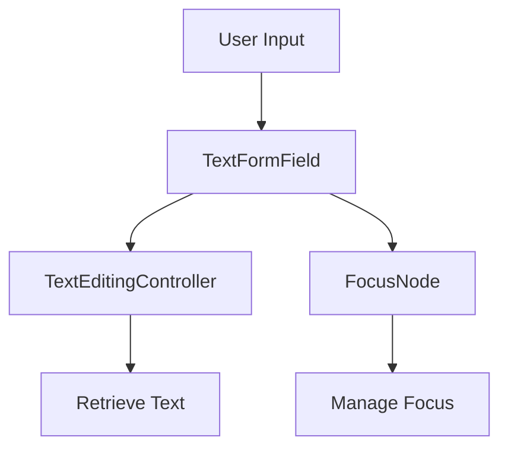

## 7.1.2 Input Fields and Controllers

In the world of mobile app development, handling user input efficiently and effectively is crucial. Flutter, with its rich set of widgets, provides powerful tools to manage input fields, making it easier to create interactive and user-friendly forms. This section delves into the details of using `TextFormField`, `TextEditingController`, and `FocusNode` to handle user input in Flutter applications.

### Understanding TextFormField

The `TextFormField` widget is a specialized input field designed for use within forms. It extends the capabilities of the basic `TextField` by integrating seamlessly with the `Form` widget, providing built-in validation support. This makes it an ideal choice for creating forms that require user input validation.

- **Key Features of TextFormField:**
  - **Validation Support:** Easily validate user input with built-in validators.
  - **Integration with Form Widget:** Works seamlessly with the `Form` widget to manage form state.
  - **Customization:** Offers extensive customization options through the `InputDecoration` property.

Here's a simple example of a `TextFormField`:

```dart
TextFormField(
  decoration: InputDecoration(
    labelText: 'Email',
    hintText: 'Enter your email',
    icon: Icon(Icons.email),
  ),
  validator: (value) {
    if (value == null || value.isEmpty) {
      return 'Please enter your email';
    }
    return null;
  },
)
```

### Decorating Input Fields

Customizing the appearance of input fields is essential for creating visually appealing and intuitive user interfaces. The `InputDecoration` property allows you to style `TextFormField` widgets extensively.

- **Common Decoration Properties:**
  - **labelText:** Displays a label above the input field.
  - **hintText:** Provides a hint inside the input field.
  - **helperText:** Displays additional information below the input field.
  - **prefixIcon:** Adds an icon at the beginning of the input field.
  - **suffixIcon:** Adds an icon at the end of the input field.

Here's how you can use these properties:

```dart
TextFormField(
  decoration: InputDecoration(
    labelText: 'Username',
    hintText: 'Enter your username',
    helperText: 'Your unique username',
    prefixIcon: Icon(Icons.person),
    suffixIcon: Icon(Icons.check),
  ),
)
```

### Using TextEditingController

The `TextEditingController` is a powerful tool for managing and retrieving the text from input fields. It allows you to programmatically control the text displayed in a `TextFormField`.

- **Initializing a Controller:**

```dart
final TextEditingController _controller = TextEditingController();
```

- **Assigning the Controller to a TextFormField:**

```dart
TextFormField(
  controller: _controller,
  decoration: InputDecoration(labelText: 'Username'),
)
```

- **Accessing the Text:**

```dart
String enteredText = _controller.text;
```

- **Updating the Text:**

```dart
_controller.text = 'New Value';
```

### Managing Focus

Managing focus between input fields is crucial for creating a smooth user experience. Flutter provides the `FocusNode` class to handle focus management.

- **Creating FocusNodes:**

```dart
FocusNode _emailFocus = FocusNode();
FocusNode _passwordFocus = FocusNode();
```

- **Moving Focus to the Next Field:**

```dart
TextFormField(
  focusNode: _emailFocus,
  onFieldSubmitted: (_) {
    FocusScope.of(context).requestFocus(_passwordFocus);
  },
  decoration: InputDecoration(labelText: 'Email'),
)
```

- **Releasing Focus:**

```dart
FocusScope.of(context).unfocus();
```

### Keyboard Types and Input Actions

Flutter allows you to customize the keyboard type and input actions to enhance the user input experience.

- **Setting Keyboard Types:**

```dart
TextFormField(
  keyboardType: TextInputType.emailAddress,
  decoration: InputDecoration(labelText: 'Email'),
)
```

- **Setting Input Actions:**

```dart
TextFormField(
  textInputAction: TextInputAction.next,
  decoration: InputDecoration(labelText: 'Password'),
)
```

### Visual Aids

To better understand how input fields, controllers, and focus nodes interact, let's visualize these components using diagrams.



This diagram illustrates the interaction between user input, `TextFormField`, `TextEditingController`, and `FocusNode`.

### Best Practices

- **Dispose of Controllers and FocusNodes:**
  - Always dispose of controllers and focus nodes in stateful widgets to prevent memory leaks.

```dart
@override
void dispose() {
  _controller.dispose();
  _emailFocus.dispose();
  _passwordFocus.dispose();
  super.dispose();
}
```

- **Use Semantic Labels:**
  - Provide semantic labels for accessibility support, ensuring your app is usable by all users.

### Interactive Exercise

Let's put these concepts into practice by creating a registration form with multiple input fields and implementing focus traversal.

**Exercise: Create a Registration Form**

1. **Create a Form Widget:**
   - Use a `Form` widget to wrap your input fields.

2. **Add Input Fields:**
   - Include fields for username, email, and password using `TextFormField`.

3. **Implement Focus Traversal:**
   - Use `FocusNode` to manage focus between fields.

4. **Validate Input:**
   - Add validation logic to ensure all fields are filled correctly.

5. **Submit the Form:**
   - Implement a submit button that validates and processes the form data.

Here's a starting point for your registration form:

```dart
class RegistrationForm extends StatefulWidget {
  @override
  _RegistrationFormState createState() => _RegistrationFormState();
}

class _RegistrationFormState extends State<RegistrationForm> {
  final _formKey = GlobalKey<FormState>();
  final TextEditingController _usernameController = TextEditingController();
  final TextEditingController _emailController = TextEditingController();
  final TextEditingController _passwordController = TextEditingController();
  final FocusNode _emailFocus = FocusNode();
  final FocusNode _passwordFocus = FocusNode();

  @override
  void dispose() {
    _usernameController.dispose();
    _emailController.dispose();
    _passwordController.dispose();
    _emailFocus.dispose();
    _passwordFocus.dispose();
    super.dispose();
  }

  @override
  Widget build(BuildContext context) {
    return Form(
      key: _formKey,
      child: Column(
        children: [
          TextFormField(
            controller: _usernameController,
            decoration: InputDecoration(labelText: 'Username'),
            textInputAction: TextInputAction.next,
            onFieldSubmitted: (_) {
              FocusScope.of(context).requestFocus(_emailFocus);
            },
          ),
          TextFormField(
            controller: _emailController,
            focusNode: _emailFocus,
            decoration: InputDecoration(labelText: 'Email'),
            keyboardType: TextInputType.emailAddress,
            textInputAction: TextInputAction.next,
            onFieldSubmitted: (_) {
              FocusScope.of(context).requestFocus(_passwordFocus);
            },
          ),
          TextFormField(
            controller: _passwordController,
            focusNode: _passwordFocus,
            decoration: InputDecoration(labelText: 'Password'),
            obscureText: true,
            textInputAction: TextInputAction.done,
            onFieldSubmitted: (_) {
              if (_formKey.currentState!.validate()) {
                // Process data
              }
            },
          ),
          ElevatedButton(
            onPressed: () {
              if (_formKey.currentState!.validate()) {
                // Process data
              }
            },
            child: Text('Register'),
          ),
        ],
      ),
    );
  }
}
```

### Conclusion

Mastering input fields and controllers in Flutter is essential for creating robust and user-friendly applications. By understanding and utilizing `TextFormField`, `TextEditingController`, and `FocusNode`, you can enhance the user input experience in your apps. Remember to follow best practices, such as disposing of controllers and focus nodes, to maintain optimal performance and prevent memory leaks.

### Further Reading

- [Flutter Documentation on TextFormField](https://api.flutter.dev/flutter/material/TextFormField-class.html)
- [TextEditingController Class](https://api.flutter.dev/flutter/widgets/TextEditingController-class.html)
- [FocusNode Class](https://api.flutter.dev/flutter/widgets/FocusNode-class.html)
- [InputDecoration Class](https://api.flutter.dev/flutter/material/InputDecoration-class.html)

## Quiz Time!



### What is the primary advantage of using `TextFormField` over `TextField`?

- [x] Built-in validation support
- [ ] Better performance
- [ ] More styling options
- [ ] Easier to use

> **Explanation:** `TextFormField` provides built-in validation support, making it ideal for use within forms.

### Which property of `InputDecoration` is used to display a hint inside the input field?

- [ ] labelText
- [x] hintText
- [ ] helperText
- [ ] prefixIcon

> **Explanation:** The `hintText` property is used to display a hint inside the input field.

### How do you initialize a `TextEditingController`?

- [x] `final TextEditingController _controller = TextEditingController();`
- [ ] `TextEditingController _controller = new TextEditingController();`
- [ ] `var _controller = TextEditingController();`
- [ ] `TextEditingController _controller;`

> **Explanation:** The correct syntax to initialize a `TextEditingController` is `final TextEditingController _controller = TextEditingController();`.

### What is the purpose of a `FocusNode` in Flutter?

- [ ] To style input fields
- [x] To manage focus between input fields
- [ ] To validate input fields
- [ ] To retrieve text from input fields

> **Explanation:** `FocusNode` is used to manage focus between input fields in Flutter.

### Which method is used to move focus to the next input field?

- [ ] `FocusScope.of(context).nextFocus();`
- [x] `FocusScope.of(context).requestFocus(_nextFocusNode);`
- [ ] `FocusScope.of(context).moveFocus(_nextFocusNode);`
- [ ] `FocusScope.of(context).focusNext();`

> **Explanation:** `FocusScope.of(context).requestFocus(_nextFocusNode);` is used to move focus to the next input field.

### What should you do with controllers and focus nodes in a stateful widget to prevent memory leaks?

- [ ] Initialize them in the `build` method
- [ ] Use them without disposing
- [x] Dispose of them in the `dispose` method
- [ ] Initialize them in the `initState` method

> **Explanation:** Controllers and focus nodes should be disposed of in the `dispose` method to prevent memory leaks.

### Which keyboard type should be used for an email input field?

- [ ] `TextInputType.text`
- [x] `TextInputType.emailAddress`
- [ ] `TextInputType.number`
- [ ] `TextInputType.phone`

> **Explanation:** `TextInputType.emailAddress` is the appropriate keyboard type for an email input field.

### How can you access the text entered in a `TextFormField` using a `TextEditingController`?

- [ ] `_controller.getText()`
- [ ] `_controller.value`
- [x] `_controller.text`
- [ ] `_controller.input`

> **Explanation:** The text entered in a `TextFormField` can be accessed using `_controller.text`.

### What is the role of `InputDecoration` in a `TextFormField`?

- [ ] To validate input
- [x] To customize the appearance of the input field
- [ ] To manage focus
- [ ] To retrieve text

> **Explanation:** `InputDecoration` is used to customize the appearance of the input field.

### True or False: You should always use `TextFormField` instead of `TextField` for any text input in Flutter.

- [ ] True
- [x] False

> **Explanation:** While `TextFormField` is useful for forms with validation, `TextField` can be used for simple text input without validation requirements.


