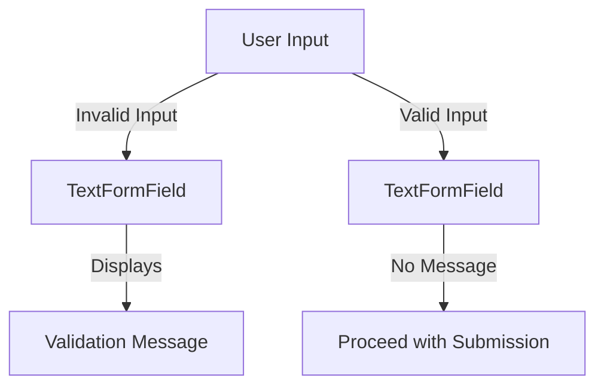

## 7.1.3 Form Validation Techniques

In the world of mobile app development, ensuring the integrity and accuracy of user input is paramount. Form validation is a critical aspect of any application that collects data from users, whether it's a simple login form or a complex registration process. This section delves into the techniques and best practices for implementing form validation in Flutter, a powerful UI toolkit for building natively compiled applications for mobile, web, and desktop from a single codebase.

### Why Validate Forms

Validating forms is essential for several reasons:

- **Data Integrity:** Ensures that the data collected from users is accurate, complete, and consistent. This is crucial for maintaining the quality of the data stored in your application's database.
- **User Feedback:** Provides immediate feedback to users, helping them correct errors before submission. This enhances the user experience by guiding users to provide the correct information.
- **Security:** Prevents malicious input that could lead to security vulnerabilities, such as SQL injection or cross-site scripting (XSS).
- **Business Logic Enforcement:** Ensures that the data adheres to the business rules and logic defined for the application.

### Using Validators in TextFormField

Flutter provides a convenient way to validate user input using the `TextFormField` widget. The `validator` property allows you to define custom validation logic for each input field.

```dart
TextFormField(
  validator: (value) {
    if (value == null || value.isEmpty) {
      return 'Please enter some text';
    }
    return null;
  },
)
```

- **Explanation:**
  - The `validator` function takes the current value of the input field as an argument.
  - If the input is invalid (e.g., empty), the function returns a string containing the error message.
  - If the input is valid, the function returns `null`, indicating no error.

This approach allows you to provide specific and meaningful error messages to users, enhancing their experience by clearly indicating what needs to be corrected.

### Implementing Form Auto-Validation

Flutter's `TextFormField` widget also supports auto-validation, which can be controlled using the `autovalidateMode` property. This property determines when the validation logic is applied:

- **`AutovalidateMode.onUserInteraction`:** Validates the input only when the user interacts with the field. This mode is useful for providing feedback as the user types or modifies the input.
- **`AutovalidateMode.always`:** Continuously validates the input, regardless of user interaction. This mode can be helpful in scenarios where real-time validation is required.

```dart
TextFormField(
  autovalidateMode: AutovalidateMode.onUserInteraction,
  validator: (value) {
    if (value == null || value.isEmpty) {
      return 'Please enter some text';
    }
    return null;
  },
)
```

### Validation Process

To trigger form validation programmatically, you can use the `validate` method of the `FormState` class. This method checks all fields within the form and returns `true` if all validations pass, or `false` if any validation fails.

```dart
final isValid = _formKey.currentState!.validate();
if (isValid) {
  // Proceed with the submission
}
```

- **Explanation:**
  - The `validate` method iterates over all form fields and applies their respective validators.
  - If all fields are valid, the method returns `true`, allowing you to proceed with form submission or other actions.
  - If any field is invalid, the method returns `false`, and the corresponding error messages are displayed.

### Displaying Validation Messages

One of the advantages of using `TextFormField` for form inputs is that validation messages are automatically displayed below the input field. This provides immediate visual feedback to users, helping them understand what needs to be corrected.

- **Visual Aid:**
  - Below is a diagram illustrating how validation messages appear under input fields:



### Best Practices

When implementing form validation, consider the following best practices:

- **Provide Specific Error Messages:** Ensure that error messages are clear and specific, guiding users on how to correct their input.
- **Client-Side and Server-Side Validation:** Validate data on the client side for immediate feedback and on the server side for security and data integrity.
- **Consistent Validation Logic:** Use consistent validation logic across similar fields to maintain uniformity and predictability.
- **User-Friendly Design:** Design forms that are easy to understand and navigate, minimizing the likelihood of user errors.

### Exercise

To solidify your understanding of form validation in Flutter, try implementing validation in a registration form. Ensure that all fields, such as email, password, and username, are properly validated. Consider the following:

- **Email Validation:** Check for a valid email format.
- **Password Strength:** Ensure the password meets complexity requirements (e.g., minimum length, special characters).
- **Username Uniqueness:** Validate that the username is not already taken (this may require server-side validation).

### Conclusion

Form validation is a crucial aspect of building robust and user-friendly applications. By leveraging Flutter's built-in validation capabilities, you can ensure data integrity, enhance user experience, and maintain security. Remember to validate both on the client and server sides, and always provide clear and actionable feedback to users.

## Quiz Time!



### Why is form validation important in mobile app development?

- [x] To ensure data integrity and provide user feedback
- [ ] To increase app size
- [ ] To make the app run slower
- [ ] To complicate the code

> **Explanation:** Form validation ensures data integrity, provides immediate feedback to users, and enhances security by preventing malicious input.

### What does the `validator` property in `TextFormField` do?

- [x] It defines custom validation logic for the input field
- [ ] It changes the color of the input field
- [ ] It hides the input field
- [ ] It disables the input field

> **Explanation:** The `validator` property allows you to define custom validation logic, returning an error message if the input is invalid or `null` if it is valid.

### What does returning `null` from a validator function indicate?

- [x] The input is valid
- [ ] The input is invalid
- [ ] The input field is hidden
- [ ] The input field is disabled

> **Explanation:** Returning `null` from a validator function indicates that the input is valid and no error message should be displayed.

### Which `autovalidateMode` option validates input only when the user interacts with the field?

- [x] AutovalidateMode.onUserInteraction
- [ ] AutovalidateMode.always
- [ ] AutovalidateMode.never
- [ ] AutovalidateMode.continuous

> **Explanation:** `AutovalidateMode.onUserInteraction` validates the input only when the user interacts with the field, providing feedback as they type or modify the input.

### How can you trigger form validation programmatically in Flutter?

- [x] By calling `_formKey.currentState!.validate()`
- [ ] By calling `_formKey.currentState!.submit()`
- [ ] By calling `_formKey.currentState!.reset()`
- [ ] By calling `_formKey.currentState!.dispose()`

> **Explanation:** You can trigger form validation programmatically by calling `_formKey.currentState!.validate()`, which checks all fields and returns `true` if all validations pass.

### What is a best practice for providing error messages in form validation?

- [x] Provide specific and user-friendly error messages
- [ ] Use generic error messages for all fields
- [ ] Avoid displaying error messages
- [ ] Display error messages only on the server side

> **Explanation:** Providing specific and user-friendly error messages helps guide users to correct their input effectively.

### Why should you validate data on both the client and server sides?

- [x] For immediate feedback and security
- [ ] To increase server load
- [ ] To make the app slower
- [ ] To complicate the code

> **Explanation:** Validating data on both the client and server sides ensures immediate feedback for users and maintains security and data integrity.

### What is the purpose of the `autovalidateMode` property in `TextFormField`?

- [x] To control when validation occurs
- [ ] To change the input field's color
- [ ] To hide the input field
- [ ] To disable the input field

> **Explanation:** The `autovalidateMode` property controls when validation occurs, allowing you to specify whether validation should happen on user interaction or continuously.

### What happens if a validator function returns a string?

- [x] A validation error message is displayed
- [ ] The input field is hidden
- [ ] The input field is disabled
- [ ] The input field changes color

> **Explanation:** If a validator function returns a string, it is displayed as a validation error message below the input field.

### True or False: Form validation is only necessary for complex forms.

- [ ] True
- [x] False

> **Explanation:** Form validation is necessary for all forms, regardless of complexity, to ensure data integrity, provide user feedback, and maintain security.


