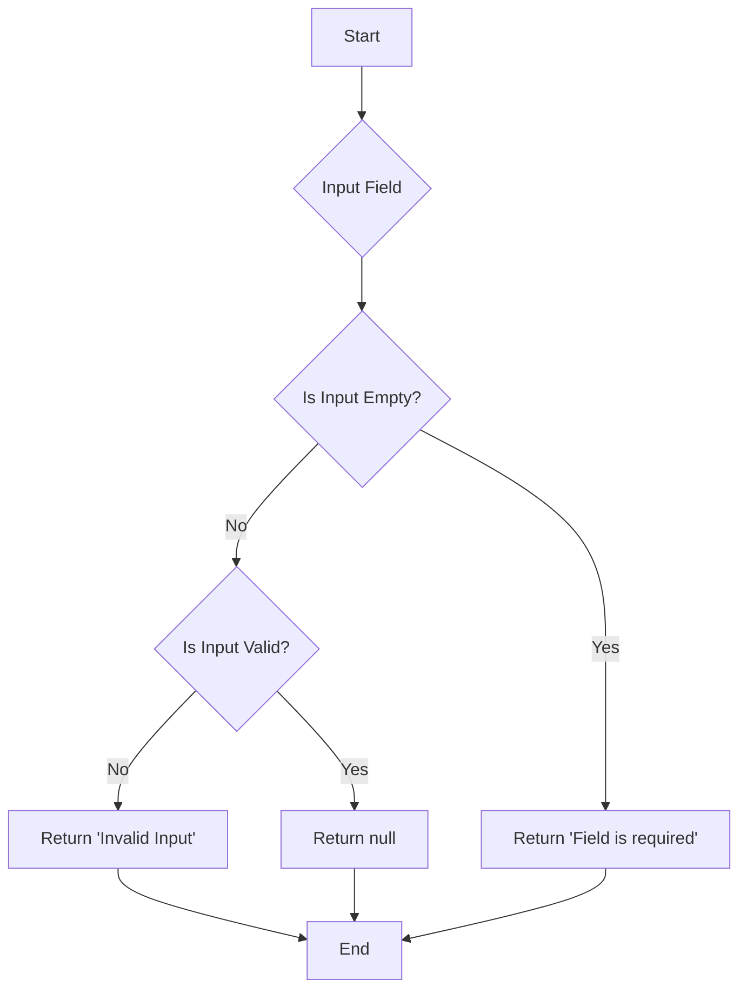

## 7.1.4 Custom Validators

In the realm of mobile app development, ensuring the integrity of user input is paramount. Flutter provides a robust framework for handling forms and validation, allowing developers to create seamless and error-free user experiences. This section delves into the creation and application of custom validators in Flutter, empowering you to enforce specific validation rules tailored to your application's needs.

### Creating Reusable Validator Functions

Custom validators are essential for enforcing specific rules that are not covered by default validators. These functions are designed to be reusable and can be applied to multiple input fields across your application.

#### Defining a Custom Validator Function

Let's start by creating a simple custom validator for email validation. The function checks if the input is not empty and matches a regular expression pattern for email addresses.

```dart
String? validateEmail(String? value) {
  final emailRegex = RegExp(r'^[^@]+@[^@]+\.[^@]+');
  if (value == null || value.isEmpty) {
    return 'Email is required';
  } else if (!emailRegex.hasMatch(value)) {
    return 'Enter a valid email';
  }
  return null;
}
```

- **Explanation:**
  - The `validateEmail` function takes a `String?` as input and returns a `String?`. If the input is invalid, it returns an error message; otherwise, it returns `null`.
  - The regular expression `RegExp(r'^[^@]+@[^@]+\.[^@]+')` is used to validate the email format.

#### Assigning the Custom Validator to an Input Field

Once the custom validator is defined, it can be easily assigned to a `TextFormField` in your Flutter form.

```dart
TextFormField(
  validator: validateEmail,
)
```

- **Explanation:**
  - The `validator` property of `TextFormField` is assigned the `validateEmail` function. This ensures that the validation logic is applied whenever the form is submitted.

### Combining Multiple Validators

In many scenarios, a single input field may require multiple validation rules. For example, a password field might need to check for both length and complexity.

#### Example: Password Validation

Here's how you can define a custom validator for a password field that checks for a minimum length:

```dart
String? validatePassword(String? value) {
  if (value == null || value.isEmpty) {
    return 'Password is required';
  } else if (value.length < 8) {
    return 'Password must be at least 8 characters';
  }
  return null;
}
```

- **Explanation:**
  - The `validatePassword` function checks if the password is not empty and has a minimum length of 8 characters.

#### Combining Validators

To apply multiple validation rules, you can create a composite validator function that calls each individual validator in sequence.

```dart
String? compositeValidator(String? value) {
  final emailError = validateEmail(value);
  if (emailError != null) return emailError;

  final passwordError = validatePassword(value);
  if (passwordError != null) return passwordError;

  return null;
}
```

- **Explanation:**
  - The `compositeValidator` function sequentially applies `validateEmail` and `validatePassword`. It returns the first error encountered or `null` if all validations pass.

### Using Validator Packages

Flutter's ecosystem includes several packages that provide ready-made validators, simplifying the validation process.

#### Example: Using the `validators` Package

The `validators` package offers a collection of common validation functions, such as URL validation.

```dart
import 'package:validators/validators.dart';

String? validateURL(String? value) {
  if (value == null || !isURL(value)) {
    return 'Enter a valid URL';
  }
  return null;
}
```

- **Explanation:**
  - The `isURL` function from the `validators` package checks if the input is a valid URL.

#### Including and Using a Package

To use a package, add it to your `pubspec.yaml` file and import it into your Dart file.

```yaml
dependencies:
  validators: ^2.0.1
```

- **Explanation:**
  - Add the package to your project's dependencies and run `flutter pub get` to install it.

### Asynchronous Validation

Some validation scenarios require asynchronous operations, such as checking if a username is already taken by querying a remote server.

#### Implementing Asynchronous Validation

To perform asynchronous validation, use a `Future` in your validator function.

```dart
Future<String?> validateUsername(String? value) async {
  if (value == null || value.isEmpty) {
    return 'Username is required';
  }

  // Simulate a network call
  final isTaken = await checkUsernameAvailability(value);
  if (isTaken) {
    return 'Username is already taken';
  }

  return null;
}

Future<bool> checkUsernameAvailability(String username) async {
  // Simulate a delay
  await Future.delayed(Duration(seconds: 1));
  // Simulate a check against a list of taken usernames
  return ['user1', 'user2', 'user3'].contains(username);
}
```

- **Explanation:**
  - The `validateUsername` function performs an asynchronous check using `checkUsernameAvailability`, which simulates a network call.

### Visual Aids

To better understand the flow of validation logic, consider the following flowchart illustrating how inputs pass through validators:



- **Explanation:**
  - This flowchart visualizes the decision-making process within a validator function, highlighting the checks for empty and invalid inputs.

### Best Practices

When implementing custom validators, consider the following best practices:

- **Keep Validator Functions Pure:** Ensure that validator functions are pure and side-effect-free. They should only evaluate input and return a result without modifying any external state.
- **Consistency Across the App:** Maintain consistent validation logic throughout your application to provide a uniform user experience.
- **Modular and Reusable:** Design validators to be modular and reusable across different forms and input fields.

### Exercise: Create a Custom Phone Number Validator

As an exercise, try creating a custom validator for a phone number field. Ensure that the phone number matches a specific format, such as `(123) 456-7890`.

```dart
String? validatePhoneNumber(String? value) {
  final phoneRegex = RegExp(r'^\\(\d{3}\\) \d{3}-\d{4}$');
  if (value == null || value.isEmpty) {
    return 'Phone number is required';
  } else if (!phoneRegex.hasMatch(value)) {
    return 'Enter a valid phone number (e.g., (123) 456-7890)';
  }
  return null;
}
```

- **Explanation:**
  - The `validatePhoneNumber` function uses a regular expression to ensure the phone number matches the specified format.

### Conclusion

Custom validators in Flutter provide a powerful mechanism for enforcing specific input rules, enhancing data integrity and user experience. By creating reusable validator functions, combining multiple validators, and leveraging asynchronous validation, you can build robust forms tailored to your application's requirements. Remember to follow best practices to ensure your validators are efficient, consistent, and maintainable.

## Quiz Time!



### What is the primary purpose of a custom validator in Flutter?

- [x] To enforce specific validation rules not covered by default validators
- [ ] To style input fields
- [ ] To manage state in a Flutter application
- [ ] To handle network requests

> **Explanation:** Custom validators are used to enforce specific validation rules that are not covered by Flutter's default validators, ensuring data integrity.

### How can you assign a custom validator to a `TextFormField`?

- [x] By setting the `validator` property of `TextFormField` to the custom validator function
- [ ] By using the `onChanged` property
- [ ] By setting the `decoration` property
- [ ] By using the `controller` property

> **Explanation:** The `validator` property of `TextFormField` is used to assign a custom validator function, which is called during form submission.

### Which package provides ready-made validators for common validation tasks?

- [x] validators
- [ ] flutter_bloc
- [ ] provider
- [ ] dio

> **Explanation:** The `validators` package offers a collection of ready-made validators for common validation tasks, such as email and URL validation.

### What is a key consideration when designing custom validator functions?

- [x] They should be pure and side-effect-free
- [ ] They should modify external state
- [ ] They should handle network requests directly
- [ ] They should be tightly coupled with UI components

> **Explanation:** Custom validator functions should be pure and side-effect-free, meaning they only evaluate input and return a result without modifying external state.

### How can you perform asynchronous validation in Flutter?

- [x] By using a `Future` in the validator function
- [ ] By using a `Stream`
- [ ] By using a `Completer`
- [ ] By using a `Timer`

> **Explanation:** Asynchronous validation can be performed by using a `Future` in the validator function, allowing for operations like network requests.

### What is the purpose of combining multiple validators?

- [x] To apply multiple validation rules to a single input field
- [ ] To reduce code complexity
- [ ] To improve app performance
- [ ] To handle asynchronous operations

> **Explanation:** Combining multiple validators allows you to apply multiple validation rules to a single input field, ensuring comprehensive validation.

### Which of the following is a best practice for custom validators?

- [x] Ensure consistent validation logic across the app
- [ ] Use global variables within validators
- [ ] Modify UI components directly from validators
- [ ] Perform network requests within validators

> **Explanation:** Ensuring consistent validation logic across the app is a best practice, providing a uniform user experience.

### What is the benefit of using the `validators` package?

- [x] It provides a collection of common validation functions
- [ ] It simplifies state management
- [ ] It enhances UI performance
- [ ] It handles network requests

> **Explanation:** The `validators` package provides a collection of common validation functions, simplifying the validation process.

### What is the role of a regular expression in a custom validator?

- [x] To define a pattern that the input must match
- [ ] To style the input field
- [ ] To manage state transitions
- [ ] To handle asynchronous operations

> **Explanation:** A regular expression in a custom validator defines a pattern that the input must match, such as an email or phone number format.

### True or False: Custom validators can only be used for synchronous validation.

- [ ] True
- [x] False

> **Explanation:** Custom validators can be used for both synchronous and asynchronous validation, allowing for a wide range of validation scenarios.




