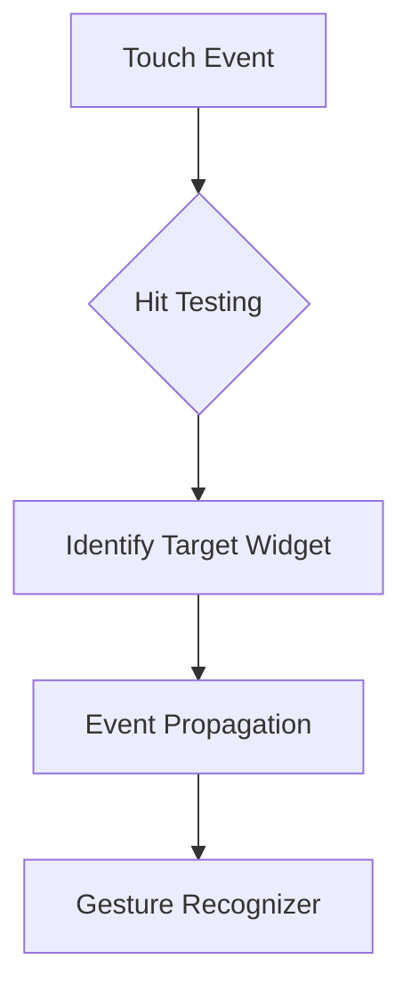

## 7.2.1 Understanding Gesture Detection

In the realm of mobile app development, gestures play a pivotal role in creating intuitive and engaging user experiences. From the simple tap to complex multi-touch interactions, gestures allow users to interact with applications in a natural and fluid manner. In this section, we will delve into the intricacies of gesture detection in Flutter, exploring how this powerful framework enables developers to harness the full potential of touch interactions.

### Importance of Gestures in Mobile Apps

Gestures are the cornerstone of user interaction in mobile applications. They provide a direct and tactile way for users to engage with the app's content and functionality. Whether it's tapping a button, swiping through a gallery, or pinching to zoom on an image, gestures make the user experience more dynamic and responsive.

- **Enhancing User Experience:** Gestures allow for a more immersive and interactive experience, enabling users to perform actions quickly and intuitively.
- **Efficiency and Accessibility:** By reducing the need for on-screen buttons and controls, gestures can make apps more accessible and easier to navigate.
- **Natural Interaction:** Gestures mimic real-world interactions, making them intuitive for users and reducing the learning curve.

### Gesture System in Flutter

Flutter's gesture system is designed to efficiently handle touch interactions by combining low-level touch events into higher-level gestures. This system is built on a robust architecture that allows developers to easily implement and customize gestures in their applications.

- **Gesture Recognizers:** Flutter provides a range of gesture recognizers that interpret touch events and detect specific gestures. These recognizers can be attached to widgets to handle various types of interactions.
- **Efficient Handling:** Flutter's gesture system is optimized for performance, ensuring that touch interactions are processed smoothly and responsively.
- **Customizability:** Developers can create custom gesture recognizers to handle unique interactions specific to their app's requirements.

### Event Bubbling and Hit Testing

In Flutter, determining which widget should respond to a gesture involves a process known as hit testing. This process ensures that touch events are directed to the appropriate widget in the widget tree.

- **Hit Testing:** When a touch event occurs, Flutter performs hit testing to identify the widget under the touch point. This involves traversing the widget tree to find the widget that should receive the event.
- **Event Bubbling:** Once a widget is identified, the event is propagated up the widget tree, allowing parent widgets to respond to the gesture if necessary.



### Gesture Detection Process

Flutter's gesture detection process involves several key steps, each crucial for interpreting touch interactions accurately.

#### 1. Pointer Events

Pointer events are the low-level events that represent the position and movement of touch points on the screen. These events form the foundation of Flutter's gesture detection system.

- **PointerDown:** Triggered when a touch point is placed on the screen.
- **PointerMove:** Triggered when a touch point moves across the screen.
- **PointerUp:** Triggered when a touch point is lifted from the screen.

#### 2. Gesture Recognizers

Gesture recognizers interpret pointer events to detect specific gestures. Flutter provides a variety of built-in recognizers, each designed to handle different types of gestures.

- **TapGestureRecognizer:** Detects single and double taps.
- **LongPressGestureRecognizer:** Detects long press gestures.
- **PanGestureRecognizer:** Detects drag or pan gestures.
- **ScaleGestureRecognizer:** Detects pinch-to-zoom gestures.

#### 3. Gesture Disambiguation

When multiple gestures are possible, Flutter uses gesture disambiguation to determine which gesture should be recognized. This involves prioritizing gestures based on their likelihood and context.

### Common Gesture Types

Flutter can detect a wide range of gestures, each serving different purposes in enhancing user interaction.

- **Tap:** A quick touch on the screen, often used for selecting or activating elements.
- **Double Tap:** Two quick taps in succession, commonly used for zooming or liking content.
- **Long Press:** A prolonged touch, often used to reveal additional options or initiate drag-and-drop.
- **Pan (Drag):** A touch that moves across the screen, used for scrolling or repositioning elements.
- **Scale (Pinch Zoom):** A multi-touch gesture that changes the scale of an element, used for zooming in and out.
- **Swipe:** A quick, directional movement, often used for navigating between screens or dismissing elements.

### Best Practices

To ensure that gestures enhance the user experience, consider the following best practices:

- **Intuitive Gestures:** Design gestures that align with user expectations and mimic real-world interactions.
- **Visual Feedback:** Provide immediate visual feedback when a gesture is recognized to confirm the action to the user.
- **Consistency:** Maintain consistency in gesture interactions across the app to avoid confusing users.
- **Accessibility:** Ensure that gestures are accessible to all users, including those with disabilities, by providing alternative input methods when necessary.

### Interactive Exercise

Think about the gestures you commonly use in mobile apps. How do these gestures enhance your interaction with the app? Consider implementing a simple app that uses a variety of gestures to interact with different elements. Experiment with different gesture recognizers and observe how they affect the user experience.

### Practical Code Example

Let's create a simple Flutter app that demonstrates gesture detection using a `GestureDetector` widget. This app will respond to tap, double tap, and long press gestures.

```dart
import 'package:flutter/material.dart';

void main() => runApp(GestureApp());

class GestureApp extends StatelessWidget {
  @override
  Widget build(BuildContext context) {
    return MaterialApp(
      home: GestureDemo(),
    );
  }
}

class GestureDemo extends StatefulWidget {
  @override
  _GestureDemoState createState() => _GestureDemoState();
}

class _GestureDemoState extends State<GestureDemo> {
  String _gestureDetected = 'No Gesture Detected';

  void _onTap() {
    setState(() {
      _gestureDetected = 'Tap Detected';
    });
  }

  void _onDoubleTap() {
    setState(() {
      _gestureDetected = 'Double Tap Detected';
    });
  }

  void _onLongPress() {
    setState(() {
      _gestureDetected = 'Long Press Detected';
    });
  }

  @override
  Widget build(BuildContext context) {
    return Scaffold(
      appBar: AppBar(
        title: Text('Gesture Detection Demo'),
      ),
      body: Center(
        child: GestureDetector(
          onTap: _onTap,
          onDoubleTap: _onDoubleTap,
          onLongPress: _onLongPress,
          child: Container(
            width: 200,
            height: 200,
            color: Colors.blue,
            alignment: Alignment.center,
            child: Text(
              _gestureDetected,
              style: TextStyle(color: Colors.white),
              textAlign: TextAlign.center,
            ),
          ),
        ),
      ),
    );
  }
}
```

**Explanation:**

- **GestureDetector:** This widget listens for gestures and calls the appropriate callback when a gesture is detected.
- **onTap, onDoubleTap, onLongPress:** These callbacks update the state to reflect the detected gesture.
- **Visual Feedback:** The app provides visual feedback by updating the text displayed in the center of the container.

### Conclusion

Understanding gesture detection in Flutter is crucial for creating interactive and user-friendly mobile applications. By leveraging Flutter's gesture system, developers can implement a wide range of touch interactions that enhance the user experience. Remember to follow best practices to ensure that gestures are intuitive, consistent, and accessible.

### Further Reading and Resources

- [Flutter GestureDetector Documentation](https://api.flutter.dev/flutter/widgets/GestureDetector-class.html)
- [Flutter Gesture Recognizers](https://flutter.dev/docs/development/ui/advanced/gestures)
- [Building Interactive Apps with Flutter](https://flutter.dev/docs/cookbook/gestures)

## Quiz Time!



### What is the primary role of gestures in mobile apps?

- [x] Enhancing user interaction and experience
- [ ] Reducing app size
- [ ] Improving app security
- [ ] Increasing app loading speed

> **Explanation:** Gestures enhance user interaction and experience by providing intuitive and natural ways to interact with the app.

### Which Flutter widget is primarily used for detecting gestures?

- [x] GestureDetector
- [ ] Container
- [ ] Scaffold
- [ ] AppBar

> **Explanation:** The GestureDetector widget is used to detect gestures in Flutter applications.

### What is the purpose of hit testing in Flutter?

- [x] To determine which widget should receive a touch event
- [ ] To optimize app performance
- [ ] To manage app state
- [ ] To handle network requests

> **Explanation:** Hit testing determines which widget should receive a touch event by identifying the widget under the touch point.

### Which gesture recognizer is used to detect pinch-to-zoom gestures?

- [x] ScaleGestureRecognizer
- [ ] TapGestureRecognizer
- [ ] LongPressGestureRecognizer
- [ ] PanGestureRecognizer

> **Explanation:** The ScaleGestureRecognizer is used to detect pinch-to-zoom gestures.

### What is gesture disambiguation in Flutter?

- [x] Determining which gesture should be recognized when multiple gestures are possible
- [ ] Optimizing gesture performance
- [ ] Managing gesture callbacks
- [ ] Handling gesture errors

> **Explanation:** Gesture disambiguation determines which gesture should be recognized when multiple gestures are possible.

### Which of the following is NOT a common gesture type in Flutter?

- [ ] Tap
- [ ] Swipe
- [ ] Long Press
- [x] Hover

> **Explanation:** Hover is not a common gesture type in Flutter as it is typically associated with desktop interactions.

### What is the benefit of providing visual feedback for gestures?

- [x] It confirms the action to the user
- [ ] It increases app size
- [ ] It improves network performance
- [ ] It enhances app security

> **Explanation:** Providing visual feedback confirms the action to the user, enhancing the user experience.

### How does Flutter handle multiple possible gestures?

- [x] Through gesture disambiguation
- [ ] By ignoring all gestures
- [ ] By prioritizing the first gesture detected
- [ ] By disabling gesture detection

> **Explanation:** Flutter handles multiple possible gestures through gesture disambiguation, determining which gesture should be recognized.

### Which gesture is commonly used for navigating between screens?

- [x] Swipe
- [ ] Tap
- [ ] Double Tap
- [ ] Long Press

> **Explanation:** The swipe gesture is commonly used for navigating between screens.

### True or False: Gesture detection in Flutter is only applicable to touch interactions.

- [x] True
- [ ] False

> **Explanation:** Gesture detection in Flutter is primarily designed for touch interactions, which are common in mobile applications.


