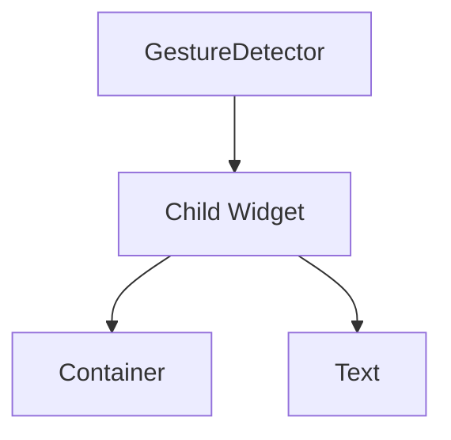

## 7.2.2 Using GestureDetector

In the world of mobile applications, user interaction is paramount. Flutter, with its rich set of widgets, provides developers with the tools to create responsive and intuitive user interfaces. One such powerful widget is the `GestureDetector`. This widget allows you to detect various gestures and respond to them, making your app interactive and engaging. In this section, we will delve into the intricacies of using `GestureDetector`, exploring its capabilities, and understanding how to implement it effectively in your Flutter applications.

### Introduction to GestureDetector

The `GestureDetector` widget is a cornerstone of touch interactions in Flutter. It acts as an invisible layer that can be wrapped around any widget to detect gestures such as taps, drags, and pinches. When a gesture is detected, `GestureDetector` triggers the corresponding callback function, allowing you to define custom behavior for each interaction.

### Basic Usage

To start using `GestureDetector`, you simply wrap it around any widget you want to make interactive. Here’s a basic example:

```dart
GestureDetector(
  onTap: () {
    print('Container tapped');
  },
  child: Container(
    color: Colors.blue,
    width: 200,
    height: 200,
  ),
)
```

In this example, a `GestureDetector` is wrapped around a `Container`. When the container is tapped, the `onTap` callback is triggered, printing a message to the console.

### Available Callbacks

`GestureDetector` provides a variety of callbacks to handle different types of gestures. Here are some of the most commonly used ones:

- **onTap**: Triggered when the user taps on the widget.
- **onDoubleTap**: Triggered when the user double-taps on the widget.
- **onLongPress**: Triggered when the user presses and holds on the widget.
- **onPanStart**, **onPanUpdate**, **onPanEnd**: Used for detecting drag gestures.
- **onScaleStart**, **onScaleUpdate**, **onScaleEnd**: Used for detecting pinch-to-zoom gestures.

### Implementing Common Gestures

#### Tap Gesture

The tap gesture is one of the simplest and most commonly used gestures. It is typically used for button presses or selecting items. Here’s how you can implement it:

```dart
GestureDetector(
  onTap: () {
    print('Button tapped');
  },
  child: ElevatedButton(
    onPressed: null, // Disable default onPressed to use GestureDetector
    child: Text('Tap Me'),
  ),
)
```

#### Long Press Gesture

Long press gestures are useful for showing additional options or tooltips. For example, you might use a long press to display a context menu:

```dart
GestureDetector(
  onLongPress: () {
    print('Long press detected');
    // Show additional options
  },
  child: Icon(Icons.more_vert),
)
```

#### Pan/Drag Gesture

Pan or drag gestures allow you to track finger movement across the screen. This is useful for implementing features like swiping or dragging items:

```dart
GestureDetector(
  onPanUpdate: (details) {
    print('Dragging: ${details.delta}');
    // Update widget position based on drag
  },
  child: Container(
    color: Colors.green,
    width: 100,
    height: 100,
  ),
)
```

### Handling Multiple Gestures

In some scenarios, multiple gestures might be recognized simultaneously. Flutter uses a concept called gesture arenas to resolve conflicts between gestures. When multiple gestures are detected, they enter a gesture arena, and Flutter decides which gesture to honor based on priority and other factors.

To handle multiple gestures, you can use a combination of callbacks and logic to determine the appropriate response. For instance, you might want to prioritize a drag gesture over a tap if both are detected:

```dart
GestureDetector(
  onPanStart: (details) {
    print('Pan started');
  },
  onTap: () {
    print('Tap detected');
  },
  child: Container(
    color: Colors.red,
    width: 150,
    height: 150,
  ),
)
```

### Visual Feedback

Providing visual feedback is crucial for enhancing user experience. It helps users understand that their interactions have been recognized. You can use animations, color changes, or other visual cues to indicate that a gesture has been detected:

```dart
GestureDetector(
  onTap: () {
    // Change color or animate
  },
  child: AnimatedContainer(
    duration: Duration(milliseconds: 300),
    color: Colors.blueAccent,
    width: 200,
    height: 200,
  ),
)
```

### Visual Aids

To better understand how `GestureDetector` works, consider the following diagram illustrating how it wraps around a child widget:



In this diagram, the `GestureDetector` is the parent widget that wraps around a child widget, which could be a `Container`, `Text`, or any other widget.

### Best Practices

- **Interactive Areas**: Ensure that interactive areas are large enough for easy touch. Small touch targets can lead to user frustration.
- **Real Device Testing**: Always test gestures on real devices to ensure they work as intended. Emulators may not accurately simulate touch interactions.
- **Feedback**: Provide immediate visual feedback for interactions to enhance user experience.

### Exercise

As an exercise, try implementing a custom widget that changes color when tapped and moves position when dragged. This will help reinforce your understanding of `GestureDetector` and its capabilities.

```dart
class InteractiveBox extends StatefulWidget {
  @override
  _InteractiveBoxState createState() => _InteractiveBoxState();
}

class _InteractiveBoxState extends State<InteractiveBox> {
  Color _color = Colors.blue;
  Offset _position = Offset(0, 0);

  @override
  Widget build(BuildContext context) {
    return GestureDetector(
      onTap: () {
        setState(() {
          _color = _color == Colors.blue ? Colors.red : Colors.blue;
        });
      },
      onPanUpdate: (details) {
        setState(() {
          _position += details.delta;
        });
      },
      child: Transform.translate(
        offset: _position,
        child: Container(
          color: _color,
          width: 100,
          height: 100,
        ),
      ),
    );
  }
}
```

### Conclusion

The `GestureDetector` widget is an essential tool for handling user input in Flutter applications. By understanding its capabilities and implementing it effectively, you can create interactive and engaging user interfaces. Remember to provide visual feedback and test your gestures on real devices to ensure a seamless user experience.

### Additional Resources

- [Flutter GestureDetector Documentation](https://api.flutter.dev/flutter/widgets/GestureDetector-class.html)
- [Flutter Gesture Detection](https://flutter.dev/docs/cookbook/gestures)
- [Building Interactive Apps with Flutter](https://flutter.dev/docs/development/ui/interactive)

## Quiz Time!



### What is the primary purpose of the GestureDetector widget in Flutter?

- [x] To detect user gestures and call corresponding callbacks.
- [ ] To display text on the screen.
- [ ] To manage application state.
- [ ] To handle network requests.

> **Explanation:** The GestureDetector widget is used to detect user gestures such as taps, drags, and pinches, and it calls the corresponding callback functions when these gestures are detected.

### Which callback would you use to detect a double-tap gesture?

- [ ] onTap
- [x] onDoubleTap
- [ ] onLongPress
- [ ] onPanUpdate

> **Explanation:** The onDoubleTap callback is specifically designed to detect double-tap gestures.

### How can you provide visual feedback when a widget is tapped?

- [x] By changing the widget's color or using animations.
- [ ] By printing a message to the console.
- [ ] By logging the event to a file.
- [ ] By sending a network request.

> **Explanation:** Providing visual feedback, such as changing the widget's color or using animations, helps users understand that their interaction has been recognized.

### What is the purpose of gesture arenas in Flutter?

- [x] To resolve conflicts when multiple gestures are detected simultaneously.
- [ ] To store user preferences.
- [ ] To manage application themes.
- [ ] To handle database operations.

> **Explanation:** Gesture arenas are used in Flutter to resolve conflicts when multiple gestures are detected at the same time, determining which gesture should be honored.

### Which gesture callback would you use to implement a drag-and-drop feature?

- [ ] onTap
- [ ] onDoubleTap
- [x] onPanUpdate
- [ ] onScaleUpdate

> **Explanation:** The onPanUpdate callback is used to track finger movement across the screen, making it suitable for implementing drag-and-drop features.

### What should you consider when designing interactive areas for touch gestures?

- [x] Ensure they are large enough for easy touch.
- [ ] Make them as small as possible to save space.
- [ ] Use only default colors.
- [ ] Avoid providing any feedback.

> **Explanation:** Interactive areas should be large enough to ensure that users can easily touch them, reducing frustration and improving user experience.

### Why is it important to test gestures on real devices?

- [x] Because emulators may not accurately simulate touch interactions.
- [ ] Because real devices are faster.
- [ ] Because emulators do not support gestures.
- [ ] Because real devices have better graphics.

> **Explanation:** Testing gestures on real devices is important because emulators may not accurately simulate touch interactions, leading to potential issues in the user experience.

### Which callback would you use to detect a pinch-to-zoom gesture?

- [ ] onTap
- [ ] onDoubleTap
- [ ] onPanUpdate
- [x] onScaleUpdate

> **Explanation:** The onScaleUpdate callback is used to detect pinch-to-zoom gestures, allowing you to track changes in scale.

### How can you change the position of a widget when it is dragged?

- [x] By updating the widget's position using the onPanUpdate callback.
- [ ] By using the onTap callback.
- [ ] By changing the widget's color.
- [ ] By using a network request.

> **Explanation:** You can change the position of a widget by updating its position in response to the onPanUpdate callback, which tracks finger movement.

### True or False: GestureDetector can only be used with Container widgets.

- [ ] True
- [x] False

> **Explanation:** False. GestureDetector can be used with any widget, not just Container widgets, to detect gestures and respond to them.


