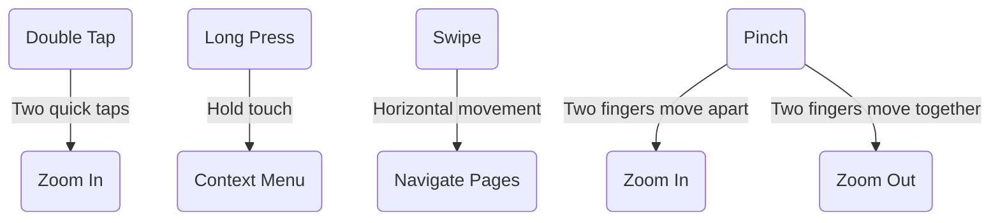

## 7.2.3 Recognizing Common Gestures

In the world of mobile applications, gestures are a fundamental part of the user interface. They allow users to interact with apps in intuitive and efficient ways. Flutter, being a versatile UI toolkit, provides robust support for handling gestures. This section will delve into recognizing and implementing common gestures such as double tap, long press, swipe, and pinch, using Flutter's `GestureDetector` widget. We will explore practical examples, best practices, and provide visual aids to enhance your understanding.

### Double Tap Gesture

The double tap gesture is a quick, two-tap action that is often used to perform actions like zooming in on an image or selecting an item. In Flutter, you can easily implement this gesture using the `onDoubleTap` callback provided by the `GestureDetector` widget.

#### Implementing Double Tap

Here's a simple implementation of the double tap gesture:

```dart
GestureDetector(
  onDoubleTap: () {
    print('Double tapped');
  },
  child: Container(
    width: 200.0,
    height: 200.0,
    color: Colors.blue,
    child: Center(
      child: Text(
        'Double Tap Me',
        style: TextStyle(color: Colors.white),
      ),
    ),
  ),
)
```

**Example Use Case: Zooming in on an Image**

Imagine an image viewer where users can double tap to zoom in on an image. This interaction is familiar to many users and enhances the user experience by providing a quick way to focus on details.

```dart
class ImageZoom extends StatefulWidget {
  @override
  _ImageZoomState createState() => _ImageZoomState();
}

class _ImageZoomState extends State<ImageZoom> {
  double _scale = 1.0;

  void _handleDoubleTap() {
    setState(() {
      _scale = _scale == 1.0 ? 2.0 : 1.0; // Toggle between normal and zoomed scale
    });
  }

  @override
  Widget build(BuildContext context) {
    return GestureDetector(
      onDoubleTap: _handleDoubleTap,
      child: Transform.scale(
        scale: _scale,
        child: Image.network('https://example.com/image.jpg'),
      ),
    );
  }
}
```

### Long Press Gesture

The long press gesture is a sustained touch that can be used to trigger actions like showing context menus or initiating drag operations. Flutter's `GestureDetector` provides an `onLongPress` callback to handle this gesture.

#### Implementing Long Press

Here's how you can implement a long press gesture:

```dart
GestureDetector(
  onLongPress: () {
    print('Long pressed');
  },
  child: Container(
    width: 200.0,
    height: 200.0,
    color: Colors.green,
    child: Center(
      child: Text(
        'Long Press Me',
        style: TextStyle(color: Colors.white),
      ),
    ),
  ),
)
```

**Use Cases: Context Menus and Drag Operations**

- **Context Menus:** Long pressing on an item can reveal additional options, similar to right-clicking on a desktop.
- **Drag Operations:** Initiating a drag-and-drop operation often starts with a long press.

### Swipe Gesture

Swiping is a common gesture used for navigating through pages or dismissing items. Flutter allows you to detect swipe gestures using `onHorizontalDrag` and `onVerticalDrag` callbacks.

#### Implementing Swipe

Here's an example of detecting horizontal swipe gestures:

```dart
GestureDetector(
  onHorizontalDragEnd: (details) {
    if (details.velocity.pixelsPerSecond.dx > 0) {
      print('Swiped right');
    } else {
      print('Swiped left');
    }
  },
  child: Container(
    width: 200.0,
    height: 200.0,
    color: Colors.red,
    child: Center(
      child: Text(
        'Swipe Me',
        style: TextStyle(color: Colors.white),
      ),
    ),
  ),
)
```

**Applications: Page Navigation and Item Dismissal**

- **Page Navigation:** Swiping left or right to navigate between pages in a carousel or a tab view.
- **Item Dismissal:** Swiping an item in a list to delete or archive it.

### Scale/Pinch Gesture

The scale or pinch gesture is used to zoom in and out, commonly seen in image galleries and map applications. Flutter supports this gesture through `onScaleStart`, `onScaleUpdate`, and `onScaleEnd` callbacks.

#### Implementing Scale/Pinch

Here's a basic implementation of a pinch-to-zoom gesture:

```dart
class PinchZoomImage extends StatefulWidget {
  @override
  _PinchZoomImageState createState() => _PinchZoomImageState();
}

class _PinchZoomImageState extends State<PinchZoomImage> {
  double _scale = 1.0;

  @override
  Widget build(BuildContext context) {
    return GestureDetector(
      onScaleUpdate: (details) {
        setState(() {
          _scale = details.scale;
        });
      },
      child: Transform.scale(
        scale: _scale,
        child: Image.network('https://example.com/image.jpg'),
      ),
    );
  }
}
```

**Use Case: Zooming on Images or Maps**

Pinch-to-zoom is a natural interaction for users when they want to explore details in images or maps.

### Visual Aids

To better understand these gestures, let's look at some diagrams illustrating the touch patterns:



### Best Practices

- **Avoid Gesture Conflicts:** Ensure that gestures do not interfere with each other. For example, a swipe gesture should not trigger a long press action.
- **Accessibility:** Provide alternative interactions for users who may have difficulty performing certain gestures. Consider using buttons or other UI elements as alternatives.
- **Feedback:** Provide visual or haptic feedback to indicate that a gesture has been recognized and an action has been performed.

### Exercise

To solidify your understanding, try creating an image viewer that supports both double-tap to zoom and pinch-to-zoom gestures. Experiment with different images and scales to see how the gestures interact.

### Conclusion

Recognizing and implementing common gestures in Flutter enhances the user experience by making interactions more intuitive and fluid. By understanding how to use `GestureDetector` and its callbacks, you can create responsive and engaging applications. Remember to consider accessibility and provide feedback to users to ensure a seamless experience.

### Additional Resources

- [Flutter GestureDetector Documentation](https://api.flutter.dev/flutter/widgets/GestureDetector-class.html)
- [Flutter Cookbook: Gestures](https://flutter.dev/docs/cookbook/gestures)
- [Designing for Touch](https://material.io/design/platform-guidance/android-touch.html)

## Quiz Time!



### Which callback is used to detect a double tap gesture in Flutter?

- [x] onDoubleTap
- [ ] onTap
- [ ] onLongPress
- [ ] onSwipe

> **Explanation:** The `onDoubleTap` callback is specifically designed to detect double tap gestures in Flutter.

### What is a common use case for the long press gesture?

- [ ] Zooming in on an image
- [x] Showing context menus
- [ ] Navigating between pages
- [ ] Pinching to zoom

> **Explanation:** Long press gestures are often used to show context menus, providing additional options for the user.

### How can you detect a swipe gesture in Flutter?

- [x] Using onHorizontalDrag and onVerticalDrag callbacks
- [ ] Using onTap and onDoubleTap callbacks
- [ ] Using onLongPress and onScaleUpdate callbacks
- [ ] Using onPinch and onRotate callbacks

> **Explanation:** Swipe gestures can be detected using the `onHorizontalDrag` and `onVerticalDrag` callbacks in Flutter.

### What is the purpose of the onScaleUpdate callback?

- [ ] To detect double taps
- [ ] To detect long presses
- [x] To handle pinch-to-zoom gestures
- [ ] To handle swipe gestures

> **Explanation:** The `onScaleUpdate` callback is used to handle pinch-to-zoom gestures, allowing you to update the scale of an element.

### Which gesture is commonly used for dismissing items in a list?

- [ ] Double tap
- [ ] Long press
- [x] Swipe
- [ ] Pinch

> **Explanation:** Swiping is commonly used to dismiss items in a list, such as deleting or archiving them.

### What should you consider to avoid gesture conflicts?

- [x] Ensure gestures do not interfere with each other
- [ ] Use only one gesture per app
- [ ] Disable all gestures
- [ ] Use gestures only for navigation

> **Explanation:** To avoid gesture conflicts, ensure that gestures do not interfere with each other, allowing for a smooth user experience.

### How can you provide alternative interactions for accessibility?

- [x] Use buttons or other UI elements
- [ ] Disable gestures for accessibility
- [ ] Use only complex gestures
- [ ] Provide no alternatives

> **Explanation:** Providing buttons or other UI elements as alternatives can help make your app more accessible to users who may have difficulty with gestures.

### What is a benefit of providing feedback for gestures?

- [x] It indicates that a gesture has been recognized
- [ ] It makes the app slower
- [ ] It confuses the user
- [ ] It is unnecessary

> **Explanation:** Providing feedback, such as visual or haptic cues, indicates to the user that a gesture has been recognized and an action has been performed.

### Which gesture is used to zoom in and out on images or maps?

- [ ] Double tap
- [ ] Long press
- [ ] Swipe
- [x] Pinch

> **Explanation:** The pinch gesture is commonly used to zoom in and out on images or maps, allowing users to explore details.

### True or False: The GestureDetector widget in Flutter can only detect one type of gesture at a time.

- [ ] True
- [x] False

> **Explanation:** False. The `GestureDetector` widget in Flutter can detect multiple types of gestures simultaneously, such as taps, swipes, and pinches.


