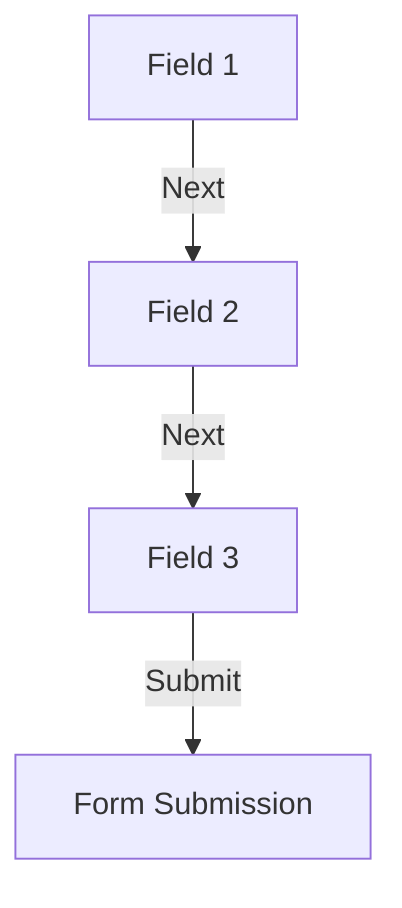

## 7.3.1 Managing Focus and Input

In the realm of mobile app development, managing user input efficiently is crucial for creating seamless and intuitive user experiences. Flutter, with its rich set of widgets and tools, provides developers with the ability to handle focus and input effectively. This section delves into the intricacies of managing focus and input in Flutter applications, focusing on the use of `FocusNode`, programmatic focus management, and best practices for enhancing user interaction.

### Understanding FocusNode

At the heart of managing focus in Flutter is the `FocusNode`. This object is used to manage the focus state of a widget, particularly input fields like `TextField` or `TextFormField`. A `FocusNode` can be thought of as a controller that keeps track of whether a widget currently has focus, allowing developers to programmatically control focus behavior.

#### Creating and Assigning a FocusNode

To utilize a `FocusNode`, you first need to create an instance of it and assign it to a widget. This is typically done in the `initState` method of a `StatefulWidget`. Here's a simple example demonstrating how to create and assign a `FocusNode` to a `TextField`:

```dart
class MyForm extends StatefulWidget {
  @override
  _MyFormState createState() => _MyFormState();
}

class _MyFormState extends State<MyForm> {
  FocusNode _focusNode;

  @override
  void initState() {
    super.initState();
    _focusNode = FocusNode();
  }

  @override
  void dispose() {
    _focusNode.dispose();
    super.dispose();
  }

  @override
  Widget build(BuildContext context) {
    return TextField(
      focusNode: _focusNode,
      decoration: InputDecoration(labelText: 'Enter your text'),
    );
  }
}
```

In this example, a `FocusNode` is created and assigned to a `TextField`. It's important to dispose of the `FocusNode` in the `dispose` method to prevent memory leaks.

### Moving Focus Between Fields

In many applications, especially forms, it's common to move focus from one input field to another. Flutter provides a straightforward way to achieve this using the `FocusScope` class. You can programmatically shift focus between fields, enhancing the user experience by reducing the need for manual input.

#### Programmatically Shifting Focus

To shift focus programmatically, you can use the `FocusScope.of(context).requestFocus()` method. Here's an example of how to move focus from one field to another:

```dart
void _fieldFocusChange(BuildContext context, FocusNode currentFocus, FocusNode nextFocus) {
  currentFocus.unfocus();
  FocusScope.of(context).requestFocus(nextFocus);
}
```

This function takes the current focus node and the next focus node as parameters, unfocuses the current field, and requests focus for the next field. This is particularly useful when implementing a "Next" button on the keyboard.

### Listening to Focus Changes

Listening to focus changes allows you to perform actions when a widget gains or loses focus. This can be useful for tasks such as validation, updating UI elements, or logging user interactions.

#### Adding Focus Change Listeners

You can add listeners to a `FocusNode` to respond to focus changes. Here's how you can do it:

```dart
_focusNode.addListener(() {
  if (_focusNode.hasFocus) {
    // Do something when the field gains focus
    print('Field has gained focus');
  } else {
    // Do something when the field loses focus
    print('Field has lost focus');
  }
});
```

By adding a listener, you can execute specific code when the focus state changes, providing a dynamic and responsive user interface.

### Disposing Focus Nodes

Proper resource management is crucial in any application. In Flutter, it's important to dispose of `FocusNode` instances when they are no longer needed to prevent memory leaks.

#### Disposing of Focus Nodes

Always dispose of your `FocusNode` in the `dispose` method of your widget:

```dart
@override
void dispose() {
  _focusNode.dispose();
  super.dispose();
}
```

This ensures that the resources used by the `FocusNode` are released when the widget is removed from the widget tree.

### Visual Aids

To better understand how focus moves between fields, consider the following diagram illustrating the flow of focus in a simple form with three input fields:



This diagram shows a linear flow where focus moves from Field 1 to Field 2, then to Field 3, and finally to form submission upon pressing the "Next" button.

### Best Practices

When managing focus and input in Flutter, consider the following best practices to enhance user experience:

- **Provide Clear Visual Cues:** Ensure that input fields provide clear visual indicators when they gain focus. This can be achieved through changes in border color, shadow, or background.
  
- **Minimize Required Interactions:** Design forms and input sequences to minimize the number of interactions required from the user. Automatically moving focus to the next field upon input submission can streamline the process.

- **Consider User Flow:** Think about the natural flow of user interaction and design your input fields to follow this flow. This can significantly improve the usability of your application.

### Exercise

To solidify your understanding of managing focus and input in Flutter, try implementing a simple form with three input fields. The form should automatically move focus to the next field upon input submission. Here's a starting point:

```dart
class MyForm extends StatefulWidget {
  @override
  _MyFormState createState() => _MyFormState();
}

class _MyFormState extends State<MyForm> {
  FocusNode _focusNode1;
  FocusNode _focusNode2;
  FocusNode _focusNode3;

  @override
  void initState() {
    super.initState();
    _focusNode1 = FocusNode();
    _focusNode2 = FocusNode();
    _focusNode3 = FocusNode();
  }

  @override
  void dispose() {
    _focusNode1.dispose();
    _focusNode2.dispose();
    _focusNode3.dispose();
    super.dispose();
  }

  void _fieldFocusChange(BuildContext context, FocusNode currentFocus, FocusNode nextFocus) {
    currentFocus.unfocus();
    FocusScope.of(context).requestFocus(nextFocus);
  }

  @override
  Widget build(BuildContext context) {
    return Column(
      children: <Widget>[
        TextField(
          focusNode: _focusNode1,
          decoration: InputDecoration(labelText: 'Field 1'),
          onSubmitted: (term) {
            _fieldFocusChange(context, _focusNode1, _focusNode2);
          },
        ),
        TextField(
          focusNode: _focusNode2,
          decoration: InputDecoration(labelText: 'Field 2'),
          onSubmitted: (term) {
            _fieldFocusChange(context, _focusNode2, _focusNode3);
          },
        ),
        TextField(
          focusNode: _focusNode3,
          decoration: InputDecoration(labelText: 'Field 3'),
          onSubmitted: (term) {
            _focusNode3.unfocus();
            // Handle form submission
          },
        ),
      ],
    );
  }
}
```

### Conclusion

Managing focus and input in Flutter is a powerful way to enhance user interaction and streamline the input process. By understanding and utilizing `FocusNode`, you can create intuitive and responsive forms that guide users through input sequences with ease. Remember to follow best practices, such as providing visual cues and minimizing interactions, to create a user-friendly experience.

For further exploration, consider diving into the official Flutter documentation on [Focus and Text Input](https://flutter.dev/docs/cookbook/forms/focus) and experimenting with more complex input scenarios in your projects.

## Quiz Time!



### What is a `FocusNode` used for in Flutter?

- [x] To manage the focus state of a widget
- [ ] To handle network requests
- [ ] To manage state across the application
- [ ] To style widgets

> **Explanation:** A `FocusNode` is used to manage the focus state of a widget, particularly input fields like `TextField`.

### How do you programmatically move focus from one field to another in Flutter?

- [x] Using `FocusScope.of(context).requestFocus(nextFocus)`
- [ ] Using `Navigator.push()`
- [ ] Using `setState()`
- [ ] Using `Theme.of(context)`

> **Explanation:** You can programmatically move focus using `FocusScope.of(context).requestFocus(nextFocus)`.

### Why is it important to dispose of `FocusNode` instances?

- [x] To prevent memory leaks
- [ ] To improve network performance
- [ ] To enhance UI animations
- [ ] To reduce app size

> **Explanation:** Disposing of `FocusNode` instances is important to prevent memory leaks in your application.

### What method is used to listen for focus changes on a `FocusNode`?

- [x] `addListener()`
- [ ] `removeListener()`
- [ ] `setState()`
- [ ] `initState()`

> **Explanation:** The `addListener()` method is used to listen for focus changes on a `FocusNode`.

### What is a common use case for programmatically shifting focus between fields?

- [x] Moving to the next input field when the user presses the "Next" button on the keyboard
- [ ] Changing the theme of the app
- [ ] Navigating to a new screen
- [ ] Updating the app's state

> **Explanation:** A common use case is moving to the next input field when the user presses the "Next" button on the keyboard.

### Which method is used to unfocus a `FocusNode`?

- [x] `unfocus()`
- [ ] `dispose()`
- [ ] `removeFocus()`
- [ ] `clearFocus()`

> **Explanation:** The `unfocus()` method is used to remove focus from a `FocusNode`.

### What should you do when a `FocusNode` is no longer needed?

- [x] Dispose of it in the `dispose()` method
- [ ] Call `setState()`
- [ ] Remove it from the widget tree
- [ ] Change its color

> **Explanation:** When a `FocusNode` is no longer needed, it should be disposed of in the `dispose()` method to free resources.

### Which class is used to manage focus across multiple widgets?

- [x] `FocusScope`
- [ ] `Navigator`
- [ ] `Theme`
- [ ] `State`

> **Explanation:** `FocusScope` is used to manage focus across multiple widgets.

### What visual aid can help users identify which input field is focused?

- [x] Clear visual cues like border color changes
- [ ] Changing the app's theme
- [ ] Displaying a dialog
- [ ] Playing a sound

> **Explanation:** Clear visual cues, such as border color changes, help users identify which input field is focused.

### True or False: It is unnecessary to dispose of a `FocusNode` if it is used in a `StatelessWidget`.

- [ ] True
- [x] False

> **Explanation:** False. Even if a `FocusNode` is used in a `StatelessWidget`, it should be disposed of to prevent memory leaks.


