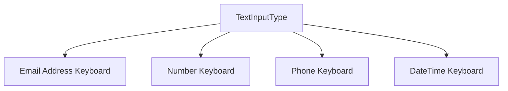

## 7.3.2 Customizing the Keyboard

In the realm of mobile app development, providing a seamless and intuitive user input experience is paramount. Flutter, with its rich set of widgets and customization options, allows developers to tailor the keyboard experience to suit the needs of their applications. This section delves into the various ways you can customize the keyboard in Flutter, enhancing both functionality and user experience.

### Setting Keyboard Types

Choosing the right keyboard type is crucial for improving user input efficiency. Flutter's `TextField` widget offers a variety of keyboard layouts tailored to the expected input type. This not only streamlines the data entry process but also reduces user errors.

#### Specifying Keyboard Layout

To specify the keyboard layout, use the `keyboardType` property of the `TextField` widget. Here's a basic example:

```dart
TextField(
  keyboardType: TextInputType.emailAddress,
  decoration: InputDecoration(
    labelText: 'Email',
  ),
)
```

#### Common Keyboard Types

- **TextInputType.number**: Ideal for numeric input, such as age or quantity.
- **TextInputType.phone**: Best suited for phone numbers, providing a dial pad layout.
- **TextInputType.datetime**: Useful for date and time inputs, offering a layout with numbers and symbols.

### Controlling Input Actions

The `textInputAction` property allows you to control the action button on the keyboard, enhancing the flow of data entry. This is particularly useful in forms where users need to move between fields or submit data.

#### Setting Input Actions

Here's how you can set the `textInputAction`:

```dart
TextField(
  textInputAction: TextInputAction.next,
  decoration: InputDecoration(
    labelText: 'First Name',
  ),
)
```

#### Common Input Actions

- **TextInputAction.done**: Indicates completion of input.
- **TextInputAction.go**: Typically used for search or navigation actions.
- **TextInputAction.search**: Activates a search operation.

### Obscuring Text for Passwords

For sensitive information like passwords, it's essential to obscure the input to protect user privacy. The `obscureText` property is used for this purpose.

#### Enabling Text Obscuring

Here's how you can obscure text in a password field:

```dart
TextField(
  obscureText: true,
  decoration: InputDecoration(
    labelText: 'Password',
  ),
)
```

### Customizing Keyboard Appearance

The appearance of the keyboard can be customized to match the app's theme, providing a consistent user experience. The `keyboardAppearance` property allows you to set the keyboard's brightness.

#### Setting Keyboard Appearance

To set the keyboard appearance, use the following code:

```dart
TextField(
  keyboardAppearance: Brightness.dark,
  decoration: InputDecoration(
    labelText: 'Username',
  ),
)
```

### Input Formatters

Input formatters are powerful tools for restricting input to certain patterns, ensuring data integrity and reducing errors.

#### Using Input Formatters

Here's an example of using an input formatter to allow only digits:

```dart
TextField(
  inputFormatters: [FilteringTextInputFormatter.digitsOnly],
  decoration: InputDecoration(
    labelText: 'Age',
  ),
)
```

#### Example: Limiting Input to Uppercase Letters

```dart
TextField(
  inputFormatters: [FilteringTextInputFormatter.allow(RegExp(r'[A-Z]'))],
  decoration: InputDecoration(
    labelText: 'Code',
  ),
)
```

### Visual Aids

To better understand the impact of these customizations, let's look at some visual representations of different keyboard layouts:



### Best Practices

- **Choose the Appropriate Keyboard**: Always select the keyboard type that matches the expected input to enhance user experience.
- **Avoid Unnecessary Restrictions**: While input formatters are useful, avoid over-restricting input, which can frustrate users.
- **Consistent Appearance**: Ensure the keyboard appearance aligns with the app's theme for a cohesive look.

### Exercise

To solidify your understanding, try creating a simple form with fields for a phone number and a date, each using the appropriate keyboard type. Here's a starting point:

```dart
Column(
  children: [
    TextField(
      keyboardType: TextInputType.phone,
      decoration: InputDecoration(
        labelText: 'Phone Number',
      ),
    ),
    TextField(
      keyboardType: TextInputType.datetime,
      decoration: InputDecoration(
        labelText: 'Date of Birth',
      ),
    ),
  ],
)
```

### Conclusion

Customizing the keyboard in Flutter is a straightforward yet powerful way to enhance user interaction with your app. By selecting the appropriate keyboard type, controlling input actions, and utilizing input formatters, you can significantly improve the data entry experience. Remember to always consider the user's perspective and strive for a balance between functionality and usability.

## Quiz Time!



### What property of the `TextField` widget is used to specify the keyboard layout?

- [x] `keyboardType`
- [ ] `textInputAction`
- [ ] `obscureText`
- [ ] `inputFormatters`

> **Explanation:** The `keyboardType` property is used to specify the keyboard layout based on the expected input type.

### Which `TextInputType` is best suited for entering phone numbers?

- [ ] `TextInputType.emailAddress`
- [ ] `TextInputType.number`
- [x] `TextInputType.phone`
- [ ] `TextInputType.datetime`

> **Explanation:** `TextInputType.phone` is designed for entering phone numbers, providing a dial pad layout.

### How can you control the action button on the keyboard in a `TextField`?

- [ ] By setting the `keyboardType`
- [x] By setting the `textInputAction`
- [ ] By setting the `obscureText`
- [ ] By setting the `keyboardAppearance`

> **Explanation:** The `textInputAction` property controls the action button on the keyboard.

### What property would you use to obscure text input in a password field?

- [ ] `keyboardType`
- [ ] `textInputAction`
- [x] `obscureText`
- [ ] `inputFormatters`

> **Explanation:** The `obscureText` property is used to hide input in a password field.

### Which property allows you to set the keyboard's brightness?

- [ ] `textInputAction`
- [ ] `obscureText`
- [x] `keyboardAppearance`
- [ ] `inputFormatters`

> **Explanation:** The `keyboardAppearance` property sets the keyboard's brightness to match the app's theme.

### What is the purpose of input formatters in a `TextField`?

- [x] To restrict input to certain patterns
- [ ] To change the keyboard layout
- [ ] To obscure text input
- [ ] To control the action button on the keyboard

> **Explanation:** Input formatters restrict input to certain patterns, ensuring data integrity.

### Which input formatter would you use to allow only digits?

- [ ] `FilteringTextInputFormatter.allow(RegExp(r'[A-Z]'))`
- [x] `FilteringTextInputFormatter.digitsOnly`
- [ ] `FilteringTextInputFormatter.allow(RegExp(r'[a-z]'))`
- [ ] `FilteringTextInputFormatter.deny(RegExp(r'[0-9]'))`

> **Explanation:** `FilteringTextInputFormatter.digitsOnly` allows only digits in the input field.

### What is a best practice when choosing a keyboard type for a `TextField`?

- [x] Choose the keyboard type that matches the expected input
- [ ] Always use `TextInputType.text`
- [ ] Avoid using `TextInputType.number`
- [ ] Use `TextInputType.emailAddress` for all inputs

> **Explanation:** Choosing the keyboard type that matches the expected input enhances user experience.

### True or False: The `textInputAction` property can be used to obscure text input.

- [ ] True
- [x] False

> **Explanation:** The `textInputAction` property controls the action button on the keyboard, not text obscuring.

### Which of the following is NOT a common input action?

- [ ] `TextInputAction.done`
- [ ] `TextInputAction.go`
- [ ] `TextInputAction.search`
- [x] `TextInputAction.hide`

> **Explanation:** `TextInputAction.hide` is not a recognized input action in Flutter.


