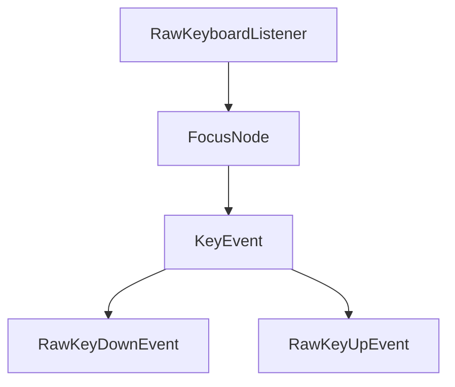

## 7.3.3 Handling Special Keys

In the realm of Flutter development, handling keyboard input is crucial, especially for applications targeting desktop and web platforms. This section delves into the intricacies of managing special keys, such as function keys, arrow keys, and keyboard shortcuts, using Flutter's robust framework. We'll explore the `RawKeyboardListener`, differentiate between key event types, and implement keyboard shortcuts using `Shortcuts` and `Actions` widgets. By the end of this section, you'll be equipped to enhance user interaction through effective keyboard handling.

### Listening to Key Events

Flutter provides the `RawKeyboardListener` widget, a powerful tool for capturing raw keyboard events. This widget is particularly useful for applications that need to respond to hardware keyboard inputs, such as desktop or web apps.

Here's a basic example of using `RawKeyboardListener` to detect when the Enter key is pressed:

```dart
import 'package:flutter/material.dart';
import 'package:flutter/services.dart';

class SpecialKeyHandler extends StatelessWidget {
  @override
  Widget build(BuildContext context) {
    return Scaffold(
      appBar: AppBar(title: Text('Special Key Handler')),
      body: RawKeyboardListener(
        focusNode: FocusNode(),
        onKey: (RawKeyEvent event) {
          if (event.isKeyPressed(LogicalKeyboardKey.enter)) {
            print('Enter key pressed');
            // Handle Enter key
          }
        },
        child: Center(
          child: Text('Press the Enter key'),
        ),
      ),
    );
  }
}
```

**Key Points:**
- **FocusNode**: A `FocusNode` is required to capture keyboard events. It manages the focus state of the `RawKeyboardListener`.
- **LogicalKeyboardKey**: This class provides a comprehensive list of logical keys, allowing you to check for specific key presses.

### KeyEvent Types

Understanding the types of key events is essential for implementing precise keyboard interactions. Flutter distinguishes between two primary key event types: `RawKeyDownEvent` and `RawKeyUpEvent`.

- **RawKeyDownEvent**: Triggered when a key is pressed down.
- **RawKeyUpEvent**: Triggered when a key is released.

Here's how you can differentiate between these events:

```dart
onKey: (RawKeyEvent event) {
  if (event.runtimeType == RawKeyDownEvent) {
    print('Key is pressed down');
  } else if (event.runtimeType == RawKeyUpEvent) {
    print('Key is released');
  }
}
```

**Practical Example:**
Consider a scenario where you want to perform an action only when a key is pressed down, not when it's released. This distinction is crucial for implementing features like key repeat actions.

### Handling Keyboard Shortcuts

Keyboard shortcuts are a staple of desktop applications, enhancing productivity by allowing users to perform actions quickly. Flutter facilitates the implementation of keyboard shortcuts through the `Shortcuts` and `Actions` widgets.

#### Implementing Keyboard Shortcuts

Here's how you can set up a simple keyboard shortcut for copying text using the `Shortcuts` and `Actions` widgets:

```dart
import 'package:flutter/material.dart';
import 'package:flutter/services.dart';

class KeyboardShortcutExample extends StatelessWidget {
  void _copy() {
    print('Copy action triggered');
    // Implement copy functionality
  }

  @override
  Widget build(BuildContext context) {
    return Shortcuts(
      shortcuts: {
        LogicalKeySet(LogicalKeyboardKey.control, LogicalKeyboardKey.keyC): CopyIntent(),
      },
      child: Actions(
        actions: {
          CopyIntent: CallbackAction<CopyIntent>(
            onInvoke: (CopyIntent intent) => _copy(),
          ),
        },
        child: Scaffold(
          appBar: AppBar(title: Text('Keyboard Shortcuts')),
          body: Center(
            child: Text('Press Ctrl+C to copy'),
          ),
        ),
      ),
    );
  }
}

class CopyIntent extends Intent {}
```

**Key Components:**
- **Shortcuts**: Maps key combinations to intents.
- **Actions**: Associates intents with callback actions.

### Visual Aids

To better understand how key events propagate through the focus hierarchy, consider the following diagram:



**Explanation:**
- The `RawKeyboardListener` listens for key events.
- Events are processed through the `FocusNode`.
- Depending on the action, either a `RawKeyDownEvent` or `RawKeyUpEvent` is triggered.

### Best Practices

When handling keyboard inputs, consider the following best practices:

- **Non-interference**: Ensure that custom keyboard handling does not override or interfere with default system behaviors.
- **Visual Feedback**: Provide users with visual cues when a keyboard shortcut is activated, enhancing user experience and accessibility.
- **Accessibility**: Consider users with disabilities by ensuring that keyboard shortcuts and key events are accessible and configurable.

### Exercise: Implementing a Simple Text Editor

To solidify your understanding, try implementing a simple text editor that handles keyboard shortcuts for copy and paste. Use the `Shortcuts` and `Actions` widgets to map common text editing shortcuts, such as Ctrl+C for copy and Ctrl+V for paste.

**Steps:**
1. Set up a basic Flutter application with a `TextField` for text input.
2. Implement `Shortcuts` and `Actions` to handle copy and paste operations.
3. Provide visual feedback when shortcuts are activated.

### Conclusion

Handling special keys in Flutter is a powerful way to enhance user interaction, especially for desktop and web applications. By mastering `RawKeyboardListener`, understanding key event types, and implementing keyboard shortcuts with `Shortcuts` and `Actions`, you can create responsive and intuitive applications. Remember to adhere to best practices to ensure a seamless user experience.

## Quiz Time!



### What widget is used in Flutter to handle raw keyboard events?

- [x] RawKeyboardListener
- [ ] TextField
- [ ] GestureDetector
- [ ] FocusNode

> **Explanation:** `RawKeyboardListener` is specifically designed to handle raw keyboard events in Flutter applications.

### Which class provides a comprehensive list of logical keys in Flutter?

- [x] LogicalKeyboardKey
- [ ] KeyEvent
- [ ] RawKeyEvent
- [ ] KeySet

> **Explanation:** `LogicalKeyboardKey` provides a list of logical keys that can be used to identify specific key presses.

### What is the purpose of the `FocusNode` in a `RawKeyboardListener`?

- [x] To manage the focus state and capture keyboard events
- [ ] To display text input
- [ ] To handle mouse events
- [ ] To manage network requests

> **Explanation:** `FocusNode` is used to manage the focus state of the `RawKeyboardListener` and capture keyboard events.

### How can you differentiate between `RawKeyDownEvent` and `RawKeyUpEvent`?

- [x] By checking the `runtimeType` of the event
- [ ] By checking the `keyCode` of the event
- [ ] By using a `FocusNode`
- [ ] By using a `TextField`

> **Explanation:** You can differentiate between `RawKeyDownEvent` and `RawKeyUpEvent` by checking the `runtimeType` of the event.

### Which widgets are used to implement keyboard shortcuts in Flutter?

- [x] Shortcuts and Actions
- [ ] GestureDetector and Listener
- [ ] TextField and FocusNode
- [ ] Container and Column

> **Explanation:** `Shortcuts` and `Actions` widgets are used to implement keyboard shortcuts in Flutter applications.

### What is a best practice when handling keyboard shortcuts?

- [x] Provide visual feedback when a shortcut is activated
- [ ] Override all default system behaviors
- [ ] Ignore accessibility considerations
- [ ] Use only one shortcut per application

> **Explanation:** Providing visual feedback when a shortcut is activated enhances user experience and accessibility.

### What is the role of the `CopyIntent` class in the keyboard shortcut example?

- [x] It defines an intent for the copy action
- [ ] It handles the paste action
- [ ] It manages focus state
- [ ] It displays a dialog

> **Explanation:** `CopyIntent` defines an intent for the copy action, which is used in conjunction with `Shortcuts` and `Actions`.

### What should you ensure when implementing custom keyboard handling?

- [x] It does not interfere with default behaviors
- [ ] It overrides all system shortcuts
- [ ] It only works on mobile devices
- [ ] It ignores user feedback

> **Explanation:** Custom keyboard handling should not interfere with default system behaviors to maintain a seamless user experience.

### What is the primary use of the `Actions` widget in Flutter?

- [x] To associate intents with callback actions
- [ ] To display text input
- [ ] To manage network requests
- [ ] To handle mouse events

> **Explanation:** The `Actions` widget is used to associate intents with callback actions, enabling the implementation of keyboard shortcuts.

### True or False: `RawKeyboardListener` can be used to handle mouse events.

- [ ] True
- [x] False

> **Explanation:** `RawKeyboardListener` is specifically designed to handle keyboard events, not mouse events.


