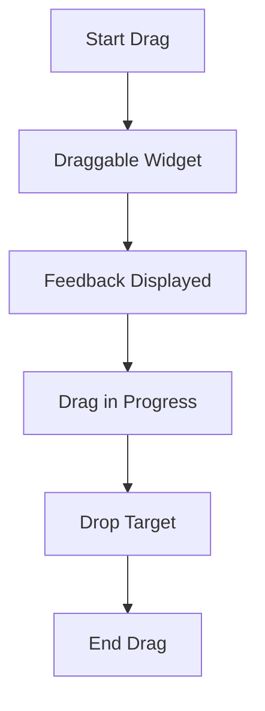

## 7.4.1 Implementing Drag Operations

In modern mobile applications, providing intuitive and interactive user interfaces is crucial for enhancing user experience. One such interactive feature is the drag-and-drop functionality, which allows users to move items around the screen. Flutter, with its rich set of widgets, makes implementing drag operations straightforward and efficient. In this section, we will delve into the `Draggable` widget, explore how to customize drag behavior, and discuss best practices for creating effective drag-and-drop interfaces.

### Understanding the Draggable Widget

The `Draggable` widget in Flutter is the cornerstone of implementing drag operations. It allows a widget to be moved around the screen by dragging it with a finger or pointer. The `Draggable` widget is versatile and can be customized to fit various use cases.

#### Basic Implementation of Draggable

Let's start with a simple example of a `Draggable` widget:

```dart
Draggable<int>(
  data: 10,
  child: Container(
    width: 100,
    height: 100,
    color: Colors.blue,
    child: Center(child: Text('Drag me')),
  ),
  feedback: Container(
    width: 100,
    height: 100,
    color: Colors.blue.withOpacity(0.5),
    child: Center(child: Text('Dragging')),
  ),
)
```

- **`data`:** This property holds the data that is transferred during the drag operation. In this example, the data is an integer (`10`). This data can be used by the drop target to determine what action to take when the drag is completed.
  
- **`feedback`:** This is the widget that is displayed under the pointer during the drag operation. It provides visual feedback to the user, indicating that the drag is in progress. In our example, the feedback is a semi-transparent blue container with the text "Dragging".

#### Customizing Drag Behavior

The `Draggable` widget offers several properties to customize its behavior, making it adaptable to various scenarios.

##### Using `childWhenDragging`

The `childWhenDragging` property allows you to specify a widget that will replace the original child while it is being dragged. This can be useful for providing visual feedback or maintaining the layout of your UI.

```dart
Draggable<int>(
  data: 10,
  child: Container(
    width: 100,
    height: 100,
    color: Colors.blue,
    child: Center(child: Text('Drag me')),
  ),
  feedback: Container(
    width: 100,
    height: 100,
    color: Colors.blue.withOpacity(0.5),
    child: Center(child: Text('Dragging')),
  ),
  childWhenDragging: Container(
    width: 100,
    height: 100,
    color: Colors.grey,
    child: Center(child: Text('Original')),
  ),
)
```

In this example, when the widget is being dragged, the original child is replaced with a grey container labeled "Original".

##### Setting `maxSimultaneousDrags`

The `maxSimultaneousDrags` property limits the number of drags that can occur simultaneously. This is particularly useful in scenarios where you want to restrict the number of items that can be dragged at once.

```dart
Draggable<int>(
  data: 10,
  child: Container(
    width: 100,
    height: 100,
    color: Colors.blue,
    child: Center(child: Text('Drag me')),
  ),
  feedback: Container(
    width: 100,
    height: 100,
    color: Colors.blue.withOpacity(0.5),
    child: Center(child: Text('Dragging')),
  ),
  maxSimultaneousDrags: 1,
)
```

Here, `maxSimultaneousDrags` is set to `1`, meaning only one drag operation can occur at a time.

### Visual Aids and Diagrams

To better understand the drag operation process, let's visualize it with diagrams.



- **Start Drag:** The user initiates the drag by pressing and holding the draggable widget.
- **Draggable Widget:** The widget becomes draggable, and the feedback is displayed.
- **Feedback Displayed:** The feedback widget follows the pointer, providing visual confirmation of the drag.
- **Drag in Progress:** The user moves the widget across the screen.
- **Drop Target:** The widget is dragged to a designated drop target.
- **End Drag:** The drag operation concludes, and the data is transferred to the drop target.

### Best Practices for Drag Operations

Implementing drag operations effectively requires attention to user experience and interface design. Here are some best practices to consider:

- **Identifiable Draggable Items:** Ensure that draggable items are easily identifiable. Use visual cues such as icons, colors, or text to indicate that an item can be dragged.

- **Adequate Draggable Areas:** Make sure that draggable areas are large enough for easy interaction. Small or tightly packed draggable items can lead to frustration and errors.

- **Consistent Feedback:** Provide consistent visual feedback during the drag operation. This helps users understand what is happening and confirms that their actions are being recognized.

- **Accessibility Considerations:** Consider accessibility when implementing drag operations. Ensure that draggable items can be used with assistive technologies and that feedback is clear for all users.

### Interactive Exercise

To reinforce your understanding of drag operations, try creating a draggable item that changes appearance when being dragged. Use the `childWhenDragging` property to modify the widget's appearance during the drag.

**Exercise:**

1. Create a `Draggable` widget with a colored container as its child.
2. Use the `childWhenDragging` property to change the container's color and text when it is being dragged.
3. Experiment with different feedback widgets to see how they affect the user experience.

### Conclusion

Implementing drag operations in Flutter is a powerful way to enhance user interaction and create dynamic interfaces. By understanding the `Draggable` widget and customizing its behavior, you can create intuitive and engaging drag-and-drop experiences. Remember to follow best practices and consider accessibility to ensure that your applications are user-friendly and inclusive.

For further exploration, consider integrating drag-and-drop functionality with other widgets such as `DragTarget` to create complete drag-and-drop solutions. Refer to the official Flutter documentation and community resources for additional insights and examples.

## Quiz Time!



### What is the primary purpose of the `Draggable` widget in Flutter?

- [x] To make a widget draggable across the screen.
- [ ] To display a static image.
- [ ] To handle network requests.
- [ ] To manage application state.

> **Explanation:** The `Draggable` widget is used to make a widget draggable, allowing it to be moved across the screen by the user.

### What does the `data` property in a `Draggable` widget represent?

- [x] The data being transferred during the drag operation.
- [ ] The color of the widget.
- [ ] The size of the widget.
- [ ] The position of the widget.

> **Explanation:** The `data` property holds the data that is transferred during the drag operation, which can be used by the drop target.

### Which property of the `Draggable` widget specifies the widget displayed during the drag?

- [x] `feedback`
- [ ] `child`
- [ ] `data`
- [ ] `maxSimultaneousDrags`

> **Explanation:** The `feedback` property specifies the widget that is displayed under the pointer during the drag operation.

### How can you limit the number of simultaneous drags in a `Draggable` widget?

- [x] By setting the `maxSimultaneousDrags` property.
- [ ] By using the `childWhenDragging` property.
- [ ] By adjusting the `data` property.
- [ ] By modifying the `feedback` property.

> **Explanation:** The `maxSimultaneousDrags` property limits the number of drag operations that can occur simultaneously.

### What is the purpose of the `childWhenDragging` property?

- [x] To specify a widget that replaces the original child during the drag.
- [ ] To set the maximum number of drags.
- [ ] To define the data being transferred.
- [ ] To change the color of the widget.

> **Explanation:** The `childWhenDragging` property allows you to specify a widget that will replace the original child while it is being dragged.

### Which of the following is a best practice for implementing drag operations?

- [x] Ensure draggable areas are large enough for easy interaction.
- [ ] Use small, tightly packed draggable items.
- [ ] Avoid providing visual feedback during the drag.
- [ ] Ignore accessibility considerations.

> **Explanation:** Ensuring draggable areas are large enough for easy interaction is a best practice to enhance user experience.

### What is a common use case for the `Draggable` widget?

- [x] Creating interactive user interfaces with drag-and-drop functionality.
- [ ] Displaying static text.
- [ ] Handling database operations.
- [ ] Managing application routing.

> **Explanation:** The `Draggable` widget is commonly used to create interactive user interfaces with drag-and-drop functionality.

### What should you consider when implementing drag operations for accessibility?

- [x] Ensure draggable items can be used with assistive technologies.
- [ ] Use complex gestures that require multiple fingers.
- [ ] Avoid providing visual feedback.
- [ ] Make draggable areas as small as possible.

> **Explanation:** Ensuring draggable items can be used with assistive technologies is important for accessibility.

### Which property would you use to change the appearance of a `Draggable` widget during a drag?

- [x] `childWhenDragging`
- [ ] `data`
- [ ] `feedback`
- [ ] `maxSimultaneousDrags`

> **Explanation:** The `childWhenDragging` property is used to change the appearance of a `Draggable` widget during a drag.

### True or False: The `Draggable` widget can only be used with integer data types.

- [ ] True
- [x] False

> **Explanation:** False. The `Draggable` widget can be used with any data type, not just integers.


