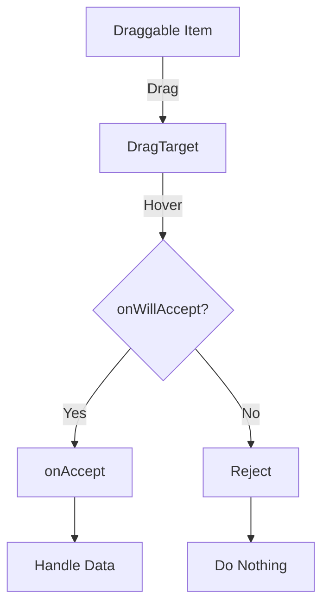

## 7.4.2 Drop Targets and Feedback

In modern app development, creating interactive and intuitive user interfaces is crucial for enhancing user experience. One of the ways to achieve this is through drag-and-drop functionality, which allows users to interact with elements in a natural and engaging manner. In this section, we will delve into the concept of drop targets in Flutter, focusing on the `DragTarget` widget, and explore how to provide effective visual feedback during drag-and-drop interactions.

### Understanding DragTarget in Flutter

The `DragTarget` widget in Flutter acts as a receiver for draggable items. It is a powerful tool that enables developers to define areas where draggable widgets can be dropped. When a draggable item is dropped onto a `DragTarget`, the target can accept the data and perform specific actions based on the received data.

#### Basic Usage of DragTarget

To implement a `DragTarget`, you need to define the widget and specify its behavior using several key properties:

- **`onAccept`:** This callback is triggered when a draggable item is successfully dropped onto the target. It receives the data from the draggable item, allowing you to handle it appropriately.
- **`builder`:** This function builds the widget tree for the `DragTarget`. It provides three parameters: the context, a list of data being dragged over the target (`candidateData`), and a list of data that was rejected (`rejectedData`).

Here's a simple example of a `DragTarget` that accepts integer data:

```dart
DragTarget<int>(
  onAccept: (data) {
    // Handle the received data
    print('Received data: $data');
  },
  builder: (context, candidateData, rejectedData) {
    return Container(
      width: 100,
      height: 100,
      color: Colors.green,
      child: Center(
        child: Text('Drop Here'),
      ),
    );
  },
)
```

In this example, the `DragTarget` is a green square that prints the received data to the console when a draggable item is dropped onto it.

### Providing Visual Feedback

Visual feedback is essential in drag-and-drop interactions as it guides users and enhances the overall experience. Flutter allows you to change the appearance of the `DragTarget` when a draggable item is hovering over it by utilizing the `candidateData` parameter in the `builder` function.

#### Changing Appearance on Hover

You can modify the appearance of the `DragTarget` based on whether it is being hovered over by a draggable item. For instance, you might change the color of the target to indicate that it is ready to accept a drop:

```dart
builder: (context, candidateData, rejectedData) {
  return Container(
    width: 100,
    height: 100,
    color: candidateData.isNotEmpty ? Colors.red : Colors.green,
    child: Center(
      child: Text(candidateData.isNotEmpty ? 'Release to Drop' : 'Drop Here'),
    ),
  );
}
```

In this code snippet, the `DragTarget` changes its color to red and updates the text when a draggable item is hovering over it, providing clear visual feedback to the user.

### Accepting Specific Data Types

In many applications, you may want to restrict the types of data that a `DragTarget` can accept. This can be achieved using the `onWillAccept` callback, which allows you to specify conditions for accepting data.

#### Using onWillAccept

The `onWillAccept` callback is called when a draggable item is dragged over the target. It receives the data from the draggable item and returns a boolean indicating whether the data should be accepted:

```dart
onWillAccept: (data) {
  return data == expectedValue;
},
```

This example demonstrates how to accept only specific data by comparing it to an expected value. If the data matches the expected value, the `DragTarget` will accept it; otherwise, it will reject it.

### Visual Aids: Illustrating Drag-and-Drop Interactions

To better understand the drag-and-drop interactions, let's visualize the process using a diagram. The following Mermaid.js diagram illustrates the flow of a draggable item being dropped onto a `DragTarget`:



In this diagram, the draggable item is dragged over the `DragTarget`. The `onWillAccept` callback determines whether the data should be accepted. If accepted, the `onAccept` callback is triggered to handle the data; otherwise, the data is rejected.

### Best Practices for Drop Targets

When implementing drop targets in your Flutter application, consider the following best practices to ensure a smooth and intuitive user experience:

- **Indicate Active Targets:** Clearly indicate when a drop target is active and ready to accept a drop. Use visual cues such as color changes or animations to signal readiness.
- **Graceful Handling of Rejections:** Handle cases where a drop is not accepted gracefully. Provide feedback to the user, such as a message or animation, to indicate that the drop was unsuccessful.
- **Consistent Feedback:** Ensure that the feedback provided during drag-and-drop interactions is consistent across your application. This helps users understand the behavior and expectations of the interface.
- **Accessibility Considerations:** Make sure that your drag-and-drop interactions are accessible to all users, including those with disabilities. Provide alternative ways to interact with the interface, such as keyboard shortcuts or voice commands.

### Exercise: Creating a Drag-and-Drop Matching Game

To put your knowledge into practice, try creating a simple drag-and-drop matching game. In this game, users will drag items to their corresponding targets. Follow these steps to build the game:

1. **Define the Draggable Items:** Create a list of draggable items, each with a unique identifier or value.
2. **Set Up the DragTargets:** Create multiple `DragTarget` widgets, each configured to accept a specific item based on its identifier or value.
3. **Implement Visual Feedback:** Use the `candidateData` parameter to change the appearance of the `DragTarget` when an item is hovering over it.
4. **Handle Successful Drops:** Use the `onAccept` callback to handle successful drops and update the game state accordingly.
5. **Provide Feedback for Incorrect Drops:** Use the `onWillAccept` callback to reject incorrect drops and provide feedback to the user.

By completing this exercise, you'll gain hands-on experience with drag-and-drop interactions in Flutter and learn how to create engaging and interactive user interfaces.

### Conclusion

In this section, we've explored the concept of drop targets in Flutter and how to provide visual feedback during drag-and-drop interactions. By using the `DragTarget` widget, you can create interactive and intuitive interfaces that enhance user experience. Remember to follow best practices and consider accessibility when implementing drag-and-drop functionality in your applications.

For further exploration, consider reading the official [Flutter documentation](https://flutter.dev/docs) on drag-and-drop interactions and experimenting with different types of draggable items and targets. Additionally, you can explore open-source projects on GitHub to see how other developers have implemented drag-and-drop functionality in their Flutter applications.

---

## Quiz Time!



### What is the primary role of the `DragTarget` widget in Flutter?

- [x] To receive data when a draggable item is dropped onto it
- [ ] To initiate drag operations
- [ ] To animate widgets
- [ ] To manage state in Flutter applications

> **Explanation:** The `DragTarget` widget is designed to receive data when a draggable item is dropped onto it, allowing developers to handle the data appropriately.

### Which callback is used to determine if a `DragTarget` should accept a draggable item?

- [ ] onAccept
- [x] onWillAccept
- [ ] builder
- [ ] onDragEnd

> **Explanation:** The `onWillAccept` callback is used to determine whether a `DragTarget` should accept a draggable item based on specific conditions.

### How can you provide visual feedback when a draggable item is hovering over a `DragTarget`?

- [ ] By using the onAccept callback
- [x] By utilizing the candidateData parameter in the builder function
- [ ] By changing the widget's state
- [ ] By using the onWillAccept callback

> **Explanation:** Visual feedback can be provided by utilizing the `candidateData` parameter in the `builder` function to change the appearance of the `DragTarget`.

### What does the `onAccept` callback do in a `DragTarget`?

- [x] It handles the data when a draggable item is successfully dropped onto the target
- [ ] It determines if the data should be accepted
- [ ] It builds the widget tree for the `DragTarget`
- [ ] It animates the drop operation

> **Explanation:** The `onAccept` callback is triggered when a draggable item is successfully dropped onto the `DragTarget`, allowing you to handle the received data.

### Which of the following is a best practice for implementing drop targets?

- [x] Clearly indicate when a drop target is active
- [ ] Always accept all draggable items
- [ ] Use complex animations for feedback
- [ ] Ignore accessibility considerations

> **Explanation:** It is a best practice to clearly indicate when a drop target is active and ready to accept a drop, providing visual cues to the user.

### What is the purpose of the `candidateData` parameter in the `DragTarget` builder function?

- [x] To provide a list of data being dragged over the target
- [ ] To handle the data when dropped
- [ ] To reject data that is not accepted
- [ ] To animate the drag operation

> **Explanation:** The `candidateData` parameter provides a list of data being dragged over the `DragTarget`, allowing you to provide visual feedback.

### How can you restrict a `DragTarget` to accept only specific data types?

- [ ] By using the onAccept callback
- [x] By implementing the onWillAccept callback
- [ ] By modifying the builder function
- [ ] By using the onDragEnd callback

> **Explanation:** You can restrict a `DragTarget` to accept only specific data types by implementing the `onWillAccept` callback to check the data.

### What should you do if a drop is not accepted by a `DragTarget`?

- [x] Provide feedback to the user
- [ ] Ignore the drop
- [ ] Automatically accept the drop
- [ ] Restart the drag operation

> **Explanation:** If a drop is not accepted, you should provide feedback to the user, indicating that the drop was unsuccessful.

### Which of the following is an example of visual feedback for a `DragTarget`?

- [x] Changing the color of the target when a draggable item is hovering over it
- [ ] Printing a message to the console
- [ ] Logging the data to a file
- [ ] Sending a notification to the user

> **Explanation:** Changing the color of the `DragTarget` when a draggable item is hovering over it is an example of visual feedback.

### True or False: The `DragTarget` widget can only accept integer data.

- [ ] True
- [x] False

> **Explanation:** False. The `DragTarget` widget can accept any data type, not just integers. You can specify the type of data it should accept.


