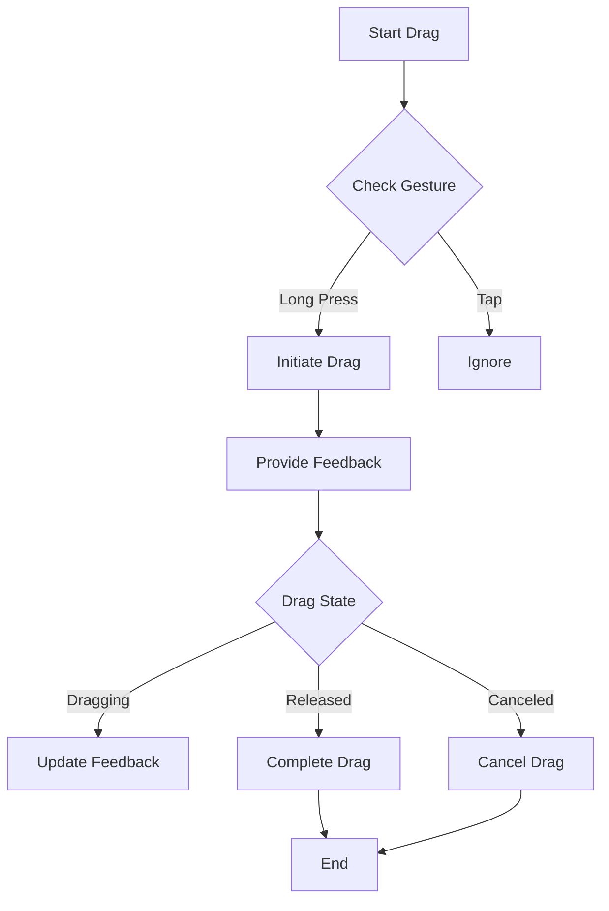

---

linkTitle: "7.4.3 Custom Drag Behaviors"
title: "Custom Drag Behaviors in Flutter: Mastering Drag and Drop Interactions"
description: "Explore the intricacies of creating custom drag behaviors in Flutter, including implementing custom draggable widgets, controlling drag motion, and using animations for dynamic feedback."
categories:
- Flutter Development
- User Interface Design
- Mobile App Development
tags:
- Flutter
- Drag and Drop
- Custom Widgets
- User Interaction
- Animation
date: 2024-10-25
type: docs
nav_weight: 743000
---

## 7.4.3 Custom Drag Behaviors

In the world of mobile app development, creating intuitive and engaging user interfaces is paramount. Flutter, with its rich set of widgets and customization capabilities, provides developers with the tools to create sophisticated drag-and-drop interactions. This section delves into the art of crafting custom drag behaviors in Flutter, offering insights into creating custom draggable widgets, controlling drag motion, and enhancing user experience with animations.

### Creating Custom Draggable Widgets

Flutter's `Draggable` widget is the cornerstone of drag-and-drop functionality. By overriding its methods, you can implement custom drag behaviors that cater to specific application needs.

#### Implementing Custom Drag Behaviors

To create a custom draggable widget, you can start by extending the `Draggable` class and overriding its methods. This allows you to modify the drag behavior, such as changing the cursor or dynamically altering the feedback widget.

```dart
class CustomDraggable extends StatelessWidget {
  @override
  Widget build(BuildContext context) {
    return Draggable<String>(
      data: 'Custom Data',
      feedback: Container(
        color: Colors.blue,
        width: 100,
        height: 100,
        child: Center(child: Text('Dragging')),
      ),
      childWhenDragging: Container(
        color: Colors.grey,
        width: 100,
        height: 100,
        child: Center(child: Text('Original')),
      ),
      child: Container(
        color: Colors.red,
        width: 100,
        height: 100,
        child: Center(child: Text('Drag Me')),
      ),
      onDragStarted: () {
        print('Drag started');
      },
      onDragCompleted: () {
        print('Drag completed');
      },
      onDraggableCanceled: (velocity, offset) {
        print('Drag canceled');
      },
    );
  }
}
```

In this example, the `feedback` widget changes dynamically during the drag operation, providing visual cues to the user.

### Controlling Drag Motion

Sometimes, you may want to initiate drag operations with specific gestures, such as a long press. Flutter's `LongPressDraggable` widget is designed for such scenarios.

#### Using LongPressDraggable

The `LongPressDraggable` widget allows you to start a drag operation with a long press, providing a more deliberate interaction model.

```dart
class LongPressDraggableExample extends StatelessWidget {
  @override
  Widget build(BuildContext context) {
    return LongPressDraggable<String>(
      data: 'Long Press Data',
      feedback: Container(
        color: Colors.green,
        width: 100,
        height: 100,
        child: Center(child: Text('Long Press Dragging')),
      ),
      child: Container(
        color: Colors.orange,
        width: 100,
        height: 100,
        child: Center(child: Text('Long Press Me')),
      ),
    );
  }
}
```

This widget is particularly useful in scenarios where accidental drags need to be minimized, ensuring that only intentional actions trigger the drag.

### Using TweenAnimations for Feedback

Animations can significantly enhance the user experience by providing dynamic feedback during drag operations. The `TweenAnimationBuilder` widget in Flutter allows you to animate properties of the feedback widget smoothly.

#### Animating Feedback with TweenAnimationBuilder

By using `TweenAnimationBuilder`, you can create animations that respond to the drag state, such as scaling or rotating the feedback widget.

```dart
class AnimatedDraggable extends StatelessWidget {
  @override
  Widget build(BuildContext context) {
    return Draggable<String>(
      data: 'Animated Data',
      feedback: TweenAnimationBuilder<double>(
        tween: Tween(begin: 1.0, end: 1.5),
        duration: Duration(milliseconds: 300),
        builder: (context, scale, child) {
          return Transform.scale(
            scale: scale,
            child: Container(
              color: Colors.purple,
              width: 100,
              height: 100,
              child: Center(child: Text('Animated')),
            ),
          );
        },
      ),
      child: Container(
        color: Colors.yellow,
        width: 100,
        height: 100,
        child: Center(child: Text('Animate Me')),
      ),
    );
  }
}
```

In this example, the feedback widget scales up during the drag, providing a visual indication of the interaction.

### Combining with Gestures

Integrating drag-and-drop functionality with gesture detection can lead to complex and interactive user interfaces. By combining `Draggable` with `GestureDetector`, you can create sophisticated interactions.

#### Integrating with GestureDetector

The `GestureDetector` widget can be used to detect various gestures, such as taps and swipes, and trigger drag operations based on these interactions.

```dart
class GestureDraggable extends StatelessWidget {
  @override
  Widget build(BuildContext context) {
    return GestureDetector(
      onTap: () {
        print('Tapped');
      },
      onDoubleTap: () {
        print('Double Tapped');
      },
      child: Draggable<String>(
        data: 'Gesture Data',
        feedback: Container(
          color: Colors.teal,
          width: 100,
          height: 100,
          child: Center(child: Text('Gesture Dragging')),
        ),
        child: Container(
          color: Colors.cyan,
          width: 100,
          height: 100,
          child: Center(child: Text('Gesture Me')),
        ),
      ),
    );
  }
}
```

This combination allows you to create interactive elements that respond to multiple types of user input, enhancing the overall user experience.

### Visual Aids

Understanding the lifecycle of custom drag operations can be challenging. Visual aids, such as flowcharts, can help clarify the process.



This flowchart illustrates the sequence of events in a custom drag operation, from the initial gesture detection to the completion or cancellation of the drag.

### Best Practices

When implementing custom drag behaviors, it's essential to ensure that they are intuitive and align with platform conventions. Here are some best practices to consider:

- **Intuitive Interactions:** Ensure that drag-and-drop interactions are easy to understand and use. Avoid complex gestures that may confuse users.
- **Platform Conventions:** Align your drag behaviors with the conventions of the platform you're targeting, whether it's iOS, Android, or web.
- **Accessibility:** Consider accessibility when designing drag-and-drop interactions. Provide alternative methods for users who may have difficulty with drag gestures.

### Exercise

To solidify your understanding of custom drag behaviors, try creating a draggable widget that scales up when dragged and snaps back to its original size when released.

```dart
class ExerciseDraggable extends StatelessWidget {
  @override
  Widget build(BuildContext context) {
    return Draggable<String>(
      data: 'Exercise Data',
      feedback: TweenAnimationBuilder<double>(
        tween: Tween(begin: 1.0, end: 1.5),
        duration: Duration(milliseconds: 300),
        builder: (context, scale, child) {
          return Transform.scale(
            scale: scale,
            child: Container(
              color: Colors.indigo,
              width: 100,
              height: 100,
              child: Center(child: Text('Exercise')),
            ),
          );
        },
      ),
      child: Container(
        color: Colors.lime,
        width: 100,
        height: 100,
        child: Center(child: Text('Drag Me')),
      ),
      onDragEnd: (details) {
        // Implement snapping back logic here
      },
    );
  }
}
```

### Conclusion

Custom drag behaviors in Flutter offer a powerful way to enhance user interaction and engagement. By leveraging Flutter's widgets and animation capabilities, you can create intuitive and dynamic drag-and-drop experiences. Remember to adhere to best practices and consider accessibility to ensure that your applications are user-friendly and inclusive.

For further exploration, consider diving into Flutter's official documentation and experimenting with different drag-and-drop scenarios in your projects.

## Quiz Time!



### What is the primary widget used for implementing drag-and-drop functionality in Flutter?

- [x] Draggable
- [ ] GestureDetector
- [ ] Container
- [ ] ListView

> **Explanation:** The `Draggable` widget is the primary widget used for implementing drag-and-drop functionality in Flutter.

### Which widget allows you to start a drag operation with a long press?

- [ ] Draggable
- [x] LongPressDraggable
- [ ] GestureDetector
- [ ] TweenAnimationBuilder

> **Explanation:** The `LongPressDraggable` widget allows you to start a drag operation with a long press.

### How can you animate the feedback widget during a drag operation?

- [ ] Using Container
- [ ] Using GestureDetector
- [x] Using TweenAnimationBuilder
- [ ] Using ListView

> **Explanation:** You can use `TweenAnimationBuilder` to animate the feedback widget during a drag operation.

### What is a best practice when implementing custom drag behaviors?

- [x] Ensure interactions are intuitive and align with platform conventions
- [ ] Use complex gestures to enhance user experience
- [ ] Ignore accessibility considerations
- [ ] Avoid using animations

> **Explanation:** It is a best practice to ensure that interactions are intuitive and align with platform conventions.

### What is the purpose of the `onDragStarted` method in a `Draggable` widget?

- [x] To execute code when the drag operation starts
- [ ] To execute code when the drag operation ends
- [ ] To execute code when the drag operation is canceled
- [ ] To execute code when the drag operation is completed

> **Explanation:** The `onDragStarted` method is used to execute code when the drag operation starts.

### Which widget can be combined with `Draggable` to detect various gestures?

- [ ] Container
- [ ] ListView
- [x] GestureDetector
- [ ] TweenAnimationBuilder

> **Explanation:** The `GestureDetector` widget can be combined with `Draggable` to detect various gestures.

### What is the role of the `feedback` property in a `Draggable` widget?

- [x] To provide a visual representation of the widget during the drag
- [ ] To handle gestures
- [ ] To manage state
- [ ] To execute animations

> **Explanation:** The `feedback` property provides a visual representation of the widget during the drag.

### How can you ensure that drag-and-drop interactions are accessible?

- [x] Provide alternative methods for users who may have difficulty with drag gestures
- [ ] Use complex gestures
- [ ] Ignore platform conventions
- [ ] Avoid using animations

> **Explanation:** Providing alternative methods for users who may have difficulty with drag gestures ensures accessibility.

### What is the purpose of the `onDraggableCanceled` method?

- [x] To execute code when the drag operation is canceled
- [ ] To execute code when the drag operation starts
- [ ] To execute code when the drag operation ends
- [ ] To execute code when the drag operation is completed

> **Explanation:** The `onDraggableCanceled` method is used to execute code when the drag operation is canceled.

### True or False: The `TweenAnimationBuilder` widget can be used to create animations that respond to the drag state.

- [x] True
- [ ] False

> **Explanation:** The `TweenAnimationBuilder` widget can indeed be used to create animations that respond to the drag state.


