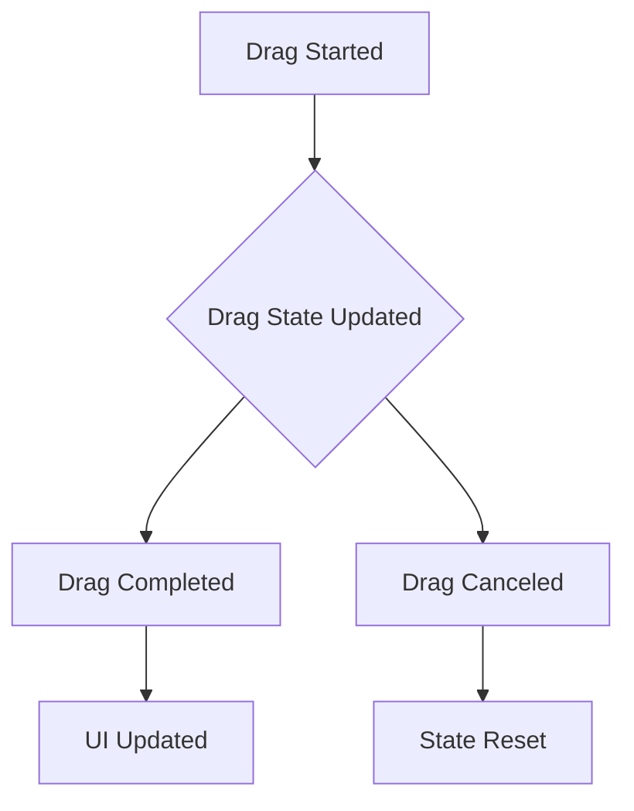

## 7.4.4 Managing Drag State

Drag-and-drop functionality is a powerful feature in modern user interfaces, allowing users to interact with applications in intuitive ways. In Flutter, managing drag state effectively is crucial for creating seamless and responsive drag-and-drop experiences. This section delves into the intricacies of managing drag state, covering essential concepts, practical implementations, and best practices.

### Tracking Drag Data

To manage drag state in Flutter, it's essential to track and update the state as the drag operation progresses. Flutter provides several state management solutions, such as `setState`, Provider, and others, to facilitate this process.

#### Using `setState`

For simple applications, `setState` can be used to update the UI in response to drag events. Here's a basic example of using `setState` to track drag state:

```dart
class DragExample extends StatefulWidget {
  @override
  _DragExampleState createState() => _DragExampleState();
}

class _DragExampleState extends State<DragExample> {
  Offset _dragOffset = Offset.zero;

  @override
  Widget build(BuildContext context) {
    return Scaffold(
      appBar: AppBar(title: Text('Drag Example')),
      body: Stack(
        children: [
          Positioned(
            left: _dragOffset.dx,
            top: _dragOffset.dy,
            child: Draggable(
              feedback: Container(
                width: 100,
                height: 100,
                color: Colors.blue,
              ),
              child: Container(
                width: 100,
                height: 100,
                color: Colors.red,
              ),
              onDragEnd: (details) {
                setState(() {
                  _dragOffset = details.offset;
                });
              },
            ),
          ),
        ],
      ),
    );
  }
}
```

In this example, the `setState` method updates the `_dragOffset` whenever the drag operation ends, repositioning the draggable widget.

#### Using Provider

For more complex applications, using a state management library like Provider can help manage drag state more efficiently. Provider allows you to separate the state logic from the UI, making your code more modular and testable.

```dart
class DragState with ChangeNotifier {
  Offset _dragOffset = Offset.zero;

  Offset get dragOffset => _dragOffset;

  void updateDragOffset(Offset newOffset) {
    _dragOffset = newOffset;
    notifyListeners();
  }
}

// In your widget tree
ChangeNotifierProvider(
  create: (_) => DragState(),
  child: DragExample(),
)
```

In this setup, the `DragState` class manages the drag offset, and the UI listens for changes using a `Consumer` widget.

### Handling Multiple Draggables

Managing multiple drag operations simultaneously requires careful coordination of state updates. You can achieve this by maintaining a list of draggable items and their respective states.

```dart
class MultiDragExample extends StatefulWidget {
  @override
  _MultiDragExampleState createState() => _MultiDragExampleState();
}

class _MultiDragExampleState extends State<MultiDragExample> {
  List<Offset> _dragOffsets = [Offset.zero, Offset(100, 100)];

  @override
  Widget build(BuildContext context) {
    return Scaffold(
      appBar: AppBar(title: Text('Multi Drag Example')),
      body: Stack(
        children: List.generate(_dragOffsets.length, (index) {
          return Positioned(
            left: _dragOffsets[index].dx,
            top: _dragOffsets[index].dy,
            child: Draggable(
              feedback: Container(
                width: 50,
                height: 50,
                color: Colors.blue,
              ),
              child: Container(
                width: 50,
                height: 50,
                color: Colors.red,
              ),
              onDragEnd: (details) {
                setState(() {
                  _dragOffsets[index] = details.offset;
                });
              },
            ),
          );
        }),
      ),
    );
  }
}
```

In this example, each draggable item maintains its own offset, allowing for independent drag operations.

### Drag Events

Flutter's `Draggable` widget provides several callbacks to handle drag events, such as `onDragStarted`, `onDraggableCanceled`, and `onDragCompleted`. These callbacks allow you to respond to different stages of the drag operation.

```dart
Draggable(
  onDragStarted: () {
    print('Drag started');
  },
  onDraggableCanceled: (velocity, offset) {
    print('Drag canceled');
  },
  onDragCompleted: () {
    print('Drag completed');
  },
  feedback: Container(
    width: 100,
    height: 100,
    color: Colors.blue,
  ),
  child: Container(
    width: 100,
    height: 100,
    color: Colors.red,
  ),
)
```

- **onDragStarted**: Triggered when the drag operation begins.
- **onDraggableCanceled**: Triggered if the drag operation is canceled, providing the velocity and offset at the time of cancellation.
- **onDragCompleted**: Triggered when the drag operation completes successfully.

### Reordering Lists

Flutter's `ReorderableListView` widget simplifies the process of reordering items in a list through drag-and-drop. This widget automatically handles the drag state and updates the list order.

```dart
class ReorderableListExample extends StatefulWidget {
  @override
  _ReorderableListExampleState createState() => _ReorderableListExampleState();
}

class _ReorderableListExampleState extends State<ReorderableListExample> {
  List<String> _items = ['Item 1', 'Item 2', 'Item 3'];

  @override
  Widget build(BuildContext context) {
    return Scaffold(
      appBar: AppBar(title: Text('Reorderable List Example')),
      body: ReorderableListView(
        onReorder: (oldIndex, newIndex) {
          setState(() {
            if (newIndex > oldIndex) {
              newIndex -= 1;
            }
            final item = _items.removeAt(oldIndex);
            _items.insert(newIndex, item);
          });
        },
        children: _items.map((item) {
          return ListTile(
            key: ValueKey(item),
            title: Text(item),
          );
        }).toList(),
      ),
    );
  }
}
```

In this example, the `ReorderableListView` widget manages the drag state internally, allowing users to reorder items by dragging them.

### Visual Aids

To better understand the state changes during drag-and-drop operations, consider the following diagram illustrating the process:



- **Drag Started**: The initial state when the user begins dragging an item.
- **Drag State Updated**: The ongoing state updates as the item is dragged.
- **Drag Completed**: The final state when the item is dropped successfully.
- **Drag Canceled**: The state when the drag operation is canceled.
- **UI Updated**: The UI reflects the new state after a successful drag.
- **State Reset**: The state reverts to its original form if the drag is canceled.

### Best Practices

- **Keep the UI Responsive**: Ensure that the UI updates promptly in response to drag events to provide a smooth user experience.
- **Test Across Devices**: Test drag-and-drop interactions on different devices and screen sizes to ensure consistent behavior.
- **Optimize Performance**: Minimize unnecessary state updates and optimize the rendering of draggable items to maintain performance.

### Exercise

To solidify your understanding, try implementing a to-do list application where tasks can be reordered through drag-and-drop. Use the `ReorderableListView` widget to manage the list order and track the drag state using a state management solution of your choice.

### Conclusion

Managing drag state in Flutter is a crucial aspect of creating interactive and user-friendly applications. By understanding how to track drag data, handle multiple draggables, and respond to drag events, you can build sophisticated drag-and-drop interfaces that enhance user engagement. Remember to follow best practices and test your implementations thoroughly to ensure a seamless experience across all devices.

## Quiz Time!



### What is the primary purpose of using state management solutions in drag-and-drop functionality?

- [x] To track and update the drag state
- [ ] To handle network requests
- [ ] To manage database connections
- [ ] To optimize app performance

> **Explanation:** State management solutions are used to track and update the drag state, ensuring that the UI reflects the current state of the drag operation.

### Which Flutter widget is specifically designed for reordering list items through drag-and-drop?

- [ ] ListView
- [x] ReorderableListView
- [ ] GridView
- [ ] Stack

> **Explanation:** The `ReorderableListView` widget is designed to allow users to reorder list items through drag-and-drop interactions.

### What callback is triggered when a drag operation is canceled in a `Draggable` widget?

- [ ] onDragStarted
- [ ] onDragCompleted
- [x] onDraggableCanceled
- [ ] onDragEnd

> **Explanation:** The `onDraggableCanceled` callback is triggered when a drag operation is canceled, allowing you to handle the cancellation appropriately.

### How can you manage multiple drag operations simultaneously in Flutter?

- [x] By maintaining a list of draggable items and their respective states
- [ ] By using a single global variable for all draggables
- [ ] By disabling drag functionality
- [ ] By using a single `Draggable` widget for all items

> **Explanation:** Managing multiple drag operations requires maintaining a list of draggable items and their respective states to handle each operation independently.

### What is a best practice for ensuring a responsive UI during drag-and-drop operations?

- [x] Updating the UI promptly in response to drag events
- [ ] Delaying UI updates until all drag operations are complete
- [ ] Using complex animations for all drag events
- [ ] Ignoring drag events to reduce processing

> **Explanation:** Keeping the UI responsive involves updating it promptly in response to drag events, ensuring a smooth user experience.

### Which state management solution is recommended for complex applications with multiple drag operations?

- [ ] setState
- [x] Provider
- [ ] InheritedWidget
- [ ] StatefulWidget

> **Explanation:** Provider is recommended for complex applications as it allows for more modular and testable code, separating state logic from the UI.

### What is the role of the `onDragCompleted` callback in a `Draggable` widget?

- [x] It is triggered when the drag operation completes successfully
- [ ] It is triggered when the drag operation starts
- [ ] It is triggered when the drag operation is canceled
- [ ] It is triggered when the drag operation fails

> **Explanation:** The `onDragCompleted` callback is triggered when the drag operation completes successfully, allowing you to perform any necessary actions upon completion.

### How does the `ReorderableListView` widget manage drag state?

- [x] It manages the drag state internally, allowing users to reorder items by dragging them
- [ ] It requires manual state management for each item
- [ ] It does not support drag-and-drop functionality
- [ ] It only supports single-item drag operations

> **Explanation:** The `ReorderableListView` widget manages the drag state internally, simplifying the process of reordering items through drag-and-drop.

### What is the benefit of using diagrams to illustrate state changes during drag-and-drop operations?

- [x] They provide a visual representation of the process, enhancing understanding
- [ ] They replace the need for code examples
- [ ] They are only useful for debugging
- [ ] They complicate the explanation

> **Explanation:** Diagrams provide a visual representation of the process, helping to enhance understanding by illustrating state changes during drag-and-drop operations.

### True or False: Testing drag-and-drop interactions on different devices is unnecessary if the code works on one device.

- [ ] True
- [x] False

> **Explanation:** False. Testing on different devices is crucial to ensure consistent behavior and performance across various screen sizes and hardware configurations.


