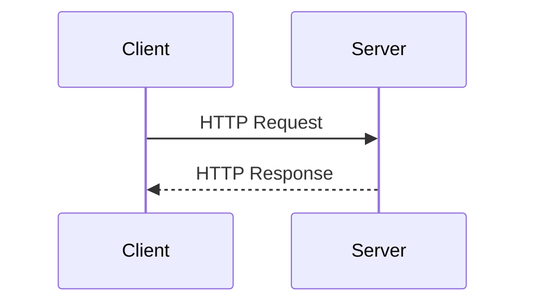
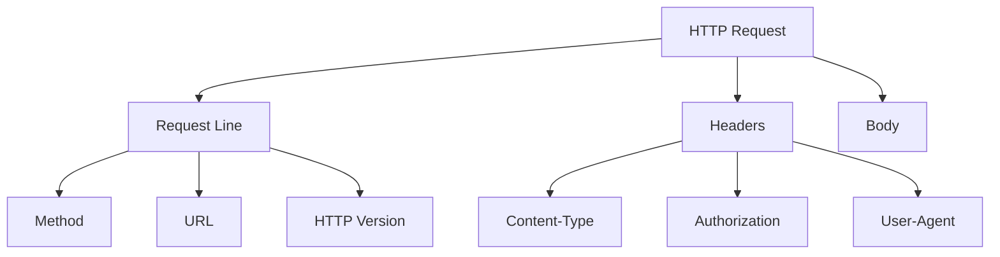

## 8.1.1 Understanding HTTP Requests

In the world of web and mobile development, understanding how data is exchanged over the internet is crucial. At the heart of this communication lies the **HTTP (HyperText Transfer Protocol)**, a protocol that serves as the backbone for data exchange on the web. This section will guide you through the essentials of HTTP requests, their structure, and how they are used in Flutter applications to interact with web services.

### Basics of HTTP Protocol

HTTP is a protocol used for transferring hypertext requests and information on the internet. It operates as a request-response protocol in the client-server computing model. A client, typically a web browser or a mobile app, sends an HTTP request to a server, which then processes the request and returns an HTTP response.

#### Client-Server Architecture

In a client-server architecture, the client initiates communication by sending a request to the server. The server processes this request and sends back a response. This interaction can be visualized as follows:



This simple sequence diagram illustrates the basic flow of an HTTP request and response. The client sends a request, and the server responds with the requested data or an error message.

#### Common HTTP Methods

HTTP defines several methods that indicate the desired action to be performed on the identified resource. Here are the most commonly used methods:

- **GET**: Used to retrieve data from a server. It is a read-only operation and does not alter the state of the resource.
- **POST**: Used to send data to a server to create a new resource. This method often includes a request body containing the data to be sent.
- **PUT**: Used to update an existing resource on the server. Like POST, it can include a request body with the updated data.
- **DELETE**: Used to remove a resource from the server.

Each method serves a specific purpose and is chosen based on the action required by the client.

### URL Structure

A URL (Uniform Resource Locator) is the address used to access a resource on the internet. Understanding its components is essential for making HTTP requests:

- **Scheme**: Indicates the protocol used, such as `http` or `https`. The latter is a secure version of HTTP.
- **Host**: The domain name or IP address of the server where the resource is hosted.
- **Path**: Specifies the exact location of the resource on the server.
- **Query Parameters**: Optional key-value pairs appended to the URL to provide additional data to the server.

For example, in the URL `https://api.example.com/data?user=123`, `https` is the scheme, `api.example.com` is the host, `/data` is the path, and `user=123` is a query parameter.

### Headers and Body

HTTP requests and responses can include headers and a body, each serving distinct purposes:

#### Headers

Headers provide metadata about the request or response. Common headers include:

- **Content-Type**: Indicates the media type of the resource (e.g., `application/json`).
- **Authorization**: Contains credentials for authenticating the client.
- **User-Agent**: Identifies the client software making the request.

#### Body

The body of an HTTP request contains data sent to the server, typically used with POST and PUT methods. For example, when submitting a form, the form data is included in the request body.

### Status Codes

HTTP status codes are issued by a server in response to a client's request. They indicate whether the request was successful or if there was an error. Here are some common status codes:

- **200 OK**: The request was successful, and the server returned the requested data.
- **201 Created**: The request was successful, and a new resource was created.
- **400 Bad Request**: The server could not understand the request due to invalid syntax.
- **401 Unauthorized**: Authentication is required to access the resource.
- **404 Not Found**: The requested resource could not be found on the server.
- **500 Internal Server Error**: The server encountered an unexpected condition that prevented it from fulfilling the request.

Understanding these codes helps in diagnosing issues and handling responses appropriately.

### Visual Aids

To further illustrate the concepts discussed, let's look at a diagram that breaks down the components of an HTTP request:



This diagram shows the structure of an HTTP request, highlighting the request line, headers, and body.

### Code Example

To put theory into practice, let's look at a simple example of making an HTTP GET request using Dart's `http` package. This example fetches data from a server and prints it to the console:

```dart
import 'package:http/http.dart' as http;

void fetchData() async {
  final response = await http.get(Uri.parse('https://api.example.com/data'));
  if (response.statusCode == 200) {
    print('Data: ${response.body}');
  } else {
    print('Error: ${response.statusCode}');
  }
}
```

In this code snippet:

- We import the `http` package to handle HTTP requests.
- The `fetchData` function makes a GET request to `https://api.example.com/data`.
- If the response status code is 200, it prints the data. Otherwise, it prints an error message with the status code.

### Key Takeaways

- Understanding HTTP is crucial for network programming and integrating web services into Flutter applications.
- HTTP requests are the primary means of communication between a client and a server.
- Familiarity with HTTP methods, URL structure, headers, and status codes is essential for effective API interaction.

### Exercises

To reinforce your understanding, consider the following exercises:

- Research and list different HTTP methods and their typical use cases.
- Practice inspecting network requests in a web browser's developer tools to see HTTP requests and responses in action.

By mastering HTTP requests, you'll be well-equipped to build Flutter applications that effectively communicate with web services, enabling dynamic and data-driven user experiences.

## Quiz Time!



### What is the primary role of the HTTP protocol?

- [x] To facilitate data communication on the web
- [ ] To encrypt data for secure transmission
- [ ] To manage database transactions
- [ ] To compile code for web applications

> **Explanation:** HTTP (HyperText Transfer Protocol) is the foundation of data communication on the web, enabling the exchange of information between clients and servers.

### Which HTTP method is typically used to retrieve data from a server?

- [x] GET
- [ ] POST
- [ ] PUT
- [ ] DELETE

> **Explanation:** The GET method is used to request data from a specified resource on the server without altering its state.

### What does the "host" component of a URL represent?

- [x] The server's domain or IP address
- [ ] The specific resource location on the server
- [ ] The protocol used for communication
- [ ] Additional data sent in the URL

> **Explanation:** The host component of a URL specifies the domain name or IP address of the server where the resource is hosted.

### What is the purpose of HTTP headers?

- [x] To provide metadata about the request or response
- [ ] To contain the main content of the request
- [ ] To encrypt the data being transmitted
- [ ] To specify the HTTP method being used

> **Explanation:** HTTP headers provide metadata about the request or response, such as content type and authorization information.

### Which HTTP status code indicates that a resource was created successfully?

- [x] 201 Created
- [ ] 200 OK
- [ ] 404 Not Found
- [ ] 500 Internal Server Error

> **Explanation:** The 201 Created status code indicates that the request was successful and a new resource was created on the server.

### In the context of HTTP, what is a "request body"?

- [x] Data sent to the server with methods like POST and PUT
- [ ] Metadata about the request
- [ ] The URL of the resource being requested
- [ ] The status code of the response

> **Explanation:** The request body contains data sent to the server, typically used with POST and PUT methods to create or update resources.

### What does a 404 status code signify?

- [x] Resource not found
- [ ] Request succeeded
- [ ] Client error in the request
- [ ] Server encountered an error

> **Explanation:** A 404 Not Found status code indicates that the requested resource could not be found on the server.

### Which component of a URL specifies the protocol used?

- [x] Scheme
- [ ] Host
- [ ] Path
- [ ] Query Parameters

> **Explanation:** The scheme component of a URL indicates the protocol used, such as `http` or `https`.

### What is the role of the Authorization header in an HTTP request?

- [x] To contain credentials for authenticating the client
- [ ] To specify the content type of the request
- [ ] To indicate the HTTP method being used
- [ ] To provide the server's response time

> **Explanation:** The Authorization header contains credentials used to authenticate the client making the request.

### True or False: The DELETE method is used to update existing data on the server.

- [ ] True
- [x] False

> **Explanation:** False. The DELETE method is used to remove data from the server, not to update it.


