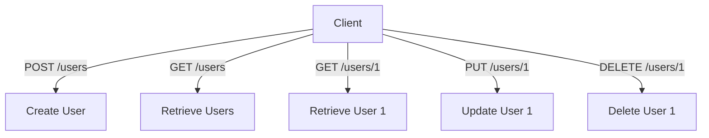

## 8.1.2 RESTful APIs

In the world of modern web and mobile applications, RESTful APIs play a crucial role in enabling communication between client applications and servers. This section delves into the core concepts of RESTful APIs, their principles, and how to effectively implement them in Flutter applications.

### Introduction to REST

**REST (Representational State Transfer)** is an architectural style that defines a set of constraints and principles for designing networked applications. RESTful APIs are built on top of the HTTP protocol and use standard HTTP methods to perform CRUD (Create, Read, Update, Delete) operations on resources.

RESTful APIs are designed to be simple, scalable, and stateless, making them ideal for web services that need to be consumed by a wide range of clients, including mobile apps, web browsers, and other servers.

### Principles of REST

Understanding the principles of REST is essential for designing and consuming RESTful APIs effectively. Here are the key principles:

- **Statelessness**: Each request from a client to a server must contain all the information needed to understand and process the request. The server does not store any session information about the client, which simplifies server design and improves scalability.

- **Client-Server Architecture**: RESTful APIs follow a client-server architecture, where the client and server are separate entities. This separation of concerns allows for independent development and scaling of the client and server components.

- **Uniform Interface**: RESTful APIs use a uniform interface, which means they rely on standard HTTP methods (GET, POST, PUT, DELETE) and status codes (200, 404, 500) to communicate. This uniformity simplifies the interaction between clients and servers.

- **Resource-Based**: RESTful APIs operate on resources, which are identified by URLs. Each resource can be accessed and manipulated using standard HTTP methods.

- **Representation-Oriented**: Resources can have multiple representations, such as JSON, XML, or HTML. The client and server negotiate the representation format through HTTP headers.

### CRUD Operations Mapping

RESTful APIs map HTTP methods to CRUD operations as follows:

- **POST**: Used to create a new resource. For example, `POST /users` creates a new user.

- **GET**: Used to retrieve a resource or a list of resources. For example, `GET /users` retrieves a list of users, and `GET /users/1` retrieves the details of the user with ID 1.

- **PUT/PATCH**: Used to update an existing resource. `PUT` typically replaces the entire resource, while `PATCH` updates only specific fields. For example, `PUT /users/1` updates the user with ID 1.

- **DELETE**: Used to remove a resource. For example, `DELETE /users/1` deletes the user with ID 1.

### Endpoints and Resources

API endpoints are structured to represent resources. Each endpoint corresponds to a specific resource or collection of resources. Here are some examples:

- `GET /users`: Retrieves a list of users.
- `GET /users/1`: Retrieves details of the user with ID 1.
- `POST /users`: Creates a new user.
- `PUT /users/1`: Updates the user with ID 1.
- `DELETE /users/1`: Deletes the user with ID 1.

Endpoints are designed to be intuitive and consistent, making it easy for developers to understand and use the API.

### Visual Aids

To better understand how RESTful APIs work, let's visualize the interaction between HTTP methods and resources using a flow diagram and a table.

#### API Flow Diagram



#### CRUD Operations Table

| HTTP Method | CRUD Operation | Description                  |
|-------------|----------------|------------------------------|
| POST        | Create         | Create a new resource        |
| GET         | Read           | Retrieve a resource or list  |
| PUT/PATCH   | Update         | Update an existing resource  |
| DELETE      | Delete         | Remove a resource            |

### Code Example

Let's look at a practical example of interacting with a RESTful API endpoint using Flutter and the `http` package. We'll create a function to add a new user to a server.

```dart
import 'dart:convert';
import 'package:http/http.dart' as http;

Future<void> createUser(String name, String email) async {
  final response = await http.post(
    Uri.parse('https://api.example.com/users'),
    headers: {'Content-Type': 'application/json'},
    body: jsonEncode({'name': name, 'email': email}),
  );

  if (response.statusCode == 201) {
    print('User created: ${response.body}');
  } else {
    print('Error: ${response.statusCode}');
  }
}
```

**Explanation:**

- We use the `http.post` method to send a POST request to the `/users` endpoint.
- The `headers` specify that the request body is in JSON format.
- The `body` contains the user data, which is encoded as a JSON string using `jsonEncode`.
- We check the `statusCode` of the response to determine if the user was created successfully (status code 201) or if there was an error.

### Best Practices

When working with RESTful APIs, it's important to follow best practices to ensure efficient and secure communication:

- **Use Proper HTTP Methods**: Always use the appropriate HTTP method for the action being performed. For example, use GET for retrieval and POST for creation.

- **Handle Responses and Errors**: Check the status codes of responses and handle errors appropriately. Provide meaningful error messages to users.

- **Secure API Calls**: Use HTTPS to encrypt data in transit and protect sensitive information. Implement authentication and authorization mechanisms to control access to resources.

### Exercises

To reinforce your understanding of RESTful APIs, try the following exercises:

- **Design a Simple RESTful API**: Choose a resource, such as products in an e-commerce app, and design a RESTful API for it. Map out the endpoints and the corresponding HTTP methods.

- **Implement a CRUD Application**: Create a simple Flutter application that interacts with a RESTful API to perform CRUD operations on a resource of your choice.

These exercises will help you apply the concepts you've learned and gain hands-on experience with RESTful APIs in Flutter.

### Conclusion

RESTful APIs are a fundamental part of modern application development, enabling seamless communication between clients and servers. By understanding the principles of REST and how to implement them in Flutter, you can build robust and scalable applications that leverage the power of networked resources.

For further exploration, consider diving into the official [Flutter documentation](https://flutter.dev/docs) and [Dart API reference](https://api.dart.dev/), as well as exploring open-source projects on platforms like GitHub to see real-world implementations of RESTful APIs in Flutter applications.

## Quiz Time!



### What does REST stand for?

- [x] Representational State Transfer
- [ ] Remote Execution Service Technology
- [ ] Resource Exchange and Synchronization Technique
- [ ] Real-time Event Streaming Technology

> **Explanation:** REST stands for Representational State Transfer, an architectural style for designing networked applications.

### Which HTTP method is used to create a new resource in a RESTful API?

- [ ] GET
- [x] POST
- [ ] PUT
- [ ] DELETE

> **Explanation:** The POST method is used to create a new resource in a RESTful API.

### What is the principle of statelessness in RESTful APIs?

- [x] Each request must contain all the information needed to process it.
- [ ] The server maintains session state for each client.
- [ ] The client stores all server data locally.
- [ ] The server can modify client data directly.

> **Explanation:** Statelessness means each request from client to server must contain all the information needed to understand and process the request.

### How are resources identified in a RESTful API?

- [ ] By client IP addresses
- [ ] By server session IDs
- [x] By URLs
- [ ] By JSON objects

> **Explanation:** Resources in a RESTful API are identified by URLs.

### Which HTTP method is used to update an existing resource?

- [x] PUT
- [ ] GET
- [ ] POST
- [ ] DELETE

> **Explanation:** The PUT method is used to update an existing resource in a RESTful API.

### What is the purpose of the DELETE method in RESTful APIs?

- [ ] To create a new resource
- [ ] To retrieve a resource
- [ ] To update a resource
- [x] To remove a resource

> **Explanation:** The DELETE method is used to remove a resource in a RESTful API.

### Which HTTP status code indicates a successful creation of a resource?

- [ ] 200
- [ ] 404
- [x] 201
- [ ] 500

> **Explanation:** The status code 201 indicates that a resource has been successfully created.

### What is the role of headers in an HTTP request?

- [ ] To store session data
- [x] To provide metadata about the request
- [ ] To encrypt the request body
- [ ] To authenticate the server

> **Explanation:** Headers provide metadata about the request, such as content type and authorization information.

### Which principle of REST involves using standard HTTP methods and status codes?

- [ ] Statelessness
- [ ] Client-Server Architecture
- [x] Uniform Interface
- [ ] Representation-Oriented

> **Explanation:** The Uniform Interface principle involves using standard HTTP methods and status codes.

### True or False: RESTful APIs can only use JSON as a representation format.

- [ ] True
- [x] False

> **Explanation:** RESTful APIs can use multiple representation formats, such as JSON, XML, or HTML.


