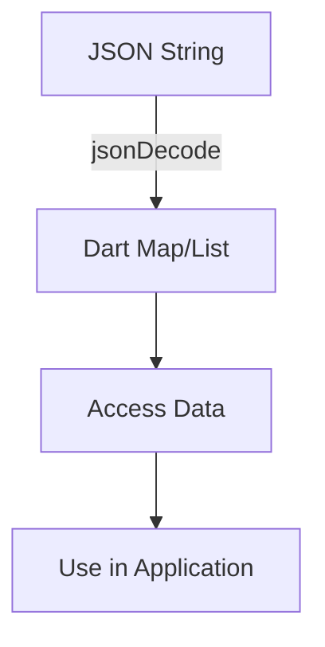

## 8.1.3 JSON Parsing

In the world of modern app development, data interchange between a client and a server is a fundamental aspect. JSON (JavaScript Object Notation) has become the de facto standard for data exchange due to its simplicity and ease of use. In this section, we will delve into the intricacies of JSON parsing in Flutter, leveraging Dart's powerful libraries to decode and encode JSON data efficiently.

### What is JSON?

JSON, or JavaScript Object Notation, is a lightweight data-interchange format that is easy for humans to read and write, and easy for machines to parse and generate. It is language-independent, using conventions familiar to programmers of the C family of languages, including C, C++, C#, Java, JavaScript, Perl, Python, and many others. These properties make JSON an ideal data-interchange language.

#### Key Characteristics of JSON:
- **Human-Readable**: JSON's syntax is straightforward and easy to understand, making it accessible for developers and non-developers alike.
- **Machine-Friendly**: JSON is easily parsed and generated by machines, making it a preferred choice for data interchange.
- **Lightweight**: JSON's minimal syntax makes it lightweight, which is crucial for performance in web and mobile applications.

### JSON Structure

Understanding the structure of JSON is crucial for parsing and generating JSON data. JSON is built on two structures:

- **Objects**: These are collections of key-value pairs enclosed in curly braces `{}`. Each key is a string, and the value can be a string, number, object, array, true, false, or null.
  
  Example:
  ```json
  {
    "name": "John Doe",
    "age": 30,
    "isStudent": false
  }
  ```

- **Arrays**: These are ordered lists of values enclosed in square brackets `[]`. Values in an array can be of any type, including objects and other arrays.
  
  Example:
  ```json
  [
    "apple",
    "banana",
    "cherry"
  ]
  ```

### Parsing JSON in Flutter

Flutter, powered by Dart, provides robust support for JSON parsing through its `dart:convert` library. This library offers straightforward methods for encoding and decoding JSON data, making it easy to integrate JSON parsing into your Flutter applications.

#### Importing the `dart:convert` Library

To work with JSON in Flutter, you need to import the `dart:convert` library, which provides the `jsonEncode` and `jsonDecode` functions.

```dart
import 'dart:convert';
```

### Decoding JSON

Decoding JSON refers to the process of converting a JSON string into a Dart object. This is typically done using the `jsonDecode()` function, which parses the JSON string and returns a corresponding Dart object, usually a `Map<String, dynamic>` or a `List<dynamic>`.

#### Example: Decoding a JSON String

Let's consider a simple JSON string and decode it into a Dart object.

```dart
import 'dart:convert';

void parseJson(String jsonString) {
  final Map<String, dynamic> data = jsonDecode(jsonString);
  print('Name: ${data['name']}');
}

void main() {
  const jsonString = '{"name": "Alice", "age": 25, "email": "alice@example.com"}';
  parseJson(jsonString);
}
```

In this example:
- We define a JSON string representing a user.
- We use `jsonDecode()` to parse the JSON string into a `Map<String, dynamic>`.
- We access the 'name' field from the parsed data and print it.

#### Understanding the Output

The `jsonDecode()` function automatically converts the JSON string into a Dart map, allowing you to access the data using keys. This is particularly useful for handling JSON objects.

### Encoding JSON

Encoding JSON involves converting a Dart object into a JSON string. This is achieved using the `jsonEncode()` function, which serializes the Dart object into a JSON-formatted string.

#### Example: Encoding a Dart Object

Consider the following example where we encode a Dart map into a JSON string.

```dart
void encodeJson() {
  final Map<String, dynamic> user = {
    'name': 'Alice',
    'email': 'alice@example.com',
  };
  final jsonString = jsonEncode(user);
  print('JSON String: $jsonString');
}

void main() {
  encodeJson();
}
```

In this example:
- We create a Dart map representing a user.
- We use `jsonEncode()` to convert the map into a JSON string.
- We print the resulting JSON string.

#### Understanding the Output

The `jsonEncode()` function serializes the Dart map into a JSON string, which can then be transmitted over a network or stored for later use.

### Handling Complex JSON Structures

Real-world JSON data often involves nested structures, such as arrays within objects or objects within arrays. Handling these complex structures requires careful parsing and data extraction.

#### Example: Parsing Nested JSON

Let's explore how to parse a JSON string with nested objects and arrays.

```dart
import 'dart:convert';

void parseNestedJson(String jsonString) {
  final Map<String, dynamic> data = jsonDecode(jsonString);
  final firstItemDetail = data['items'][0]['detail'];
  print('First Item Detail: $firstItemDetail');
}

void main() {
  const jsonString = '''
  {
    "items": [
      {"detail": "Item 1 Detail"},
      {"detail": "Item 2 Detail"}
    ]
  }
  ''';
  parseNestedJson(jsonString);
}
```

In this example:
- We define a JSON string with an array of items, each containing a 'detail' field.
- We parse the JSON string into a Dart map.
- We access the 'detail' field of the first item in the array.

#### Visualizing JSON Structures

To better understand JSON structures, let's visualize the mapping between JSON and Dart data types using a diagram.



This diagram illustrates the process of decoding a JSON string into a Dart map or list, accessing the data, and using it within your application.

### Best Practices

When working with JSON in Flutter, consider the following best practices to ensure efficient and error-free parsing:

- **Handle Null Values**: Always check for null values when accessing JSON data to avoid runtime errors.
- **Type Casting**: Be cautious with type casting, especially when dealing with dynamic data. Use explicit casting where necessary.
- **Use Model Classes**: Consider using model classes to represent complex data structures. This approach enhances code readability and maintainability.
- **Error Handling**: Implement robust error handling to manage parsing errors gracefully.

### Exercises

To reinforce your understanding of JSON parsing, try the following exercises:

1. **Parse a Sample JSON String**: Given the JSON string below, parse it and extract the 'email' field.

   ```json
   {
     "name": "Bob",
     "age": 28,
     "email": "bob@example.com"
   }
   ```

2. **Convert a Dart Object to JSON**: Write a function that converts the following Dart object into a JSON string.

   ```dart
   final Map<String, dynamic> product = {
     'id': 101,
     'name': 'Laptop',
     'price': 999.99,
     'features': ['16GB RAM', '512GB SSD', 'Intel i7']
   };
   ```

3. **Handle Nested JSON**: Given the nested JSON structure below, write a function to extract the 'price' of the second product.

   ```json
   {
     "products": [
       {"name": "Phone", "price": 699.99},
       {"name": "Tablet", "price": 499.99}
     ]
   }
   ```

### Conclusion

JSON parsing is a critical skill for any Flutter developer working with APIs and data. By understanding the structure of JSON and leveraging Dart's `dart:convert` library, you can efficiently decode and encode JSON data in your applications. Remember to apply best practices and consider using model classes for complex data structures to enhance your code's readability and maintainability.

For further exploration, consider diving into Dart's official documentation on JSON handling and exploring open-source projects that utilize JSON parsing in Flutter.

## Quiz Time!



### What is JSON?

- [x] A lightweight data-interchange format
- [ ] A programming language
- [ ] A database management system
- [ ] A web server

> **Explanation:** JSON (JavaScript Object Notation) is a lightweight data-interchange format that is easy for humans to read and write and easy for machines to parse and generate.

### Which library in Dart is used for JSON parsing?

- [x] dart:convert
- [ ] dart:core
- [ ] dart:async
- [ ] dart:io

> **Explanation:** The `dart:convert` library in Dart provides functions for JSON encoding and decoding.

### What does the `jsonDecode()` function return when parsing a JSON object?

- [x] Map<String, dynamic>
- [ ] List<dynamic>
- [ ] String
- [ ] int

> **Explanation:** The `jsonDecode()` function returns a `Map<String, dynamic>` when parsing a JSON object.

### How do you convert a Dart object to a JSON string?

- [x] Using the `jsonEncode()` function
- [ ] Using the `jsonDecode()` function
- [ ] Using the `toString()` method
- [ ] Using the `parse()` method

> **Explanation:** The `jsonEncode()` function is used to convert a Dart object to a JSON string.

### What is the correct way to access the 'detail' field of the first item in a JSON array?

- [x] data['items'][0]['detail']
- [ ] data['items']['detail'][0]
- [ ] data[0]['items']['detail']
- [ ] data['detail'][0]['items']

> **Explanation:** To access the 'detail' field of the first item in a JSON array, use `data['items'][0]['detail']`.

### Why is it important to handle null values when parsing JSON?

- [x] To avoid runtime errors
- [ ] To improve performance
- [ ] To increase code readability
- [ ] To reduce code complexity

> **Explanation:** Handling null values is important to avoid runtime errors that can occur when accessing non-existent keys in a JSON object.

### What is a best practice when dealing with complex JSON structures?

- [x] Use model classes to represent data structures
- [ ] Always use dynamic types
- [ ] Avoid using maps
- [ ] Use global variables

> **Explanation:** Using model classes to represent complex data structures enhances code readability and maintainability.

### Which of the following is a key characteristic of JSON?

- [x] Human-readable
- [ ] Binary format
- [ ] Requires a schema
- [ ] Platform-dependent

> **Explanation:** JSON is human-readable, making it easy to understand and work with.

### What is the purpose of the `jsonEncode()` function?

- [x] To convert a Dart object to a JSON string
- [ ] To parse a JSON string into a Dart object
- [ ] To validate JSON syntax
- [ ] To compress JSON data

> **Explanation:** The `jsonEncode()` function is used to convert a Dart object to a JSON string.

### True or False: JSON arrays can contain other arrays.

- [x] True
- [ ] False

> **Explanation:** JSON arrays can contain other arrays, allowing for nested data structures.


