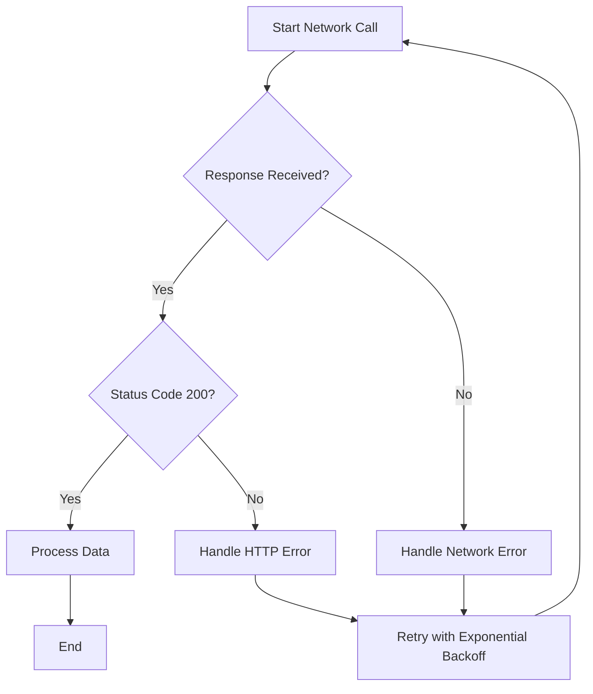

## 8.1.4 Error Handling in Network Calls

In the world of mobile application development, network calls are an essential component, enabling apps to fetch data from remote servers, interact with APIs, and provide dynamic content to users. However, network calls are inherently prone to errors due to various factors such as connectivity issues, server downtime, or data format inconsistencies. Proper error handling in network calls is crucial for maintaining app reliability and enhancing user experience. This section delves into the importance of error handling, common errors and exceptions, and practical strategies for implementing robust error management in Flutter applications.

### Importance of Error Handling

Network calls can fail for numerous reasons, including:

- **No Internet Connection:** Users may be in areas with poor connectivity or have their devices in airplane mode.
- **Server Errors:** The server might be down, overloaded, or returning unexpected responses.
- **Data Format Issues:** The data received from the server may not match the expected format, leading to parsing errors.

Proper error handling is vital for:

- **Improving App Reliability:** By gracefully handling errors, you prevent your app from crashing and ensure it continues to function under adverse conditions.
- **Enhancing User Experience:** Providing meaningful feedback to users when errors occur helps manage their expectations and reduces frustration.

### Common Errors and Exceptions

Understanding the types of errors you might encounter is the first step in handling them effectively. Here are some common exceptions in network calls:

- **SocketException:** This occurs when there are network-related issues, such as a connection timeout or inability to reach the server.
- **HttpException:** This is thrown when there is a server-side error, such as a 404 Not Found or 500 Internal Server Error.
- **FormatException:** This happens when there is an issue parsing the response data, often due to unexpected data formats.

### Implementing Try-Catch Blocks

To handle exceptions in network calls, wrap your asynchronous network requests in try-catch blocks. This allows you to catch and manage exceptions gracefully.

```dart
import 'dart:convert';
import 'dart:io';
import 'package:http/http.dart' as http;

void fetchData() async {
  try {
    final response = await http.get(Uri.parse('https://api.example.com/data'));
    if (response.statusCode == 200) {
      // Process data
      var data = jsonDecode(response.body);
      print('Data received: $data');
    } else {
      // Handle server error
      print('Server error: ${response.statusCode}');
    }
  } on SocketException {
    // Handle network error
    print('Network error: Unable to reach the server.');
  } on HttpException {
    // Handle HTTP error
    print('HTTP error: Invalid response.');
  } on FormatException {
    // Handle data format error
    print('Format error: Unable to process the data.');
  } catch (e) {
    // Handle any other exceptions
    print('Unexpected error: $e');
  }
}
```

### Handling HTTP Errors

HTTP errors are indicated by the `response.statusCode`. It's essential to check this code to determine the success or failure of a request. Common status codes include:

- **200 OK:** The request was successful.
- **404 Not Found:** The requested resource could not be found.
- **500 Internal Server Error:** The server encountered an error.

Display meaningful error messages to users based on the status code. For instance, if a 404 error occurs, inform the user that the resource is unavailable.

### Timeouts and Retries

Network requests can hang indefinitely if not properly managed. Setting timeouts ensures that your app doesn't wait forever for a response.

```dart
final response = await http
    .get(Uri.parse('https://api.example.com/data'))
    .timeout(Duration(seconds: 10));
```

If a request times out or fails, consider implementing a retry mechanism. A common strategy is exponential backoff, where the wait time between retries increases exponentially.

### Visual Aids

To better understand the decision-making process when handling network responses and errors, consider the following flowchart:



### Logging and Monitoring

Logging errors is crucial for diagnosing issues and improving your app. Consider using tools like Sentry or Firebase Crashlytics for error reporting and monitoring. These tools provide insights into error frequency and help identify patterns.

### Best Practices

- **Always Handle Exceptions:** Prevent your app from crashing by catching and managing exceptions.
- **Provide User Feedback:** Use UI elements like SnackBar or AlertDialog to inform users of errors.
- **Log Errors:** Keep a record of errors for analysis and debugging.
- **Implement Retries:** Use retry mechanisms for transient errors, with strategies like exponential backoff.

### Exercises

1. **Modify a Network Call:** Implement error handling for a network call, covering SocketException, HttpException, and FormatException. Test your implementation under different failure scenarios.
2. **Implement a Retry Mechanism:** Add a retry mechanism with exponential backoff to a network call. Experiment with different backoff strategies and observe their effects.

By mastering error handling in network calls, you can significantly enhance the robustness and user experience of your Flutter applications. Remember, a well-handled error is an opportunity to improve your app's reliability and user satisfaction.

## Quiz Time!



### Which exception is thrown when there is a network-related issue like a connection timeout?

- [x] SocketException
- [ ] HttpException
- [ ] FormatException
- [ ] TimeoutException

> **Explanation:** SocketException is thrown when there are network-related issues, such as a connection timeout or inability to reach the server.

### What should you check to determine if an HTTP request was successful?

- [ ] response.body
- [x] response.statusCode
- [ ] response.headers
- [ ] response.contentLength

> **Explanation:** The response.statusCode indicates the success or failure of an HTTP request. A status code of 200 means the request was successful.

### Which tool can be used for error reporting and monitoring in Flutter applications?

- [ ] Google Analytics
- [x] Firebase Crashlytics
- [ ] Cloud Firestore
- [ ] Flutter Inspector

> **Explanation:** Firebase Crashlytics is a tool used for error reporting and monitoring in Flutter applications, providing insights into error frequency and patterns.

### What is a common strategy for retrying failed network requests?

- [ ] Linear backoff
- [x] Exponential backoff
- [ ] Random backoff
- [ ] Constant backoff

> **Explanation:** Exponential backoff is a common strategy for retrying failed network requests, where the wait time between retries increases exponentially.

### Which of the following is NOT a common HTTP status code?

- [ ] 200 OK
- [ ] 404 Not Found
- [ ] 500 Internal Server Error
- [x] 302 Temporary Redirect

> **Explanation:** 302 Temporary Redirect is a valid HTTP status code, but it is less commonly discussed in the context of error handling compared to 200, 404, and 500.

### What should you do to prevent your app from crashing due to unhandled exceptions?

- [x] Always handle exceptions
- [ ] Ignore exceptions
- [ ] Log exceptions only
- [ ] Display exceptions to users

> **Explanation:** Always handle exceptions to prevent your app from crashing. This involves catching and managing exceptions appropriately.

### How can you inform users of errors in a Flutter application?

- [ ] By logging errors
- [x] By using UI elements like SnackBar or AlertDialog
- [ ] By ignoring errors
- [ ] By displaying raw error messages

> **Explanation:** Use UI elements like SnackBar or AlertDialog to inform users of errors in a user-friendly manner.

### Which exception is thrown when there is an issue parsing response data?

- [ ] SocketException
- [ ] HttpException
- [x] FormatException
- [ ] TimeoutException

> **Explanation:** FormatException is thrown when there is an issue parsing response data, often due to unexpected data formats.

### What is the purpose of setting a timeout for network requests?

- [ ] To increase request speed
- [x] To prevent the app from waiting indefinitely for a response
- [ ] To reduce server load
- [ ] To improve data accuracy

> **Explanation:** Setting a timeout for network requests prevents the app from waiting indefinitely for a response, ensuring it can handle delays gracefully.

### True or False: Logging errors is unnecessary if you handle exceptions properly.

- [ ] True
- [x] False

> **Explanation:** False. Logging errors is crucial even if you handle exceptions properly, as it helps diagnose issues and improve your app.


