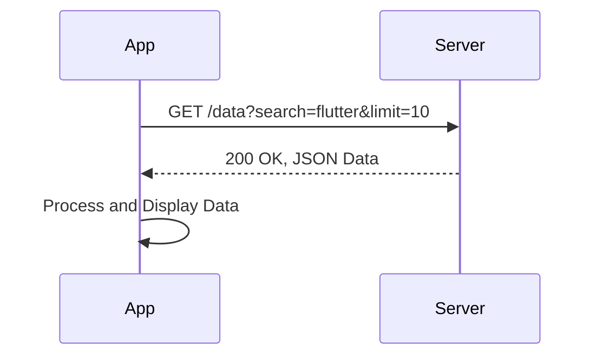

## 8.2.2 Making GET Requests

In the world of mobile app development, interacting with web services is a common requirement. Whether you're fetching data from a public API or communicating with your own backend, understanding how to make HTTP requests is crucial. In this section, we'll delve into making GET requests using Flutter's `http` package, a powerful tool for handling network operations.

### Understanding GET Requests

GET requests are the most common type of HTTP request. They are used to retrieve data from a server. When you type a URL into your browser, you're making a GET request to that server. In the context of a Flutter application, GET requests allow you to fetch data from APIs, which can then be displayed in your app.

- **Purpose of GET Requests:** Primarily used to request data from a specified resource. The server responds with the requested data, which can be in various formats like JSON, XML, or HTML.
- **URL Query String:** Parameters can be appended to the URL to refine the request. For example, `https://api.example.com/data?search=flutter&limit=10` includes query parameters for searching and limiting results.

### Making a GET Request

To make a GET request in Flutter, you'll use the `http` package. This package provides a simple way to perform HTTP requests and handle responses.

#### Step-by-Step Guide

1. **Add the `http` Package to Your Project:**

   First, ensure that the `http` package is included in your `pubspec.yaml` file:

   ```yaml
   dependencies:
     flutter:
       sdk: flutter
     http: ^0.13.3
   ```

   Run `flutter pub get` to install the package.

2. **Import the `http` Package:**

   In your Dart file, import the `http` package:

   ```dart
   import 'package:http/http.dart' as http;
   import 'dart:convert'; // For JSON decoding
   ```

3. **Write the GET Request Function:**

   Here's a basic example of making a GET request:

   ```dart
   Future<void> fetchData() async {
     final response = await http.get(Uri.parse('https://api.example.com/data'));
     if (response.statusCode == 200) {
       final data = jsonDecode(response.body);
       // Process data
       print(data);
     } else {
       // Handle error
       print('Request failed with status: ${response.statusCode}.');
     }
   }
   ```

   - **`await` and `async`:** These keywords are used for asynchronous programming. `await` pauses the execution until the future completes, while `async` marks the function as asynchronous.
   - **`Uri.parse`:** Converts a string URL into a `Uri` object, which is required by the `http.get` method.

### Adding Headers

Headers are key-value pairs sent with the request to provide additional context or information. Common headers include `Authorization` for authentication and `Accept` to specify the response format.

```dart
final response = await http.get(
  Uri.parse('https://api.example.com/data'),
  headers: {
    'Authorization': 'Bearer your_token',
    'Accept': 'application/json',
  },
);
```

- **Authorization Header:** Used to send credentials or tokens for accessing protected resources.
- **Accept Header:** Informs the server about the response format the client can handle, such as `application/json`.

### Handling Query Parameters

Query parameters are used to pass additional data to the server. They are appended to the URL and can be used to filter or sort data.

```dart
var params = {'search': 'flutter', 'limit': '10'};
var uri = Uri.https('api.example.com', '/data', params);
final response = await http.get(uri);
```

- **`Uri.https` and `Uri.http`:** Constructors for building URIs with query parameters. Use `https` for secure connections.
- **Encoding Parameters:** Always encode parameters to handle special characters and spaces.

### Visual Aids

To better understand the flow of a GET request, consider the following diagram:



This sequence diagram illustrates the interaction between your app and the server during a GET request.

### Best Practices

- **Encode Query Parameters:** Use `Uri` constructors to automatically encode parameters, ensuring special characters are handled correctly.
- **Use HTTPS:** Always use HTTPS for secure data transmission, especially when dealing with sensitive information.
- **Error Handling:** Implement robust error handling to manage network failures or unexpected server responses.
- **Caching:** Consider caching responses to reduce network calls and improve performance.

### Exercises

1. **Fetch and Display Articles:**

   Write a function to fetch a list of articles from a public API and display them in your app. Include error handling and loading indicators.

   ```dart
   Future<List<Article>> fetchArticles() async {
     final response = await http.get(Uri.parse('https://api.example.com/articles'));
     if (response.statusCode == 200) {
       final List<dynamic> articlesJson = jsonDecode(response.body);
       return articlesJson.map((json) => Article.fromJson(json)).toList();
     } else {
       throw Exception('Failed to load articles');
     }
   }
   ```

2. **Error Handling and Loading Indicators:**

   Enhance the user experience by showing a loading spinner while data is being fetched and displaying error messages if the request fails.

By mastering GET requests, you unlock the ability to integrate rich, dynamic data into your Flutter applications, enhancing their functionality and user experience. Practice these techniques and explore additional resources to deepen your understanding of network operations in Flutter.

## Quiz Time!



### What is the primary purpose of a GET request?

- [x] To retrieve data from a server
- [ ] To send data to a server
- [ ] To update data on a server
- [ ] To delete data from a server

> **Explanation:** GET requests are used to retrieve data from a server, typically without altering the server's state.

### Which package is commonly used in Flutter for making HTTP requests?

- [x] http
- [ ] dio
- [ ] axios
- [ ] retrofit

> **Explanation:** The `http` package is a popular choice for making HTTP requests in Flutter applications.

### How do you include headers in a GET request using the `http` package?

- [x] By passing a `headers` map to the `http.get` method
- [ ] By appending headers to the URL
- [ ] By using a separate method to set headers
- [ ] By modifying the request body

> **Explanation:** Headers are included in a GET request by passing a `headers` map to the `http.get` method.

### What is the purpose of the `await` keyword in Dart?

- [x] To pause execution until a future completes
- [ ] To declare a function as asynchronous
- [ ] To handle exceptions in asynchronous code
- [ ] To create a new thread

> **Explanation:** The `await` keyword is used to pause execution until a future completes, allowing asynchronous code to run synchronously.

### Which of the following is a best practice when making GET requests?

- [x] Use HTTPS for secure data transmission
- [x] Encode query parameters
- [ ] Always use HTTP for faster requests
- [ ] Ignore error handling for simplicity

> **Explanation:** Using HTTPS ensures secure data transmission, and encoding query parameters handles special characters correctly.

### What is the role of the `Uri.parse` method in making GET requests?

- [x] To convert a string URL into a `Uri` object
- [ ] To send the request to the server
- [ ] To decode the server's response
- [ ] To handle errors in the request

> **Explanation:** `Uri.parse` converts a string URL into a `Uri` object, which is required by the `http.get` method.

### How can you handle query parameters in a GET request?

- [x] By using `Uri.https` or `Uri.http` constructors
- [ ] By appending them directly to the URL string
- [ ] By including them in the request body
- [ ] By setting them in the request headers

> **Explanation:** Query parameters are handled using `Uri.https` or `Uri.http` constructors, which automatically encode them.

### What should you do if a GET request fails?

- [x] Implement error handling to manage network failures
- [ ] Retry the request indefinitely
- [ ] Ignore the error and continue
- [ ] Display a success message

> **Explanation:** Implementing error handling is crucial to manage network failures and provide a better user experience.

### Which HTTP status code indicates a successful GET request?

- [x] 200
- [ ] 404
- [ ] 500
- [ ] 403

> **Explanation:** A status code of 200 indicates a successful GET request, meaning the server has returned the requested data.

### True or False: GET requests can modify data on the server.

- [ ] True
- [x] False

> **Explanation:** GET requests are designed to retrieve data without modifying it on the server.


