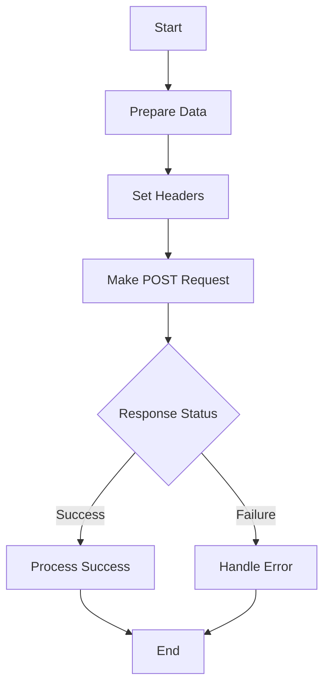

## 8.2.3 Making POST Requests

In the world of web development, interacting with APIs is a fundamental task. POST requests are a crucial part of this interaction, allowing us to send data to a server and often create new resources. In this section, we will explore how to make POST requests using Flutter's `http` package, covering everything from sending JSON data to uploading files.

### Understanding POST Requests

POST requests are used to send data to a server, typically resulting in the creation of a new resource. Unlike GET requests, which are used to retrieve data, POST requests can include a body containing the data to be sent. This makes POST requests ideal for operations like creating a new user account, submitting a form, or uploading a file.

#### Differences Between POST and GET Requests

- **Data Transmission**: 
  - **GET**: Sends data as URL parameters, visible in the URL.
  - **POST**: Sends data in the request body, not visible in the URL.

- **Use Cases**:
  - **GET**: Ideal for retrieving data without side effects.
  - **POST**: Used for operations that modify data on the server, such as creating or updating resources.

- **Security**: 
  - **GET**: Less secure for sensitive data as it appears in the URL.
  - **POST**: More secure for sensitive data as it is sent in the body.

### Making a POST Request

To make a POST request in Flutter, we use the `http.post` method. This method requires a URI, headers, and a body. The body is typically encoded as JSON, and it's crucial to set the `Content-Type` header to `application/json`.

#### Example: Creating a User

Let's look at an example of making a POST request to create a new user:

```dart
import 'dart:convert';
import 'package:http/http.dart' as http;

Future<void> createUser(String name, String email) async {
  final response = await http.post(
    Uri.parse('https://api.example.com/users'),
    headers: {'Content-Type': 'application/json'},
    body: jsonEncode({'name': name, 'email': email}),
  );

  if (response.statusCode == 201) {
    print('User created successfully');
  } else {
    print('Failed to create user: ${response.statusCode}');
  }
}
```

**Key Points:**

- **URI Parsing**: Use `Uri.parse` to convert the URL string into a URI object.
- **Headers**: Set `Content-Type` to `application/json` to indicate the body is JSON-encoded.
- **Body Encoding**: Use `jsonEncode` to convert the Dart map to a JSON string.
- **Response Handling**: Check the `statusCode` to determine if the request was successful.

### Sending Form Data

Sometimes, you may need to send data in a form-encoded format, such as when submitting login credentials. This requires setting the `Content-Type` header to `application/x-www-form-urlencoded`.

#### Example: Sending Form-Encoded Data

```dart
import 'package:http/http.dart' as http;

Future<void> loginUser(String username, String password) async {
  final response = await http.post(
    Uri.parse('https://api.example.com/login'),
    headers: {'Content-Type': 'application/x-www-form-urlencoded'},
    body: {'username': username, 'password': password},
  );

  if (response.statusCode == 200) {
    print('Login successful');
  } else {
    print('Login failed: ${response.statusCode}');
  }
}
```

**Key Points:**

- **Form Encoding**: The body is a map of key-value pairs, automatically encoded as form data.
- **Response Handling**: Similar to JSON requests, check the `statusCode` for success or failure.

### Uploading Files

For file uploads, we use multipart requests. The `http.MultipartRequest` class allows us to send files along with other form data.

#### Example: Uploading a File

```dart
import 'package:http/http.dart' as http;
import 'dart:io';

Future<void> uploadFile(String filePath) async {
  var request = http.MultipartRequest('POST', Uri.parse('https://api.example.com/upload'));
  request.files.add(await http.MultipartFile.fromPath('file', filePath));

  var response = await request.send();

  if (response.statusCode == 200) {
    print('File uploaded successfully');
  } else {
    print('File upload failed: ${response.statusCode}');
  }
}
```

**Key Points:**

- **Multipart Request**: Use `http.MultipartRequest` for file uploads.
- **File Handling**: Use `http.MultipartFile.fromPath` to read the file asynchronously.
- **Response Handling**: Check the `statusCode` to confirm the upload status.

### Visual Aids

To better understand the process of making a POST request, let's look at a flowchart illustrating the steps involved:



**Explanation:**

- **Prepare Data**: Encode the data as JSON or form-encoded.
- **Set Headers**: Include necessary headers like `Content-Type`.
- **Make POST Request**: Send the request using `http.post` or `http.MultipartRequest`.
- **Response Status**: Check the response status code to determine success or failure.

### Best Practices

- **Secure Transmission**: Always use HTTPS to encrypt data in transit.
- **Data Validation**: Validate and sanitize data before sending it to the server to prevent injection attacks.
- **Error Handling**: Implement robust error handling to manage different response scenarios.

### Exercises

1. **Implement a Login Function**: Create a function that sends user credentials to an API endpoint and handles different response scenarios (success, invalid credentials, server error).

2. **Extend the File Upload Example**: Modify the file upload example to include additional form data, such as a description or tags for the file.

### Conclusion

Making POST requests in Flutter using the `http` package is a powerful way to interact with APIs. By understanding the differences between POST and GET requests, setting the appropriate headers, and handling responses correctly, you can effectively send data to servers and create new resources. Remember to follow best practices for security and data validation to ensure your applications are robust and secure.

## Quiz Time!



### What is the primary purpose of a POST request?

- [x] To send data to the server and create a new resource
- [ ] To retrieve data from the server
- [ ] To delete a resource on the server
- [ ] To update an existing resource on the server

> **Explanation:** POST requests are primarily used to send data to the server, often resulting in the creation of a new resource.

### Which header is essential when sending JSON data in a POST request?

- [x] Content-Type: application/json
- [ ] Accept: application/json
- [ ] Content-Length
- [ ] Authorization

> **Explanation:** The `Content-Type: application/json` header is crucial as it informs the server that the request body contains JSON data.

### How do you encode form data in a POST request?

- [x] Use a map of key-value pairs with Content-Type: application/x-www-form-urlencoded
- [ ] Use JSON encoding with Content-Type: application/json
- [ ] Use XML encoding with Content-Type: application/xml
- [ ] Use plain text encoding with Content-Type: text/plain

> **Explanation:** Form data is encoded as key-value pairs with the `Content-Type: application/x-www-form-urlencoded` header.

### What class is used for file uploads in the `http` package?

- [x] http.MultipartRequest
- [ ] http.FileUploadRequest
- [ ] http.UploadRequest
- [ ] http.FileRequest

> **Explanation:** The `http.MultipartRequest` class is used for file uploads in the `http` package.

### What should you check to determine if a POST request was successful?

- [x] The response status code
- [ ] The response headers
- [ ] The request URL
- [ ] The request method

> **Explanation:** The response status code indicates whether a POST request was successful or not.

### Why is it important to use HTTPS for POST requests?

- [x] To encrypt data in transit and ensure secure transmission
- [ ] To speed up the request
- [ ] To reduce server load
- [ ] To improve SEO

> **Explanation:** HTTPS encrypts data in transit, ensuring secure transmission and protecting sensitive information.

### What method is used to convert a Dart map to a JSON string?

- [x] jsonEncode
- [ ] jsonDecode
- [ ] jsonStringify
- [ ] jsonParse

> **Explanation:** The `jsonEncode` method is used to convert a Dart map to a JSON string.

### Which of the following is a best practice when making POST requests?

- [x] Validate and sanitize data before sending it to the server
- [ ] Always use GET requests instead
- [ ] Ignore server responses
- [ ] Send data without headers

> **Explanation:** Validating and sanitizing data before sending it to the server is a best practice to prevent security vulnerabilities.

### What is the role of the `http.post` method?

- [x] To send a POST request to a specified URI
- [ ] To send a GET request to a specified URI
- [ ] To send a DELETE request to a specified URI
- [ ] To send a PUT request to a specified URI

> **Explanation:** The `http.post` method is used to send a POST request to a specified URI.

### True or False: POST requests are visible in the URL.

- [ ] True
- [x] False

> **Explanation:** POST requests send data in the request body, not in the URL, making them not visible in the URL.


