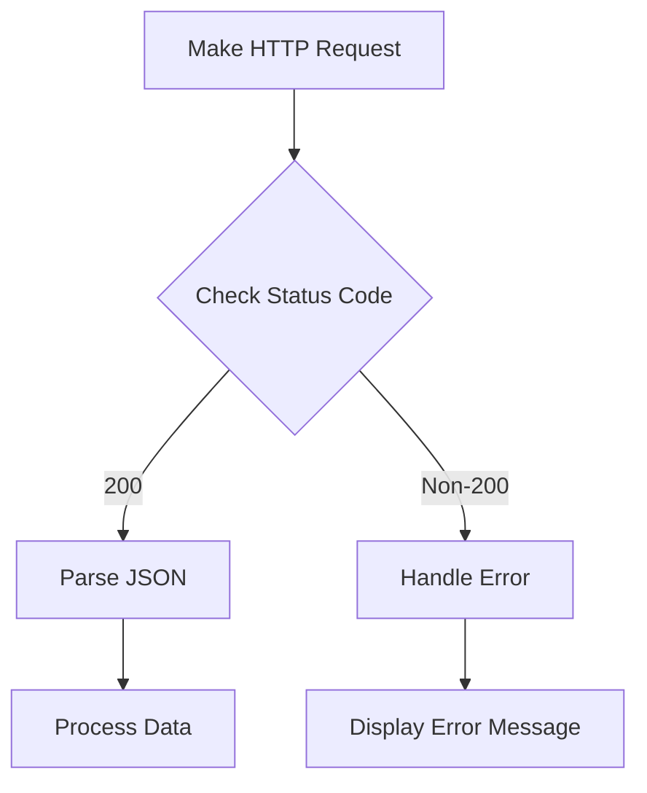

## 8.2.4 Handling Responses

In the world of mobile app development, interacting with web services is a common task. Flutter, with its powerful `http` package, makes it easy to perform HTTP requests and handle responses. This section will guide you through the intricacies of handling HTTP responses, ensuring you can effectively manage data retrieval and error handling in your Flutter applications.

### Understanding HTTP Responses

An HTTP response is the data sent by a server in response to an HTTP request. It consists of several key components:

- **Status Code:** A three-digit number indicating the result of the request. Common status codes include:
  - `200 OK`: The request was successful.
  - `404 Not Found`: The requested resource could not be found.
  - `500 Internal Server Error`: The server encountered an error.

- **Headers:** Metadata about the response, such as content type, content length, and server information. Headers provide essential context for interpreting the response body.

- **Body:** The actual data returned by the server. This could be in various formats, such as JSON, XML, or plain text.

Understanding these components is crucial for effectively handling responses in your application.

### Checking Status Codes

Before processing the response body, it's essential to check the status code to determine the outcome of the request. This helps in identifying whether the request was successful or if there were errors that need handling.

```dart
import 'package:http/http.dart' as http;

Future<void> fetchData() async {
  final response = await http.get(Uri.parse('https://api.example.com/data'));

  if (response.statusCode == 200) {
    // Process the response body
  } else {
    // Handle error
    print('Request failed with status: ${response.statusCode}.');
  }
}
```

By checking `response.statusCode`, you can implement logic to handle different scenarios, such as retrying the request or displaying an error message to the user.

### Parsing JSON Responses

JSON (JavaScript Object Notation) is a common format for data exchange between clients and servers. To work with JSON responses in Flutter, you can use the `dart:convert` library to decode the JSON data into a Dart object.

```dart
import 'dart:convert';

void processResponse(http.Response response) {
  if (response.statusCode == 200) {
    final Map<String, dynamic> data = jsonDecode(response.body);
    // Use the decoded data
  } else {
    print('Failed to load data');
  }
}
```

#### Handling Empty or Non-JSON Responses

Sometimes, the response body might be empty or not in JSON format. It's important to handle these cases gracefully to prevent runtime errors.

```dart
void processResponse(http.Response response) {
  if (response.statusCode == 200) {
    try {
      final Map<String, dynamic> data = jsonDecode(response.body);
      // Use the decoded data
    } catch (e) {
      print('Error parsing JSON: $e');
    }
  } else {
    print('Failed to load data');
  }
}
```

### Handling Different Content Types

While JSON is prevalent, you may encounter other content types like XML or plain text. Handling these requires checking the `Content-Type` header and processing the body accordingly.

```dart
void handleResponse(http.Response response) {
  final contentType = response.headers['content-type'];

  if (contentType.contains('application/json')) {
    // Parse JSON
  } else if (contentType.contains('text/xml')) {
    // Parse XML
  } else if (contentType.contains('text/plain')) {
    // Handle plain text
  }
}
```

### Using Headers from the Response

Headers can provide valuable information, such as pagination details or rate limiting. Accessing headers is straightforward:

```dart
final contentType = response.headers['content-type'];
final rateLimit = response.headers['x-rate-limit'];
```

Understanding and utilizing headers can enhance your application's functionality, such as implementing pagination or handling API rate limits.

### Error Handling

Proper error handling is crucial for a robust application. When a server returns an error, it's important to parse the error message and provide meaningful feedback to the user.

```dart
void handleError(http.Response response) {
  if (response.statusCode != 200) {
    final Map<String, dynamic> errorData = jsonDecode(response.body);
    final errorMessage = errorData['message'] ?? 'An error occurred';
    print('Error: $errorMessage');
  }
}
```

### Visual Aids

To better understand the flow of handling HTTP responses, consider the following diagram:



This diagram illustrates the decision-making process when handling HTTP responses, emphasizing the importance of checking status codes and parsing data appropriately.

### Best Practices

- **Error Messages:** Provide clear and concise error messages to users, avoiding technical jargon.
- **Security:** Avoid exposing sensitive information in error messages.
- **User Feedback:** Implement user-friendly feedback mechanisms to inform users of the request status.

### Exercises

1. **Function Implementation:** Write a function that handles HTTP responses, including parsing headers and managing non-JSON content.
2. **Error Handling:** Create a robust error-handling mechanism that provides user-friendly feedback.

### Conclusion

Handling HTTP responses effectively is a critical skill in Flutter development. By understanding the structure of responses, checking status codes, parsing JSON, and managing errors, you can build robust applications that interact seamlessly with web services.

For further exploration, consider reading the official [Flutter documentation](https://flutter.dev/docs) and exploring open-source projects on [GitHub](https://github.com/flutter/flutter).

## Quiz Time!



### What are the key components of an HTTP response?

- [x] Status Code, Headers, Body
- [ ] Request Method, URL, Headers
- [ ] Status Code, URL, Body
- [ ] Headers, URL, Request Method

> **Explanation:** An HTTP response consists of a status code, headers, and a body, which together provide the result of an HTTP request.

### Why is it important to check the status code of an HTTP response?

- [x] To determine the outcome of the request
- [ ] To verify the request method used
- [ ] To ensure the URL is correct
- [ ] To check the size of the response body

> **Explanation:** Checking the status code helps determine if the request was successful or if there were errors that need handling.

### How do you decode a JSON response body in Dart?

- [x] `final Map<String, dynamic> data = jsonDecode(response.body);`
- [ ] `final data = jsonEncode(response.body);`
- [ ] `final data = response.body.toString();`
- [ ] `final data = jsonParse(response.body);`

> **Explanation:** The `jsonDecode` function is used to convert a JSON string into a Dart object.

### What should you do if the response body is not in JSON format?

- [x] Check the `Content-Type` header and handle accordingly
- [ ] Assume it's plain text and display it
- [ ] Ignore the response
- [ ] Convert it to JSON

> **Explanation:** The `Content-Type` header indicates the format of the response body, which should be handled accordingly.

### How can you access the content type of an HTTP response?

- [x] `final contentType = response.headers['content-type'];`
- [ ] `final contentType = response.body['content-type'];`
- [ ] `final contentType = response.statusCode;`
- [ ] `final contentType = response.url;`

> **Explanation:** The content type can be accessed through the headers of the response.

### What is a common use of response headers?

- [x] To provide metadata such as pagination info and rate limiting
- [ ] To store the request URL
- [ ] To indicate the request method
- [ ] To contain the response body

> **Explanation:** Headers provide metadata about the response, such as pagination information and rate limiting.

### How should you handle errors in HTTP responses?

- [x] Parse error messages and display user-friendly feedback
- [ ] Ignore the error and retry the request
- [ ] Display the raw error message to the user
- [ ] Log the error and terminate the app

> **Explanation:** Parsing error messages and providing user-friendly feedback ensures a better user experience.

### What is the purpose of the `jsonDecode` function?

- [x] To convert a JSON string into a Dart object
- [ ] To encode a Dart object into a JSON string
- [ ] To parse XML data
- [ ] To handle plain text responses

> **Explanation:** `jsonDecode` is used to convert JSON strings into Dart objects for further processing.

### True or False: You should always expose detailed error messages to users.

- [ ] True
- [x] False

> **Explanation:** Detailed error messages can expose sensitive information and should be avoided. Provide user-friendly messages instead.

### Which library is used in Dart to decode JSON data?

- [x] `dart:convert`
- [ ] `dart:core`
- [ ] `dart:async`
- [ ] `dart:io`

> **Explanation:** The `dart:convert` library provides functions for encoding and decoding JSON data.


