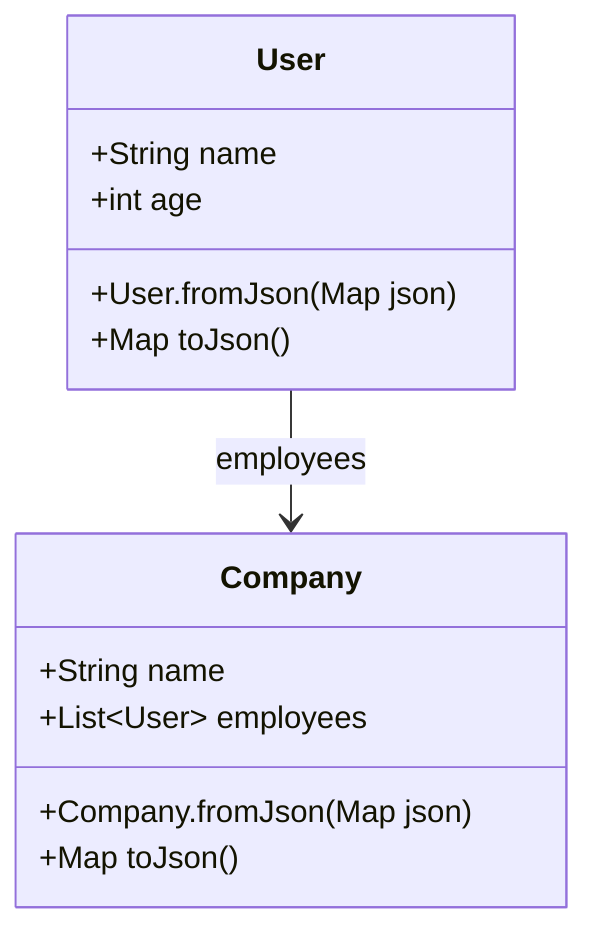

## 8.3.3 Using `json_serializable`

In modern app development, working with JSON data is a common task, especially when interacting with APIs. Manually writing serialization and deserialization code can be tedious and error-prone. This is where the `json_serializable` package comes in handy. It automates the generation of JSON serialization code for Dart objects, significantly reducing boilerplate and potential errors.

### Introduction to `json_serializable`

The `json_serializable` package is a code generation library that simplifies the process of converting Dart objects to and from JSON. By using annotations, it automatically generates the necessary code for serialization and deserialization, allowing developers to focus on the core logic of their applications.

**Benefits of Using `json_serializable`:**

- **Reduces Boilerplate:** Automatically generates the `fromJson` and `toJson` methods, eliminating repetitive code.
- **Minimizes Errors:** Ensures consistency and correctness in serialization logic.
- **Improves Maintainability:** Changes to data models are automatically reflected in serialization code.

### Setting Up the Package

To get started with `json_serializable`, you need to add it to your Flutter project's dependencies. This involves updating your `pubspec.yaml` file to include both `json_serializable` and `build_runner`, which is used to run the code generation process.

```yaml
dependencies:
  json_annotation: ^4.0.1

dev_dependencies:
  build_runner: ^2.1.4
  json_serializable: ^6.1.1
```

After updating the `pubspec.yaml`, run the following command to install the dependencies:

```bash
flutter pub get
```

This command fetches the packages and makes them available for use in your project.

### Annotating Classes

To use `json_serializable`, you need to annotate your Dart classes with `@JsonSerializable()`. This annotation tells the code generator to create the necessary serialization logic for the class.

Here's an example of how to annotate a simple `User` class:

```dart
import 'package:json_annotation/json_annotation.dart';

part 'user.g.dart';

@JsonSerializable()
class User {
  final String name;
  final int age;

  User({required this.name, required this.age});

  factory User.fromJson(Map<String, dynamic> json) => _$UserFromJson(json);

  Map<String, dynamic> toJson() => _$UserToJson(this);
}
```

**Key Points:**

- **`@JsonSerializable()` Annotation:** This annotation is essential for the code generator to recognize which classes need serialization logic.
- **`part 'user.g.dart';` Directive:** This directive includes the generated code file, which contains the `fromJson` and `toJson` methods.
- **Factory Constructor and `toJson` Method:** These are placeholders for the generated methods, which will be implemented in the `user.g.dart` file.

### Generating Serialization Code

Once your classes are annotated, you need to run the code generator to create the serialization logic. Use the following command:

```bash
flutter pub run build_runner build
```

This command generates the `user.g.dart` file, which contains the implementations of the `fromJson` and `toJson` methods. The generated code handles the conversion between JSON and Dart objects, ensuring that all fields are correctly serialized and deserialized.

### Using the Generated Code

With the serialization code generated, you can now easily convert between JSON and Dart objects. Here's how you can use the generated methods:

```dart
import 'dart:convert';

void main() {
  final userJson = '{"name":"Alice","age":30}';
  final user = User.fromJson(jsonDecode(userJson));

  print('User: ${user.name}, Age: ${user.age}');

  final jsonString = jsonEncode(user.toJson());
  print('JSON: $jsonString');
}
```

**Explanation:**

- **Deserialization:** The `User.fromJson` method converts a JSON string into a `User` object.
- **Serialization:** The `user.toJson` method converts a `User` object back into a JSON string.

### Handling Nested Objects and Lists

`json_serializable` can also handle classes that contain other classes or lists. This is particularly useful when dealing with complex JSON structures.

Consider a `Company` class that contains a list of `User` objects:

```dart
@JsonSerializable()
class Company {
  final String name;
  final List<User> employees;

  Company({required this.name, required this.employees});

  factory Company.fromJson(Map<String, dynamic> json) => _$CompanyFromJson(json);

  Map<String, dynamic> toJson() => _$CompanyToJson(this);
}
```

In this example, `json_serializable` will generate the necessary code to serialize and deserialize the `employees` list, ensuring that each `User` object is correctly processed.

### Visual Aids

To better understand the structure of the annotated class and the generated code, consider the following diagram:



This diagram illustrates the relationship between the `User` and `Company` classes and highlights the methods involved in JSON serialization.

### Best Practices

When using `json_serializable`, consider the following best practices:

- **Keep Model Classes Clean:** Avoid adding business logic to model classes. Use annotations to handle serialization.
- **Commit Generated Files:** Include generated files in source control to ensure consistency across different environments.
- **Regularly Update Dependencies:** Keep your packages up to date to benefit from the latest features and bug fixes.

### Exercises

To reinforce your understanding of `json_serializable`, try the following exercises:

- **Set Up `json_serializable`:** Integrate `json_serializable` into your own Flutter project and create model classes for your data structures.
- **Create Nested Models:** Design a complex data model with nested objects and lists, and use `json_serializable` to handle serialization.
- **Experiment with Custom Serialization:** Explore custom serialization options, such as renaming JSON keys or handling special data types.

By following these exercises, you'll gain hands-on experience with `json_serializable` and enhance your ability to work with JSON data in Flutter.

## Quiz Time!



### What is the primary purpose of the `json_serializable` package in Flutter?

- [x] To automate the generation of JSON serialization code for Dart objects.
- [ ] To manually write JSON serialization code.
- [ ] To handle network requests.
- [ ] To manage state in Flutter applications.

> **Explanation:** The `json_serializable` package is used to automate the generation of JSON serialization code, reducing boilerplate and errors.

### Which command is used to install the dependencies after adding `json_serializable` to `pubspec.yaml`?

- [ ] flutter run
- [ ] flutter build
- [x] flutter pub get
- [ ] flutter clean

> **Explanation:** The `flutter pub get` command is used to install the dependencies specified in `pubspec.yaml`.

### What annotation is used to mark a class for JSON serialization with `json_serializable`?

- [ ] @JsonEncode()
- [x] @JsonSerializable()
- [ ] @JsonDecode()
- [ ] @JsonConvert()

> **Explanation:** The `@JsonSerializable()` annotation is used to mark a class for JSON serialization with `json_serializable`.

### What is the purpose of the `part` directive in a class using `json_serializable`?

- [ ] To include external libraries.
- [x] To include the generated code file.
- [ ] To define the main function.
- [ ] To specify dependencies.

> **Explanation:** The `part` directive is used to include the generated code file that contains the `fromJson` and `toJson` methods.

### Which command generates the serialization code for classes annotated with `@JsonSerializable()`?

- [ ] flutter run
- [x] flutter pub run build_runner build
- [ ] flutter build
- [ ] flutter clean

> **Explanation:** The `flutter pub run build_runner build` command generates the serialization code for classes annotated with `@JsonSerializable()`.

### How does `json_serializable` handle nested objects and lists in a class?

- [x] It generates code to serialize and deserialize nested objects and lists.
- [ ] It ignores nested objects and lists.
- [ ] It requires manual serialization of nested objects.
- [ ] It only serializes primitive data types.

> **Explanation:** `json_serializable` generates code to handle nested objects and lists, ensuring they are correctly serialized and deserialized.

### Why is it recommended to commit generated files to source control when using `json_serializable`?

- [x] To ensure consistency across different environments.
- [ ] To reduce the size of the repository.
- [ ] To avoid using `build_runner`.
- [ ] To prevent code generation errors.

> **Explanation:** Committing generated files ensures consistency across different environments and avoids discrepancies in generated code.

### What is a benefit of using `json_serializable` over manual JSON serialization?

- [x] It reduces boilerplate code and minimizes errors.
- [ ] It increases the complexity of the code.
- [ ] It requires more manual intervention.
- [ ] It is slower than manual serialization.

> **Explanation:** `json_serializable` reduces boilerplate code and minimizes errors, making it more efficient than manual serialization.

### What should you do if you change the structure of a class annotated with `@JsonSerializable()`?

- [ ] Manually update the generated code.
- [x] Run `flutter pub run build_runner build` again to regenerate the code.
- [ ] Ignore the changes.
- [ ] Remove the `@JsonSerializable()` annotation.

> **Explanation:** If the structure of a class changes, you should run `flutter pub run build_runner build` again to regenerate the serialization code.

### True or False: `json_serializable` can only handle simple data types and cannot serialize complex objects.

- [ ] True
- [x] False

> **Explanation:** False. `json_serializable` can handle complex objects, including nested objects and lists, by generating appropriate serialization code.


