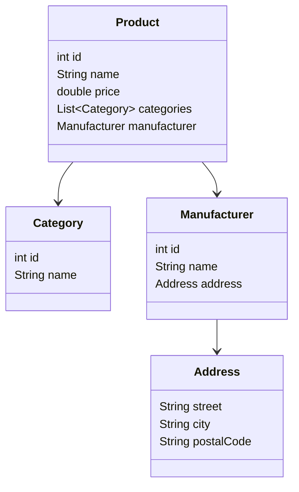

## 8.3.4 Managing Complex JSON Structures

In the world of modern app development, interacting with APIs is a common task. These APIs often return data in JSON format, which can range from simple key-value pairs to complex nested structures. Understanding how to manage these complex JSON structures is crucial for building robust Flutter applications. This section will guide you through the process of handling complex JSON data, mapping it to Dart models, and ensuring your code is efficient and error-free.

### Understanding Complex JSON

Real-world APIs frequently return JSON data that includes nested objects, arrays, and a variety of data types. This complexity can pose challenges when attempting to parse and utilize the data within your Flutter applications. Let's consider a sample JSON structure that might be returned by an e-commerce API:

```json
{
  "id": 1,
  "name": "Product Name",
  "price": 99.99,
  "categories": [
    {"id": 10, "name": "Category 1"},
    {"id": 11, "name": "Category 2"}
  ],
  "manufacturer": {
    "id": 100,
    "name": "Manufacturer Name",
    "address": {
      "street": "123 Main St",
      "city": "Anytown",
      "postalCode": "12345"
    }
  }
}
```

This JSON structure includes a product with multiple categories and a nested manufacturer object, which itself contains an address object. Parsing such a structure requires a clear understanding of how to map JSON data to Dart objects.

### Mapping JSON to Dart Models

To effectively work with complex JSON structures, it's essential to create Dart model classes that mirror the JSON structure. This involves defining classes for each entity represented in the JSON, such as `Product`, `Category`, `Manufacturer`, and `Address`.

#### Implementing Nested Model Classes

Let's start by defining the Dart classes corresponding to the JSON structure. We'll create classes for `Product`, `Category`, `Manufacturer`, and `Address`, each with `fromJson` and `toJson` methods to handle serialization and deserialization.

```dart
class Product {
  final int id;
  final String name;
  final double price;
  final List<Category> categories;
  final Manufacturer manufacturer;

  Product({
    required this.id,
    required this.name,
    required this.price,
    required this.categories,
    required this.manufacturer,
  });

  factory Product.fromJson(Map<String, dynamic> json) {
    return Product(
      id: json['id'] as int,
      name: json['name'] as String,
      price: json['price'] as double,
      categories: (json['categories'] as List)
          .map((e) => Category.fromJson(e as Map<String, dynamic>))
          .toList(),
      manufacturer: Manufacturer.fromJson(json['manufacturer'] as Map<String, dynamic>),
    );
  }

  Map<String, dynamic> toJson() {
    return {
      'id': id,
      'name': name,
      'price': price,
      'categories': categories.map((e) => e.toJson()).toList(),
      'manufacturer': manufacturer.toJson(),
    };
  }
}

class Category {
  final int id;
  final String name;

  Category({required this.id, required this.name});

  factory Category.fromJson(Map<String, dynamic> json) {
    return Category(
      id: json['id'] as int,
      name: json['name'] as String,
    );
  }

  Map<String, dynamic> toJson() {
    return {
      'id': id,
      'name': name,
    };
  }
}

class Manufacturer {
  final int id;
  final String name;
  final Address address;

  Manufacturer({required this.id, required this.name, required this.address});

  factory Manufacturer.fromJson(Map<String, dynamic> json) {
    return Manufacturer(
      id: json['id'] as int,
      name: json['name'] as String,
      address: Address.fromJson(json['address'] as Map<String, dynamic>),
    );
  }

  Map<String, dynamic> toJson() {
    return {
      'id': id,
      'name': name,
      'address': address.toJson(),
    };
  }
}

class Address {
  final String street;
  final String city;
  final String postalCode;

  Address({required this.street, required this.city, required this.postalCode});

  factory Address.fromJson(Map<String, dynamic> json) {
    return Address(
      street: json['street'] as String,
      city: json['city'] as String,
      postalCode: json['postalCode'] as String,
    );
  }

  Map<String, dynamic> toJson() {
    return {
      'street': street,
      'city': city,
      'postalCode': postalCode,
    };
  }
}
```

### Handling Lists and Nested Objects

When dealing with lists of objects, such as the `categories` array in our JSON example, you can use the `map` function to iterate over the list and convert each item to a Dart object. This approach is also applicable to nested objects, ensuring that each level of the JSON structure is accurately represented in your Dart models.

```dart
categories = (json['categories'] as List)
    .map((e) => Category.fromJson(e as Map<String, dynamic>))
    .toList();
```

### Error Handling and Null Safety

In real-world scenarios, JSON data might contain optional fields or null values. Dart's null safety features and null-aware operators can help manage these situations effectively. When defining your model classes, use nullable types for optional fields and provide default values where appropriate.

```dart
class Product {
  final int id;
  final String name;
  final double price;
  final List<Category>? categories; // Nullable list
  final Manufacturer? manufacturer; // Nullable object

  Product({
    required this.id,
    required this.name,
    required this.price,
    this.categories,
    this.manufacturer,
  });

  factory Product.fromJson(Map<String, dynamic> json) {
    return Product(
      id: json['id'] as int,
      name: json['name'] as String,
      price: json['price'] as double,
      categories: (json['categories'] as List?)
          ?.map((e) => Category.fromJson(e as Map<String, dynamic>))
          .toList(),
      manufacturer: json['manufacturer'] != null
          ? Manufacturer.fromJson(json['manufacturer'] as Map<String, dynamic>)
          : null,
    );
  }
}
```

### Visual Aids

To better understand the relationships between these model classes, consider the following diagram illustrating the structure:



### Best Practices

- **Organize Model Classes:** Keep your model classes organized by separating them into different files. This improves code readability and maintainability.
- **Use Code Generation Tools:** Consider using tools like `json_serializable` to automate the generation of `fromJson` and `toJson` methods, reducing the potential for errors.
- **Consistent Naming Conventions:** Use consistent naming conventions for class properties and JSON keys to avoid confusion.
- **Test Parsing Logic:** Write unit tests to verify that your parsing logic correctly handles various JSON structures, including edge cases.

### Exercises

To reinforce your understanding, try the following exercise:

1. Given the following JSON, create the corresponding Dart model classes and implement the parsing logic:

```json
{
  "orderId": 12345,
  "customer": {
    "customerId": 67890,
    "name": "John Doe",
    "contact": {
      "email": "john.doe@example.com",
      "phone": "555-1234"
    }
  },
  "items": [
    {"productId": 1, "quantity": 2},
    {"productId": 2, "quantity": 1}
  ],
  "total": 150.75
}
```

### Conclusion

Managing complex JSON structures in Flutter involves understanding the JSON format, mapping it to Dart models, and handling nested objects and arrays with care. By following best practices and leveraging Dart's features, you can ensure that your applications are robust and maintainable. As you continue to work with APIs, remember to test your parsing logic thoroughly and consider using tools to automate repetitive tasks.

## Quiz Time!



### What is a common challenge when working with complex JSON structures?

- [x] Handling nested objects and arrays
- [ ] Parsing simple key-value pairs
- [ ] Converting JSON to XML
- [ ] Sending JSON data to a server

> **Explanation:** Complex JSON structures often include nested objects and arrays, which can be challenging to parse and map to Dart models.

### How can you map a JSON array to a Dart list?

- [x] Use the `map` function to iterate over the JSON array and convert each item to a Dart object.
- [ ] Use the `forEach` function to iterate over the JSON array.
- [ ] Convert the JSON array to a string and then parse it.
- [ ] Use a `while` loop to iterate over the JSON array.

> **Explanation:** The `map` function is used to transform each element of a JSON array into a Dart object, which is then collected into a list.

### What is the purpose of the `fromJson` method in a Dart model class?

- [x] To deserialize JSON data into a Dart object
- [ ] To serialize a Dart object into JSON
- [ ] To convert a Dart object into XML
- [ ] To validate JSON data

> **Explanation:** The `fromJson` method is used to convert JSON data into a Dart object by mapping JSON keys to Dart class properties.

### Which Dart feature helps manage optional fields and null values in JSON?

- [x] Null safety and null-aware operators
- [ ] Type inference
- [ ] Generics
- [ ] Asynchronous programming

> **Explanation:** Dart's null safety and null-aware operators help manage optional fields and null values, ensuring safer code.

### What tool can automate the generation of `fromJson` and `toJson` methods?

- [x] json_serializable
- [ ] Flutter CLI
- [ ] Dart Analyzer
- [ ] JSON Formatter

> **Explanation:** The `json_serializable` package can automatically generate `fromJson` and `toJson` methods, reducing manual coding errors.

### Why is it important to separate model classes into different files?

- [x] To improve code readability and maintainability
- [ ] To increase the app's performance
- [ ] To reduce the app's size
- [ ] To make the app run faster

> **Explanation:** Separating model classes into different files helps keep the code organized, making it easier to read and maintain.

### What is a best practice when naming class properties and JSON keys?

- [x] Use consistent naming conventions
- [ ] Use random names for flexibility
- [ ] Use uppercase letters for all names
- [ ] Use numbers in names for uniqueness

> **Explanation:** Consistent naming conventions help avoid confusion and ensure that the code is easy to understand and maintain.

### How can you ensure your parsing logic handles various JSON structures?

- [x] Write unit tests for different JSON scenarios
- [ ] Use print statements to debug
- [ ] Manually check each JSON file
- [ ] Use a JSON validator tool

> **Explanation:** Writing unit tests for different JSON scenarios ensures that your parsing logic is robust and handles various structures correctly.

### What is the advantage of using `json_serializable` for JSON parsing?

- [x] It reduces manual coding errors by generating serialization code automatically.
- [ ] It makes the app run faster.
- [ ] It increases the app's size.
- [ ] It simplifies the app's UI design.

> **Explanation:** `json_serializable` automates the generation of serialization code, reducing the likelihood of manual coding errors.

### True or False: Real-world APIs always return simple JSON structures.

- [ ] True
- [x] False

> **Explanation:** Real-world APIs often return complex JSON structures with nested objects and arrays, requiring careful parsing and handling.


