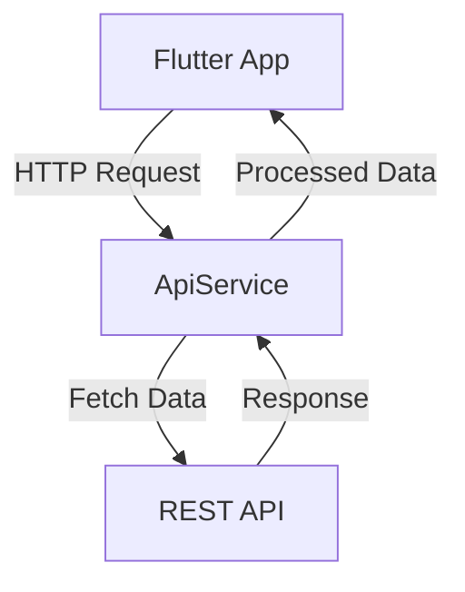

## 8.4.1 Connecting to REST APIs

In today's digital landscape, mobile applications often need to interact with remote servers to fetch, update, and manage data. This interaction is typically facilitated through REST APIs (Representational State Transfer Application Programming Interfaces), which provide a standardized way for applications to communicate with backend services. In this section, we'll explore how to connect your Flutter app to REST APIs, manage data, and implement best practices for seamless backend integration.

### Overview of Backend Integration

Integrating with backend services is a crucial aspect of modern app development. It allows your application to access and manipulate data stored remotely, enabling functionalities such as user authentication, data synchronization, and real-time updates. By leveraging REST APIs, your Flutter app can perform operations like fetching user profiles, submitting forms, or retrieving product listings from a server.

Backend integration involves several key components:

- **API Endpoints**: Specific URLs that represent different resources or actions on the server.
- **HTTP Methods**: Standardized methods like GET, POST, PUT, and DELETE used to perform operations on resources.
- **Headers**: Additional information sent with requests, often used for authentication or specifying data formats.
- **Data Formats**: Common formats like JSON or XML used to structure the data exchanged between the client and server.

Understanding these components is essential for effectively integrating your Flutter app with REST APIs.

### Setting Up API Endpoints

Before you can connect your app to a REST API, you need to understand the API's documentation. This documentation provides crucial information about the available endpoints, required headers, authentication methods, and data formats. Here's a step-by-step guide to setting up API endpoints:

1. **Read the API Documentation**: Familiarize yourself with the API's capabilities, including the available endpoints and their respective HTTP methods.

2. **Identify Required Headers**: Determine any headers that need to be included in your requests, such as `Authorization` for authentication or `Content-Type` for specifying data formats.

3. **Understand Authentication Methods**: Learn how the API handles authentication, whether through API keys, OAuth tokens, or other methods.

4. **Determine Data Formats**: Identify the data formats used by the API, typically JSON, and understand how to parse and serialize this data in your app.

By thoroughly understanding the API documentation, you can ensure that your app communicates effectively with the backend.

### Creating a Service Class

To organize your network code and maintain a clean architecture, it's beneficial to encapsulate API interactions within a service class. This approach promotes separation of concerns, making your codebase more modular and easier to maintain. Here's an example of a service class in Dart:

```dart
import 'dart:convert';
import 'package:http/http.dart' as http;

class ApiService {
  final String baseUrl = 'https://api.example.com';

  Future<List<Product>> fetchProducts() async {
    final response = await http.get(Uri.parse('$baseUrl/products'));
    if (response.statusCode == 200) {
      final List<dynamic> data = jsonDecode(response.body);
      return data.map((json) => Product.fromJson(json)).toList();
    } else {
      throw Exception('Failed to load products');
    }
  }
}
```

**Benefits of Separation of Concerns:**

- **Modularity**: By isolating network logic in a service class, you can easily manage and update API interactions without affecting other parts of your app.
- **Reusability**: Service classes can be reused across different parts of your app, reducing code duplication.
- **Testability**: Isolating network logic makes it easier to write unit tests for your API interactions.

### Handling Authorization

Many APIs require authentication to access certain endpoints. This often involves including an authentication token or API key in the request headers. Here's how you can handle authorization in your service class:

```dart
Future<List<Product>> fetchProducts(String token) async {
  final response = await http.get(
    Uri.parse('$baseUrl/products'),
    headers: {
      'Authorization': 'Bearer $token',
      'Accept': 'application/json',
    },
  );
  if (response.statusCode == 200) {
    final List<dynamic> data = jsonDecode(response.body);
    return data.map((json) => Product.fromJson(json)).toList();
  } else {
    throw Exception('Failed to load products');
  }
}
```

**Key Points:**

- **Authorization Header**: Include the `Authorization` header with the appropriate token or API key.
- **Security**: Ensure that tokens are stored securely and transmitted over HTTPS to protect sensitive information.

### Dependency Injection

To enhance the testability and flexibility of your service class, consider using dependency injection. This design pattern allows you to inject dependencies into a class, making it easier to swap out implementations for testing or configuration purposes.

```dart
class ApiService {
  final http.Client client;
  final String baseUrl;

  ApiService({required this.client, this.baseUrl = 'https://api.example.com'});

  Future<List<Product>> fetchProducts() async {
    final response = await client.get(Uri.parse('$baseUrl/products'));
    if (response.statusCode == 200) {
      final List<dynamic> data = jsonDecode(response.body);
      return data.map((json) => Product.fromJson(json)).toList();
    } else {
      throw Exception('Failed to load products');
    }
  }
}
```

**Benefits of Dependency Injection:**

- **Testability**: Easily mock dependencies for unit testing.
- **Flexibility**: Swap out implementations without modifying the service class.
- **Maintainability**: Centralize configuration and dependencies for easier management.

### Visual Aids

To better understand how your Flutter app communicates with the backend, consider the following flow diagram:



**Explanation:**

- The Flutter app sends an HTTP request to the `ApiService`.
- The `ApiService` interacts with the REST API to fetch data.
- The REST API returns a response, which is processed by the `ApiService`.
- The processed data is then returned to the Flutter app for display or further processing.

### Best Practices

When integrating with REST APIs, consider the following best practices:

- **Centralize API Configurations**: Store base URLs, headers, and other configurations in a centralized location for easier maintenance and updates.
- **Handle Exceptions Gracefully**: Implement error handling to provide meaningful error messages and improve user experience.
- **Use HTTPS**: Always use HTTPS to encrypt data in transit and protect sensitive information.
- **Limit API Calls**: Implement caching or throttling mechanisms to reduce unnecessary API calls and improve performance.

### Exercises

To reinforce your understanding, try the following exercise:

- **Create a Service Class**: Choose an API of your choice and create a service class to interact with it. Implement methods for different endpoints, such as fetching data, submitting forms, or updating resources.

By following these guidelines and best practices, you can effectively connect your Flutter app to REST APIs and leverage the power of backend services to enhance your application's functionality.

## Quiz Time!



### What is the primary purpose of integrating a Flutter app with a REST API?

- [x] To access and manipulate data stored remotely
- [ ] To improve the app's user interface
- [ ] To enhance the app's performance
- [ ] To reduce the app's size

> **Explanation:** Integrating with a REST API allows the app to access and manipulate data stored on a remote server, enabling functionalities like fetching user profiles or submitting forms.

### Which of the following is NOT a component of REST API integration?

- [ ] API Endpoints
- [ ] HTTP Methods
- [x] CSS Stylesheets
- [ ] Headers

> **Explanation:** CSS Stylesheets are not related to REST API integration. REST API integration involves components like API endpoints, HTTP methods, and headers.

### What is the benefit of using a service class for API interactions?

- [x] It promotes separation of concerns and modularity
- [ ] It makes the code more complex
- [ ] It decreases the app's performance
- [ ] It increases code duplication

> **Explanation:** A service class promotes separation of concerns and modularity by isolating network logic, making the codebase more organized and maintainable.

### How can you include an authentication token in an API request header?

- [x] By adding it to the 'Authorization' header
- [ ] By appending it to the URL
- [ ] By including it in the request body
- [ ] By storing it in a cookie

> **Explanation:** Authentication tokens are typically included in the 'Authorization' header of an API request to authenticate the client.

### What is the purpose of dependency injection in a service class?

- [x] To enhance testability and flexibility
- [ ] To increase code complexity
- [ ] To reduce the number of lines of code
- [ ] To improve the app's user interface

> **Explanation:** Dependency injection enhances testability and flexibility by allowing dependencies to be injected into a class, making it easier to swap out implementations for testing or configuration.

### Which HTTP method is commonly used to fetch data from a REST API?

- [x] GET
- [ ] POST
- [ ] PUT
- [ ] DELETE

> **Explanation:** The GET method is commonly used to fetch data from a REST API.

### What should you do to ensure secure transmission of data when integrating with a REST API?

- [x] Use HTTPS
- [ ] Use HTTP
- [ ] Use FTP
- [ ] Use SMTP

> **Explanation:** Using HTTPS ensures that data is encrypted during transmission, protecting sensitive information from interception.

### What is a common data format used in REST APIs?

- [x] JSON
- [ ] HTML
- [ ] CSV
- [ ] XML

> **Explanation:** JSON (JavaScript Object Notation) is a common data format used in REST APIs for structuring data exchanged between the client and server.

### Why is it important to handle exceptions in API interactions?

- [x] To provide meaningful error messages and improve user experience
- [ ] To increase the app's performance
- [ ] To reduce the app's size
- [ ] To enhance the app's user interface

> **Explanation:** Handling exceptions in API interactions helps provide meaningful error messages and improve user experience by gracefully managing errors.

### True or False: Centralizing API configurations can make maintenance easier.

- [x] True
- [ ] False

> **Explanation:** Centralizing API configurations, such as base URLs and headers, makes it easier to maintain and update the app's network settings.


