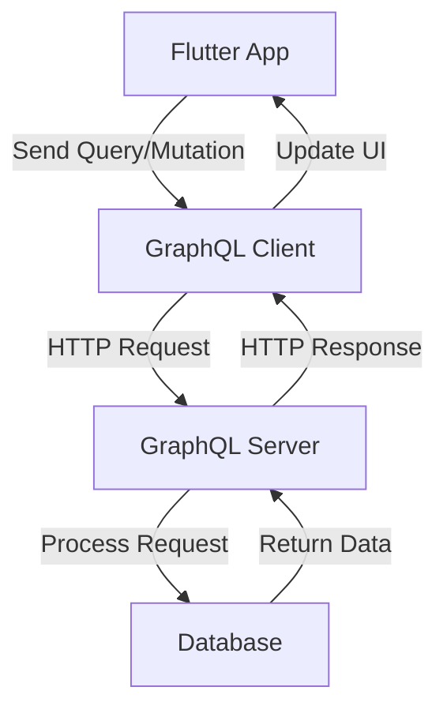

## 8.4.2 Using GraphQL with Flutter

In the ever-evolving landscape of mobile app development, efficiently managing data fetching and manipulation is crucial. GraphQL, a powerful query language for APIs, offers a flexible and efficient approach to interact with backend services. In this section, we will delve into integrating GraphQL with Flutter, exploring its advantages, setting up the necessary tools, and implementing queries and mutations to enhance your app's data handling capabilities.

### Introduction to GraphQL

GraphQL is a query language for APIs and a runtime for executing those queries by using a type system you define for your data. Unlike REST, where you have multiple endpoints for different data needs, GraphQL allows you to request exactly the data you need with a single endpoint. This capability reduces the amount of data transferred over the network, making your applications more efficient.

#### Key Features of GraphQL

- **Single Endpoint:** All data requests are made to a single endpoint, simplifying API management.
- **Declarative Data Fetching:** Clients specify the data they need, reducing over-fetching and under-fetching.
- **Strongly Typed Schema:** Ensures that API responses are predictable and reliable.
- **Real-time Data with Subscriptions:** Supports real-time updates, making it ideal for dynamic applications.

### Advantages of GraphQL

GraphQL offers several advantages over traditional REST APIs, making it a preferred choice for modern app development:

- **Efficient Data Fetching:** By allowing clients to request only the data they need, GraphQL reduces bandwidth usage and improves performance.
- **Avoids Over-fetching and Under-fetching:** Unlike REST, where you might receive more data than necessary or need multiple requests to gather all required data, GraphQL provides exactly what you ask for.
- **Strongly Typed Schema:** The schema defines the capabilities of the API, ensuring that clients can rely on the structure of the data they receive.
- **Improved Developer Experience:** With tools like GraphiQL, developers can explore and test queries in a user-friendly interface.

### Setting Up GraphQL in Flutter

To integrate GraphQL with Flutter, we will use the `graphql_flutter` package, which provides a comprehensive set of tools for working with GraphQL APIs in Flutter applications.

#### Adding Dependencies

First, add the `graphql_flutter` package to your Flutter project's `pubspec.yaml` file:

```yaml
dependencies:
  flutter:
    sdk: flutter
  graphql_flutter: ^5.0.0
```

After adding the dependency, run `flutter pub get` to install the package.

#### Importing Necessary Packages

In your Dart files, import the required packages to start using GraphQL:

```dart
import 'package:flutter/material.dart';
import 'package:graphql_flutter/graphql_flutter.dart';
```

### Initializing GraphQL Client

The GraphQL client is responsible for managing the connection to the GraphQL server. It requires an endpoint and optional headers for authentication or other purposes.

```dart
final HttpLink httpLink = HttpLink('https://api.example.com/graphql');

final GraphQLClient client = GraphQLClient(
  link: httpLink,
  cache: GraphQLCache(),
);
```

- **HttpLink:** Represents the GraphQL server endpoint.
- **GraphQLClient:** Manages the connection and caching of data.

### Making Queries and Mutations

GraphQL operations are categorized into queries (for fetching data) and mutations (for modifying data). Let's explore how to implement both.

#### Example of a GraphQL Query

Below is an example of a GraphQL query to fetch a list of products:

```dart
const String query = r'''
  query GetProducts {
    products {
      id
      name
      price
    }
  }
''';

void fetchProducts() async {
  final QueryOptions options = QueryOptions(document: gql(query));
  final QueryResult result = await client.query(options);
  if (!result.hasException) {
    final List products = result.data['products'];
    // Process products
  } else {
    // Handle exception
  }
}
```

- **QueryOptions:** Configures the query, including the document and any variables.
- **QueryResult:** Contains the data returned by the server or any errors encountered.

#### Performing Mutations

Mutations are used to modify data on the server. Here's how you can perform a mutation to add a new product:

```dart
const String mutation = r'''
  mutation AddProduct($name: String!, $price: Float!) {
    addProduct(name: $name, price: $price) {
      id
      name
      price
    }
  }
''';

void addProduct(String name, double price) async {
  final MutationOptions options = MutationOptions(
    document: gql(mutation),
    variables: {'name': name, 'price': price},
  );
  final QueryResult result = await client.mutate(options);
  if (!result.hasException) {
    final product = result.data['addProduct'];
    // Process new product
  } else {
    // Handle exception
  }
}
```

- **MutationOptions:** Similar to `QueryOptions`, but used for mutations.
- **Variables:** Allows you to pass dynamic data to your GraphQL operations.

### Using Widgets for GraphQL Operations

The `graphql_flutter` package provides `Query` and `Mutation` widgets to simplify integrating GraphQL operations with your Flutter UI.

#### Query Widget

The `Query` widget is used to fetch data and automatically update the UI when the data changes.

```dart
Query(
  options: QueryOptions(
    document: gql(query),
  ),
  builder: (QueryResult result, {VoidCallback refetch, FetchMore fetchMore}) {
    if (result.hasException) {
      return Text('Error: ${result.exception.toString()}');
    }

    if (result.isLoading) {
      return CircularProgressIndicator();
    }

    final List products = result.data['products'];

    return ListView.builder(
      itemCount: products.length,
      itemBuilder: (context, index) {
        final product = products[index];
        return ListTile(
          title: Text(product['name']),
          subtitle: Text('\$${product['price']}'),
        );
      },
    );
  },
)
```

- **Builder Function:** Handles different states (loading, error, data) and updates the UI accordingly.

#### Mutation Widget

The `Mutation` widget is used to perform mutations and update the UI based on the result.

```dart
Mutation(
  options: MutationOptions(
    document: gql(mutation),
  ),
  builder: (RunMutation runMutation, QueryResult result) {
    return ElevatedButton(
      onPressed: () {
        runMutation({'name': 'New Product', 'price': 29.99});
      },
      child: Text('Add Product'),
    );
  },
)
```

- **RunMutation:** A function that triggers the mutation with the provided variables.

### Visual Aids

To better understand the flow of a GraphQL operation, consider the following diagram:



This diagram illustrates the journey of a GraphQL request from the Flutter app to the server and back, highlighting the interaction between different components.

### Best Practices

- **Use Fragments:** Reuse parts of queries to avoid duplication and improve maintainability.
- **Handle UI States:** Ensure your UI gracefully handles loading, error, and data states.
- **Optimize Caching:** Leverage caching strategies to reduce unnecessary network requests.
- **Secure Your API:** Implement authentication and authorization to protect your data.

### Exercises

To solidify your understanding, try the following exercises:

- Set up a GraphQL client in a new Flutter project and perform a query to fetch data.
- Implement a mutation to modify data on the server and update the UI accordingly.
- Experiment with fragments to reuse query parts and optimize your code.

By integrating GraphQL with Flutter, you can build efficient, scalable, and responsive applications that provide a seamless user experience. The flexibility and power of GraphQL, combined with Flutter's rich UI capabilities, open up new possibilities for modern app development.

## Quiz Time!



### What is GraphQL?

- [x] A query language for APIs that allows clients to request exactly the data they need.
- [ ] A database management system.
- [ ] A frontend framework for building user interfaces.
- [ ] A server-side programming language.

> **Explanation:** GraphQL is a query language for APIs and a runtime for executing those queries by using a type system you define for your data.

### Which of the following is an advantage of using GraphQL?

- [x] Consumes less bandwidth by fetching only necessary data.
- [ ] Requires multiple endpoints for different data needs.
- [ ] Does not support real-time data updates.
- [ ] Is not strongly typed.

> **Explanation:** GraphQL allows clients to request only the data they need, reducing bandwidth usage. It supports real-time updates and is strongly typed.

### How do you add the `graphql_flutter` package to a Flutter project?

- [x] Add `graphql_flutter: ^5.0.0` to the `dependencies` section of `pubspec.yaml`.
- [ ] Install it using `npm install graphql_flutter`.
- [ ] Add it to the `dev_dependencies` section of `pubspec.yaml`.
- [ ] Download it manually and add it to the project.

> **Explanation:** The `graphql_flutter` package is added to the `dependencies` section of `pubspec.yaml` to be used in a Flutter project.

### What is the purpose of the `HttpLink` in a GraphQL client setup?

- [x] It represents the GraphQL server endpoint.
- [ ] It is used to cache data locally.
- [ ] It defines the UI components for the app.
- [ ] It handles authentication and authorization.

> **Explanation:** `HttpLink` is used to specify the endpoint of the GraphQL server that the client will communicate with.

### In a GraphQL query, what does the `gql` function do?

- [x] Parses a GraphQL query string into a document node.
- [ ] Executes the query on the server.
- [ ] Caches the query results.
- [ ] Handles errors in the query.

> **Explanation:** The `gql` function is used to parse a GraphQL query string into a document node that can be executed by the client.

### What widget is used to perform GraphQL queries in Flutter?

- [x] `Query`
- [ ] `Mutation`
- [ ] `StreamBuilder`
- [ ] `FutureBuilder`

> **Explanation:** The `Query` widget is used to perform GraphQL queries and automatically update the UI based on the query results.

### How can you handle loading states in a `Query` widget?

- [x] By checking `result.isLoading` in the builder function.
- [ ] By using a `FutureBuilder`.
- [ ] By setting a global loading variable.
- [ ] By using a separate loading widget.

> **Explanation:** The `Query` widget's builder function provides a `result` object, where `result.isLoading` can be checked to handle loading states.

### What is a common use case for GraphQL mutations?

- [x] Modifying data on the server.
- [ ] Fetching data from the server.
- [ ] Caching data locally.
- [ ] Rendering UI components.

> **Explanation:** Mutations in GraphQL are used to modify data on the server, such as creating, updating, or deleting records.

### What is the benefit of using fragments in GraphQL?

- [x] Reusing parts of queries to avoid duplication.
- [ ] Increasing the complexity of queries.
- [ ] Reducing the need for a GraphQL client.
- [ ] Simplifying server-side logic.

> **Explanation:** Fragments allow you to reuse parts of queries, reducing duplication and making your queries more maintainable.

### True or False: GraphQL requires multiple endpoints for different data needs.

- [ ] True
- [x] False

> **Explanation:** GraphQL uses a single endpoint for all data requests, allowing clients to specify exactly what data they need in each request.


