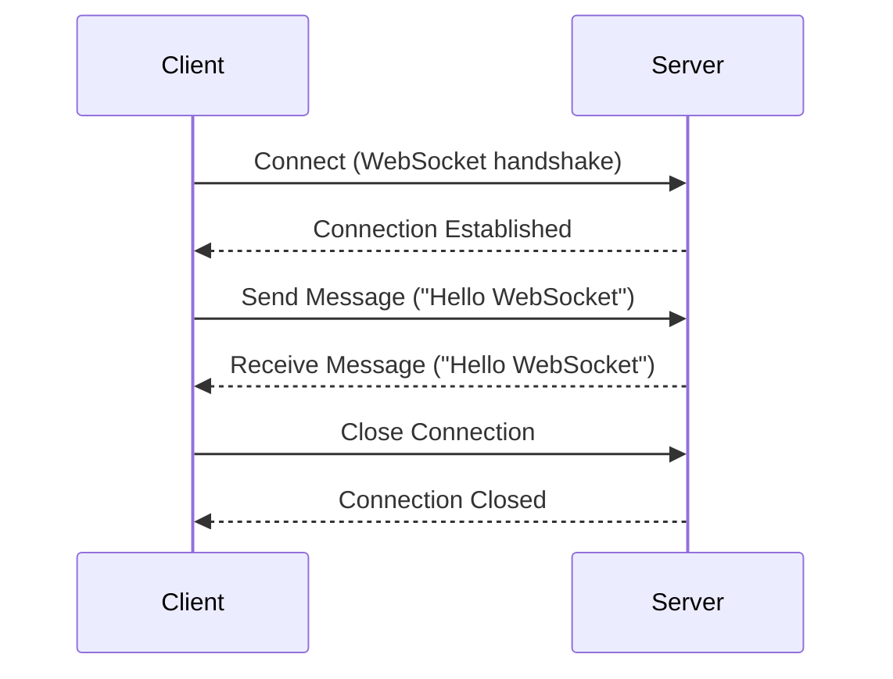

## 8.4.3 Real-time Data with WebSockets

In the ever-evolving landscape of mobile applications, the demand for real-time data exchange has become increasingly prevalent. Whether it's a chat application, live sports updates, or multiplayer gaming, the ability to push and receive data instantly is crucial. This is where WebSockets come into play, offering a robust solution for real-time communication. In this section, we will delve into the intricacies of WebSockets, explore their use cases, and guide you through implementing WebSocket communication in Flutter using the `web_socket_channel` package.

### Introduction to WebSockets

WebSockets provide a full-duplex communication channel over a single TCP connection, enabling real-time data exchange between the client and server. Unlike traditional HTTP requests, which are unidirectional and require a new connection for each request/response cycle, WebSockets maintain an open connection, allowing data to flow freely in both directions. This makes WebSockets an ideal choice for applications that require low-latency communication and real-time updates.

#### Key Features of WebSockets

- **Full-Duplex Communication:** Allows simultaneous two-way communication between client and server.
- **Persistent Connection:** Maintains a single open connection, reducing the overhead of establishing new connections.
- **Low Latency:** Provides near-instantaneous data exchange, crucial for real-time applications.

### Use Cases for WebSockets

WebSockets are particularly useful in scenarios where real-time data exchange is essential. Here are some common use cases:

- **Real-time Chat Applications:** Enable users to send and receive messages instantly, creating a seamless chat experience.
- **Live Updates and Notifications:** Push real-time updates to users, such as stock prices, sports scores, or news alerts.
- **Multiplayer Games:** Facilitate real-time interactions between players, ensuring a smooth gaming experience.

### Setting Up WebSocket Communication

To integrate WebSocket communication in your Flutter application, we'll use the `web_socket_channel` package. This package provides a simple API for establishing WebSocket connections and handling data transmission.

#### Adding the Package to Your Project

First, add the `web_socket_channel` package to your `pubspec.yaml` file:

```yaml
dependencies:
  web_socket_channel: ^2.1.0
```

Run `flutter pub get` to install the package.

#### Importing the Package

Next, import the package in your Dart file:

```dart
import 'package:web_socket_channel/web_socket_channel.dart';
```

### Establishing a Connection

To establish a WebSocket connection, create a `WebSocketChannel` instance. This channel will handle the communication between your Flutter app and the WebSocket server.

```dart
final channel = WebSocketChannel.connect(
  Uri.parse('wss://echo.websocket.org'),
);
```

#### Understanding WebSocket Schemes

- **`ws`:** The standard WebSocket protocol, typically used for non-secure connections.
- **`wss`:** The secure WebSocket protocol, similar to HTTPS, used for encrypted connections.

### Sending and Receiving Data

Once the connection is established, you can send and receive messages through the WebSocket channel.

#### Listening for Incoming Messages

To listen for messages from the server, use the `stream` property of the channel:

```dart
channel.stream.listen((message) {
  print('Received: $message');
});
```

This sets up a listener that triggers whenever a new message is received.

#### Sending a Message

To send a message to the server, use the `sink` property of the channel:

```dart
channel.sink.add('Hello WebSocket');
```

This sends the specified message to the connected WebSocket server.

### Closing the Connection

It's important to close the WebSocket connection when it's no longer needed to free up resources and avoid memory leaks.

```dart
channel.sink.close();
```

### Visual Aids

To better understand the flow of WebSocket communication, let's look at a sequence diagram illustrating the interaction between a client and a server:



### Best Practices

When working with WebSockets, consider the following best practices to ensure a robust and efficient implementation:

- **Handle Network Errors:** Implement error handling to manage network disruptions gracefully. Consider using retry logic to re-establish connections when they drop.
- **Manage Reconnection Logic:** Automatically attempt to reconnect in case of connection loss, but implement exponential backoff to avoid overwhelming the server.
- **Avoid Memory Leaks:** Always close the WebSocket channel when it's no longer needed, such as when the user navigates away from the screen or the app is closed.

### Exercises

To solidify your understanding of WebSockets, try implementing a simple chat client that connects to a WebSocket server and exchanges messages. Here are some steps to guide you:

1. **Set Up the UI:** Create a basic chat interface with a text input field and a send button.
2. **Establish a WebSocket Connection:** Use the `web_socket_channel` package to connect to a WebSocket server.
3. **Send and Receive Messages:** Implement functionality to send messages from the input field and display incoming messages in the chat interface.
4. **Handle Connection Closure:** Ensure the WebSocket connection is closed when the chat screen is exited.

### Conclusion

WebSockets provide a powerful mechanism for real-time data exchange in Flutter applications. By maintaining an open connection, they enable seamless two-way communication, making them ideal for applications that require instant updates. With the `web_socket_channel` package, integrating WebSocket communication in your Flutter app is straightforward, allowing you to build responsive and interactive applications.

For further exploration, consider diving into the official [WebSocket API documentation](https://developer.mozilla.org/en-US/docs/Web/API/WebSockets_API) and the [web_socket_channel package documentation](https://pub.dev/packages/web_socket_channel). These resources provide additional insights and advanced usage scenarios to enhance your understanding of WebSockets.

## Quiz Time!



### What is a key feature of WebSockets?

- [x] Full-duplex communication
- [ ] Unidirectional communication
- [ ] Requires a new connection for each message
- [ ] Only works over HTTP

> **Explanation:** WebSockets provide full-duplex communication, allowing simultaneous two-way data exchange over a single connection.

### Which protocol is used for secure WebSocket connections?

- [ ] ws
- [x] wss
- [ ] http
- [ ] https

> **Explanation:** The `wss` protocol is used for secure WebSocket connections, similar to how `https` is used for secure HTTP connections.

### What package is commonly used for WebSocket communication in Flutter?

- [ ] http
- [x] web_socket_channel
- [ ] dio
- [ ] socket_io

> **Explanation:** The `web_socket_channel` package is commonly used in Flutter for WebSocket communication.

### How do you send a message over a WebSocket channel in Flutter?

- [ ] channel.stream.add('message');
- [x] channel.sink.add('message');
- [ ] channel.send('message');
- [ ] channel.message('message');

> **Explanation:** To send a message over a WebSocket channel in Flutter, you use `channel.sink.add('message');`.

### What should you do when a WebSocket connection is no longer needed?

- [ ] Leave it open
- [x] Close the channel
- [ ] Restart the app
- [ ] Ignore it

> **Explanation:** It's important to close the WebSocket channel when it's no longer needed to free up resources and avoid memory leaks.

### Which of the following is a use case for WebSockets?

- [x] Real-time chat applications
- [ ] Static web pages
- [ ] Batch processing
- [ ] File storage

> **Explanation:** WebSockets are ideal for real-time chat applications due to their ability to provide instant data exchange.

### What is the purpose of the `stream` property in a WebSocket channel?

- [ ] To send messages
- [x] To listen for incoming messages
- [ ] To close the connection
- [ ] To establish a connection

> **Explanation:** The `stream` property is used to listen for incoming messages from the WebSocket server.

### How can you handle network errors in WebSocket communication?

- [x] Implement error handling and reconnection logic
- [ ] Ignore them
- [ ] Restart the app
- [ ] Use HTTP instead

> **Explanation:** Implementing error handling and reconnection logic is crucial for managing network errors in WebSocket communication.

### What is a common pitfall when working with WebSockets?

- [ ] Using HTTP instead of WebSockets
- [x] Forgetting to close the channel
- [ ] Sending too many messages
- [ ] Using the wrong package

> **Explanation:** A common pitfall is forgetting to close the WebSocket channel, which can lead to memory leaks.

### True or False: WebSockets require a new connection for each message sent.

- [ ] True
- [x] False

> **Explanation:** False. WebSockets maintain a persistent connection, allowing multiple messages to be sent and received over the same connection.


