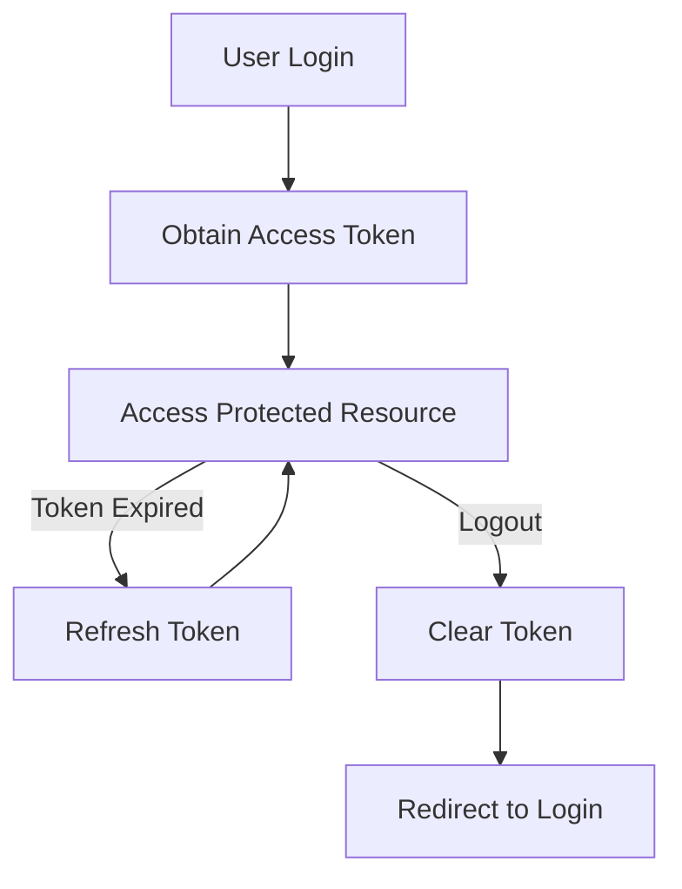

## 8.4.4 Managing Authentication and Tokens

In the world of mobile app development, managing authentication and tokens is crucial for ensuring secure and efficient communication between your Flutter application and backend services. This section delves into the intricacies of authentication mechanisms, token management, and best practices to secure your app's data and user sessions.

### Understanding Authentication Mechanisms

Authentication is the process of verifying the identity of a user or system. In the context of Flutter applications, it involves ensuring that the app communicates securely with backend services. Let's explore some common authentication methods:

#### API Keys

API keys are simple tokens that a client includes in API requests to identify themselves. They are often used for tracking and controlling how the API is being used, such as preventing abuse or overuse. However, API keys alone do not provide robust security, as they can be easily compromised if not handled properly.

#### Basic Authentication

Basic Authentication involves sending a username and password with each request. These credentials are encoded in Base64 and included in the HTTP header. While straightforward, this method is not secure unless used over HTTPS, as the credentials can be intercepted.

#### OAuth 2.0

OAuth 2.0 is a more secure and flexible authentication framework that allows third-party applications to access a user's data without exposing their credentials. It involves obtaining an access token from an authorization server, which is then used to authenticate API requests.

#### JWT (JSON Web Tokens)

JWT is a compact, URL-safe means of representing claims to be transferred between two parties. It consists of three parts: a header, a payload, and a signature. JWTs are commonly used for authentication and information exchange, as they can be easily verified and trusted.

### Implementing Token-Based Authentication

Token-based authentication is a popular method for securing API requests. It involves obtaining a token from an authentication endpoint and including it in the HTTP header of subsequent requests. Here's a basic example of how to include a token in your HTTP requests using Dart:

```dart
import 'package:http/http.dart' as http;

Future<void> fetchData(String token) async {
  final response = await http.get(
    Uri.parse('https://api.example.com/data'),
    headers: {'Authorization': 'Bearer $token'},
  );

  if (response.statusCode == 200) {
    // Process the data
  } else {
    // Handle the error
  }
}
```

In this example, the token is included in the `Authorization` header as a Bearer token. This token is typically obtained from an authentication endpoint after the user logs in.

### Refreshing Tokens

Tokens often have a limited lifespan for security reasons. To maintain a seamless user experience, it's important to refresh tokens before they expire. This involves detecting when a token is about to expire and requesting a new one from the server.

```dart
Future<String> refreshToken(String refreshToken) async {
  final response = await http.post(
    Uri.parse('https://api.example.com/refresh'),
    body: {'refresh_token': refreshToken},
  );

  if (response.statusCode == 200) {
    // Extract and return the new token
    return response.body['access_token'];
  } else {
    // Handle the error
    throw Exception('Failed to refresh token');
  }
}
```

In this example, a `refresh_token` is used to obtain a new access token. It's important to handle token expiration gracefully to avoid disrupting the user experience.

### Securely Storing Tokens

Storing tokens securely is critical to prevent unauthorized access. The `flutter_secure_storage` package provides a secure way to store sensitive data on the device.

```dart
import 'package:flutter_secure_storage/flutter_secure_storage.dart';

final storage = FlutterSecureStorage();

// Write value
await storage.write(key: 'authToken', value: token);

// Read value
String token = await storage.read(key: 'authToken');
```

By using `flutter_secure_storage`, you can ensure that tokens are stored securely and are not accessible by unauthorized applications.

### Handling Logout and Session Expiration

Handling logout and session expiration involves clearing stored tokens and redirecting users to the login screen. This ensures that users are required to authenticate again before accessing protected resources.

```dart
Future<void> logout() async {
  await storage.delete(key: 'authToken');
  // Redirect to login screen
}
```

By clearing the stored token, you effectively log the user out and prevent further access to protected resources until they log in again.

### Visual Aids

To better understand the authentication process and token lifecycle, consider the following flowchart:



This flowchart illustrates the typical flow of obtaining, using, refreshing, and clearing tokens in a Flutter application.

### Best Practices

- **Never Hardcode Tokens:** Avoid hardcoding tokens or sensitive credentials in your codebase. Use environment variables or secure storage solutions.
- **Use HTTPS:** Always use HTTPS to encrypt communication between your app and backend services.
- **Validate Tokens Server-Side:** Ensure that tokens are validated on the server side to prevent unauthorized access.
- **Implement Token Expiry:** Use short-lived tokens and implement refresh mechanisms to enhance security.

### Exercises

To solidify your understanding of authentication and token management, try setting up authentication in your app using a mock API or a real backend service. Experiment with different authentication methods and implement token-based authentication using the concepts covered in this section.

By mastering these techniques, you'll be well-equipped to build secure and efficient Flutter applications that protect user data and maintain seamless communication with backend services.

## Quiz Time!



### What is the primary purpose of using tokens in API requests?

- [x] To authenticate and authorize API requests
- [ ] To encrypt the data being sent
- [ ] To improve the speed of API requests
- [ ] To reduce the size of API requests

> **Explanation:** Tokens are used to authenticate and authorize API requests, ensuring that only authorized users can access protected resources.

### Which package is recommended for securely storing tokens in Flutter?

- [x] flutter_secure_storage
- [ ] shared_preferences
- [ ] path_provider
- [ ] http

> **Explanation:** The `flutter_secure_storage` package is recommended for securely storing sensitive data like tokens on the device.

### What is the role of a refresh token in authentication?

- [x] To obtain a new access token when the current one expires
- [ ] To encrypt the access token
- [ ] To store user credentials
- [ ] To log out the user

> **Explanation:** A refresh token is used to obtain a new access token when the current one expires, allowing the user to maintain their session without re-authenticating.

### Why is it important to use HTTPS for API communication?

- [x] To encrypt the data being transmitted
- [ ] To speed up the communication
- [ ] To reduce server load
- [ ] To simplify the API requests

> **Explanation:** HTTPS encrypts the data being transmitted, protecting it from interception and ensuring secure communication between the client and server.

### What should you do when a user logs out of your app?

- [x] Clear stored tokens and redirect to the login screen
- [ ] Keep the tokens for future use
- [ ] Encrypt the tokens and store them
- [ ] Log the user back in automatically

> **Explanation:** When a user logs out, you should clear stored tokens to prevent unauthorized access and redirect the user to the login screen.

### Which authentication method involves sending a username and password with each request?

- [x] Basic Authentication
- [ ] OAuth 2.0
- [ ] API Keys
- [ ] JWT

> **Explanation:** Basic Authentication involves sending a username and password with each request, typically encoded in Base64.

### What is a common use case for JSON Web Tokens (JWT)?

- [x] Authentication and information exchange
- [ ] Encrypting data
- [ ] Speeding up API requests
- [ ] Reducing server load

> **Explanation:** JSON Web Tokens (JWT) are commonly used for authentication and information exchange, as they can be easily verified and trusted.

### How can you detect when a token is about to expire?

- [x] By checking the token's expiration time
- [ ] By monitoring API response times
- [ ] By logging user activity
- [ ] By encrypting the token

> **Explanation:** You can detect when a token is about to expire by checking its expiration time and implementing logic to refresh it before it expires.

### What is the benefit of using short-lived tokens?

- [x] They enhance security by reducing the risk of token misuse
- [ ] They improve API response times
- [ ] They reduce server load
- [ ] They simplify token management

> **Explanation:** Short-lived tokens enhance security by reducing the risk of token misuse, as they expire quickly and require frequent renewal.

### True or False: Hardcoding tokens in your codebase is a secure practice.

- [ ] True
- [x] False

> **Explanation:** Hardcoding tokens in your codebase is not secure, as it exposes sensitive information that can be easily compromised.


