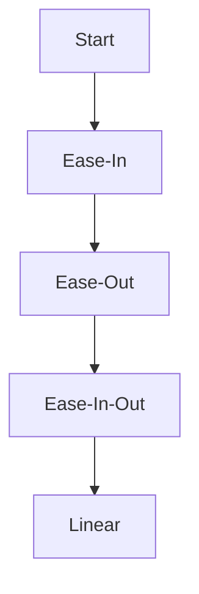
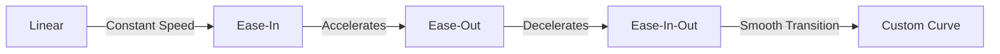

## 9.1.1 Understanding Animation Principles

In the realm of mobile app development, animations play a pivotal role in creating engaging and intuitive user experiences. They are not merely decorative elements but serve as a bridge between the user and the application, providing feedback, guiding attention, and enhancing the overall interaction. In this section, we will delve into the fundamental principles of animations, focusing on their importance, types, and how they can be effectively implemented in Flutter applications.

### Introduction to Animations

**Definition:** Animations are visual changes in a component's appearance that occur over time. They can involve movement, color changes, size transformations, and more.

**Purpose:** The primary purpose of animations is to enhance user experience by making the app feel more responsive and interactive. They guide user attention, provide visual feedback, and communicate changes or progress within the app.

Consider the following benefits of using animations in mobile apps:

- **User Engagement:** Animations capture user attention and make interactions more enjoyable.
- **Feedback Mechanism:** They provide immediate feedback to user actions, confirming that the app is responding.
- **Guidance:** Animations can guide users through complex processes or transitions, making navigation intuitive.
- **Aesthetic Appeal:** Well-designed animations contribute to the overall aesthetic of the app, making it more appealing.

### Principles of Animation

Understanding the core principles of animation is crucial for creating smooth and effective animations in your Flutter applications. Let's explore these principles in detail:

#### Timing

Timing is a fundamental aspect of animations that dictates the speed and duration of the animated effect. It determines how long an animation takes to complete and can significantly impact the user's perception of the animation.

- **Duration:** The total time an animation takes from start to finish. Shorter durations can make animations feel snappy, while longer durations can create a more relaxed effect.
- **Speed:** The rate at which an animation progresses. Consistent speed can make animations predictable, while variable speed can add dynamism.

**Example:** Consider a loading spinner. A fast-spinning animation might convey urgency, while a slower spin might suggest a more relaxed pace.

#### Easing (Curves)

Easing functions, or curves, define how an animation accelerates and decelerates over time. They are crucial for making animations feel natural and realistic.

- **Linear:** The animation progresses at a constant speed. This can feel mechanical and is rarely used for natural movements.
- **Ease-In:** The animation starts slowly and accelerates towards the end. Useful for elements entering the screen.
- **Ease-Out:** The animation starts quickly and decelerates towards the end. Ideal for elements exiting the screen.
- **Ease-In-Out:** Combines both ease-in and ease-out, starting and ending slowly with a faster middle section. This is often used for smooth transitions.

**Visual Aid:**



#### State Changes

Animations are often tied to state changes in the app's UI elements. When a user interacts with an app, the state of certain components may change, triggering animations to reflect these changes.

- **Stateful Widgets:** In Flutter, stateful widgets can animate changes in their state, providing visual feedback to the user.
- **Transitions:** Animations can smooth the transition between different states, making the app feel more cohesive.

**Example:** A button that changes color when pressed can use an animation to transition smoothly between colors, providing feedback that the button has been activated.

#### Feedback and Communication

Animations serve as a communication tool between the app and the user. They can indicate progress, confirm actions, or highlight changes, enhancing the user's understanding of the app's functionality.

- **Progress Indicators:** Animations can show progress, such as loading bars or spinners, to inform users that a process is ongoing.
- **Action Confirmation:** Animations can confirm user actions, such as a button press or form submission, by providing visual feedback.

### Types of Animations

Flutter provides two primary types of animations: explicit and implicit. Understanding the differences between these types is essential for choosing the right approach for your app.

#### Explicit Animations

Explicit animations are controlled manually, offering fine-grained control over the animation process. They are ideal for complex animations that require precise timing and coordination.

- **AnimationController:** Used to manage the animation's duration and playback.
- **Tween:** Defines the range of values for the animation, such as color or size.
- **Listener:** Allows you to respond to changes in the animation's value.

**Code Example:**

```dart
class ExplicitAnimationExample extends StatefulWidget {
  @override
  _ExplicitAnimationExampleState createState() => _ExplicitAnimationExampleState();
}

class _ExplicitAnimationExampleState extends State<ExplicitAnimationExample> with SingleTickerProviderStateMixin {
  AnimationController _controller;
  Animation<double> _animation;

  @override
  void initState() {
    super.initState();
    _controller = AnimationController(
      duration: const Duration(seconds: 2),
      vsync: this,
    );
    _animation = Tween<double>(begin: 0, end: 300).animate(_controller)
      ..addListener(() {
        setState(() {});
      });
    _controller.forward();
  }

  @override
  void dispose() {
    _controller.dispose();
    super.dispose();
  }

  @override
  Widget build(BuildContext context) {
    return Container(
      width: _animation.value,
      height: _animation.value,
      color: Colors.blue,
    );
  }
}
```

#### Implicit Animations

Implicit animations are handled automatically by Flutter when properties change. They are simpler to implement and are suitable for straightforward animations.

- **AnimatedContainer:** Automatically animates changes to its properties, such as size, color, or alignment.
- **AnimatedOpacity:** Animates changes in opacity, useful for fade-in and fade-out effects.

**Code Example:**

```dart
class ImplicitAnimationExample extends StatefulWidget {
  @override
  _ImplicitAnimationExampleState createState() => _ImplicitAnimationExampleState();
}

class _ImplicitAnimationExampleState extends State<ImplicitAnimationExample> {
  bool _isExpanded = false;

  @override
  Widget build(BuildContext context) {
    return GestureDetector(
      onTap: () {
        setState(() {
          _isExpanded = !_isExpanded;
        });
      },
      child: AnimatedContainer(
        duration: Duration(seconds: 1),
        width: _isExpanded ? 200 : 100,
        height: _isExpanded ? 200 : 100,
        color: _isExpanded ? Colors.red : Colors.blue,
        alignment: _isExpanded ? Alignment.center : AlignmentDirectional.topStart,
        child: FlutterLogo(size: 75),
      ),
    );
  }
}
```

### Visual Aids

To better understand how different easing curves affect animation timing, consider the following diagram illustrating various easing functions:



### Real-World Analogies

Animations in digital interfaces can be compared to movements in the physical world. For example:

- **Ball Accelerating Due to Gravity:** Similar to an ease-in curve, where the ball starts slowly and gains speed.
- **Car Braking to a Stop:** Resembles an ease-out curve, where the car starts fast and slows down gradually.

These analogies help in understanding how easing functions can make animations feel more natural and relatable.

### Engagement

Think about apps you've used that have particularly smooth or engaging animations. How did those animations enhance your experience? Reflecting on these experiences can provide insights into how animations can be effectively used in your own projects.

### Key Takeaways

- Animations are essential for creating engaging and user-friendly apps.
- Understanding the basic principles of timing and easing is crucial for designing effective animations.
- Choosing between explicit and implicit animations depends on the complexity and requirements of the animation.
- Real-world analogies can aid in grasping abstract animation concepts.

By mastering these principles, you can create animations that not only enhance the aesthetic appeal of your app but also improve its usability and user experience.

## Quiz Time!



### What is the primary purpose of animations in mobile apps?

- [x] To enhance user experience by making the app feel more responsive and interactive.
- [ ] To increase the app's loading time.
- [ ] To reduce the app's functionality.
- [ ] To make the app more complex.

> **Explanation:** Animations enhance user experience by making the app feel more responsive and interactive, guiding user attention, and providing visual feedback.

### Which of the following is NOT a principle of animation?

- [ ] Timing
- [ ] Easing
- [ ] State Changes
- [x] Complexity

> **Explanation:** Complexity is not a principle of animation. The principles include timing, easing, and state changes.

### What is the role of easing functions in animations?

- [x] To define how an animation accelerates and decelerates over time.
- [ ] To increase the animation's duration.
- [ ] To decrease the animation's speed.
- [ ] To make the animation linear.

> **Explanation:** Easing functions define how an animation accelerates and decelerates over time, making movements feel more natural.

### What type of animation is controlled manually with fine-grained control?

- [x] Explicit Animations
- [ ] Implicit Animations
- [ ] Static Animations
- [ ] Dynamic Animations

> **Explanation:** Explicit animations are controlled manually, offering fine-grained control over the animation process.

### Which widget is used for implicit animations in Flutter?

- [x] AnimatedContainer
- [ ] AnimationController
- [ ] Tween
- [ ] Listener

> **Explanation:** AnimatedContainer is used for implicit animations, automatically animating changes to its properties.

### How does an ease-in curve affect an animation?

- [x] The animation starts slowly and accelerates towards the end.
- [ ] The animation starts quickly and decelerates towards the end.
- [ ] The animation progresses at a constant speed.
- [ ] The animation stops abruptly.

> **Explanation:** An ease-in curve causes the animation to start slowly and accelerate towards the end, often used for elements entering the screen.

### What is the function of AnimationController in explicit animations?

- [x] To manage the animation's duration and playback.
- [ ] To automatically animate property changes.
- [ ] To define the range of values for the animation.
- [ ] To provide visual feedback.

> **Explanation:** AnimationController is used to manage the animation's duration and playback in explicit animations.

### Which principle of animation is often tied to state changes in the app's UI elements?

- [x] State Changes
- [ ] Timing
- [ ] Easing
- [ ] Feedback

> **Explanation:** State changes are often tied to animations in the app's UI elements, providing visual feedback to the user.

### What is the benefit of using animations for progress indicators?

- [x] They inform users that a process is ongoing.
- [ ] They increase the app's complexity.
- [ ] They reduce the app's functionality.
- [ ] They make the app less responsive.

> **Explanation:** Animations for progress indicators inform users that a process is ongoing, enhancing user understanding and experience.

### True or False: Implicit animations require manual control over the animation process.

- [ ] True
- [x] False

> **Explanation:** False. Implicit animations are handled automatically by Flutter when properties change, requiring less manual control.


