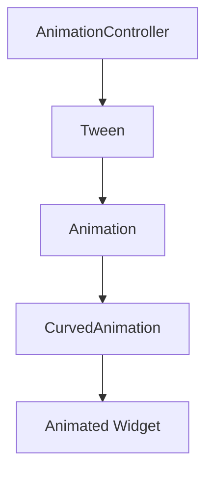

## 9.1.2 The Animation Framework

Flutter's animation framework is a powerful tool that allows developers to create smooth and dynamic user interfaces. By leveraging both high-level and low-level APIs, Flutter provides the flexibility to implement a wide range of animations, from simple transitions to complex, interactive animations. This section will delve into the core components of Flutter's animation framework, illustrating how they work together to bring your applications to life.

### Overview of Flutter's Animation Framework

Flutter's animation library is designed to be both comprehensive and flexible, offering developers the tools needed to create engaging animations. The framework is built around a few core components that work together to define, control, and render animations. These components include `Animation<T>`, `AnimationController`, `Tween<T>`, and `Curve`.

- **High-Level APIs:** These are designed for ease of use, providing pre-built animations and transitions that can be easily integrated into your applications.
- **Low-Level APIs:** These offer more control and flexibility, allowing developers to create custom animations tailored to specific needs.

### Core Classes and Concepts

#### Animation<T>

The `Animation<T>` class is a fundamental part of Flutter's animation framework. It represents a value that changes over time, driven by an `AnimationController`. The type parameter `T` can be any type, such as `double`, `Color`, or `Size`, depending on what you want to animate.

- **Purpose:** Generates a new value whenever the animation's value changes.
- **Usage:** Often used in conjunction with `Tween` to interpolate between values.

#### AnimationController

The `AnimationController` is responsible for controlling the timing of an animation. It starts, stops, and reverses the animation, and it can be configured with a duration and a `vsync` parameter to optimize performance.

- **Duration:** Specifies how long the animation should take to complete.
- **Vsync:** Synchronizes the animation with the screen refresh rate to ensure smooth performance.

#### Tween<T>

A `Tween` defines the start and end values for an animation and calculates intermediate values. It is used to interpolate between two values over the course of an animation.

- **Start and End Values:** Defines the range of the animation.
- **Interpolation:** Calculates the intermediate values based on the animation's progress.

#### Curve

The `Curve` class modifies the progression of an animation over time. It defines how the animation's value changes, allowing for effects like easing in and out.

- **Curves Class:** Provides a variety of predefined curves, such as `Curves.easeIn`, `Curves.easeOut`, and `Curves.bounceIn`.

### Animation Composition

To create an animation in Flutter, you typically combine these components. Here's how they work together:

1. **Define a Tween:** Specify the start and end values for your animation.
2. **Create an AnimationController:** Control the timing and progression of the animation.
3. **Apply a Curve:** Modify the animation's progression for more natural motion.
4. **Animate a Widget:** Use the animated value to update a widget's properties.

### Code Example

Let's look at a simple example that demonstrates how to create an animation using these components:

```dart
import 'package:flutter/material.dart';

class MyAnimatedWidget extends StatefulWidget {
  @override
  _MyAnimatedWidgetState createState() => _MyAnimatedWidgetState();
}

class _MyAnimatedWidgetState extends State<MyAnimatedWidget> with SingleTickerProviderStateMixin {
  AnimationController _controller;
  Animation<double> _animation;

  @override
  void initState() {
    super.initState();
    _controller = AnimationController(
      duration: const Duration(seconds: 2),
      vsync: this,
    );

    _animation = Tween<double>(begin: 0, end: 300).animate(
      CurvedAnimation(
        parent: _controller,
        curve: Curves.easeInOut,
      ),
    );

    _controller.forward();
  }

  @override
  void dispose() {
    _controller.dispose();
    super.dispose();
  }

  @override
  Widget build(BuildContext context) {
    return AnimatedBuilder(
      animation: _animation,
      builder: (context, child) {
        return Container(
          width: _animation.value,
          height: _animation.value,
          color: Colors.blue,
        );
      },
    );
  }
}
```

**Explanation:**

- **AnimationController:** Initialized with a duration of 2 seconds and a `vsync` parameter to optimize performance.
- **Tween:** Defines the animation's start and end values (0 to 300).
- **CurvedAnimation:** Applies an `easeInOut` curve to the animation.
- **AnimatedBuilder:** Rebuilds the widget tree whenever the animation's value changes, updating the container's size.

### Visual Diagrams

To better understand the relationships between these components, let's use a Mermaid.js diagram:



- **AnimationController:** Drives the animation.
- **Tween:** Interpolates between start and end values.
- **Animation:** Represents the changing value.
- **CurvedAnimation:** Modifies the animation's progression.
- **Animated Widget:** Uses the animation's value to update its properties.

### Lifecycle of an Animation

Understanding the lifecycle of an animation is crucial for managing resources and ensuring smooth performance:

1. **Initialization:** Create an `AnimationController` and configure it with a duration and `vsync`.
2. **Start:** Call `forward()` on the controller to begin the animation.
3. **Stop/Reverse:** Use `stop()` or `reverse()` to control the animation's direction.
4. **Dispose:** Always dispose of the controller in the `dispose()` method to prevent memory leaks.

### Best Practices

- **Dispose Controllers:** Always dispose of `AnimationController` instances to free up resources.
- **Separate Logic:** Keep animation logic separate from widget build methods to maintain clean code.
- **Optimize Performance:** Use `vsync` to synchronize animations with the screen refresh rate.

### Exercises

To reinforce your understanding, try creating a basic animation using the classes discussed:

- **Exercise 1:** Animate a widget's opacity from 0 to 1 over 3 seconds.
- **Exercise 2:** Create an animation that changes a widget's size and color simultaneously.

### Conclusion

Flutter's animation framework provides a robust set of tools for creating dynamic and engaging user interfaces. By understanding the core components and how they work together, you can leverage these tools to enhance your applications with smooth and responsive animations. Remember to follow best practices and experiment with different combinations of `Tween`, `AnimationController`, and `Curves` to achieve the desired effects.

## Quiz Time!



### What is the role of the `Animation<T>` class in Flutter's animation framework?

- [x] It represents a value that changes over time.
- [ ] It controls the timing of the animation.
- [ ] It defines the start and end values for an animation.
- [ ] It modifies the animation's progression over time.

> **Explanation:** The `Animation<T>` class represents a value that changes over time, driven by an `AnimationController`.

### Which class is responsible for controlling the timing of an animation in Flutter?

- [ ] Animation<T>
- [x] AnimationController
- [ ] Tween<T>
- [ ] Curve

> **Explanation:** The `AnimationController` is responsible for controlling the timing of an animation, including starting, stopping, and reversing it.

### What does the `Tween<T>` class define in an animation?

- [ ] The animation's duration
- [ ] The animation's progression curve
- [x] The start and end values for an animation
- [ ] The widget to be animated

> **Explanation:** The `Tween<T>` class defines the start and end values for an animation and calculates intermediate values.

### How does the `Curve` class affect an animation in Flutter?

- [ ] It sets the animation's duration.
- [x] It modifies the animation's progression over time.
- [ ] It defines the start and end values for an animation.
- [ ] It represents a value that changes over time.

> **Explanation:** The `Curve` class modifies the animation's progression over time, allowing for effects like easing in and out.

### What is the purpose of the `vsync` parameter in an `AnimationController`?

- [x] To synchronize the animation with the screen refresh rate
- [ ] To define the start and end values for an animation
- [ ] To modify the animation's progression over time
- [ ] To represent a value that changes over time

> **Explanation:** The `vsync` parameter synchronizes the animation with the screen refresh rate to ensure smooth performance.

### Which method is used to start an animation in Flutter?

- [ ] stop()
- [ ] reverse()
- [x] forward()
- [ ] dispose()

> **Explanation:** The `forward()` method is used to start an animation in Flutter.

### Why is it important to dispose of `AnimationController` instances?

- [x] To prevent memory leaks
- [ ] To modify the animation's progression over time
- [ ] To define the start and end values for an animation
- [ ] To represent a value that changes over time

> **Explanation:** Disposing of `AnimationController` instances is important to free up resources and prevent memory leaks.

### What does the `AnimatedBuilder` widget do in Flutter?

- [x] It rebuilds the widget tree whenever the animation's value changes.
- [ ] It controls the timing of the animation.
- [ ] It defines the start and end values for an animation.
- [ ] It modifies the animation's progression over time.

> **Explanation:** The `AnimatedBuilder` widget rebuilds the widget tree whenever the animation's value changes, updating the animated widget.

### Which of the following is a best practice when working with animations in Flutter?

- [x] Keep animation logic separate from widget build methods.
- [ ] Always use the default curve for animations.
- [ ] Avoid using `vsync` for performance optimization.
- [ ] Never dispose of `AnimationController` instances.

> **Explanation:** Keeping animation logic separate from widget build methods is a best practice to maintain clean and organized code.

### True or False: The `Tween` class in Flutter can only be used with `double` values.

- [ ] True
- [x] False

> **Explanation:** The `Tween` class in Flutter can be used with various types, such as `double`, `Color`, and `Size`, not just `double` values.


