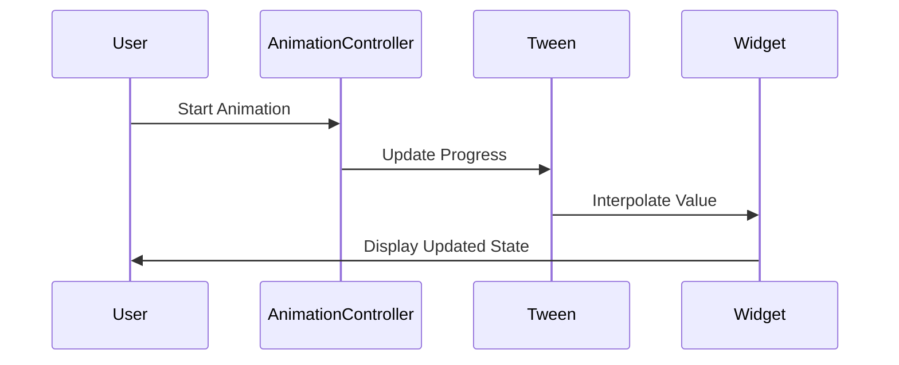

## 9.1.3 Tween Animations

In the world of Flutter, animations play a crucial role in enhancing user experience by providing smooth transitions and dynamic effects. Among the various animation techniques available, Tween animations stand out for their simplicity and versatility. This section delves into the concept of Tween animations, exploring their implementation, customization, and practical applications in Flutter development.

### Understanding Tweens

A `Tween<T>` in Flutter is a powerful class designed to interpolate between a beginning and an ending value over the duration of an animation. This interpolation is based on the progress of an animation, which is typically controlled by an `AnimationController`. The `Tween` class provides a straightforward way to define the range of values that an animation can take, allowing developers to create smooth transitions between states.

- **Definition:** A `Tween<T>` is a class that defines a range of values and calculates intermediate values based on an animation's progress. It is used to animate properties that can be represented by a single value, such as size, color, or alignment.
- **Interpolation:** Tweens calculate intermediate values by interpolating between the start and end values. This process is often linear but can be modified using curves for non-linear animations.

### Types of Tweens

Flutter offers a variety of built-in tweens to cater to different types of animations. Each tween is specialized for a specific data type, making it easier to animate various properties of widgets.

- **`Tween<double>`:** Used for animating numerical values, such as size or opacity.
- **`ColorTween`:** Interpolates between two colors, useful for animating color transitions.
- **`SizeTween`:** Animates changes in size, ideal for resizing widgets smoothly.
- **`AlignmentTween`:** Interpolates between two alignments, useful for animating widget positions within a container.

In addition to these, Flutter allows developers to create custom tweens for other data types, providing flexibility to animate virtually any property.

### Implementing Tween Animations

To illustrate the implementation of Tween animations, let's walk through a detailed example. This example demonstrates how to animate the size of a container using a `Tween<double>`.

```dart
class TweenAnimationExample extends StatefulWidget {
  @override
  _TweenAnimationExampleState createState() => _TweenAnimationExampleState();
}

class _TweenAnimationExampleState extends State<TweenAnimationExample>
    with SingleTickerProviderStateMixin {
  late AnimationController _controller;
  late Animation<double> _sizeAnimation;

  @override
  void initState() {
    super.initState();
    _controller = AnimationController(
      duration: const Duration(seconds: 2),
      vsync: this,
    );
    _sizeAnimation = Tween<double>(begin: 50, end: 200).animate(_controller);
    _controller.forward();
  }

  @override
  void dispose() {
    _controller.dispose();
    super.dispose();
  }

  @override
  Widget build(BuildContext context) {
    return AnimatedBuilder(
      animation: _sizeAnimation,
      builder: (context, child) {
        return Container(
          width: _sizeAnimation.value,
          height: _sizeAnimation.value,
          color: Colors.blue,
        );
      },
    );
  }
}
```

#### Code Walkthrough

- **StatefulWidget:** The `TweenAnimationExample` is a `StatefulWidget` because it involves an animation that changes over time.
- **AnimationController:** An `AnimationController` is created to manage the animation's duration and progress. It is initialized in the `initState` method and disposed of in the `dispose` method to free resources.
- **Tween:** A `Tween<double>` is defined with a beginning value of 50 and an ending value of 200. This tween is then animated using the `AnimationController`.
- **AnimatedBuilder:** The `AnimatedBuilder` widget listens to the animation and rebuilds the container with the updated size value as the animation progresses.

### Visual Aids

To better understand how Tween animations work, let's visualize the process with a sequence diagram and before-and-after images.



- **Sequence Diagram:** This diagram illustrates the flow of a Tween animation, showing how the `AnimationController` updates the tween's progress, which in turn interpolates the value and updates the widget.


- **Before and After Images:** These images depict the widget before and after the animation, highlighting the change in size.

### Custom Tweens

While Flutter provides a variety of built-in tweens, there are scenarios where you may need to animate custom data types. In such cases, you can create a custom tween by extending the `Tween<T>` class.

```dart
class CustomTween extends Tween<CustomType> {
  @override
  CustomType lerp(double t) {
    // Implement interpolation logic
  }
}
```

- **Custom Tween:** By overriding the `lerp` method, you can define how the interpolation should occur for your custom data type. This flexibility allows you to animate complex properties that are not covered by the built-in tweens.

### When to Use Tweens

Tweens are particularly useful in scenarios where you need to animate values over time. They are essential for creating smooth transitions and can be combined with curves to achieve non-linear animations. Some common use cases for tweens include:

- **Animating Size and Position:** Tweens are ideal for resizing widgets or moving them across the screen.
- **Color Transitions:** Use `ColorTween` to smoothly transition between colors, enhancing visual appeal.
- **Custom Animations:** Create custom tweens for complex animations that involve multiple properties.

### Exercises

To reinforce your understanding of Tween animations, try the following exercises:

- **Animate Color:** Use a `ColorTween` to animate the background color of a container.
- **Animate Alignment:** Implement an `AlignmentTween` to move a widget from one corner of the screen to another.
- **Create a Custom Tween:** Design a custom tween to animate a complex property, such as a gradient or a custom shape.

By experimenting with these exercises, you'll gain a deeper understanding of how tweens work and how they can be applied to create dynamic and engaging user interfaces.

## Quiz Time!



### What is a Tween in Flutter?

- [x] A class that interpolates between a beginning and ending value over the duration of an animation.
- [ ] A widget that displays text on the screen.
- [ ] A method for handling user input.
- [ ] A tool for debugging Flutter applications.

> **Explanation:** A Tween in Flutter is a class that interpolates between a beginning and ending value over the duration of an animation, allowing for smooth transitions between states.

### Which of the following is NOT a type of Tween available in Flutter?

- [ ] Tween<double>
- [ ] ColorTween
- [ ] SizeTween
- [x] TextTween

> **Explanation:** TextTween is not a type of Tween available in Flutter. The available types include Tween<double>, ColorTween, and SizeTween, among others.

### How do you create a custom tween in Flutter?

- [x] By extending the Tween<T> class and overriding the lerp method.
- [ ] By using the AnimatedBuilder widget.
- [ ] By implementing the StatefulWidget class.
- [ ] By creating a new instance of AnimationController.

> **Explanation:** To create a custom tween in Flutter, you extend the Tween<T> class and override the lerp method to define the interpolation logic for your custom data type.

### What is the purpose of the AnimationController in a Tween animation?

- [x] To manage the animation's duration and progress.
- [ ] To display the animated widget on the screen.
- [ ] To handle user input during the animation.
- [ ] To debug the animation process.

> **Explanation:** The AnimationController manages the animation's duration and progress, controlling how the tween interpolates between its start and end values.

### Which widget is used to listen to an animation and rebuild its child with updated values?

- [x] AnimatedBuilder
- [ ] Container
- [ ] GestureDetector
- [ ] Scaffold

> **Explanation:** The AnimatedBuilder widget listens to an animation and rebuilds its child with updated values as the animation progresses.

### When should you use a Tween animation in Flutter?

- [x] When you need to animate values over time.
- [ ] When you want to display static content.
- [ ] When you need to handle user input.
- [ ] When you want to debug your application.

> **Explanation:** Tween animations are used when you need to animate values over time, providing smooth transitions between states.

### Which method is overridden to define the interpolation logic in a custom tween?

- [x] lerp
- [ ] build
- [ ] initState
- [ ] dispose

> **Explanation:** The lerp method is overridden in a custom tween to define the interpolation logic for the custom data type.

### What is the role of the Tween class in a Flutter animation?

- [x] To define the range of values that an animation can take.
- [ ] To handle user input during the animation.
- [ ] To display the animated widget on the screen.
- [ ] To debug the animation process.

> **Explanation:** The Tween class defines the range of values that an animation can take, allowing for smooth transitions between states.

### True or False: Tweens can only be used for linear animations.

- [ ] True
- [x] False

> **Explanation:** False. Tweens can be combined with curves to achieve non-linear animations, providing more complex and dynamic effects.

### Which of the following is a common use case for a ColorTween?

- [x] Animating the background color of a container.
- [ ] Displaying static text on the screen.
- [ ] Handling user input events.
- [ ] Debugging the application.

> **Explanation:** A common use case for a ColorTween is animating the background color of a container, creating smooth color transitions.



By mastering Tween animations, you can create visually appealing and dynamic user interfaces in your Flutter applications. Whether you're animating size, color, or custom properties, tweens provide a flexible and powerful tool for bringing your UI to life.
