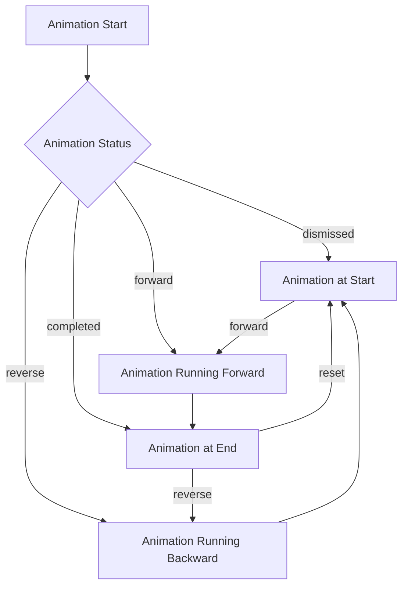

## 9.1.4 Animation Controllers

Animations are a powerful way to enhance the user experience in mobile applications, making them more engaging and intuitive. In Flutter, the `AnimationController` is a fundamental class that plays a crucial role in managing the timing and execution of animations. This section will delve into the details of `AnimationController`, providing you with the knowledge to create dynamic and interactive animations in your Flutter applications.

### Role of AnimationController

The `AnimationController` is the backbone of Flutter's animation system. It is responsible for controlling the duration and timing of animations. Think of it as the conductor of an orchestra, ensuring that each part of the animation plays at the right time and pace. The `AnimationController` can drive animations forward, backward, or even repeat them, providing a flexible tool for creating complex animations.

- **Duration and Timing:** The `AnimationController` specifies how long an animation should run. By setting a duration, you define the time it takes for the animation to complete one cycle.
- **Direction Control:** With methods like `.forward()`, `.reverse()`, and `.repeat()`, you can control the direction and repetition of the animation, allowing for a wide range of effects.
- **Playback Control:** The `AnimationController` provides methods to start, stop, and reset animations, giving you precise control over the animation lifecycle.

### Initializing AnimationController

To use an `AnimationController`, you must first initialize it within a `StatefulWidget`. This initialization typically occurs in the `initState()` method. Here's a basic example:

```dart
class MyAnimatedWidget extends StatefulWidget {
  @override
  _MyAnimatedWidgetState createState() => _MyAnimatedWidgetState();
}

class _MyAnimatedWidgetState extends State<MyAnimatedWidget> with SingleTickerProviderStateMixin {
  late AnimationController _controller;

  @override
  void initState() {
    super.initState();
    _controller = AnimationController(
      duration: const Duration(seconds: 2),
      vsync: this,
    );
  }

  @override
  void dispose() {
    _controller.dispose();
    super.dispose();
  }

  @override
  Widget build(BuildContext context) {
    return Container(); // Placeholder for your animated widget
  }
}
```

- **`vsync` Parameter:** The `vsync` parameter is crucial for performance optimization. It prevents off-screen animations from consuming unnecessary resources. By using `SingleTickerProviderStateMixin`, your widget acts as a `TickerProvider`, which is necessary for the `AnimationController` to function correctly.

### Controlling Animation Playback

Once your `AnimationController` is initialized, you can control the playback of your animations using various methods:

- **`.forward()`:** Starts the animation from the current value to the end.
- **`.reverse()`:** Reverses the animation from the current value to the beginning.
- **`.repeat()`:** Continuously repeats the animation.
- **`.stop()`:** Stops the animation at its current value.
- **`.reset()`:** Resets the animation value to the beginning.

Here's an example of using these methods:

```dart
void _startAnimation() {
  _controller.forward();
}

void _reverseAnimation() {
  _controller.reverse();
}

void _repeatAnimation() {
  _controller.repeat();
}

void _stopAnimation() {
  _controller.stop();
}

void _resetAnimation() {
  _controller.reset();
}
```

### Listening to Animation Status

Listening to the animation status is essential for responding to changes in the animation lifecycle. You can add a status listener to the `AnimationController` to execute code when the animation reaches certain states:

```dart
_controller.addStatusListener((status) {
  if (status == AnimationStatus.completed) {
    // Do something when animation completes
    print('Animation completed');
  } else if (status == AnimationStatus.dismissed) {
    // Do something when animation is dismissed
    print('Animation dismissed');
  }
});
```

### Animation Status

The `AnimationStatus` enum provides four possible states:

- **`dismissed`:** The animation is at the beginning.
- **`forward`:** The animation is running forward.
- **`reverse`:** The animation is running backward.
- **`completed`:** The animation is at the end.

Understanding these statuses allows you to create responsive animations that react to user interactions or other events in your app.

### Disposing the Controller

Properly disposing of the `AnimationController` is crucial to prevent memory leaks. Always override the `dispose()` method in your `StatefulWidget` to clean up the controller:

```dart
@override
void dispose() {
  _controller.dispose();
  super.dispose();
}
```

### Visual Aids

To better understand the flow of animation states and transitions, consider the following flowchart:



This diagram illustrates how an animation can transition between different states, providing a visual representation of the animation lifecycle.

### Example Scenario

Let's create a practical example where an `AnimationController` is used to animate an object with user interaction. We'll build a simple expanding and collapsing menu:

```dart
class ExpandableMenu extends StatefulWidget {
  @override
  _ExpandableMenuState createState() => _ExpandableMenuState();
}

class _ExpandableMenuState extends State<ExpandableMenu> with SingleTickerProviderStateMixin {
  late AnimationController _controller;
  late Animation<double> _animation;

  @override
  void initState() {
    super.initState();
    _controller = AnimationController(
      duration: const Duration(milliseconds: 300),
      vsync: this,
    );
    _animation = CurvedAnimation(parent: _controller, curve: Curves.easeInOut);
  }

  void _toggleMenu() {
    if (_controller.isDismissed) {
      _controller.forward();
    } else {
      _controller.reverse();
    }
  }

  @override
  void dispose() {
    _controller.dispose();
    super.dispose();
  }

  @override
  Widget build(BuildContext context) {
    return Column(
      children: [
        ElevatedButton(
          onPressed: _toggleMenu,
          child: Text('Toggle Menu'),
        ),
        SizeTransition(
          sizeFactor: _animation,
          axisAlignment: -1.0,
          child: Column(
            children: [
              ListTile(title: Text('Item 1')),
              ListTile(title: Text('Item 2')),
              ListTile(title: Text('Item 3')),
            ],
          ),
        ),
      ],
    );
  }
}
```

In this example, we use a `SizeTransition` widget to animate the expansion and collapse of a menu. The `AnimationController` manages the timing, and the `CurvedAnimation` provides a smooth transition effect.

### Best Practices

- **Use `SingleTickerProviderStateMixin`:** For a single animation, this mixin is efficient and straightforward. For multiple animations, consider using `TickerProviderStateMixin`.
- **Avoid Heavy Computations:** Keep animations smooth by avoiding intensive computations during animation frames. Offload heavy tasks to background threads if necessary.
- **Dispose Controllers:** Always dispose of your `AnimationController` to free up resources and prevent memory leaks.

### Exercises

To solidify your understanding, try creating an interactive animation where the user can start, stop, and reverse the animation using buttons. Experiment with different durations and curves to see how they affect the animation's behavior.

### Conclusion

The `AnimationController` is a versatile tool in Flutter's animation toolkit, providing precise control over the timing and execution of animations. By mastering its use, you can create engaging and responsive animations that enhance the user experience in your applications.

### Additional Resources

For further exploration, consider the following resources:

- [Flutter Animation Documentation](https://flutter.dev/docs/development/ui/animations)
- [Flutter Animation Samples](https://github.com/flutter/samples/tree/main/animations)
- [Dart Language Tour](https://dart.dev/guides/language/language-tour)

These resources offer deeper insights into Flutter animations and provide additional examples and tutorials to expand your knowledge.

## Quiz Time!



### What is the primary role of an AnimationController in Flutter?

- [x] To manage the duration and timing of an animation
- [ ] To create complex UI layouts
- [ ] To handle user input events
- [ ] To manage network requests

> **Explanation:** The `AnimationController` is responsible for managing the duration and timing of animations in Flutter, acting as the conductor for animation sequences.

### Which method would you use to start an animation forward from its current value?

- [x] .forward()
- [ ] .reverse()
- [ ] .repeat()
- [ ] .stop()

> **Explanation:** The `.forward()` method is used to start the animation from its current value to the end.

### What is the purpose of the vsync parameter in an AnimationController?

- [x] To optimize performance by preventing off-screen animations from consuming resources
- [ ] To control the speed of the animation
- [ ] To define the animation's color scheme
- [ ] To handle user interactions

> **Explanation:** The `vsync` parameter helps optimize performance by ensuring that animations do not consume resources when they are not visible on the screen.

### How do you properly dispose of an AnimationController to prevent memory leaks?

- [x] Call _controller.dispose() in the dispose() method
- [ ] Use _controller.stop() in the initState() method
- [ ] Set _controller to null in the build() method
- [ ] Use _controller.reset() in the dispose() method

> **Explanation:** Disposing of the `AnimationController` in the `dispose()` method is essential to free up resources and prevent memory leaks.

### Which AnimationStatus value indicates that an animation is running backward?

- [ ] dismissed
- [ ] forward
- [x] reverse
- [ ] completed

> **Explanation:** The `reverse` status indicates that the animation is running backward.

### What is the benefit of using SingleTickerProviderStateMixin with an AnimationController?

- [x] It provides an efficient way to manage a single animation
- [ ] It allows for multiple animations to run simultaneously
- [ ] It automatically disposes of the controller
- [ ] It handles network requests

> **Explanation:** `SingleTickerProviderStateMixin` is used for efficiently managing a single animation within a `StatefulWidget`.

### Which method would you use to continuously repeat an animation?

- [ ] .forward()
- [ ] .reverse()
- [x] .repeat()
- [ ] .stop()

> **Explanation:** The `.repeat()` method is used to continuously repeat an animation.

### What happens when you call _controller.reset() on an AnimationController?

- [x] The animation value is reset to the beginning
- [ ] The animation starts playing forward
- [ ] The animation stops and holds its current value
- [ ] The animation reverses direction

> **Explanation:** Calling `_controller.reset()` resets the animation value to the beginning.

### How can you listen to changes in the animation status?

- [x] By adding a status listener with _controller.addStatusListener()
- [ ] By overriding the build() method
- [ ] By using a GestureDetector
- [ ] By implementing a custom widget

> **Explanation:** You can listen to changes in the animation status by adding a status listener using `_controller.addStatusListener()`.

### True or False: An AnimationController can only drive animations forward.

- [ ] True
- [x] False

> **Explanation:** An `AnimationController` can drive animations both forward and backward, as well as repeat them.


