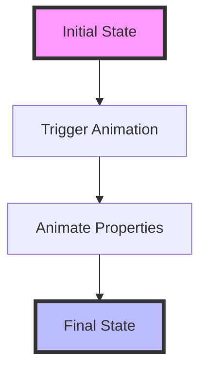

## 9.2.1 AnimatedContainer

In the world of mobile app development, creating smooth and visually appealing animations can significantly enhance the user experience. Flutter, with its rich set of widgets, provides developers with powerful tools to achieve this. One such widget is the `AnimatedContainer`, which simplifies the process of animating changes to its properties. This section will delve into the intricacies of `AnimatedContainer`, offering insights into its usage, customization, and performance considerations.

### Introduction to AnimatedContainer

The `AnimatedContainer` widget in Flutter is a versatile tool that automatically animates changes to its properties over a specified duration. This widget is particularly useful for creating simple animations without the need for explicit animation controllers or tweens. By handling the animation logic internally, `AnimatedContainer` allows developers to focus on the design and functionality of their applications.

#### Key Features of AnimatedContainer

- **Automatic Animation:** `AnimatedContainer` automatically animates changes to its properties, such as size, color, and alignment, whenever the widget is rebuilt with new values.
- **Ease of Use:** It abstracts the complexity of managing animation controllers and tweening, making it accessible for developers of all skill levels.
- **Customizable:** Developers can control the animation's duration and easing curve to achieve the desired effect.

### Basic Usage

To illustrate the basic usage of `AnimatedContainer`, consider the following example. This code demonstrates how to create a simple animation that toggles the size and color of a container when tapped.

```dart
class AnimatedContainerExample extends StatefulWidget {
  @override
  _AnimatedContainerExampleState createState() => _AnimatedContainerExampleState();
}

class _AnimatedContainerExampleState extends State<AnimatedContainerExample> {
  bool _isExpanded = false;

  void _toggleContainer() {
    setState(() {
      _isExpanded = !_isExpanded;
    });
  }

  @override
  Widget build(BuildContext context) {
    return Column(
      children: [
        GestureDetector(
          onTap: _toggleContainer,
          child: AnimatedContainer(
            width: _isExpanded ? 200 : 100,
            height: _isExpanded ? 200 : 100,
            color: _isExpanded ? Colors.blue : Colors.red,
            alignment: _isExpanded ? Alignment.center : Alignment.topCenter,
            duration: Duration(seconds: 1),
            curve: Curves.easeInOut,
            child: FlutterLogo(size: 75),
          ),
        ),
      ],
    );
  }
}
```

#### Explanation

- **State Management:** The `_isExpanded` boolean variable determines the current state of the container. The `setState()` method is used to update this variable, triggering a rebuild of the widget tree.
- **Gesture Detection:** A `GestureDetector` wraps the `AnimatedContainer`, allowing it to respond to tap events. When tapped, the `_toggleContainer` method toggles the `_isExpanded` state.
- **Animated Properties:** The `AnimatedContainer` animates changes to its `width`, `height`, `color`, and `alignment` properties based on the `_isExpanded` state.
- **Animation Configuration:** The `duration` and `curve` properties control the timing and easing of the animation, respectively.

### Properties that Can Be Animated

The `AnimatedContainer` widget supports a wide range of properties that can be animated. These include:

- **Alignment:** Animates changes to the alignment of the container's child.
- **Padding:** Animates changes to the padding around the container's child.
- **Color:** Animates changes to the background color of the container.
- **Decoration:** Animates changes to the decoration, such as border and shadow.
- **Width and Height:** Animates changes to the container's size.
- **Constraints:** Animates changes to the constraints applied to the container.
- **Margin:** Animates changes to the margin around the container.
- **Transform:** Animates changes to the transformation applied to the container, such as rotation or scaling.

### Customization

Customization is a key aspect of using `AnimatedContainer` effectively. By adjusting the `duration` and `curve` properties, developers can fine-tune the animation to match the desired user experience.

#### Duration

The `duration` property specifies the length of time the animation should take to complete. It is defined using the `Duration` class in Flutter. For example, `Duration(seconds: 1)` sets the animation to last for one second.

#### Curve

The `curve` property defines the easing curve of the animation, which determines how the animation progresses over time. Flutter provides a variety of predefined curves, such as `Curves.easeInOut`, `Curves.bounceIn`, and `Curves.elasticOut`. These curves can be used to create different animation effects.

### Visual Aids

To better understand how `AnimatedContainer` works, let's visualize the animation process. Consider the following diagram, which illustrates how the `AnimatedContainer` interpolates between property values over time.



In this diagram:

- **Initial State:** Represents the starting properties of the `AnimatedContainer`.
- **Trigger Animation:** Occurs when the state changes, prompting the `AnimatedContainer` to animate to the new property values.
- **Animate Properties:** The `AnimatedContainer` interpolates between the initial and final property values over the specified duration.
- **Final State:** Represents the end properties of the `AnimatedContainer` after the animation completes.

### Performance Considerations

While `AnimatedContainer` is efficient for simple animations, it may not be optimal for complex or highly interactive animations. For more intricate animations, consider using Flutter's lower-level animation APIs, such as `AnimationController` and `Tween`, which offer greater control and flexibility.

#### Tips for Optimal Performance

- **Limit Complexity:** Use `AnimatedContainer` for straightforward animations involving a few properties. For more complex animations, explore other animation techniques.
- **Optimize Rebuilds:** Minimize unnecessary widget rebuilds by carefully managing state changes and using `setState()` judiciously.
- **Profile Performance:** Use Flutter's performance profiling tools to identify and address any performance bottlenecks in your animations.

### Exercises

To reinforce your understanding of `AnimatedContainer`, try the following exercise:

- **Exercise:** Create a toggle button that expands and contracts a container, animating different properties such as `padding`, `margin`, and `transform`. Experiment with different `duration` and `curve` settings to observe their effects on the animation.

### Conclusion

The `AnimatedContainer` widget is a powerful tool for creating smooth and visually appealing animations in Flutter applications. By understanding its properties and customization options, developers can enhance the user experience with minimal effort. As you continue to explore Flutter's animation capabilities, consider how `AnimatedContainer` can be used to simplify and streamline your animation workflows.

### Additional Resources

For further exploration of Flutter animations, consider the following resources:

- [Flutter Official Documentation on AnimatedContainer](https://api.flutter.dev/flutter/widgets/AnimatedContainer-class.html)
- [Flutter Animation and Motion Widgets](https://flutter.dev/docs/development/ui/animations)
- [Flutter Cookbook: Animations](https://flutter.dev/docs/cookbook/animation)

These resources provide in-depth information and examples to help you master animations in Flutter.

## Quiz Time!



### What is the primary advantage of using AnimatedContainer in Flutter?

- [x] It simplifies animations by handling the animation controller and tweening internally.
- [ ] It allows for complex animations with multiple controllers.
- [ ] It is the only widget that can animate color changes.
- [ ] It requires manual management of animation states.

> **Explanation:** AnimatedContainer simplifies animations by automatically handling the animation controller and tweening, making it easier to implement animations without manual management.

### Which property of AnimatedContainer controls the duration of the animation?

- [ ] curve
- [x] duration
- [ ] alignment
- [ ] color

> **Explanation:** The `duration` property specifies how long the animation should take to complete.

### What does the curve property in AnimatedContainer define?

- [ ] The color transition
- [x] The easing curve of the animation
- [ ] The alignment of the child widget
- [ ] The size of the container

> **Explanation:** The `curve` property defines the easing curve, which determines how the animation progresses over time.

### Which of the following properties can be animated using AnimatedContainer?

- [x] width
- [x] color
- [x] alignment
- [ ] text

> **Explanation:** AnimatedContainer can animate properties like `width`, `color`, and `alignment`, but not text content directly.

### How can you trigger an animation in AnimatedContainer?

- [x] By changing the state variables and calling setState()
- [ ] By using a separate animation controller
- [ ] By directly modifying the widget tree
- [ ] By using a timer

> **Explanation:** Changing state variables and calling `setState()` triggers the AnimatedContainer to animate to the new property values.

### What is a potential limitation of using AnimatedContainer for animations?

- [ ] It cannot animate color changes.
- [x] It might not be optimal for complex or highly interactive animations.
- [ ] It requires manual tweening.
- [ ] It does not support duration customization.

> **Explanation:** AnimatedContainer is efficient for simple animations but may not be suitable for complex or highly interactive animations.

### Which of the following is NOT a property that AnimatedContainer can animate?

- [ ] padding
- [ ] margin
- [ ] transform
- [x] text

> **Explanation:** AnimatedContainer can animate properties like `padding`, `margin`, and `transform`, but not text content directly.

### What is the role of the GestureDetector in the provided code example?

- [x] It detects tap events to toggle the container's state.
- [ ] It animates the container's properties.
- [ ] It manages the animation duration.
- [ ] It sets the initial state of the container.

> **Explanation:** The GestureDetector detects tap events and triggers the toggle function to change the container's state.

### True or False: AnimatedContainer requires an explicit animation controller to function.

- [x] False
- [ ] True

> **Explanation:** AnimatedContainer does not require an explicit animation controller as it handles the animation logic internally.

### Which Flutter class can be used for more complex animations than AnimatedContainer?

- [ ] GestureDetector
- [ ] Text
- [x] AnimationController
- [ ] Scaffold

> **Explanation:** AnimationController provides more control and flexibility for complex animations compared to AnimatedContainer.


