## 9.2.2 AnimatedOpacity

In the realm of mobile app development, creating smooth and visually appealing transitions is crucial for enhancing user experience. Flutter, with its rich set of animation widgets, provides developers with powerful tools to achieve this. One such widget is `AnimatedOpacity`, which allows for seamless transitions in a widget's visibility by animating changes in its opacity. This section delves into the purpose, implementation, and best practices of using `AnimatedOpacity`, along with practical examples and exercises to solidify your understanding.

### Purpose of AnimatedOpacity

`AnimatedOpacity` is a widget in Flutter designed to animate changes in a widget's opacity over a specified duration. This is particularly useful for creating fade-in and fade-out effects, which can significantly enhance the visual appeal of your application. By smoothly transitioning a widget's opacity, you can guide users' attention, create a sense of depth, and improve the overall user experience.

- **Fade-in Effects:** Gradually increase the opacity of a widget as it appears on the screen, making the transition less abrupt and more visually pleasing.
- **Fade-out Effects:** Smoothly decrease the opacity of a widget before it disappears, providing a graceful exit.
- **Soft Transitions:** Use opacity changes to softly transition between different visibility states, such as showing or hiding elements based on user interactions.

### Implementation

Implementing `AnimatedOpacity` in your Flutter application is straightforward. Below is a practical example demonstrating how to use this widget to toggle the opacity of a `FlutterLogo` widget with a button press.

```dart
class AnimatedOpacityExample extends StatefulWidget {
  @override
  _AnimatedOpacityExampleState createState() => _AnimatedOpacityExampleState();
}

class _AnimatedOpacityExampleState extends State<AnimatedOpacityExample> {
  double _opacity = 1.0;

  void _toggleOpacity() {
    setState(() {
      _opacity = _opacity == 1.0 ? 0.0 : 1.0;
    });
  }

  @override
  Widget build(BuildContext context) {
    return Column(
      mainAxisAlignment: MainAxisAlignment.center,
      children: [
        ElevatedButton(
          onPressed: _toggleOpacity,
          child: Text('Toggle Opacity'),
        ),
        AnimatedOpacity(
          opacity: _opacity,
          duration: Duration(seconds: 1),
          curve: Curves.easeInOut,
          child: FlutterLogo(size: 100),
        ),
      ],
    );
  }
}
```

**Explanation:**

- **State Management:** The `_opacity` variable is managed within the state of the widget. The `setState` method is used to update the opacity value, triggering a rebuild of the widget tree.
- **AnimatedOpacity Widget:** This widget takes an `opacity` parameter, which is animated over the `duration` specified. The `curve` parameter allows you to define the animation curve, such as `Curves.easeInOut` for a smooth transition.
- **User Interaction:** An `ElevatedButton` is used to toggle the opacity between 1.0 (fully visible) and 0.0 (fully transparent).

### Usage Scenarios

`AnimatedOpacity` can be employed in various scenarios to enhance the user interface:

- **Image Galleries:** Fade in a larger version of an image when a thumbnail is clicked, providing a smooth transition that draws the user's attention.
- **Modal Dialogs:** Use fade-in effects when displaying modal dialogs or overlays, creating a more polished and professional appearance.
- **Loading Indicators:** Gradually fade out loading indicators once content is fully loaded, improving the flow of the application.

### Visual Aids

To better understand how `AnimatedOpacity` works, consider the following visual aids:

#### Side-by-Side Images

- **Full Opacity:** 
- **Zero Opacity:** 

These images illustrate the difference between a widget at full opacity and zero opacity.

#### Animation Timeline Diagram

```mermaid
gantt
    title Opacity Animation Timeline
    dateFormat  HH:mm
    section Opacity Change
    Start :a1, 00:00, 0s
    Fade In :a2, after a1, 1s
    Full Opacity :a3, after a2, 2s
    Fade Out :a4, after a3, 1s
    End :a5, after a4, 0s
```



This diagram visualizes the timeline of an opacity animation, showing the transition from zero to full opacity and back.

### Best Practices

When using `AnimatedOpacity`, consider the following best practices to ensure optimal performance and user experience:

- **Performance Considerations:** Be cautious when animating opacity on large or complex widgets, as it may impact performance. Test the animation on target devices to ensure smooth transitions.
- **Widget Compatibility:** Ensure that the widget being animated can correctly handle being rendered at varying levels of opacity. Some widgets may not display correctly when partially transparent.
- **Duration and Curves:** Experiment with different durations and animation curves to achieve the desired effect. The choice of curve can significantly impact the feel of the animation.

### Exercise

To reinforce your understanding of `AnimatedOpacity`, try the following exercise:

**Create an Image Gallery:**

- Implement an image gallery where clicking on a thumbnail fades in a larger version of the image.
- Use `AnimatedOpacity` to handle the fade-in effect.
- Consider adding a fade-out effect when the larger image is dismissed.

This exercise will help you apply the concepts learned and explore the creative possibilities of using `AnimatedOpacity` in real-world applications.

### Conclusion

`AnimatedOpacity` is a versatile widget that can greatly enhance the visual dynamics of your Flutter applications. By mastering its use, you can create smooth and engaging transitions that improve user experience and add a professional touch to your app's interface. As you experiment with `AnimatedOpacity`, consider how you can integrate it into your projects to create more interactive and visually appealing applications.

## Quiz Time!



### What is the primary purpose of the `AnimatedOpacity` widget in Flutter?

- [x] To animate changes in a widget's opacity over a duration.
- [ ] To change a widget's color.
- [ ] To resize a widget.
- [ ] To move a widget across the screen.

> **Explanation:** `AnimatedOpacity` is used to animate changes in a widget's opacity, allowing for smooth fade-in and fade-out effects.

### Which method is used to trigger a rebuild of the widget tree in the provided code example?

- [x] setState
- [ ] build
- [ ] initState
- [ ] dispose

> **Explanation:** The `setState` method is called to update the widget's state and trigger a rebuild of the widget tree.

### What parameter of `AnimatedOpacity` defines the duration of the opacity animation?

- [x] duration
- [ ] opacity
- [ ] curve
- [ ] child

> **Explanation:** The `duration` parameter specifies how long the opacity animation should take.

### In the provided code example, what does the `curve` parameter do?

- [x] It defines the animation curve for the opacity transition.
- [ ] It sets the color of the widget.
- [ ] It determines the size of the widget.
- [ ] It specifies the position of the widget.

> **Explanation:** The `curve` parameter defines the animation curve, affecting the timing and speed of the transition.

### What is a potential performance consideration when using `AnimatedOpacity`?

- [x] Animating opacity on large or complex widgets may impact performance.
- [ ] It can only be used with text widgets.
- [ ] It requires a network connection.
- [ ] It cannot be used with images.

> **Explanation:** Animating opacity on large or complex widgets can affect performance, so it's important to test on target devices.

### Which of the following is a common use case for `AnimatedOpacity`?

- [x] Creating fade-in effects when a widget appears.
- [ ] Changing the background color of a widget.
- [ ] Resizing a widget.
- [ ] Rotating a widget.

> **Explanation:** `AnimatedOpacity` is commonly used for creating fade-in and fade-out effects.

### What is the effect of setting the `opacity` parameter to 0.0 in `AnimatedOpacity`?

- [x] The widget becomes fully transparent.
- [ ] The widget becomes fully opaque.
- [ ] The widget changes color.
- [ ] The widget resizes.

> **Explanation:** Setting the `opacity` parameter to 0.0 makes the widget fully transparent.

### How can you ensure that a widget can handle being rendered at varying levels of opacity?

- [x] Test the widget at different opacity levels to ensure correct rendering.
- [ ] Only use the widget at full opacity.
- [ ] Avoid using images in the widget.
- [ ] Use a fixed size for the widget.

> **Explanation:** Testing the widget at different opacity levels ensures it renders correctly when partially transparent.

### What is the role of the `child` parameter in `AnimatedOpacity`?

- [x] It specifies the widget whose opacity is being animated.
- [ ] It sets the duration of the animation.
- [ ] It defines the animation curve.
- [ ] It determines the size of the widget.

> **Explanation:** The `child` parameter specifies the widget that will undergo the opacity animation.

### True or False: `AnimatedOpacity` can only be used with text widgets.

- [ ] True
- [x] False

> **Explanation:** `AnimatedOpacity` can be used with any widget, not just text widgets, to animate changes in opacity.


