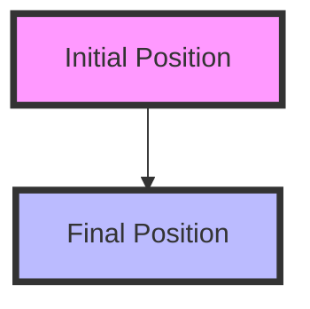

## 9.2.3 AnimatedPositioned

In the world of mobile app development, creating smooth and visually appealing transitions is crucial for enhancing user experience. Flutter, with its rich set of animation widgets, provides developers with the tools to achieve this seamlessly. One such widget is `AnimatedPositioned`, which allows for smooth transitions of a widget's position within a `Stack`. This section will delve into the intricacies of `AnimatedPositioned`, offering insights, practical examples, and best practices to help you master this powerful widget.

### Understanding AnimatedPositioned

`AnimatedPositioned` is a specialized widget in Flutter that animates changes in a widget's position within a `Stack`. It is particularly useful for moving widgets smoothly from one position to another, creating dynamic and engaging user interfaces. By animating the position properties such as `left`, `top`, `right`, and `bottom`, `AnimatedPositioned` enables developers to create fluid transitions that enhance the visual appeal of their applications.

#### Key Features of AnimatedPositioned:
- **Smooth Transitions:** Automatically animates changes in position, providing a seamless movement effect.
- **Ease of Use:** Requires minimal setup, making it accessible for developers of all skill levels.
- **Customizable:** Offers various properties to control the animation's duration and curve, allowing for tailored animations.

### Prerequisites

Before diving into `AnimatedPositioned`, it's essential to understand its prerequisites:
- **Direct Child of Stack:** `AnimatedPositioned` must be a direct child of a `Stack` widget. This is because `Stack` allows for absolute positioning of its children, which is necessary for `AnimatedPositioned` to function correctly.
- **State Management:** Since animations often involve changes in state, familiarity with Flutter's state management is beneficial. This includes understanding how to use `StatefulWidget` and `setState` to trigger animations.

### Code Example

Let's explore a practical example of using `AnimatedPositioned` to animate a widget's position. In this example, we'll create a simple application where a green square moves to a new position when tapped.

```dart
class AnimatedPositionedExample extends StatefulWidget {
  @override
  _AnimatedPositionedExampleState createState() => _AnimatedPositionedExampleState();
}

class _AnimatedPositionedExampleState extends State<AnimatedPositionedExample> {
  bool _isMoved = false;

  void _moveWidget() {
    setState(() {
      _isMoved = !_isMoved;
    });
  }

  @override
  Widget build(BuildContext context) {
    return Stack(
      children: [
        AnimatedPositioned(
          left: _isMoved ? 200 : 50,
          top: _isMoved ? 400 : 100,
          duration: Duration(seconds: 1),
          curve: Curves.easeInOut,
          child: GestureDetector(
            onTap: _moveWidget,
            child: Container(
              width: 100,
              height: 100,
              color: Colors.green,
              child: Center(child: Text('Tap Me')),
            ),
          ),
        ),
      ],
    );
  }
}
```

#### Explanation:
- **StatefulWidget:** We use a `StatefulWidget` to manage the state of the widget's position.
- **GestureDetector:** Wraps the `Container` to detect tap gestures, triggering the `_moveWidget` method.
- **AnimatedPositioned:** Animates the `left` and `top` properties, moving the widget smoothly between two positions.

### Properties of AnimatedPositioned

`AnimatedPositioned` offers several properties that can be animated to create dynamic effects:
- **left, top, right, bottom:** Define the widget's position within the `Stack`.
- **width, height:** Control the size of the widget, allowing for animations that change both position and size.
- **duration:** Specifies the duration of the animation.
- **curve:** Determines the animation curve, affecting the speed and timing of the transition.

### Visual Aids

To better understand the movement facilitated by `AnimatedPositioned`, consider the following diagram:



- **Initial Position (A):** The starting point of the widget.
- **Final Position (B):** The endpoint after the animation.
- **Arrow:** Represents the path of movement.

### Combining with Other Animated Widgets

`AnimatedPositioned` can be combined with other animated widgets to create complex animations. For instance, you can use it alongside `AnimatedOpacity` to fade a widget in and out while it moves, or with `AnimatedContainer` to simultaneously animate size and position changes.

#### Example Combination:
```dart
Stack(
  children: [
    AnimatedPositioned(
      left: _isMoved ? 200 : 50,
      top: _isMoved ? 400 : 100,
      duration: Duration(seconds: 1),
      curve: Curves.easeInOut,
      child: AnimatedOpacity(
        opacity: _isMoved ? 0.5 : 1.0,
        duration: Duration(seconds: 1),
        child: Container(
          width: 100,
          height: 100,
          color: Colors.green,
          child: Center(child: Text('Tap Me')),
        ),
      ),
    ),
  ],
);
```

### Best Practices

To make the most of `AnimatedPositioned`, consider the following best practices:
- **Consistent Stack Size:** Ensure the `Stack` size remains consistent to avoid unexpected layout changes during animations.
- **Boundary Management:** Keep widget positions within the bounds of the `Stack` to prevent overflow issues.
- **Performance Considerations:** Limit the number of simultaneous animations to maintain smooth performance.

### Exercise

To solidify your understanding of `AnimatedPositioned`, try creating a simple dashboard where widgets rearrange themselves upon user interaction. Use `AnimatedPositioned` to animate the movement of widgets to new positions, creating a dynamic and interactive layout.

#### Exercise Steps:
1. **Design the Layout:** Create a `Stack` with multiple `AnimatedPositioned` widgets.
2. **Implement Interaction:** Use `GestureDetector` to trigger position changes on tap.
3. **Animate Transitions:** Apply different curves and durations to explore various animation effects.

### Conclusion

`AnimatedPositioned` is a versatile widget that empowers developers to create smooth and engaging transitions within their Flutter applications. By understanding its properties and best practices, you can leverage `AnimatedPositioned` to enhance your app's user experience. Experiment with different animations and combinations to discover the full potential of this powerful widget.

## Quiz Time!



### What is the primary use of `AnimatedPositioned` in Flutter?

- [x] To animate changes in a widget's position within a `Stack`.
- [ ] To animate changes in a widget's color.
- [ ] To animate changes in a widget's text.
- [ ] To animate changes in a widget's shape.

> **Explanation:** `AnimatedPositioned` is used to animate changes in a widget's position within a `Stack`, allowing for smooth transitions.

### Which widget must `AnimatedPositioned` be a direct child of?

- [x] Stack
- [ ] Column
- [ ] Row
- [ ] ListView

> **Explanation:** `AnimatedPositioned` must be a direct child of a `Stack` widget to function correctly, as `Stack` allows for absolute positioning.

### What property of `AnimatedPositioned` controls the animation's duration?

- [x] duration
- [ ] curve
- [ ] left
- [ ] top

> **Explanation:** The `duration` property specifies how long the animation should take to complete.

### How can you trigger an animation in `AnimatedPositioned`?

- [x] By changing the state of the widget using `setState`.
- [ ] By changing the widget's color.
- [ ] By resizing the widget.
- [ ] By rotating the widget.

> **Explanation:** Animations in `AnimatedPositioned` are triggered by changes in state, typically using `setState`.

### Which property of `AnimatedPositioned` determines the animation curve?

- [x] curve
- [ ] duration
- [ ] left
- [ ] top

> **Explanation:** The `curve` property determines the animation curve, affecting the speed and timing of the transition.

### Can `AnimatedPositioned` animate changes in a widget's size?

- [x] Yes
- [ ] No

> **Explanation:** `AnimatedPositioned` can animate changes in a widget's `width` and `height`, in addition to its position.

### What is a common use case for combining `AnimatedPositioned` with other animated widgets?

- [x] To create complex animations involving multiple properties.
- [ ] To change the widget's text.
- [ ] To change the widget's background color.
- [ ] To change the widget's border radius.

> **Explanation:** Combining `AnimatedPositioned` with other animated widgets allows for complex animations involving multiple properties, such as position and opacity.

### What should you ensure when using `AnimatedPositioned` within a `Stack`?

- [x] The positions remain within the bounds of the `Stack`.
- [ ] The widget is always visible.
- [ ] The widget is always at the top of the `Stack`.
- [ ] The widget is always at the bottom of the `Stack`.

> **Explanation:** Ensuring that positions remain within the bounds of the `Stack` prevents overflow issues and maintains layout integrity.

### What is the effect of changing the `curve` property in `AnimatedPositioned`?

- [x] It changes the speed and timing of the animation.
- [ ] It changes the color of the widget.
- [ ] It changes the size of the widget.
- [ ] It changes the text of the widget.

> **Explanation:** The `curve` property affects the animation's speed and timing, allowing for different transition effects.

### True or False: `AnimatedPositioned` can only animate horizontal movements.

- [ ] True
- [x] False

> **Explanation:** `AnimatedPositioned` can animate both horizontal and vertical movements, as well as changes in size.


