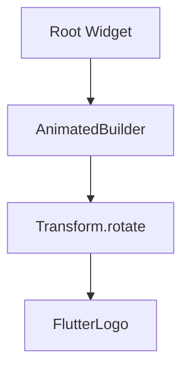

## 9.2.4 AnimatedBuilder

In the world of Flutter, animations play a crucial role in enhancing user experience by providing visual feedback and improving the overall interactivity of applications. Among the various tools Flutter offers for animations, `AnimatedBuilder` stands out as a versatile and efficient widget. This section delves into the purpose, functionality, and best practices of using `AnimatedBuilder` to create smooth and performant animations in your Flutter applications.

### Purpose of AnimatedBuilder

`AnimatedBuilder` is a general-purpose widget designed to facilitate the creation of animations in Flutter. Its primary advantage lies in its ability to optimize performance by rebuilding only the parts of the widget tree that need to change during an animation. This efficiency is crucial in maintaining smooth animations, especially in complex applications with numerous UI components.

#### Key Benefits of AnimatedBuilder

- **Performance Optimization:** By limiting rebuilds to only the necessary parts of the widget tree, `AnimatedBuilder` minimizes computational overhead, leading to smoother animations.
- **Separation of Concerns:** It allows developers to separate animation logic from the widget's appearance, making the codebase cleaner and more maintainable.
- **Flexibility:** `AnimatedBuilder` is ideal for custom animations where built-in animated widgets may not suffice, offering developers the flexibility to create unique and complex animations.

### How It Works

At its core, `AnimatedBuilder` operates by taking an `animation` and a `builder` function. The `builder` function is invoked every time the animation's value changes, allowing developers to define how the UI should respond to these changes.

- **Animation:** This is the driving force behind the animation, typically an `AnimationController` that dictates the animation's duration, curve, and other properties.
- **Builder Function:** This function is responsible for constructing the widget tree based on the current animation value. It receives the `BuildContext` and an optional `child` widget, which can be used to optimize performance further by avoiding unnecessary rebuilds of static child widgets.

### Code Example: Rotating a Widget

Let's explore a practical example where `AnimatedBuilder` is used to rotate a widget continuously. This example demonstrates the efficiency and simplicity of using `AnimatedBuilder` for animations.

```dart
import 'dart:math' as math;
import 'package:flutter/material.dart';

class AnimatedBuilderExample extends StatefulWidget {
  @override
  _AnimatedBuilderExampleState createState() => _AnimatedBuilderExampleState();
}

class _AnimatedBuilderExampleState extends State<AnimatedBuilderExample>
    with SingleTickerProviderStateMixin {
  late AnimationController _controller;

  @override
  void initState() {
    super.initState();
    _controller = AnimationController(
      duration: Duration(seconds: 2),
      vsync: this,
    )..repeat();
  }

  @override
  void dispose() {
    _controller.dispose();
    super.dispose();
  }

  @override
  Widget build(BuildContext context) {
    return AnimatedBuilder(
      animation: _controller,
      child: FlutterLogo(size: 100),
      builder: (context, child) {
        return Transform.rotate(
          angle: _controller.value * 2.0 * math.pi,
          child: child,
        );
      },
    );
  }
}
```

#### Explanation of the Code

- **AnimationController:** This controls the animation's duration and repetition. In this example, it repeats indefinitely, creating a continuous rotation effect.
- **AnimatedBuilder:** It listens to the `_controller` and rebuilds the `Transform.rotate` widget every time the animation value changes.
- **Transform.rotate:** This widget applies a rotation transformation to its child, which in this case is the `FlutterLogo`.

### Visual Aids

To better understand how `AnimatedBuilder` integrates into the widget tree and optimizes performance, consider the following diagram:



In this diagram, only the `Transform.rotate` widget is rebuilt during the animation, while the `FlutterLogo` remains unchanged, illustrating the efficiency of `AnimatedBuilder`.

### Custom Animations

`AnimatedBuilder` is particularly useful for creating custom animations that go beyond the capabilities of Flutter's built-in animated widgets. By leveraging the `builder` function, developers can define complex animations that respond to changes in the animation's value in creative ways.

### Best Practices

- **Pass Child Widgets:** To optimize performance, pass static child widgets to `AnimatedBuilder` to prevent unnecessary rebuilds. This is especially important for complex animations where multiple components are involved.
- **Use with AnimationController:** Ensure that the `AnimationController` is properly managed, including disposing of it in the `dispose` method to prevent memory leaks.

### Exercise: Create a Pulsating Animation

To reinforce your understanding of `AnimatedBuilder`, try creating a pulsating animation using scaling transformations. Here's a starting point:

1. **Set Up the AnimationController:** Define an `AnimationController` with a duration and repeat behavior.
2. **Use AnimatedBuilder:** Implement `AnimatedBuilder` to listen to the controller and apply a scaling transformation.
3. **Transform.scale:** Use `Transform.scale` to adjust the size of a widget based on the animation value.

### Conclusion

`AnimatedBuilder` is a powerful tool in the Flutter animation toolkit, offering both efficiency and flexibility. By understanding its purpose and functionality, you can create smooth and performant animations that enhance the user experience in your applications. Remember to follow best practices to maximize performance and maintain a clean codebase.

### Additional Resources

- [Flutter Documentation on AnimatedBuilder](https://api.flutter.dev/flutter/widgets/AnimatedBuilder-class.html)
- [Flutter Animation Tutorials](https://flutter.dev/docs/development/ui/animations/tutorial)
- [Dart Language Tour](https://dart.dev/guides/language/language-tour)

## Quiz Time!



### What is the primary purpose of using `AnimatedBuilder` in Flutter?

- [x] To optimize performance by rebuilding only necessary parts of the widget tree.
- [ ] To create complex animations without any performance considerations.
- [ ] To replace all built-in animated widgets.
- [ ] To handle user input events.

> **Explanation:** `AnimatedBuilder` is designed to optimize performance by minimizing rebuilds to only the parts of the widget tree that need to change during an animation.

### How does `AnimatedBuilder` improve performance?

- [x] By rebuilding only the parts of the widget tree that need to change.
- [ ] By caching all widgets in memory.
- [ ] By using a separate thread for animations.
- [ ] By reducing the frame rate of animations.

> **Explanation:** `AnimatedBuilder` improves performance by limiting rebuilds to only the necessary parts of the widget tree, reducing computational overhead.

### In the provided code example, what role does `Transform.rotate` play?

- [x] It applies a rotation transformation to the child widget.
- [ ] It scales the child widget.
- [ ] It changes the color of the child widget.
- [ ] It animates the opacity of the child widget.

> **Explanation:** `Transform.rotate` is used to apply a rotation transformation to the `FlutterLogo` based on the animation value.

### What should you do to prevent memory leaks when using `AnimationController`?

- [x] Dispose of the `AnimationController` in the `dispose` method.
- [ ] Initialize the `AnimationController` in the `build` method.
- [ ] Use a global variable for the `AnimationController`.
- [ ] Avoid using `AnimationController` altogether.

> **Explanation:** To prevent memory leaks, it's important to dispose of the `AnimationController` in the `dispose` method of the stateful widget.

### Which widget is rebuilt every time the animation value changes in the provided example?

- [x] `Transform.rotate`
- [ ] `FlutterLogo`
- [ ] `AnimatedBuilder`
- [ ] `AnimationController`

> **Explanation:** In the example, `Transform.rotate` is the widget that gets rebuilt every time the animation value changes, as it is inside the `builder` function of `AnimatedBuilder`.

### What is a common use case for `AnimatedBuilder`?

- [x] Creating custom animations where built-in animated widgets are insufficient.
- [ ] Handling user input events.
- [ ] Managing application state.
- [ ] Networking and API calls.

> **Explanation:** `AnimatedBuilder` is commonly used for creating custom animations that require more flexibility than what built-in animated widgets offer.

### Why is it beneficial to pass child widgets to `AnimatedBuilder`?

- [x] To avoid rebuilding static child widgets unnecessarily.
- [ ] To increase the complexity of the animation.
- [ ] To ensure that all widgets are rebuilt.
- [ ] To simplify the animation logic.

> **Explanation:** Passing child widgets to `AnimatedBuilder` helps optimize performance by preventing unnecessary rebuilds of static child widgets.

### What is the role of the `builder` function in `AnimatedBuilder`?

- [x] It constructs the widget tree based on the current animation value.
- [ ] It initializes the animation.
- [ ] It handles user input events.
- [ ] It manages application state.

> **Explanation:** The `builder` function in `AnimatedBuilder` is responsible for constructing the widget tree based on the current animation value.

### True or False: `AnimatedBuilder` can only be used with `AnimationController`.

- [x] True
- [ ] False

> **Explanation:** `AnimatedBuilder` is typically used with `AnimationController` to manage the animation's timing and state.

### What is a key advantage of using `AnimatedBuilder` for animations?

- [x] It separates animation logic from the widget's appearance.
- [ ] It automatically handles all user interactions.
- [ ] It simplifies networking operations.
- [ ] It provides built-in animations without customization.

> **Explanation:** A key advantage of `AnimatedBuilder` is that it separates animation logic from the widget's appearance, making the codebase cleaner and more maintainable.


