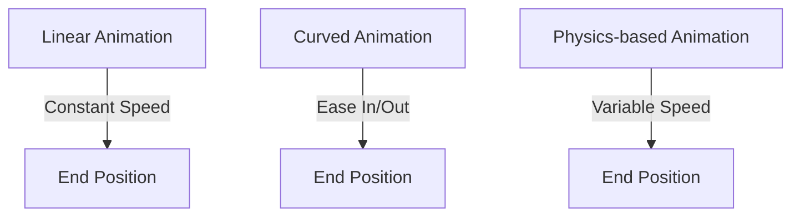

## 9.3.1 Physics-based Animations

In the realm of mobile app development, creating animations that mimic real-world physics can significantly enhance the user experience. Physics-based animations in Flutter allow developers to simulate natural movements, making interactions more intuitive and engaging. This section delves into the intricacies of physics-based animations, providing you with the knowledge and tools to implement them effectively in your Flutter applications.

### Understanding Physics-based Animations

Physics-based animations are designed to replicate the laws of physics, such as gravity, friction, and spring dynamics, to produce more lifelike and fluid motions. Unlike traditional animations that follow predefined paths, physics-based animations respond dynamically to user interactions and environmental changes, offering a more immersive experience.

#### Key Concepts:
- **Natural Motion:** By simulating physical forces, animations can move in a way that feels natural and expected, enhancing the realism of the interaction.
- **Dynamic Response:** These animations can adapt to changes in velocity, direction, and other parameters, providing a responsive and interactive user experience.

Flutter provides several classes and methods to create physics-based animations, including `AnimationController.fling()`, `SpringSimulation`, and various `PhysicsSimulation` classes.

### Using the `AnimationController.fling()` Method

The `fling()` method in Flutter is a powerful tool for simulating a fling or swipe gesture. It allows you to create animations that mimic the momentum and deceleration of a real-world fling.

#### Key Parameters:
- **Velocity:** Determines the speed and direction of the fling. A positive velocity moves the animation forward, while a negative velocity reverses it.
- **SpringDescription:** Defines the physical characteristics of the spring used in the animation, such as mass, stiffness, and damping.

Here's a basic example of using `fling()`:

```dart
_controller.fling(velocity: 2.0);
```

This line of code initiates a fling animation with a velocity of 2.0, creating a fast, forward-moving animation.

### Implementing Spring Animations

Spring animations are a type of physics-based animation that simulate the behavior of a spring. They are particularly useful for creating bouncy, elastic effects.

#### Components of a Spring Animation:
- **SpringDescription:** Specifies the physical properties of the spring, including mass, stiffness, and damping.
- **SpringSimulation:** Uses the `SpringDescription` to calculate the animation's motion over time.

Here's how you can implement a simple spring animation:

```dart
final SpringDescription spring = SpringDescription(
  mass: 1,
  stiffness: 100,
  damping: 5,
);

final Simulation simulation = SpringSimulation(spring, 0, 1, 0);

_controller.animateWith(simulation);
```

In this example, the spring animation is defined with a mass of 1, stiffness of 100, and damping of 5. The `SpringSimulation` uses these parameters to animate the widget from position 0 to 1.

### Using the `PhysicsSimulation` Classes

Flutter offers a variety of `PhysicsSimulation` classes to create complex animations that mimic different physical behaviors:

- **GravitySimulation:** Simulates the effect of gravity on an object, useful for drop or fall animations.
- **FrictionSimulation:** Models the deceleration of an object due to friction, ideal for swipe or scroll animations.
- **ScrollSimulation:** Simulates the behavior of a scrollable widget, providing a natural scrolling experience.

These simulations can be combined to create intricate animations that respond to user interactions and environmental changes.

### Code Example: Bouncing Ball Animation

Let's create a bouncing ball animation using `BouncingScrollSimulation` or `GravitySimulation`. This example demonstrates how to simulate a ball bouncing under the influence of gravity.

```dart
class BouncingBall extends StatefulWidget {
  @override
  _BouncingBallState createState() => _BouncingBallState();
}

class _BouncingBallState extends State<BouncingBall> with SingleTickerProviderStateMixin {
  late AnimationController _controller;
  late Animation<double> _animation;

  @override
  void initState() {
    super.initState();
    _controller = AnimationController(
      vsync: this,
      duration: const Duration(seconds: 2),
    );

    final simulation = GravitySimulation(
      9.8, // gravity
      0,   // starting position
      1,   // ending position
      0,   // initial velocity
    );

    _animation = _controller.drive(CurveTween(curve: Curves.bounceOut));
    _controller.animateWith(simulation);
  }

  @override
  Widget build(BuildContext context) {
    return AnimatedBuilder(
      animation: _animation,
      builder: (context, child) {
        return Transform.translate(
          offset: Offset(0, _animation.value * 300),
          child: child,
        );
      },
      child: Container(
        width: 50,
        height: 50,
        decoration: BoxDecoration(
          color: Colors.blue,
          shape: BoxShape.circle,
        ),
      ),
    );
  }

  @override
  void dispose() {
    _controller.dispose();
    super.dispose();
  }
}
```

In this code, a `GravitySimulation` is used to animate a ball that bounces under the influence of gravity. The `AnimatedBuilder` widget is used to rebuild the widget tree whenever the animation value changes, creating a smooth bouncing effect.

### Visual Aids

To better understand the differences between various animation types, consider the following diagrams:



- **Linear Animation:** Moves at a constant speed from start to end.
- **Curved Animation:** Uses easing functions to accelerate and decelerate.
- **Physics-based Animation:** Varies speed based on physical forces like gravity or friction.

### Real-World Analogies

Physics-based animations can be likened to real-world systems:

- **Pendulum:** A swinging pendulum can be simulated using spring animations, where the stiffness and damping control the swing's amplitude and decay.
- **Bouncing Ball:** A ball dropped from a height can be animated using gravity simulations, where the bounce height decreases over time due to energy loss.

### Best Practices

- **Enhance User Experience:** Use physics-based animations to create intuitive and engaging interactions that feel natural to users.
- **Consider Platform Conventions:** Ensure that animations align with the platform's design guidelines and user expectations.
- **Test Across Devices:** Verify that animations perform well on different devices and screen sizes, adjusting parameters as needed.

### Exercises

To reinforce your understanding, try creating a draggable widget that snaps back to its original position with a spring effect when released. This exercise will help you apply the concepts learned in this section to a practical scenario.

### Conclusion

Physics-based animations offer a powerful way to create dynamic and engaging user experiences in Flutter applications. By understanding and leveraging the tools provided by Flutter, you can simulate real-world physics to enhance the interactivity and realism of your app's animations.

For further exploration, consider diving into the official Flutter documentation on animations and experimenting with different `PhysicsSimulation` classes to create unique and compelling animations.

## Quiz Time!



### What is the primary purpose of physics-based animations in Flutter?

- [x] To simulate real-world physics for natural motion
- [ ] To create static animations
- [ ] To reduce app performance
- [ ] To simplify code complexity

> **Explanation:** Physics-based animations simulate real-world physics to create more natural and dynamic motions, enhancing user experience.

### Which method is used to simulate a fling or swipe gesture in Flutter?

- [x] AnimationController.fling()
- [ ] AnimationController.forward()
- [ ] AnimationController.reverse()
- [ ] AnimationController.stop()

> **Explanation:** The `AnimationController.fling()` method is specifically designed to simulate a fling or swipe gesture by using velocity.

### What parameters are crucial for defining a SpringDescription?

- [x] Mass, stiffness, damping
- [ ] Width, height, color
- [ ] Speed, direction, angle
- [ ] Length, breadth, height

> **Explanation:** A `SpringDescription` is defined by its mass, stiffness, and damping, which determine the spring's physical behavior.

### Which simulation class would you use to animate a falling object?

- [x] GravitySimulation
- [ ] FrictionSimulation
- [ ] ScrollSimulation
- [ ] SpringSimulation

> **Explanation:** `GravitySimulation` is used to simulate the effect of gravity on an object, making it ideal for animations involving falling objects.

### What is the role of the AnimatedBuilder widget in animations?

- [x] To rebuild the widget tree whenever the animation value changes
- [ ] To stop animations
- [ ] To create static widgets
- [ ] To manage state

> **Explanation:** `AnimatedBuilder` is used to rebuild the widget tree whenever the animation value changes, ensuring smooth transitions.

### How does a physics-based animation differ from a linear animation?

- [x] It varies speed based on physical forces
- [ ] It moves at a constant speed
- [ ] It uses predefined paths
- [ ] It is always faster

> **Explanation:** Physics-based animations vary speed based on physical forces like gravity or friction, unlike linear animations that move at a constant speed.

### Which of the following is NOT a PhysicsSimulation class in Flutter?

- [x] ColorSimulation
- [ ] GravitySimulation
- [ ] FrictionSimulation
- [ ] ScrollSimulation

> **Explanation:** `ColorSimulation` is not a valid `PhysicsSimulation` class in Flutter. The others simulate physical behaviors.

### What is the effect of increasing the damping parameter in a spring animation?

- [x] It reduces the oscillation amplitude
- [ ] It increases the speed
- [ ] It changes the color
- [ ] It stops the animation

> **Explanation:** Increasing the damping parameter reduces the oscillation amplitude, making the animation settle more quickly.

### Which parameter in the fling method determines the speed and direction of the animation?

- [x] Velocity
- [ ] Mass
- [ ] Damping
- [ ] Stiffness

> **Explanation:** The `velocity` parameter determines the speed and direction of the fling animation.

### True or False: Physics-based animations can adapt to user interactions and environmental changes.

- [x] True
- [ ] False

> **Explanation:** True. Physics-based animations are dynamic and can adapt to user interactions and environmental changes, providing a responsive experience.


