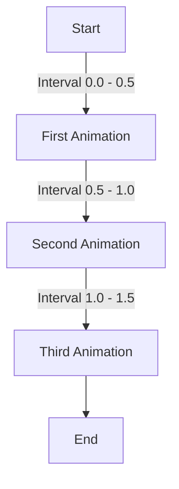

## 9.3.2 Chaining Animations

Animations are a powerful tool in Flutter, allowing developers to create visually engaging and dynamic user interfaces. In this section, we will delve into the concept of chaining animations, a technique that enables multiple animations to run sequentially, creating complex visual sequences. We will explore both manual chaining using `AnimationController` and `Tween`, as well as leveraging third-party libraries like `flutter_sequence_animation` to simplify the process.

### Concept of Chaining Animations

Chaining animations involves linking multiple animations together so that they run one after another. This technique is particularly useful for creating complex sequences where different elements animate in a coordinated manner. For example, you might want a button to expand, change color, and then shrink back to its original size, all in a smooth, continuous motion.

Chaining animations can enhance user experience by providing visual cues and transitions that guide users through an app. It can also be used to create engaging onboarding sequences, interactive tutorials, or simply to add a touch of flair to your app's UI.

### Using `SequenceAnimation`

To simplify the process of chaining animations, you can use third-party libraries like `flutter_sequence_animation`. This library provides a straightforward way to define and manage sequences of animations, reducing the complexity of manually coordinating multiple animations.

#### Setting Up `flutter_sequence_animation`

First, add the `flutter_sequence_animation` package to your `pubspec.yaml` file:

```yaml
dependencies:
  flutter:
    sdk: flutter
  flutter_sequence_animation: ^3.0.0
```

Then, import the package in your Dart file:

```dart
import 'package:flutter_sequence_animation/flutter_sequence_animation.dart';
```

#### Creating a Sequence Animation

Here's a basic example of how to create a sequence animation using `flutter_sequence_animation`:

```dart
AnimationController _controller;
SequenceAnimation _sequenceAnimation;

@override
void initState() {
  super.initState();
  _controller = AnimationController(
    duration: const Duration(seconds: 3),
    vsync: this,
  );

  _sequenceAnimation = SequenceAnimationBuilder()
    .addAnimatable(
      animatable: Tween<double>(begin: 0.0, end: 100.0),
      from: Duration.zero,
      to: const Duration(seconds: 1),
      tag: "move",
    )
    .addAnimatable(
      animatable: Tween<double>(begin: 1.0, end: 0.0),
      from: const Duration(seconds: 1),
      to: const Duration(seconds: 2),
      tag: "fade",
    )
    .animate(_controller);
}

@override
void dispose() {
  _controller.dispose();
  super.dispose();
}
```

In this example, we define a sequence where an object moves and then fades out. The `SequenceAnimationBuilder` allows us to specify the timing and order of each animation, making it easy to create complex sequences.

### Manual Chaining with `AnimationController`

For more control over your animations, you can manually chain animations using `AnimationController` and `Tween`. This approach involves defining multiple animations driven by a single controller, with each animation having its own timing and curve.

#### Using `Interval` for Timing

The `Interval` class is used to define the timing for each animation within the overall duration of the `AnimationController`. Here's an example:

```dart
AnimationController _controller;
Animation<double> firstAnimation;
Animation<double> secondAnimation;

@override
void initState() {
  super.initState();
  _controller = AnimationController(
    duration: const Duration(seconds: 2),
    vsync: this,
  );

  firstAnimation = Tween<double>(begin: 0, end: 100).animate(
    CurvedAnimation(
      parent: _controller,
      curve: Interval(0.0, 0.5, curve: Curves.easeIn),
    ),
  );

  secondAnimation = Tween<double>(begin: 0, end: 1).animate(
    CurvedAnimation(
      parent: _controller,
      curve: Interval(0.5, 1.0, curve: Curves.easeOut),
    ),
  );
}

@override
void dispose() {
  _controller.dispose();
  super.dispose();
}
```

In this example, `firstAnimation` runs during the first half of the controller's duration, and `secondAnimation` runs during the second half. The `Interval` class allows you to specify the start and end times for each animation relative to the controller's total duration.

### Implementing Staggered Animations

Staggered animations are a type of chained animation where each animation starts after a delay, creating a cascading effect. This technique is often used to animate lists or grids of items, where each item animates in sequence.

#### Example of Staggered Animation

Here's a simple example of a staggered animation sequence:

```dart
AnimationController _controller;
List<Animation<double>> animations = [];

@override
void initState() {
  super.initState();
  _controller = AnimationController(
    duration: const Duration(seconds: 3),
    vsync: this,
  );

  for (int i = 0; i < 5; i++) {
    animations.add(
      Tween<double>(begin: 0, end: 100).animate(
        CurvedAnimation(
          parent: _controller,
          curve: Interval(
            i * 0.2, // Start time
            (i + 1) * 0.2, // End time
            curve: Curves.easeInOut,
          ),
        ),
      ),
    );
  }
}

@override
void dispose() {
  _controller.dispose();
  super.dispose();
}
```

In this example, we create a list of animations, each starting slightly after the previous one. The `Interval` class is used to define the staggered start times for each animation.

### Visual Aids

To better understand how chained animations work, let's visualize the timing and curves of these animations.

#### Animation Timeline

```mermaid
gantt
    title Animation Timeline
    dateFormat  X
    section Animations
    First Animation :a1, 0, 5
    Second Animation :a2, 5, 10
    Third Animation :a3, 10, 15
```



This timeline shows how different animations are scheduled over time. Each animation starts after the previous one finishes, creating a seamless sequence.

#### Animation Curves with Intervals



This diagram illustrates how different animations are linked using intervals, with each animation having its own curve and timing.

### Best Practices

- **Cohesion:** Ensure that chained animations are cohesive and tell a visual story. Each animation should logically follow the previous one.
- **Timing:** Be cautious of animation durations and overlaps to prevent jarring transitions. Use `Interval` to manage timing effectively.
- **Performance:** Keep animations smooth and responsive by optimizing performance. Avoid running too many animations simultaneously.

### Exercises

To practice chaining animations, try creating an onboarding sequence where text and images fade in and move sequentially. Use both `flutter_sequence_animation` and manual chaining techniques to achieve the desired effect.

### Conclusion

Chaining animations in Flutter allows you to create complex, engaging sequences that enhance user experience. Whether you use third-party libraries or manually chain animations with `AnimationController`, the key is to plan your sequences carefully and ensure they are cohesive and visually appealing. By mastering these techniques, you can take your Flutter animations to the next level.

## Quiz Time!



### What is the primary purpose of chaining animations in Flutter?

- [x] To create complex sequences where multiple animations run one after another
- [ ] To run multiple animations simultaneously
- [ ] To simplify the animation code
- [ ] To improve app performance

> **Explanation:** Chaining animations allows multiple animations to run sequentially, creating complex visual sequences that enhance user experience.

### Which package can be used to simplify chained animations in Flutter?

- [ ] flutter_animations
- [x] flutter_sequence_animation
- [ ] flutter_chained_animations
- [ ] flutter_animation_tools

> **Explanation:** The `flutter_sequence_animation` package provides tools to simplify the creation and management of chained animations in Flutter.

### How does the `Interval` class help in chaining animations?

- [x] It defines the timing for each animation within the overall duration
- [ ] It synchronizes animations to run simultaneously
- [ ] It improves the performance of animations
- [ ] It simplifies the animation code

> **Explanation:** The `Interval` class is used to specify the start and end times for each animation relative to the controller's total duration, allowing for precise timing control.

### What is a staggered animation?

- [x] An animation where each part starts after a delay, creating a cascading effect
- [ ] An animation that runs in reverse order
- [ ] An animation that loops indefinitely
- [ ] An animation that changes speed over time

> **Explanation:** Staggered animations involve starting each animation after a delay, creating a cascading visual effect often used in lists or grids.

### In the manual chaining example, what does the `CurvedAnimation` class do?

- [x] It applies a curve to the animation, defining its acceleration and deceleration
- [ ] It synchronizes multiple animations
- [ ] It simplifies the animation code
- [ ] It improves the performance of animations

> **Explanation:** The `CurvedAnimation` class applies a curve to the animation, defining how it accelerates and decelerates over time.

### What is the benefit of using `flutter_sequence_animation` over manual chaining?

- [x] It simplifies the process of defining and managing sequences of animations
- [ ] It improves app performance
- [ ] It allows animations to run simultaneously
- [ ] It reduces the size of the app

> **Explanation:** `flutter_sequence_animation` simplifies the process of defining and managing sequences of animations, reducing the complexity of manual coordination.

### What should you be cautious of when chaining animations?

- [x] Animation durations and overlaps to prevent jarring transitions
- [ ] The number of animations running simultaneously
- [ ] The size of the animation files
- [ ] The color scheme of the animations

> **Explanation:** When chaining animations, it's important to be cautious of animation durations and overlaps to ensure smooth transitions.

### How can you visualize the timing of chained animations?

- [x] Using timelines and diagrams
- [ ] By running the app and observing the animations
- [ ] By printing debug statements
- [ ] By using a stopwatch

> **Explanation:** Timelines and diagrams can help visualize the timing and sequence of chained animations, aiding in planning and execution.

### What is the role of `AnimationController` in manual chaining?

- [x] It drives multiple animations with a single controller
- [ ] It synchronizes animations to run simultaneously
- [ ] It improves the performance of animations
- [ ] It simplifies the animation code

> **Explanation:** `AnimationController` drives multiple animations with a single controller, allowing for coordinated timing and control.

### True or False: Chaining animations can only be done using third-party libraries.

- [ ] True
- [x] False

> **Explanation:** Chaining animations can be done both manually using `AnimationController` and `Tween`, as well as using third-party libraries like `flutter_sequence_animation`.


