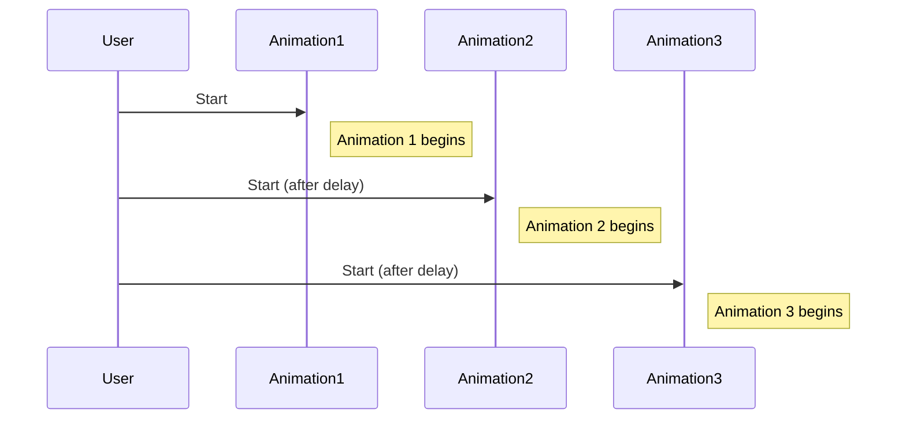

## 9.3.3 Staggered Animations

In the realm of mobile app development, animations play a crucial role in enhancing user experience by providing visual feedback and guiding user interactions. Among the various animation techniques, staggered animations stand out for their ability to create a dynamic and engaging user interface. This section delves into the concept of staggered animations, their implementation in Flutter, and practical applications to elevate your app's design.

### Definition of Staggered Animations

Staggered animations are a sequence of animations that start at different times, creating a cascading effect. This technique introduces delays between the start times of multiple animations, allowing each element to animate in succession rather than simultaneously. The result is a visually appealing and fluid transition that can draw attention to specific elements or guide the user's focus through a series of steps.

### Implementing Staggered Animations

To implement staggered animations in Flutter, we leverage the `AnimationController` and `Interval` classes. The `AnimationController` manages the animation's duration and state, while the `Interval` class defines the start and end times for each animation within the overall duration. By combining these tools, we can create a sequence of animations that appear to cascade across the screen.

#### Step-by-Step Guide to Implementing Staggered Animations

1. **Set Up the AnimationController:**
   Begin by creating an `AnimationController` to manage the overall animation duration. This controller will be responsible for driving the animations of all elements in the sequence.

   ```dart
   final AnimationController _controller = AnimationController(
     duration: const Duration(seconds: 2),
     vsync: this,
   );
   ```

2. **Define the Animation Intervals:**
   Use the `Interval` class to specify the start and end times for each animation. The intervals determine when each element's animation begins and ends relative to the overall animation duration.

   ```dart
   List<Animation<double>> animations = [];
   for (int i = 0; i < items.length; i++) {
     animations.add(
       Tween<double>(begin: 0, end: 1).animate(
         CurvedAnimation(
           parent: _controller,
           curve: Interval(
             i * 0.1, // Adjust the delay for staggering
             1.0,
             curve: Curves.easeIn,
           ),
         ),
       ),
     );
   }
   ```

3. **Animate the Widgets:**
   Apply the animations to the widgets you wish to animate. In this example, we'll animate a list of items, each fading in slightly after the previous one.

   ```dart
   Widget build(BuildContext context) {
     return Column(
       children: List.generate(items.length, (index) {
         return FadeTransition(
           opacity: animations[index],
           child: SlideTransition(
             position: Tween<Offset>(
               begin: Offset(0, 0.5),
               end: Offset.zero,
             ).animate(animations[index]),
             child: items[index],
           ),
         );
       }),
     );
   }
   ```

4. **Start the Animation:**
   Finally, start the animation by calling the `forward()` method on the `AnimationController`.

   ```dart
   @override
   void initState() {
     super.initState();
     _controller.forward();
   }
   ```

### Visual Aids

To better understand how staggered animations work, consider the following sequence diagram illustrating the staggered start times of each animation:



This diagram shows how each animation starts at a different time, creating a cascading effect.

### Use Cases for Staggered Animations

Staggered animations can be applied in various scenarios to enhance the visual appeal and user experience of your app:

- **Animating List Items:** Use staggered animations to animate list items as they appear on the screen, drawing attention to each item in sequence.
- **Menu Options:** Enhance navigation menus by animating each option with a slight delay, creating a smooth and engaging transition.
- **Onboarding Steps:** Guide users through onboarding steps with staggered animations, making the process more intuitive and visually appealing.

### Best Practices for Staggered Animations

While staggered animations can greatly enhance your app's UI, it's important to follow best practices to ensure a seamless experience:

- **Avoid Sluggishness:** Ensure that the staggering does not make the UI feel sluggish. Keep the delays short and the animations smooth.
- **Maintain Engagement:** Keep the total duration of the staggered animations reasonable to maintain user engagement and prevent frustration.
- **Test Across Devices:** Test the animations on various devices to ensure consistent performance and appearance.

### Exercises

To reinforce your understanding of staggered animations, try implementing the following exercise:

- **Gallery App Animation:** Create a gallery app where images appear one after another with a sliding effect. Use staggered animations to animate the opacity and position of each image as it enters the screen.

### Conclusion

Staggered animations are a powerful tool for creating dynamic and engaging user interfaces in Flutter. By introducing delays between animations, you can guide user attention and enhance the visual appeal of your app. With the techniques and best practices outlined in this section, you're well-equipped to implement staggered animations in your own projects.

### Further Reading and Resources

- [Flutter Animation Documentation](https://flutter.dev/docs/development/ui/animations)
- [AnimationController Class](https://api.flutter.dev/flutter/animation/AnimationController-class.html)
- [CurvedAnimation Class](https://api.flutter.dev/flutter/animation/CurvedAnimation-class.html)
- [Interval Class](https://api.flutter.dev/flutter/animation/Interval-class.html)

## Quiz Time!



### What is the primary purpose of staggered animations?

- [x] To create a cascading effect by introducing delays between animations
- [ ] To animate all elements simultaneously
- [ ] To reduce the overall animation duration
- [ ] To simplify animation implementation

> **Explanation:** Staggered animations introduce delays between animations, creating a cascading effect that enhances visual appeal.

### Which Flutter class is used to manage the timing and state of animations?

- [x] AnimationController
- [ ] Interval
- [ ] Tween
- [ ] CurvedAnimation

> **Explanation:** The `AnimationController` class manages the timing and state of animations in Flutter.

### How do you specify the start and end times for each animation in a staggered sequence?

- [x] Using the Interval class
- [ ] Using the Tween class
- [ ] Using the AnimationController class
- [ ] Using the CurvedAnimation class

> **Explanation:** The `Interval` class is used to specify the start and end times for each animation in a staggered sequence.

### What is a common use case for staggered animations?

- [x] Animating list items
- [ ] Reducing app load time
- [ ] Simplifying code structure
- [ ] Enhancing data security

> **Explanation:** Staggered animations are commonly used to animate list items, creating a visually appealing effect.

### Which method is used to start the animation in Flutter?

- [x] forward()
- [ ] start()
- [ ] begin()
- [ ] play()

> **Explanation:** The `forward()` method is used to start the animation in Flutter.

### What should be considered to avoid making the UI feel sluggish with staggered animations?

- [x] Keep the delays short and animations smooth
- [ ] Increase the animation duration
- [ ] Use complex animations
- [ ] Avoid testing on multiple devices

> **Explanation:** To avoid sluggishness, keep the delays short and animations smooth.

### What is the role of the CurvedAnimation class in staggered animations?

- [x] To apply easing curves to animations
- [ ] To manage animation timing
- [ ] To define animation intervals
- [ ] To create animation sequences

> **Explanation:** The `CurvedAnimation` class applies easing curves to animations, enhancing their visual appeal.

### How can you test the performance of staggered animations across devices?

- [x] Test on various devices to ensure consistent performance
- [ ] Use a single high-end device for testing
- [ ] Rely on emulator testing only
- [ ] Ignore performance testing

> **Explanation:** Testing on various devices ensures consistent performance and appearance of animations.

### What is a potential benefit of using staggered animations in onboarding steps?

- [x] Making the process more intuitive and visually appealing
- [ ] Reducing the number of steps
- [ ] Simplifying code implementation
- [ ] Enhancing data security

> **Explanation:** Staggered animations can make onboarding steps more intuitive and visually appealing.

### True or False: Staggered animations should always have long delays to enhance visual effects.

- [ ] True
- [x] False

> **Explanation:** Long delays can make the UI feel sluggish; it's important to keep delays short and animations smooth.


