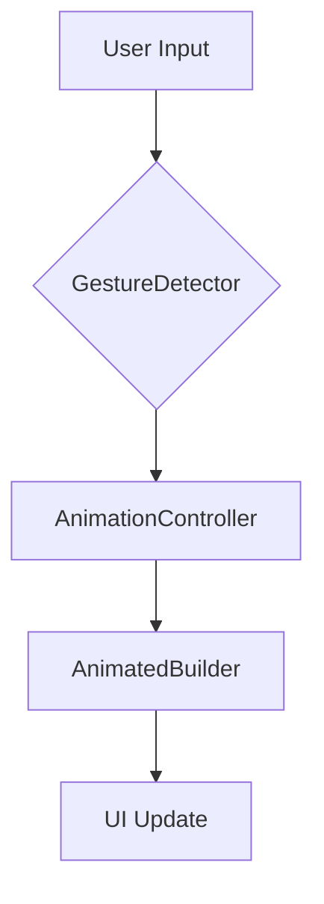

## 9.3.4 Interactive Animations

Interactive animations are a powerful tool in the Flutter developer's arsenal, allowing for dynamic and engaging user interfaces that respond to user input in real-time. Unlike static animations, interactive animations provide immediate feedback, enhancing the user experience by making applications feel more responsive and intuitive. This section will delve into the intricacies of creating interactive animations in Flutter, leveraging tools like `GestureDetector`, `AnimatedBuilder`, and `AnimationController`.

### What are Interactive Animations?

Interactive animations are animations that change in response to user actions such as tapping, dragging, or swiping. They are designed to provide immediate visual feedback, making the user interface feel alive and responsive. For example, a button that grows in size when pressed or a slider that animates smoothly as the user drags it.

#### Key Characteristics of Interactive Animations:
- **Real-Time Feedback:** Changes occur as the user interacts with the UI, providing a seamless experience.
- **User-Driven:** The animation's behavior is directly influenced by user actions, such as gestures or touch events.
- **Engagement:** Enhances user engagement by making the interface more dynamic and responsive.

### Using `GestureDetector` with Animations

The `GestureDetector` widget in Flutter is a versatile tool for capturing user interactions. By combining it with animations, you can create interactive elements that respond to gestures such as taps, drags, and swipes.

#### Example: Scaling Widget on Press

Let's create a simple widget that scales up when pressed and scales back when released. This example demonstrates how to use `GestureDetector` in conjunction with `AnimationController` and `AnimatedBuilder`.

```dart
import 'package:flutter/material.dart';

class InteractiveScaleWidget extends StatefulWidget {
  @override
  _InteractiveScaleWidgetState createState() => _InteractiveScaleWidgetState();
}

class _InteractiveScaleWidgetState extends State<InteractiveScaleWidget> with SingleTickerProviderStateMixin {
  late AnimationController _controller;
  late Animation<double> _animation;

  @override
  void initState() {
    super.initState();
    _controller = AnimationController(
      duration: const Duration(milliseconds: 200),
      vsync: this,
    );
    _animation = Tween<double>(begin: 1.0, end: 1.2).animate(_controller);
  }

  @override
  void dispose() {
    _controller.dispose();
    super.dispose();
  }

  @override
  Widget build(BuildContext context) {
    return GestureDetector(
      onTapDown: (_) => _controller.forward(),
      onTapUp: (_) => _controller.reverse(),
      onTapCancel: () => _controller.reverse(),
      child: AnimatedBuilder(
        animation: _animation,
        builder: (context, child) {
          return Transform.scale(
            scale: _animation.value,
            child: child,
          );
        },
        child: Container(
          width: 100,
          height: 100,
          color: Colors.blue,
          child: Center(child: Text('Press Me')),
        ),
      ),
    );
  }
}
```

### Implementing Draggable Animations

Draggable animations allow users to move widgets around the screen, providing a tactile and engaging experience. By using `Draggable` and `AnimatedBuilder`, you can create animations that respond to drag gestures.

#### Example: Draggable Widget with Animation

```dart
import 'package:flutter/material.dart';

class DraggableAnimationWidget extends StatefulWidget {
  @override
  _DraggableAnimationWidgetState createState() => _DraggableAnimationWidgetState();
}

class _DraggableAnimationWidgetState extends State<DraggableAnimationWidget> with SingleTickerProviderStateMixin {
  late AnimationController _controller;
  late Animation<Offset> _animation;

  @override
  void initState() {
    super.initState();
    _controller = AnimationController(
      duration: const Duration(milliseconds: 500),
      vsync: this,
    );
    _animation = Tween<Offset>(begin: Offset.zero, end: Offset(1.0, 0.0)).animate(_controller);
  }

  @override
  void dispose() {
    _controller.dispose();
    super.dispose();
  }

  @override
  Widget build(BuildContext context) {
    return Center(
      child: Draggable(
        feedback: Container(
          width: 100,
          height: 100,
          color: Colors.red.withOpacity(0.5),
          child: Center(child: Text('Drag Me')),
        ),
        childWhenDragging: Container(),
        child: AnimatedBuilder(
          animation: _animation,
          builder: (context, child) {
            return Transform.translate(
              offset: _animation.value,
              child: child,
            );
          },
          child: Container(
            width: 100,
            height: 100,
            color: Colors.red,
            child: Center(child: Text('Drag Me')),
          ),
        ),
        onDragEnd: (details) {
          _controller.forward(from: 0.0);
        },
      ),
    );
  }
}
```

### Leveraging `AnimatedBuilder` and `AnimationController`

`AnimatedBuilder` and `AnimationController` are powerful tools for creating animations that respond to gesture inputs. By tying animations to gesture values, you can create highly interactive and dynamic user interfaces.

#### Example: Gesture-Driven Animation

In this example, we use a `GestureDetector` to update an `AnimationController` based on user input, creating a smooth translation effect.

```dart
import 'package:flutter/material.dart';

class GestureDrivenAnimation extends StatefulWidget {
  @override
  _GestureDrivenAnimationState createState() => _GestureDrivenAnimationState();
}

class _GestureDrivenAnimationState extends State<GestureDrivenAnimation> with SingleTickerProviderStateMixin {
  late AnimationController _controller;
  final double maxDragDistance = 300.0;

  @override
  void initState() {
    super.initState();
    _controller = AnimationController(
      duration: const Duration(milliseconds: 500),
      vsync: this,
    );
  }

  @override
  void dispose() {
    _controller.dispose();
    super.dispose();
  }

  @override
  Widget build(BuildContext context) {
    return GestureDetector(
      onPanUpdate: (details) {
        setState(() {
          _controller.value += details.delta.dy / maxDragDistance;
        });
      },
      child: AnimatedBuilder(
        animation: _controller,
        builder: (context, child) {
          return Transform.translate(
            offset: Offset(0, _controller.value * maxDragDistance),
            child: child,
          );
        },
        child: Container(
          width: 100,
          height: 100,
          color: Colors.green,
          child: Center(child: Text('Slide Me')),
        ),
      ),
    );
  }
}
```

### Visual Aids

To better understand how user input affects the animation state, consider the following flow diagram:



This diagram illustrates the flow of data from user input through gesture detection, animation control, and finally to the UI update.

### Examples of Interactive Animations

Interactive animations can be used in various scenarios to enhance user experience:

- **Slide-to-Unlock Mechanisms:** Create a sliding animation that unlocks a feature or screen.
- **Pull-to-Refresh Animations:** Implement a pull-down gesture that triggers a refresh action with a smooth animation.
- **Interactive Sliders and Knobs:** Design sliders that provide real-time feedback as they are adjusted.

### Best Practices

- **Smooth and Responsive:** Ensure that animations are smooth and responsive to user actions to maintain a high-quality user experience.
- **Visual Feedback:** Provide clear visual feedback that aligns with user expectations, such as highlighting or scaling effects.
- **Performance Optimization:** Optimize animations to prevent jank and ensure they run smoothly on all devices.

### Exercises

To solidify your understanding of interactive animations, try creating a swipe card interface where cards animate off the screen when swiped. Consider using `GestureDetector` to capture swipe gestures and `AnimatedBuilder` to animate the card's movement.

### Conclusion

Interactive animations are a cornerstone of modern mobile applications, providing users with a dynamic and engaging experience. By leveraging Flutter's powerful animation tools, you can create interfaces that not only look great but also feel intuitive and responsive. As you continue to explore interactive animations, remember to focus on user experience, ensuring that your animations enhance rather than hinder the usability of your application.

## Quiz Time!



### What is the primary purpose of interactive animations in Flutter?

- [x] To provide real-time feedback to user input
- [ ] To create static visual effects
- [ ] To reduce app performance
- [ ] To complicate the user interface

> **Explanation:** Interactive animations are designed to respond to user input in real-time, providing immediate feedback and enhancing the user experience.

### Which Flutter widget is commonly used to detect user gestures?

- [x] GestureDetector
- [ ] AnimatedBuilder
- [ ] AnimationController
- [ ] Transform

> **Explanation:** The `GestureDetector` widget is used to detect user gestures such as taps, drags, and swipes.

### How can you create a scaling effect on a widget when it is pressed?

- [x] Use GestureDetector with AnimationController and AnimatedBuilder
- [ ] Use only AnimationController
- [ ] Use only Transform widget
- [ ] Use only AnimatedBuilder

> **Explanation:** By combining `GestureDetector`, `AnimationController`, and `AnimatedBuilder`, you can create a scaling effect that responds to user input.

### What is the role of the AnimationController in interactive animations?

- [x] It manages the animation's timing and state
- [ ] It detects user gestures
- [ ] It builds the UI
- [ ] It provides static visual effects

> **Explanation:** The `AnimationController` is responsible for managing the timing and state of animations, allowing them to respond to user input.

### Which widget is used to create draggable animations in Flutter?

- [x] Draggable
- [ ] GestureDetector
- [ ] AnimatedBuilder
- [ ] AnimationController

> **Explanation:** The `Draggable` widget is used to create animations that respond to drag gestures, allowing users to move widgets around the screen.

### What is the purpose of the AnimatedBuilder widget?

- [x] To build and update the UI based on animation values
- [ ] To detect user gestures
- [ ] To manage animation timing
- [ ] To create static visual effects

> **Explanation:** The `AnimatedBuilder` widget is used to build and update the UI based on the current values of an animation.

### How can you ensure animations are smooth and responsive?

- [x] Optimize performance and provide visual feedback
- [ ] Use only static animations
- [ ] Avoid using GestureDetector
- [ ] Increase animation duration

> **Explanation:** To ensure animations are smooth and responsive, optimize performance and provide clear visual feedback that aligns with user expectations.

### What is a common use case for interactive animations?

- [x] Pull-to-refresh animations
- [ ] Static image display
- [ ] Non-interactive text display
- [ ] Background color change

> **Explanation:** Interactive animations are commonly used for pull-to-refresh actions, where a pull-down gesture triggers a refresh with a smooth animation.

### Which diagram best represents the flow of interactive animations?

- [x] User Input -> GestureDetector -> AnimationController -> AnimatedBuilder -> UI Update
- [ ] UI Update -> GestureDetector -> AnimationController -> User Input
- [ ] AnimationController -> GestureDetector -> User Input -> UI Update
- [ ] GestureDetector -> UI Update -> AnimationController -> User Input

> **Explanation:** The correct flow is from user input through gesture detection, animation control, and finally to the UI update.

### True or False: Interactive animations should always be complex to impress users.

- [ ] True
- [x] False

> **Explanation:** Interactive animations should be smooth and responsive, not necessarily complex. The goal is to enhance user experience, not to complicate it.


