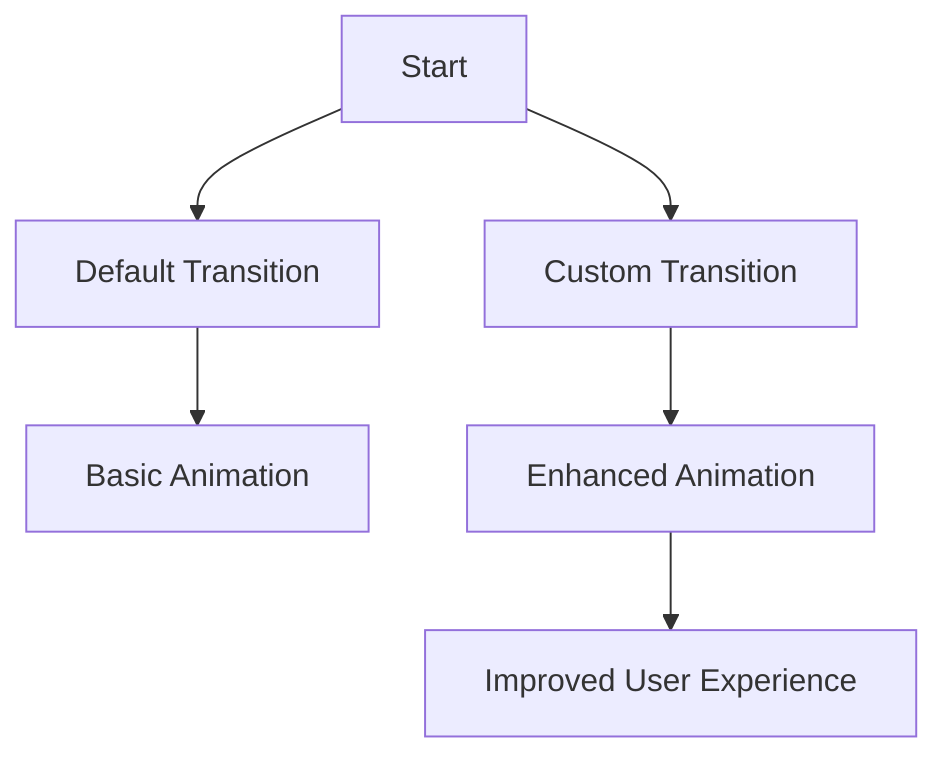

## 9.4.1 Page Transitions

In the world of mobile app development, the user experience is paramount. One of the subtle yet powerful ways to enhance this experience is through the use of page transitions. These animations occur when a user navigates between different screens or routes within an app. In this section, we will delve into the intricacies of page transitions in Flutter, exploring how to customize them to create a more engaging and intuitive user experience.

### Understanding Page Transitions

Page transitions are animations that facilitate the movement from one screen to another within an application. By default, Flutter provides a basic transition animation that is functional but may not always align with the desired user experience or the app's design language. Customizing these transitions allows developers to create a more cohesive and visually appealing experience that can significantly enhance user engagement.

#### The Importance of Customizing Transitions

Custom transitions can:
- **Enhance User Experience:** Smooth and visually appealing transitions can make navigation feel more natural and intuitive.
- **Reinforce Branding:** Custom animations can reflect the app's branding and design language, providing a consistent look and feel.
- **Improve Usability:** Well-designed transitions can guide users' attention and improve the overall usability of the app.

### Using the `PageRouteBuilder`

Flutter's `PageRouteBuilder` is a powerful tool for creating custom page transitions. It provides the flexibility to define both the page content and the transition animation.

#### Creating Custom Page Transitions

Let's explore how to implement a custom slide transition using `PageRouteBuilder`:

```dart
Navigator.push(
  context,
  PageRouteBuilder(
    pageBuilder: (context, animation, secondaryAnimation) => NextPage(),
    transitionsBuilder: (context, animation, secondaryAnimation, child) {
      var begin = Offset(1.0, 0.0);
      var end = Offset.zero;
      var curve = Curves.easeInOut;

      var tween = Tween(begin: begin, end: end).chain(CurveTween(curve: curve));

      return SlideTransition(
        position: animation.drive(tween),
        child: child,
      );
    },
  ),
);
```

**Explanation:**
- **`pageBuilder`:** Defines the target page to navigate to.
- **`transitionsBuilder`:** Defines the animation to be used during the transition.
- **`Offset`:** Represents the starting and ending positions of the transition.
- **`Tween`:** Interpolates between the start and end values.
- **`CurveTween`:** Applies a curve to the animation for a smoother transition.
- **`SlideTransition`:** Animates the position of the child widget.

### Customizing Transitions

Flutter offers a variety of transition widgets that can be used to create unique animations:

#### 1. `FadeTransition`

A `FadeTransition` animates the opacity of a widget, creating a fade-in or fade-out effect.

```dart
FadeTransition(
  opacity: animation,
  child: child,
);
```

#### 2. `ScaleTransition`

A `ScaleTransition` animates the scale of a widget, allowing it to grow or shrink.

```dart
ScaleTransition(
  scale: animation,
  child: child,
);
```

#### 3. `RotationTransition`

A `RotationTransition` animates the rotation of a widget, providing a spinning effect.

```dart
RotationTransition(
  turns: animation,
  child: child,
);
```

#### 4. `SlideTransition`

As demonstrated earlier, a `SlideTransition` animates the position of a widget, sliding it in or out of view.

#### Combining Transitions

For more complex effects, transitions can be combined. For example, a widget can simultaneously fade and slide:

```dart
transitionsBuilder: (context, animation, secondaryAnimation, child) {
  var slideTween = Tween<Offset>(begin: Offset(1.0, 0.0), end: Offset.zero);
  var fadeTween = Tween<double>(begin: 0.0, end: 1.0);

  return SlideTransition(
    position: animation.drive(slideTween),
    child: FadeTransition(
      opacity: animation.drive(fadeTween),
      child: child,
    ),
  );
},
```

### Visual Aids

To better understand the impact of custom transitions, let's visualize the process:



**Diagram Explanation:**
- **Default Transition:** Represents the basic animation provided by Flutter.
- **Custom Transition:** Illustrates the enhanced animation achieved through customization.
- **Improved User Experience:** Highlights the ultimate goal of using custom transitions.

### Best Practices

When implementing page transitions, consider the following best practices:

- **Smoothness:** Ensure transitions are fluid and do not disrupt the user experience.
- **Consistency:** Align transitions with platform conventions unless a unique experience is desired.
- **Simplicity:** Avoid overly complex animations that may distract users.
- **Performance:** Optimize animations to prevent performance issues, especially on lower-end devices.

### Exercises

To solidify your understanding, try implementing a fade transition between two pages in your app. Use the `FadeTransition` widget and experiment with different curves and durations to achieve the desired effect.

### Conclusion

Custom page transitions in Flutter offer a powerful way to enhance the user experience by making navigation more engaging and intuitive. By leveraging the flexibility of `PageRouteBuilder` and various transition widgets, developers can create animations that not only look great but also align with the app's design language and branding.

For further exploration, consider diving into Flutter's official documentation on [animations](https://flutter.dev/docs/development/ui/animations) and experimenting with different transition effects in your projects.

## Quiz Time!



### What is the primary purpose of page transitions in a Flutter app?

- [x] To enhance user experience by providing smooth navigation between screens.
- [ ] To increase the app's loading time.
- [ ] To replace the need for navigation bars.
- [ ] To reduce the app's overall size.

> **Explanation:** Page transitions are animations that occur when navigating between screens, enhancing the user experience by making navigation smooth and visually appealing.

### Which Flutter widget is used to create custom page transitions?

- [ ] Navigator
- [x] PageRouteBuilder
- [ ] MaterialPageRoute
- [ ] TransitionBuilder

> **Explanation:** `PageRouteBuilder` is used to create custom page transitions by defining both the page content and the transition animation.

### What does the `transitionsBuilder` parameter in `PageRouteBuilder` do?

- [x] It defines the animation to be used during the transition.
- [ ] It specifies the target page to navigate to.
- [ ] It sets the duration of the transition.
- [ ] It handles user input during the transition.

> **Explanation:** The `transitionsBuilder` parameter defines the animation that will be used during the transition between pages.

### Which transition widget would you use to create a fade-in effect?

- [ ] SlideTransition
- [x] FadeTransition
- [ ] ScaleTransition
- [ ] RotationTransition

> **Explanation:** `FadeTransition` is used to animate the opacity of a widget, creating a fade-in or fade-out effect.

### How can you combine multiple transitions in Flutter?

- [x] By nesting transition widgets within the `transitionsBuilder`.
- [ ] By using multiple `PageRouteBuilder` instances.
- [ ] By overriding the `Navigator` class.
- [ ] By creating a custom `TransitionManager`.

> **Explanation:** Multiple transitions can be combined by nesting transition widgets within the `transitionsBuilder` function.

### What is a best practice when implementing page transitions?

- [x] Ensure transitions are smooth and not overly distracting.
- [ ] Use as many animations as possible for each transition.
- [ ] Avoid using any transitions to keep the app simple.
- [ ] Implement transitions only on the home screen.

> **Explanation:** Transitions should be smooth and not overly distracting to enhance the user experience without causing disruption.

### Which curve is commonly used for smooth transitions in Flutter?

- [ ] Curves.linear
- [x] Curves.easeInOut
- [ ] Curves.bounceIn
- [ ] Curves.elasticOut

> **Explanation:** `Curves.easeInOut` is commonly used for smooth transitions as it provides a gradual acceleration and deceleration.

### What is the role of the `Tween` class in custom transitions?

- [x] It interpolates between the start and end values of an animation.
- [ ] It defines the duration of the transition.
- [ ] It manages the state of the transition.
- [ ] It handles user input during the transition.

> **Explanation:** The `Tween` class interpolates between the start and end values, defining the animation's progression.

### True or False: Custom transitions should always be complex to impress users.

- [ ] True
- [x] False

> **Explanation:** Custom transitions should be simple and smooth, enhancing the user experience without being overly complex or distracting.

### Which resource is recommended for further exploration of Flutter animations?

- [x] Flutter's official documentation on animations
- [ ] A random blog post
- [ ] A non-technical book
- [ ] A video game tutorial

> **Explanation:** Flutter's official documentation on animations is a comprehensive resource for learning more about implementing animations in Flutter.


