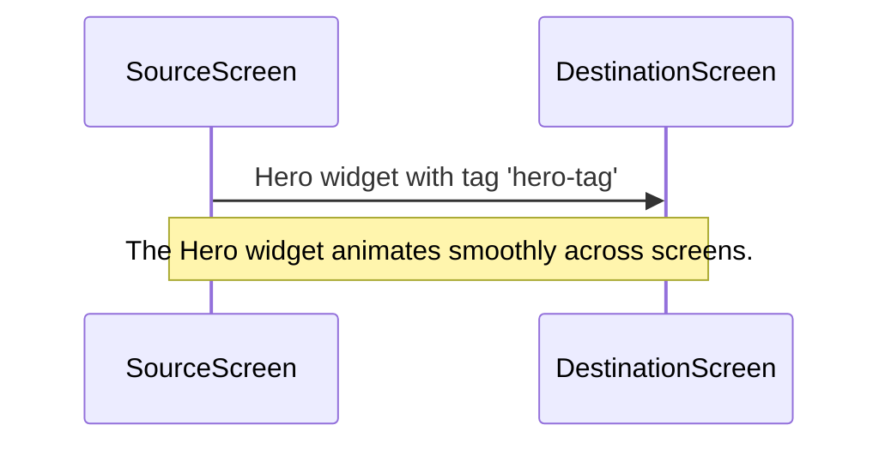

## 9.4.2 Hero Animations

In the world of mobile app development, creating a seamless and engaging user experience is paramount. One of the ways to achieve this in Flutter is through Hero animations. These animations allow a widget to "fly" from one screen to another, providing a smooth transition that captures the user's attention and enhances the overall navigation experience. In this section, we'll delve into the intricacies of Hero animations, exploring their implementation, customization, and best practices.

### Introduction to Hero Animations

Hero animations are a powerful feature in Flutter that enable a widget to transition smoothly between two screens. This effect is particularly useful for emphasizing key navigational elements, such as images or buttons, by animating them from their position on one screen to a new position on another. The animation not only provides a visual cue to the user but also maintains context by linking the two screens through a shared element.

#### Why Use Hero Animations?

- **Focus User Attention:** By animating a widget across screens, you can guide the user's focus to important elements, making the navigation intuitive and engaging.
- **Seamless Transitions:** Hero animations create a fluid transition effect, reducing the cognitive load on users as they move between different parts of the app.
- **Enhanced User Experience:** A well-implemented Hero animation can significantly improve the perceived performance and polish of your app.

### Implementing Hero Widgets

To implement a Hero animation, you need to wrap the widget you want to animate in a `Hero` widget. The `Hero` widget requires a `tag` property, which uniquely identifies the widget across the source and destination screens. The same `tag` must be used on both screens to link the animations.

Here's a basic example of how to implement a Hero animation:

```dart
// On the source screen
Hero(
  tag: 'hero-tag',
  child: Image.network('https://example.com/image.png'),
),
```

```dart
// On the destination screen
Hero(
  tag: 'hero-tag',
  child: Image.network('https://example.com/image.png'),
),
```

#### Key Points:

- **Matching Tags:** The `tag` property is crucial for the Hero animation to work. Ensure that the tags match exactly on both the source and destination widgets.
- **Widget Consistency:** While the widgets can differ in size or shape, they should represent the same element to maintain a coherent transition.

### Limitations and Considerations

While Hero animations are a powerful tool, there are some limitations and considerations to keep in mind:

- **Position and Size:** The Hero animation uses the widgets' positions and sizes on the screen. If the source and destination widgets have different shapes or aspect ratios, the transition might appear distorted.
- **Shape Changes:** To handle shape changes, you can use the `createRectTween` property to customize the animation path.
- **Performance:** Hero animations can be resource-intensive, especially if the widgets are complex or the transition involves large images.

### Advanced Customization

Flutter provides several properties to customize Hero animations, allowing you to tailor the transition to your app's needs.

#### `createRectTween`

The `createRectTween` property allows you to define a custom animation path for the Hero transition. This can be useful if you want to create non-linear animations or handle shape changes gracefully.

```dart
Hero(
  tag: 'hero-tag',
  createRectTween: (begin, end) {
    return RectTween(begin: begin, end: end);
  },
  child: Image.network('https://example.com/image.png'),
),
```

#### `flightShuttleBuilder`

The `flightShuttleBuilder` property lets you customize the appearance of the Hero widget during the transition. This can be used to add effects or modify the widget's appearance while it's "flying" between screens.

```dart
Hero(
  tag: 'hero-tag',
  flightShuttleBuilder: (flightContext, animation, direction, fromContext, toContext) {
    return Image.network('https://example.com/image.png');
  },
  child: Image.network('https://example.com/image.png'),
),
```

### Visual Aids

To better understand Hero animations, let's visualize the transition process. Imagine a sequence of images showing a Hero widget moving from one screen to another:



This diagram illustrates the flow of a Hero animation, emphasizing the seamless transition between the source and destination screens.

### Best Practices

To make the most of Hero animations, consider the following best practices:

- **Highlight Key Elements:** Use Hero animations to draw attention to important navigational elements, such as images or buttons.
- **Unique Tags:** Ensure that Hero tags are unique within the app to avoid conflicts and unintended animations.
- **Consistent Design:** Maintain a consistent design language across the source and destination widgets to ensure a coherent transition.

### Exercises

To solidify your understanding of Hero animations, try implementing them in a practical scenario. Consider creating a photo gallery app where tapping on a thumbnail expands it into a full-screen image using a Hero animation. This exercise will help you apply the concepts discussed and explore the customization options available.

### Conclusion

Hero animations are a versatile tool in Flutter's animation arsenal, enabling developers to create smooth and engaging transitions between screens. By understanding their implementation, limitations, and customization options, you can enhance your app's user experience and create visually appealing navigation effects. Remember to experiment with different properties and scenarios to fully leverage the power of Hero animations in your projects.

## Quiz Time!



### What is the primary purpose of Hero animations in Flutter?

- [x] To animate a widget from one screen to another during navigation
- [ ] To create complex animations within a single screen
- [ ] To handle user input more effectively
- [ ] To improve app performance

> **Explanation:** Hero animations are used to animate a widget from one screen to another, providing a seamless transition effect that focuses the user's attention.

### What property is essential for linking Hero animations between two screens?

- [x] tag
- [ ] key
- [ ] id
- [ ] name

> **Explanation:** The `tag` property is crucial for linking Hero animations between the source and destination screens.

### Which property allows you to define a custom animation path for a Hero transition?

- [x] createRectTween
- [ ] flightShuttleBuilder
- [ ] animationPath
- [ ] transitionBuilder

> **Explanation:** The `createRectTween` property allows you to define a custom animation path for the Hero transition.

### What is the role of the `flightShuttleBuilder` property in Hero animations?

- [x] To customize the appearance of the Hero widget during the transition
- [ ] To define the start and end points of the animation
- [ ] To handle user interactions during the animation
- [ ] To improve the performance of the animation

> **Explanation:** The `flightShuttleBuilder` property lets you customize the appearance of the Hero widget during the transition.

### What should you ensure about Hero tags within an app?

- [x] They are unique
- [ ] They are descriptive
- [ ] They are short
- [ ] They are numeric

> **Explanation:** Hero tags should be unique within the app to avoid conflicts and unintended animations.

### Which of the following is a limitation of Hero animations?

- [x] They use the widgets' positions and sizes
- [ ] They cannot be customized
- [ ] They are only available on Android
- [ ] They do not support images

> **Explanation:** Hero animations use the widgets' positions and sizes, which can be a limitation if the source and destination widgets have different shapes or aspect ratios.

### How can you handle shape changes in Hero animations?

- [x] By using the `createRectTween` property
- [ ] By using the `animationBuilder` property
- [ ] By using the `shapeHandler` property
- [ ] By using the `transitionManager` property

> **Explanation:** The `createRectTween` property can be used to handle shape changes by defining a custom animation path.

### What is a best practice when using Hero animations?

- [x] Use them to highlight key navigational elements
- [ ] Use them for all widgets
- [ ] Avoid using them for images
- [ ] Use the same tag for multiple widgets

> **Explanation:** A best practice is to use Hero animations to highlight key navigational elements, such as images or buttons.

### True or False: Hero animations can be resource-intensive.

- [x] True
- [ ] False

> **Explanation:** Hero animations can be resource-intensive, especially if the widgets are complex or the transition involves large images.

### Which exercise can help you practice implementing Hero animations?

- [x] Creating a photo gallery app with thumbnail expansion
- [ ] Building a calculator app
- [ ] Developing a weather app
- [ ] Designing a music player interface

> **Explanation:** Implementing a Hero animation in a photo gallery app where tapping on a thumbnail expands it into a full-screen image is a practical exercise to practice Hero animations.


