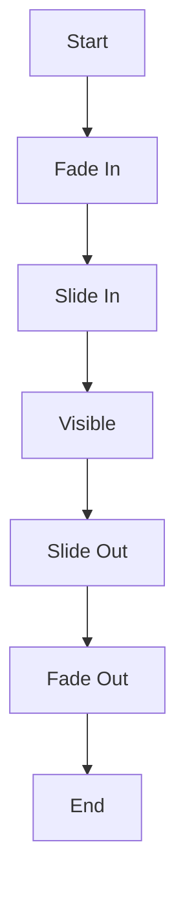

## 9.4.3 Fade and Slide Transitions

In the realm of mobile app development, creating a seamless and engaging user experience is paramount. Transitions play a crucial role in guiding users through an application, providing visual cues that enhance navigation and interaction. Among the various types of transitions, fade and slide transitions are particularly popular due to their subtlety and effectiveness in conveying changes between UI elements. This section delves into the intricacies of implementing fade and slide transitions in Flutter, offering practical insights and examples to help you master these techniques.

### Understanding Fade and Slide Transitions

Fade and slide transitions are fundamental animation techniques used to create smooth and visually appealing transitions between different states or screens in an application. These transitions help in maintaining the user's focus and provide a sense of continuity as they navigate through the app.

- **Fade Transitions:** Involve changing the opacity of a widget over time, creating a gradual appearance or disappearance effect. This is particularly useful for elements that need to subtly enter or exit the screen without drawing too much attention.
  
- **Slide Transitions:** Involve moving a widget from one position to another, typically sliding in or out of view. This type of transition is effective for elements that need to convey directionality or spatial movement.

### Using `FadeTransition`

The `FadeTransition` widget in Flutter is a straightforward way to apply fade effects to your widgets. It requires an `Animation<double>` object that controls the opacity of the child widget.

Here's a basic example of how to use `FadeTransition`:

```dart
import 'package:flutter/material.dart';

class FadeTransitionExample extends StatefulWidget {
  @override
  _FadeTransitionExampleState createState() => _FadeTransitionExampleState();
}

class _FadeTransitionExampleState extends State<FadeTransitionExample> with SingleTickerProviderStateMixin {
  AnimationController _controller;
  Animation<double> _animation;

  @override
  void initState() {
    super.initState();
    _controller = AnimationController(
      duration: const Duration(seconds: 2),
      vsync: this,
    )..repeat(reverse: true);

    _animation = CurvedAnimation(
      parent: _controller,
      curve: Curves.easeIn,
    );
  }

  @override
  void dispose() {
    _controller.dispose();
    super.dispose();
  }

  @override
  Widget build(BuildContext context) {
    return Scaffold(
      appBar: AppBar(title: Text('Fade Transition Example')),
      body: Center(
        child: FadeTransition(
          opacity: _animation,
          child: Container(
            width: 200,
            height: 200,
            color: Colors.blue,
          ),
        ),
      ),
    );
  }
}
```

**Explanation:**

- **AnimationController:** Manages the animation's lifecycle and provides the necessary timing.
- **CurvedAnimation:** Applies a curve to the animation, making the transition smoother.
- **FadeTransition:** Uses the `opacity` property to animate the fade effect.

### Using `SlideTransition`

The `SlideTransition` widget animates the position of a widget by translating it along a given offset. This is achieved using an `Animation<Offset>` object.

Here's how you can implement a `SlideTransition`:

```dart
import 'package:flutter/material.dart';

class SlideTransitionExample extends StatefulWidget {
  @override
  _SlideTransitionExampleState createState() => _SlideTransitionExampleState();
}

class _SlideTransitionExampleState extends State<SlideTransitionExample> with SingleTickerProviderStateMixin {
  AnimationController _controller;
  Animation<Offset> _animation;

  @override
  void initState() {
    super.initState();
    _controller = AnimationController(
      duration: const Duration(seconds: 2),
      vsync: this,
    )..repeat(reverse: true);

    _animation = Tween<Offset>(
      begin: Offset(0, 1),
      end: Offset.zero,
    ).animate(CurvedAnimation(
      parent: _controller,
      curve: Curves.easeInOut,
    ));
  }

  @override
  void dispose() {
    _controller.dispose();
    super.dispose();
  }

  @override
  Widget build(BuildContext context) {
    return Scaffold(
      appBar: AppBar(title: Text('Slide Transition Example')),
      body: Center(
        child: SlideTransition(
          position: _animation,
          child: Container(
            width: 200,
            height: 200,
            color: Colors.red,
          ),
        ),
      ),
    );
  }
}
```

**Explanation:**

- **Tween<Offset>:** Defines the start and end positions for the slide animation.
- **SlideTransition:** Uses the `position` property to animate the widget's movement.

### Combining Transitions

Combining fade and slide transitions can create more dynamic and engaging animations. This can be achieved by nesting transition widgets or using an `AnimatedBuilder`.

Here's an example of combining both transitions:

```dart
import 'package:flutter/material.dart';

class CombinedTransitionExample extends StatefulWidget {
  @override
  _CombinedTransitionExampleState createState() => _CombinedTransitionExampleState();
}

class _CombinedTransitionExampleState extends State<CombinedTransitionExample> with SingleTickerProviderStateMixin {
  AnimationController _controller;
  Animation<double> _fadeAnimation;
  Animation<Offset> _slideAnimation;

  @override
  void initState() {
    super.initState();
    _controller = AnimationController(
      duration: const Duration(seconds: 2),
      vsync: this,
    )..repeat(reverse: true);

    _fadeAnimation = CurvedAnimation(
      parent: _controller,
      curve: Curves.easeIn,
    );

    _slideAnimation = Tween<Offset>(
      begin: Offset(0, 1),
      end: Offset.zero,
    ).animate(CurvedAnimation(
      parent: _controller,
      curve: Curves.easeInOut,
    ));
  }

  @override
  void dispose() {
    _controller.dispose();
    super.dispose();
  }

  @override
  Widget build(BuildContext context) {
    return Scaffold(
      appBar: AppBar(title: Text('Combined Transition Example')),
      body: Center(
        child: FadeTransition(
          opacity: _fadeAnimation,
          child: SlideTransition(
            position: _slideAnimation,
            child: Container(
              width: 200,
              height: 200,
              color: Colors.green,
            ),
          ),
        ),
      ),
    );
  }
}
```

**Explanation:**

- **Nesting Transitions:** The `FadeTransition` is applied to the `SlideTransition`, allowing both effects to occur simultaneously.
- **Animation Synchronization:** Both animations are controlled by the same `AnimationController`, ensuring they are synchronized.

### Visual Aids

To better understand the movement paths and opacity changes, consider the following diagrams:



**Diagram Explanation:**

- **Fade In/Out:** Represents the change in opacity over time.
- **Slide In/Out:** Illustrates the widget's movement along the defined path.

### Best Practices

- **Smooth Curves:** Use easing curves like `Curves.easeInOut` to make transitions feel natural and fluid.
- **Short Durations:** Keep transitions brief (typically 300-500 milliseconds) to maintain a responsive user experience.
- **Consistency:** Ensure that transitions are consistent throughout the app to avoid confusing users.

### Exercises

**Exercise 1:** Create a custom dialog that uses both fade and slide transitions when appearing and disappearing. Experiment with different curves and durations to see how they affect the user experience.

**Exercise 2:** Implement a list of items where each item slides in from the bottom and fades in when it appears on the screen. Use a staggered animation to create a cascading effect.

### Conclusion

Mastering fade and slide transitions in Flutter can significantly enhance the user experience by providing smooth and engaging interactions. By understanding the principles behind these transitions and practicing their implementation, you can create applications that are not only functional but also visually appealing.

### Further Reading

- [Flutter Animation Documentation](https://flutter.dev/docs/development/ui/animations)
- [Material Design Motion Guidelines](https://material.io/design/motion/the-motion-system.html)
- [Flutter Cookbook: Animations](https://flutter.dev/docs/cookbook/animation)

## Quiz Time!



### What is the primary purpose of using fade and slide transitions in a Flutter application?

- [x] To create smooth and engaging transitions between UI elements
- [ ] To increase the complexity of the application
- [ ] To make the application run faster
- [ ] To reduce the number of widgets in the application

> **Explanation:** Fade and slide transitions are used to create smooth and engaging transitions between UI elements, enhancing the user experience.

### Which widget is used to apply a fade effect to a widget in Flutter?

- [x] FadeTransition
- [ ] SlideTransition
- [ ] Opacity
- [ ] AnimatedOpacity

> **Explanation:** The `FadeTransition` widget is specifically designed to apply fade effects to widgets in Flutter.

### How does the `SlideTransition` widget animate a widget?

- [x] By translating it along a given offset
- [ ] By changing its color
- [ ] By rotating it
- [ ] By scaling it

> **Explanation:** The `SlideTransition` widget animates a widget by translating it along a given offset, effectively moving it in or out of view.

### What is the role of an `AnimationController` in Flutter animations?

- [x] It manages the animation's lifecycle and timing
- [ ] It changes the widget's color
- [ ] It scales the widget
- [ ] It rotates the widget

> **Explanation:** An `AnimationController` manages the animation's lifecycle and timing, providing control over the animation's duration and state.

### What is the benefit of using `CurvedAnimation` with an `AnimationController`?

- [x] It applies a curve to the animation, making transitions smoother
- [ ] It changes the widget's size
- [ ] It speeds up the animation
- [ ] It adds a shadow to the widget

> **Explanation:** `CurvedAnimation` applies a curve to the animation, making transitions smoother and more natural.

### How can you combine multiple transitions in Flutter?

- [x] By nesting transition widgets or using `AnimatedBuilder`
- [ ] By using a single `AnimationController`
- [ ] By changing the widget's color
- [ ] By rotating the widget

> **Explanation:** Multiple transitions can be combined by nesting transition widgets or using an `AnimatedBuilder`.

### What is a best practice for the duration of transitions in Flutter?

- [x] Keep transitions brief, typically 300-500 milliseconds
- [ ] Make transitions as long as possible
- [ ] Use random durations for each transition
- [ ] Avoid using transitions altogether

> **Explanation:** Keeping transitions brief, typically 300-500 milliseconds, ensures a responsive user experience.

### What is the purpose of using easing curves like `Curves.easeInOut` in animations?

- [x] To make transitions feel natural and fluid
- [ ] To increase the animation speed
- [ ] To change the widget's color
- [ ] To add a shadow to the widget

> **Explanation:** Easing curves like `Curves.easeInOut` make transitions feel natural and fluid, enhancing the user experience.

### Which of the following is a common pitfall when implementing transitions?

- [x] Making transitions too long, which can affect responsiveness
- [ ] Using too many widgets
- [ ] Not using enough colors
- [ ] Avoiding animations altogether

> **Explanation:** Making transitions too long can affect the responsiveness of the application, leading to a poor user experience.

### True or False: The `SlideTransition` widget can only move widgets vertically.

- [ ] True
- [x] False

> **Explanation:** False. The `SlideTransition` widget can move widgets both vertically and horizontally by adjusting the `Offset` values.


