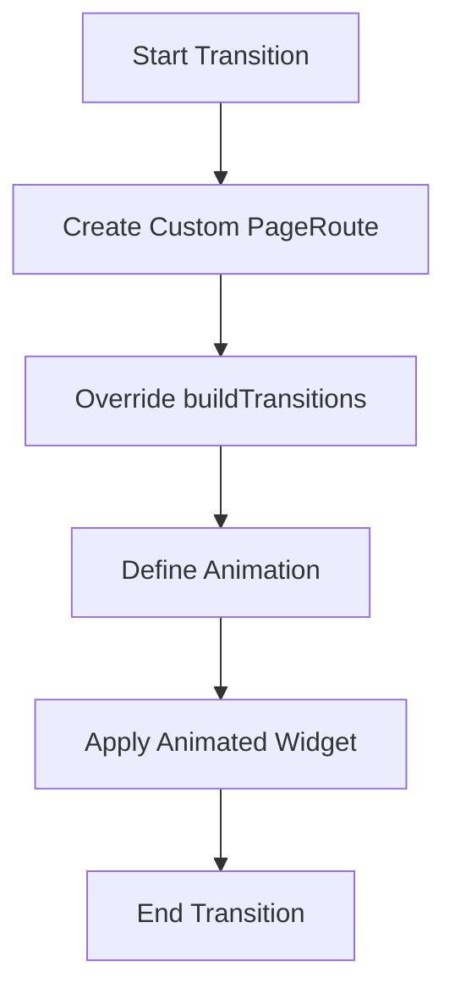

## 9.4.4 Custom Route Transitions

In the world of mobile applications, transitions play a crucial role in providing a smooth and engaging user experience. Flutter, with its rich set of animation and transition capabilities, allows developers to create custom route transitions that can make navigation between screens more dynamic and visually appealing. In this section, we will delve into the process of creating custom route transitions in Flutter, exploring the use of `PageRoute`, `PageRouteBuilder`, and animated widgets to achieve seamless transitions.

### Creating Custom Transitions

Custom transitions in Flutter can be defined by extending the `PageRoute` class or using the `PageRouteBuilder`. These classes provide the flexibility to define how a new page should appear and disappear, allowing for creative and unique transition effects.

#### Extending PageRoute

To create a custom transition, you can extend the `PageRoute` class. This approach gives you complete control over the transition animations. Here's a basic example of how to extend `MaterialPageRoute` to create a custom transition:

```dart
class CustomPageRoute extends MaterialPageRoute {
  CustomPageRoute({required WidgetBuilder builder})
      : super(builder: builder);

  @override
  Widget buildTransitions(BuildContext context, Animation<double> animation,
      Animation<double> secondaryAnimation, Widget child) {
    // Implement custom transition here
    return super.buildTransitions(context, animation, secondaryAnimation, child);
  }
}
```

In this example, the `buildTransitions` method is overridden to define the custom transition. The `animation` parameter provides the animation value that can be used to control the transition effect.

#### Using PageRouteBuilder

Another approach is to use `PageRouteBuilder`, which provides a more flexible way to define custom transitions without extending a specific route class. Here's how you can use `PageRouteBuilder`:

```dart
Navigator.of(context).push(PageRouteBuilder(
  pageBuilder: (context, animation, secondaryAnimation) => YourNewPage(),
  transitionsBuilder: (context, animation, secondaryAnimation, child) {
    // Define your custom transition here
    return FadeTransition(
      opacity: animation,
      child: child,
    );
  },
));
```

The `transitionsBuilder` function allows you to define the transition effect using the `animation` parameter, which represents the progress of the transition.

### Implementing a Custom Route Class

To implement a custom route class, you can extend `MaterialPageRoute` and override the `buildTransitions` method. This method is where you define the transition animation using the animation values provided.

Here's an example of a custom route that applies a slide transition:

```dart
class SlidePageRoute extends MaterialPageRoute {
  SlidePageRoute({required WidgetBuilder builder})
      : super(builder: builder);

  @override
  Widget buildTransitions(BuildContext context, Animation<double> animation,
      Animation<double> secondaryAnimation, Widget child) {
    const begin = Offset(1.0, 0.0);
    const end = Offset.zero;
    const curve = Curves.easeInOut;

    var tween = Tween(begin: begin, end: end).chain(CurveTween(curve: curve));

    var offsetAnimation = animation.drive(tween);

    return SlideTransition(
      position: offsetAnimation,
      child: child,
    );
  }
}
```

In this example, a `SlideTransition` is used to slide the new page into view from the right. The `Tween` and `CurveTween` are used to define the animation's start and end points and the curve of the transition.

### Using Animated Widgets

Inside the `buildTransitions` method, you can use various animated widgets to create different transition effects. For example, you can use `FadeTransition`, `ScaleTransition`, or `RotationTransition` to achieve fade, scale, or rotation effects, respectively.

Here's an example using `FadeTransition`:

```dart
class FadePageRoute extends MaterialPageRoute {
  FadePageRoute({required WidgetBuilder builder})
      : super(builder: builder);

  @override
  Widget buildTransitions(BuildContext context, Animation<double> animation,
      Animation<double> secondaryAnimation, Widget child) {
    return FadeTransition(
      opacity: animation,
      child: child,
    );
  }
}
```

In this example, the `FadeTransition` widget is used to gradually fade the new page into view as the transition progresses.

### Visual Aids

To better understand how custom route transitions integrate with the navigation stack, let's visualize the process using a flowchart. This diagram illustrates the sequence of events when a custom route transition is triggered:



This flowchart shows the steps involved in creating a custom route transition, from defining the `PageRoute` to applying the animated widget.

### Best Practices

When implementing custom route transitions, consider the following best practices to ensure a smooth and engaging user experience:

- **Enhance User Experience:** Custom transitions should enhance the user experience by providing smooth and intuitive navigation between screens. Avoid overly complex or distracting animations that may confuse users.

- **Test on Different Devices:** Ensure that custom transitions work well on different devices and orientations. Test the transitions on both Android and iOS devices to ensure consistent behavior.

- **Performance Considerations:** Keep performance in mind when designing custom transitions. Avoid complex animations that may cause frame drops or lag, especially on lower-end devices.

- **Consistency:** Maintain consistency in transition styles throughout your app to provide a cohesive user experience. Consistent transitions help users understand the navigation flow and improve usability.

### Exercises

To reinforce your understanding of custom route transitions, try the following exercise:

- **Create a Rotating Transition:** Implement a custom route that rotates the new page into view. Use `RotationTransition` to achieve this effect and experiment with different rotation angles and curves.

Here's a starting point for the rotating transition:

```dart
class RotatePageRoute extends MaterialPageRoute {
  RotatePageRoute({required WidgetBuilder builder})
      : super(builder: builder);

  @override
  Widget buildTransitions(BuildContext context, Animation<double> animation,
      Animation<double> secondaryAnimation, Widget child) {
    return RotationTransition(
      turns: animation,
      child: child,
    );
  }
}
```

### Conclusion

Custom route transitions in Flutter provide a powerful way to enhance the user experience by creating smooth and engaging animations between screens. By extending `PageRoute` or using `PageRouteBuilder`, you can define unique transition effects that align with your app's design and branding. Remember to test your transitions across different devices and orientations to ensure a consistent and performant experience for all users.

For further exploration, consider diving into Flutter's official documentation on [animations](https://flutter.dev/docs/development/ui/animations) and [navigation](https://flutter.dev/docs/cookbook/navigation) to deepen your understanding of these concepts.

## Quiz Time!



### What is the primary purpose of custom route transitions in Flutter?

- [x] To enhance user experience with smooth animations
- [ ] To increase app performance
- [ ] To simplify code structure
- [ ] To reduce app size

> **Explanation:** Custom route transitions are primarily used to enhance user experience by providing smooth and engaging animations between screens.

### Which class can be extended to create a custom route transition in Flutter?

- [x] MaterialPageRoute
- [ ] StatelessWidget
- [ ] StatefulWidget
- [ ] Container

> **Explanation:** `MaterialPageRoute` can be extended to create custom route transitions by overriding the `buildTransitions` method.

### What is the role of the `animation` parameter in the `buildTransitions` method?

- [x] It controls the progress of the transition animation
- [ ] It defines the layout of the page
- [ ] It specifies the color scheme
- [ ] It manages state changes

> **Explanation:** The `animation` parameter represents the progress of the transition animation and is used to control the transition effect.

### Which widget is used to create a fade transition effect?

- [x] FadeTransition
- [ ] SlideTransition
- [ ] ScaleTransition
- [ ] RotationTransition

> **Explanation:** `FadeTransition` is used to create a fade transition effect by animating the opacity of the widget.

### What is a best practice when implementing custom route transitions?

- [x] Ensure transitions enhance user experience
- [ ] Use complex animations for all transitions
- [ ] Avoid testing on different devices
- [ ] Ignore performance considerations

> **Explanation:** It is a best practice to ensure that custom transitions enhance the user experience by providing smooth and intuitive navigation.

### How can you create a slide transition effect in a custom route?

- [x] Use SlideTransition with an Offset animation
- [ ] Use FadeTransition with an opacity animation
- [ ] Use ScaleTransition with a scale animation
- [ ] Use RotationTransition with a turns animation

> **Explanation:** A slide transition effect can be created using `SlideTransition` with an `Offset` animation to slide the page into view.

### What should you consider when designing custom transitions?

- [x] Performance and consistency
- [ ] Only aesthetics
- [ ] Only code complexity
- [ ] Only device compatibility

> **Explanation:** When designing custom transitions, consider performance, consistency, and ensuring that they enhance the user experience.

### Which method is used to define custom transitions in `PageRouteBuilder`?

- [x] transitionsBuilder
- [ ] pageBuilder
- [ ] initState
- [ ] dispose

> **Explanation:** The `transitionsBuilder` method in `PageRouteBuilder` is used to define custom transitions.

### What is the benefit of using `PageRouteBuilder` for custom transitions?

- [x] It provides flexibility without extending a specific route class
- [ ] It simplifies state management
- [ ] It reduces app size
- [ ] It improves network performance

> **Explanation:** `PageRouteBuilder` provides flexibility in defining custom transitions without the need to extend a specific route class.

### True or False: Custom route transitions should be tested on both Android and iOS devices.

- [x] True
- [ ] False

> **Explanation:** Custom route transitions should be tested on both Android and iOS devices to ensure consistent behavior and performance.


