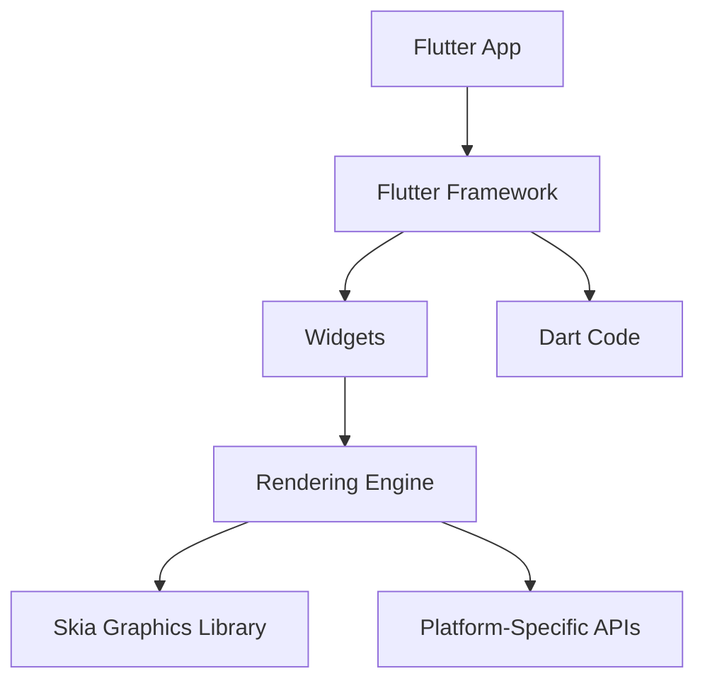

## 1.1.1 What Is Flutter?

Flutter is Google's open-source UI toolkit designed for crafting natively compiled applications for mobile, web, and desktop from a single codebase. It stands out in the app development landscape by offering a comprehensive solution that simplifies the development process while delivering high-performance applications with a rich user interface.

### Definition and Overview

At its core, Flutter is a framework that allows developers to build applications that run on multiple platforms without the need to maintain separate codebases for each. This capability is achieved through Flutter's unique architecture, which includes a rendering engine, a rich set of pre-designed widgets, and the Dart programming language.

- **Primary Purpose:** Flutter's primary goal is to enable developers to create visually appealing and highly performant applications with ease. By using a single codebase, developers can target Android, iOS, web, and desktop platforms, significantly reducing development time and effort.
- **Simplifying Development:** Flutter simplifies the app development process by providing a reactive framework that allows developers to build UIs declaratively. This means that developers describe what the UI should look like in a given state, and Flutter takes care of updating the UI when the state changes.

### Core Components

Flutter's architecture is built on several key components that work together to deliver a seamless development experience:

- **Flutter Engine:** The engine is responsible for rendering the UI and handling input. It is built using C++ and provides low-level rendering support using the Skia graphics library. The engine also interfaces with platform-specific APIs, allowing Flutter apps to access device features.
- **Widgets:** Flutter's UI is built using widgets, which are the building blocks of a Flutter application. Widgets describe how the UI should look and behave. Flutter provides a rich set of pre-designed widgets that adhere to Material Design and Cupertino (iOS-style) guidelines, allowing developers to create beautiful interfaces with ease.
- **Dart Programming Language:** Dart is the language used to write Flutter applications. It is an object-oriented, class-based language with a syntax similar to JavaScript. Dart is designed for building high-performance applications and is compiled to native code, which contributes to Flutter's fast execution.

Here is a visual representation of Flutter's architecture:



### Historical Context

Flutter's journey began with its initial release in May 2017. Since then, it has undergone significant evolution, marked by several major milestones:

- **Initial Release (2017):** Flutter was introduced at Google I/O 2017, showcasing its potential to build beautiful, high-performance apps.
- **Flutter 1.0 (2018):** The first stable release of Flutter was launched in December 2018, marking its readiness for production use.
- **Flutter for Web and Desktop (2019):** Google announced support for web and desktop platforms, expanding Flutter's reach beyond mobile.
- **Flutter 2.0 (2021):** This release brought full support for web and desktop, making Flutter a truly cross-platform framework.

Flutter's rapid adoption and continuous improvement have positioned it as a leading choice for developers seeking a versatile and efficient development framework.

### Comparison with Other Frameworks

To understand Flutter's unique position in the development ecosystem, it's helpful to compare it with other popular frameworks like React Native and Xamarin:

- **React Native:** Developed by Facebook, React Native allows developers to build mobile apps using JavaScript and React. While it offers a similar cross-platform capability, React Native relies on native components, which can lead to inconsistencies across platforms.
- **Xamarin:** A Microsoft-owned framework that uses C# and .NET to build cross-platform apps. Xamarin provides a more integrated experience with the Microsoft ecosystem but can be less flexible in terms of UI customization compared to Flutter.

**Why Flutter Stands Out:**

- **Single Codebase:** Unlike some frameworks that require separate codebases for different platforms, Flutter uses a single codebase for all platforms.
- **Rich UI Components:** Flutter's extensive widget library allows for highly customizable and visually appealing UIs.
- **Performance:** Flutter apps are compiled to native code, ensuring smooth performance and fast startup times.
- **Hot Reload:** This feature allows developers to see changes in real-time without restarting the app, significantly speeding up the development process.

### Practical Code Example

To illustrate Flutter's simplicity and power, let's look at a basic Flutter application that displays a "Hello, World!" message:

```dart
import 'package:flutter/material.dart';

void main() => runApp(MyApp());

class MyApp extends StatelessWidget {
  @override
  Widget build(BuildContext context) {
    return MaterialApp(
      home: Scaffold(
        appBar: AppBar(
          title: Text('Welcome to Flutter'),
        ),
        body: Center(
          child: Text('Hello, World!'),
        ),
      ),
    );
  }
}
```

**Code Explanation:**

- **`main()` Function:** The entry point of the application, which calls `runApp()` to start the app.
- **`MyApp` Class:** A stateless widget that represents the app itself.
- **`MaterialApp`:** A convenience widget that wraps several widgets commonly required for Material Design applications.
- **`Scaffold`:** Provides a basic structure for the app, including an app bar and a body.
- **`AppBar` and `Text`:** Widgets used to display a title and a message, respectively.

### Real-World Scenarios

Flutter's versatility makes it suitable for a wide range of applications, from simple mobile apps to complex enterprise solutions. Here are a few scenarios where Flutter excels:

- **Startups:** Flutter's rapid development cycle and cost-effectiveness make it an ideal choice for startups looking to launch their products quickly.
- **Enterprise Applications:** With its ability to deliver consistent performance across platforms, Flutter is well-suited for enterprise apps that require a uniform user experience.
- **Prototyping:** Flutter's hot reload feature allows for quick iteration, making it perfect for prototyping and experimenting with new ideas.

### Best Practices and Challenges

While Flutter offers numerous advantages, developers should be aware of some common challenges and best practices:

- **State Management:** Managing state in Flutter can be complex, especially for large applications. It's important to choose the right state management solution, such as Provider or Bloc, based on the app's requirements.
- **Platform-Specific Features:** While Flutter provides a unified codebase, accessing platform-specific features may require additional plugins or native code integration.
- **Performance Optimization:** Although Flutter is designed for high performance, developers should still follow best practices for optimizing app performance, such as minimizing widget rebuilds and using efficient data structures.

### Further Resources

For those interested in diving deeper into Flutter, here are some recommended resources:

- **Official Flutter Documentation:** [Flutter.dev](https://flutter.dev/docs)
- **Dart Programming Language:** [Dart.dev](https://dart.dev)
- **Flutter Community:** [Flutter Community on Medium](https://medium.com/flutter-community)
- **Books:** "Flutter for Beginners" by Alessandro Biessek
- **Online Courses:** "The Complete Flutter Development Bootcamp with Dart" on Udemy

### Conclusion

Flutter represents a significant advancement in cross-platform app development, offering a powerful toolkit for building high-quality applications with a single codebase. Its combination of a rich widget library, fast performance, and ease of use makes it an attractive choice for developers worldwide. As you continue your journey with Flutter, remember to explore its vast ecosystem and leverage its capabilities to create innovative and impactful applications.

## Quiz Time!



### What is Flutter primarily used for?

- [x] Building natively compiled applications for mobile, web, and desktop from a single codebase
- [ ] Creating server-side applications
- [ ] Designing hardware components
- [ ] Developing operating systems

> **Explanation:** Flutter is a UI toolkit for building natively compiled applications for mobile, web, and desktop from a single codebase.

### Which language is used to write Flutter applications?

- [x] Dart
- [ ] JavaScript
- [ ] Python
- [ ] Swift

> **Explanation:** Flutter applications are written in Dart, a language designed for building high-performance applications.

### What is the primary purpose of Flutter's widgets?

- [x] To describe how the UI should look and behave
- [ ] To manage application state
- [ ] To handle network requests
- [ ] To perform database operations

> **Explanation:** Widgets in Flutter describe the UI's appearance and behavior.

### What is the role of the Flutter engine?

- [x] Rendering the UI and handling input
- [ ] Managing application state
- [ ] Performing network operations
- [ ] Compiling Dart code

> **Explanation:** The Flutter engine is responsible for rendering the UI and handling input.

### Which graphics library does Flutter use for rendering?

- [x] Skia
- [ ] OpenGL
- [ ] DirectX
- [ ] Vulkan

> **Explanation:** Flutter uses the Skia graphics library for rendering.

### What feature of Flutter allows developers to see changes in real-time?

- [x] Hot Reload
- [ ] Cold Start
- [ ] Live Update
- [ ] Instant Refresh

> **Explanation:** Hot Reload allows developers to see changes in real-time without restarting the app.

### When was Flutter's first stable release?

- [x] December 2018
- [ ] May 2017
- [ ] March 2019
- [ ] January 2020

> **Explanation:** Flutter's first stable release was in December 2018.

### What is a key advantage of using Flutter over other frameworks?

- [x] Single codebase for all platforms
- [ ] Requires separate codebases for each platform
- [ ] Limited to mobile development
- [ ] Only supports web applications

> **Explanation:** Flutter allows developers to use a single codebase for all platforms, unlike some other frameworks.

### Which company developed Flutter?

- [x] Google
- [ ] Facebook
- [ ] Microsoft
- [ ] Apple

> **Explanation:** Flutter was developed by Google.

### True or False: Flutter can only be used for mobile app development.

- [ ] True
- [x] False

> **Explanation:** Flutter can be used for mobile, web, and desktop app development.


