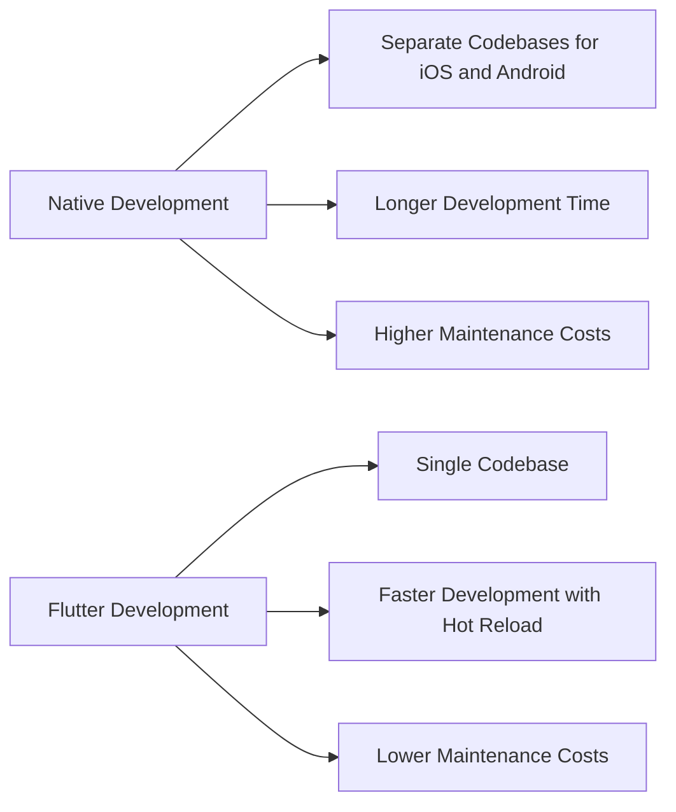

## 1.1.2 Why Choose Flutter?

In the rapidly evolving world of mobile app development, choosing the right framework can significantly impact the success of your project. Flutter, an open-source UI software development toolkit created by Google, has emerged as a popular choice for developers aiming to build high-performance, cross-platform applications. In this section, we'll delve into the key reasons why Flutter stands out as a preferred framework for modern app development.

### Performance Benefits

One of the most compelling reasons to choose Flutter is its exceptional performance. Unlike many other cross-platform frameworks, Flutter does not rely on a JavaScript bridge to communicate with native components. Instead, it uses Dart, a language that compiles directly to native machine code. This compiled nature ensures that Flutter apps run with near-native performance, providing a smooth and responsive user experience.

Flutter's performance is further enhanced by the Skia graphics engine, which powers its rendering capabilities. Skia is a fast and efficient 2D graphics library that allows Flutter to redraw the UI at 60 frames per second or more, ensuring fluid animations and transitions. This capability is crucial for creating visually appealing applications that feel natural and engaging to users.

### Single Codebase for Multiple Platforms

One of Flutter's standout features is its ability to maintain a single codebase for multiple platforms, including Android, iOS, web, and desktop. This cross-platform capability significantly reduces development time and costs, as developers can write code once and deploy it across various platforms without the need for extensive modifications.

This efficiency is particularly beneficial for startups and small teams with limited resources, as it allows them to reach a broader audience without the overhead of managing separate codebases for each platform. Additionally, maintaining a single codebase simplifies updates and bug fixes, ensuring a consistent user experience across all devices.

### Hot Reload Feature

Flutter's hot reload feature is a game-changer for developers, enhancing the development workflow by allowing real-time updates to the application without restarting it. With hot reload, developers can make changes to the code and instantly see the results in the running app. This capability not only speeds up the development process but also encourages experimentation and creativity, as developers can quickly iterate on their designs and features.

The hot reload feature is particularly useful for UI development, where small tweaks and adjustments are often necessary to achieve the desired look and feel. By providing immediate feedback, hot reload empowers developers to fine-tune their applications with ease.

### Rich Widget Library

Flutter boasts an extensive collection of customizable widgets that adhere to both Material Design and Cupertino (iOS) standards. This rich widget library enables developers to create aesthetically pleasing and platform-specific user interfaces with minimal effort. Whether you're building an app that follows Google's Material Design guidelines or one that mimics the look and feel of iOS, Flutter's widgets provide the flexibility and functionality needed to achieve your design goals.

The widget-based architecture of Flutter also promotes code reusability and modularity. Developers can create custom widgets and reuse them throughout their applications, leading to cleaner and more maintainable codebases. This approach aligns with modern software development practices, emphasizing the importance of component-based design.

### Community and Ecosystem

The strength of any development framework lies in its community and ecosystem, and Flutter excels in both areas. Since its introduction, Flutter has garnered a vibrant and growing community of developers, contributing to a wealth of resources, tutorials, and open-source projects. This active community support makes it easier for newcomers to get started with Flutter and for experienced developers to find solutions to complex problems.

In addition to community support, Flutter benefits from a rich ecosystem of packages and plugins available through the [pub.dev](https://pub.dev/) repository. These packages extend Flutter's capabilities, providing functionality for everything from state management and networking to animations and data persistence. By leveraging these packages, developers can accelerate their development process and focus on building unique features for their applications.

### Visual Comparison: Flutter vs. Native Development

To better understand the advantages of Flutter, let's compare it with traditional native development using a flowchart:

This diagram illustrates how Flutter streamlines the development process by consolidating codebases and reducing both development time and maintenance costs. The benefits of a single codebase and hot reload are clear, making Flutter an attractive choice for developers seeking efficiency and agility.

### Conclusion

Choosing Flutter for your app development projects offers numerous advantages, from high performance and cross-platform capabilities to a rich widget library and strong community support. By leveraging these benefits, developers can create stunning, responsive applications that run seamlessly across multiple platforms. As you embark on your Flutter journey, remember to explore the vast ecosystem of resources and tools available to enhance your development experience.

For further exploration, consider diving into the official [Flutter documentation](https://flutter.dev/docs), participating in community forums, and experimenting with open-source projects. By engaging with the Flutter community and continuously learning, you'll be well-equipped to harness the full potential of this powerful framework.

## Quiz Time!



### What is one of the main reasons Flutter achieves high performance?

- [x] It compiles directly to native machine code.
- [ ] It uses a JavaScript bridge.
- [ ] It relies on third-party libraries for rendering.
- [ ] It only supports simple applications.

> **Explanation:** Flutter achieves high performance by compiling Dart code directly to native machine code, eliminating the need for a JavaScript bridge.

### How does Flutter's single codebase benefit developers?

- [x] It reduces development time and costs.
- [ ] It requires separate teams for each platform.
- [ ] It limits the app to only one platform.
- [ ] It increases the complexity of the code.

> **Explanation:** A single codebase allows developers to write code once and deploy it across multiple platforms, reducing development time and costs.

### What is the purpose of Flutter's hot reload feature?

- [x] To see changes in real-time without restarting the app.
- [ ] To compile the app faster.
- [ ] To automatically update the app on the app store.
- [ ] To enhance security features.

> **Explanation:** Hot reload allows developers to see changes in real-time without restarting the application, enhancing the development workflow.

### What standards do Flutter's widgets adhere to?

- [x] Material Design and Cupertino (iOS) standards.
- [ ] Only Material Design standards.
- [ ] Only Cupertino (iOS) standards.
- [ ] No specific design standards.

> **Explanation:** Flutter's widgets adhere to both Material Design and Cupertino (iOS) standards, enabling platform-specific UI creation.

### How does the Flutter community benefit developers?

- [x] Provides resources, tutorials, and open-source projects.
- [ ] Limits access to proprietary tools.
- [ ] Requires a subscription for support.
- [ ] Offers no additional resources.

> **Explanation:** The Flutter community provides a wealth of resources, tutorials, and open-source projects, supporting developers in their learning and development efforts.

### What is the role of the Skia graphics engine in Flutter?

- [x] It powers Flutter's rendering capabilities.
- [ ] It compiles Dart code to native code.
- [ ] It manages state across widgets.
- [ ] It provides network connectivity.

> **Explanation:** The Skia graphics engine powers Flutter's rendering capabilities, allowing for smooth and efficient UI rendering.

### What is a key advantage of using Flutter's widget-based architecture?

- [x] Promotes code reusability and modularity.
- [ ] Increases code complexity.
- [ ] Limits customization options.
- [ ] Requires more memory.

> **Explanation:** Flutter's widget-based architecture promotes code reusability and modularity, leading to cleaner and more maintainable codebases.

### What is a common challenge in native development that Flutter addresses?

- [x] Managing separate codebases for iOS and Android.
- [ ] Lack of community support.
- [ ] Limited access to device features.
- [ ] Inability to create complex UIs.

> **Explanation:** Flutter addresses the challenge of managing separate codebases for iOS and Android by providing a single codebase for multiple platforms.

### How does Flutter's ecosystem of packages and plugins benefit developers?

- [x] Extends Flutter's capabilities with additional functionality.
- [ ] Limits the app to basic features.
- [ ] Requires manual integration of each package.
- [ ] Offers no additional benefits.

> **Explanation:** Flutter's ecosystem of packages and plugins extends its capabilities, providing additional functionality for various app features.

### True or False: Flutter's hot reload feature requires restarting the application to see changes.

- [ ] True
- [x] False

> **Explanation:** False. Flutter's hot reload feature allows developers to see changes in real-time without restarting the application.


