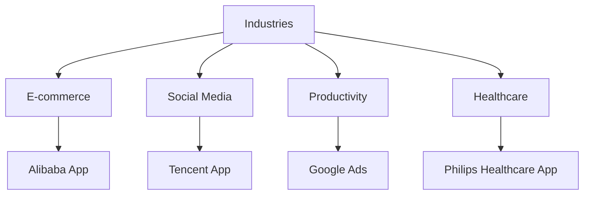

---

linkTitle: "1.1.3 Flutter in the Industry"
title: "Flutter in the Industry: Revolutionizing App Development Across Industries"
description: "Explore how Flutter is transforming app development across various industries, with insights into its adoption by major companies, diverse application use cases, and success stories."
categories:
- Flutter Development
- Mobile App Development
- Cross-Platform Solutions
tags:
- Flutter
- Cross-Platform Development
- Mobile Apps
- Industry Adoption
- Case Studies
date: 2024-10-25
type: docs
nav_weight: 113000
---

## 1.1.3 Flutter in the Industry

Flutter, Google's open-source UI toolkit, has rapidly gained traction in the app development industry due to its ability to create natively compiled applications for mobile, web, and desktop from a single codebase. This section delves into how Flutter is being adopted by major companies, the diverse range of applications it supports, and the success stories that highlight its impact on the industry.

### Adoption by Major Companies

Flutter's robust framework and ease of use have attracted numerous high-profile companies across various sectors. Here are some notable examples:

- **Google:** As the creator of Flutter, Google uses it extensively within its ecosystem. One of the most prominent applications is **Google Ads**, which leverages Flutter to provide a seamless user experience across devices, ensuring that advertisers can manage their campaigns efficiently.

- **Alibaba:** The Chinese e-commerce giant adopted Flutter to power parts of its app, which serves millions of users. Flutter's ability to deliver high-performance applications with a consistent look and feel across platforms was a key factor in Alibaba's decision.

- **Tencent:** Known for its popular social media and gaming applications, Tencent has utilized Flutter to enhance its app offerings. The framework's flexibility and performance capabilities allow Tencent to maintain its high standards for user experience.

- **Philips Healthcare:** In the healthcare sector, Philips has employed Flutter to develop applications that require a high degree of reliability and user-friendly interfaces. Flutter's hot reload feature allows for rapid iteration, which is crucial in the healthcare industry.

These companies exemplify how Flutter's capabilities are being leveraged to meet diverse business needs, from e-commerce to healthcare.

### Diverse Application Use Cases

Flutter's versatility is evident in the wide array of applications it supports. Here are some of the key areas where Flutter is making a significant impact:

- **E-commerce Apps:** Companies like Alibaba and JD.com use Flutter to create responsive and visually appealing shopping experiences. Flutter's rich set of pre-designed widgets and smooth animations help in crafting engaging user interfaces that can handle complex data and transactions.

- **Social Media Platforms:** Flutter's ability to handle real-time updates and its efficient rendering engine make it ideal for social media applications. Tencent, for instance, uses Flutter to ensure that its apps can handle high user engagement without compromising on performance.

- **Productivity Tools:** Applications like Google Ads and Reflectly, a popular journaling app, utilize Flutter to provide users with intuitive and efficient tools for managing tasks and personal data. Flutter's cross-platform capabilities ensure that these tools are accessible on any device.

- **Healthcare Applications:** In healthcare, where reliability and user experience are paramount, Flutter is used to develop applications that facilitate patient care and data management. Philips Healthcare's use of Flutter is a testament to its suitability for creating robust healthcare solutions.

### Success Stories and Case Studies

To illustrate Flutter's impact, let's explore a couple of detailed case studies:

#### Case Study 1: Alibaba's E-commerce Platform

**Challenge:** Alibaba needed a solution to unify its mobile app experience across Android and iOS without compromising on performance or user experience.

**Solution:** By adopting Flutter, Alibaba was able to streamline its development process, allowing a single team to work on both platforms simultaneously. Flutter's widget-based architecture enabled Alibaba to maintain a consistent UI and UX across devices.

**Outcome:** The use of Flutter resulted in a significant reduction in development time and costs. The app's performance improved, leading to higher user satisfaction and increased engagement.

#### Case Study 2: Reflectly - A Personal Journaling App

**Challenge:** Reflectly aimed to create a visually appealing and interactive journaling app that could run smoothly on both Android and iOS.

**Solution:** Flutter's rich set of customizable widgets and its ability to deliver high-performance animations made it the perfect choice for Reflectly. The team utilized Flutter's hot reload feature to iterate quickly and refine the app's design.

**Outcome:** Reflectly successfully launched on both platforms with a consistent and engaging user experience. The app's unique design and smooth performance contributed to its rapid growth and popularity among users.

### Visualizing Flutter's Impact Across Industries

To better understand the breadth of Flutter's application across industries, consider the following network diagram:

This diagram illustrates how Flutter is being utilized across different sectors, showcasing its versatility and adaptability.

### Conclusion

Flutter's adoption by major companies and its application across diverse industries underscore its potential as a leading framework for cross-platform app development. Its ability to deliver high-performance applications with a consistent user experience makes it an attractive choice for businesses looking to innovate and streamline their development processes.

As you explore Flutter further, consider how its features can be leveraged to meet the specific needs of your projects. Whether you're building an e-commerce platform, a social media app, or a productivity tool, Flutter offers the tools and flexibility to bring your vision to life.

## Quiz Time!



### Which major company uses Flutter for its Google Ads application?

- [x] Google
- [ ] Alibaba
- [ ] Tencent
- [ ] Philips Healthcare

> **Explanation:** Google, as the creator of Flutter, uses it for its Google Ads application to ensure a seamless user experience across devices.

### What is a key benefit Alibaba experienced by using Flutter?

- [x] Reduced development time and costs
- [ ] Increased hardware requirements
- [ ] Limited platform compatibility
- [ ] Decreased app performance

> **Explanation:** Alibaba experienced reduced development time and costs by using Flutter, allowing a single team to work on both Android and iOS platforms simultaneously.

### Which industry is NOT mentioned as using Flutter in the article?

- [ ] E-commerce
- [ ] Social Media
- [ ] Healthcare
- [x] Automotive

> **Explanation:** The article mentions E-commerce, Social Media, and Healthcare as industries using Flutter, but not the Automotive industry.

### How does Flutter benefit social media platforms like Tencent?

- [x] Handles real-time updates efficiently
- [ ] Requires separate codebases for each platform
- [ ] Limits user engagement
- [ ] Increases development complexity

> **Explanation:** Flutter's efficient rendering engine and ability to handle real-time updates make it ideal for social media platforms like Tencent.

### What feature of Flutter helped Reflectly iterate quickly on their app design?

- [x] Hot reload
- [ ] Limited widget customization
- [ ] Slow compilation times
- [ ] Complex state management

> **Explanation:** Flutter's hot reload feature allows developers to see changes instantly, facilitating rapid iteration and refinement of app design.

### Which diagram type is used to illustrate Flutter's impact across industries?

- [x] Network diagram
- [ ] Pie chart
- [ ] Bar graph
- [ ] Line chart

> **Explanation:** A network diagram is used to show how Flutter is utilized across different industries, highlighting its versatility.

### What is a common use case for Flutter in the healthcare industry?

- [x] Developing applications for patient care and data management
- [ ] Creating video games
- [ ] Building automotive software
- [ ] Designing fashion apps

> **Explanation:** In healthcare, Flutter is used to develop applications that facilitate patient care and data management, requiring reliability and user-friendly interfaces.

### Which company is known for using Flutter in its e-commerce app?

- [x] Alibaba
- [ ] Google
- [ ] Tencent
- [ ] Philips Healthcare

> **Explanation:** Alibaba uses Flutter in its e-commerce app to provide a responsive and visually appealing shopping experience.

### What is a key advantage of using Flutter for productivity tools?

- [x] Cross-platform capabilities
- [ ] Increased development time
- [ ] Limited user interface options
- [ ] Reduced app performance

> **Explanation:** Flutter's cross-platform capabilities ensure that productivity tools are accessible on any device, enhancing user experience.

### True or False: Flutter is only suitable for mobile app development.

- [ ] True
- [x] False

> **Explanation:** False. Flutter is suitable for mobile, web, and desktop app development, providing a versatile framework for various platforms.


