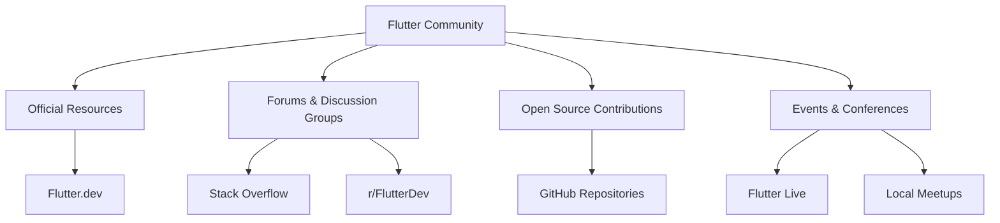

## 1.1.4 The Flutter Community

The Flutter community is a vibrant and dynamic ecosystem that plays a crucial role in the growth and success of Flutter as a leading framework for building cross-platform applications. This community is composed of developers, designers, educators, and enthusiasts who contribute to the framework's development, share knowledge, and support each other in various ways. In this section, we will explore the different facets of the Flutter community, including official resources, forums, open-source contributions, and events that provide opportunities for learning and networking.

### Community Resources

The Flutter community is supported by a wealth of resources that are essential for both beginners and experienced developers. These resources provide comprehensive information, tutorials, and documentation to help you get started with Flutter and deepen your understanding as you progress.

- **Flutter.dev:** The official Flutter website is the primary source of information about Flutter. It offers a wide range of resources, including tutorials, sample projects, and the latest news about Flutter updates and releases. The website is designed to cater to developers at all levels, providing easy access to everything you need to build Flutter applications.

- **Flutter Documentation:** The official documentation is an invaluable resource for understanding the intricacies of Flutter. It covers everything from basic concepts to advanced topics, offering detailed explanations and code examples. The documentation is continuously updated to reflect the latest changes in the framework, ensuring that developers have access to the most current information.

- **Flutter YouTube Channel:** The Flutter team maintains an active YouTube channel that features a variety of content, including tutorials, talks, and live coding sessions. This channel is a great way to learn from Flutter experts and stay updated on the latest developments in the Flutter ecosystem.

### Forums and Discussion Groups

Engaging with the community through forums and discussion groups is an excellent way to seek help, share knowledge, and connect with other Flutter developers. These platforms provide a space for developers to ask questions, discuss challenges, and share their experiences.

- **Stack Overflow:** As one of the most popular platforms for developers, Stack Overflow has a dedicated section for Flutter-related questions. Here, you can find answers to common issues, ask your own questions, and contribute by helping others solve their problems.

- **Reddit's r/FlutterDev:** This subreddit is a vibrant community where Flutter developers share news, tutorials, and personal projects. It's a great place to engage in discussions about Flutter, get feedback on your work, and stay informed about the latest trends in the Flutter world.

- **Flutter Community Slack Group:** The Flutter Community Slack group is an informal space where developers can chat in real-time. It offers various channels dedicated to different topics, allowing you to connect with others who share your interests and challenges.

### Open Source Contributions

Contributing to Flutter's open-source development is a rewarding way to give back to the community and improve your skills. The Flutter framework is open-source, and contributions from the community are vital to its growth and success.

- **GitHub Repositories:** The Flutter codebase is hosted on GitHub, where you can explore the source code, report issues, and submit pull requests. Contributing to the Flutter repositories is an excellent way to learn more about the framework's inner workings and collaborate with other developers.

- **Developing Packages and Plugins:** The Flutter ecosystem is enriched by a wide variety of packages and plugins that extend its functionality. By developing and sharing your own packages, you can contribute to the community and help other developers build better apps.

- **Reporting Issues and Providing Feedback:** Even if you're not ready to contribute code, you can still help by reporting bugs, suggesting improvements, and providing feedback on existing features. This input is invaluable to the Flutter team and helps shape the future of the framework.

### Meetups and Conferences

Attending meetups and conferences is a fantastic way to learn from experts, network with other developers, and stay updated on the latest developments in the Flutter ecosystem. These events offer a mix of technical sessions, workshops, and networking opportunities.

- **Flutter Live:** Flutter Live is a major event organized by the Flutter team, featuring keynotes, technical sessions, and announcements about new features and releases. It's an excellent opportunity to learn from the Flutter team and connect with other developers from around the world.

- **Local Meetups:** Many cities host local Flutter meetups where developers can gather to share knowledge, discuss projects, and collaborate on solutions. These meetups are a great way to build connections within your local community and learn from others' experiences.

- **Online Webinars:** In addition to in-person events, there are numerous online webinars and virtual conferences that provide access to Flutter content from the comfort of your home. These events often feature talks from industry experts and offer interactive sessions where you can ask questions and engage with the speakers.

### Visualizing the Flutter Community Structure

To better understand the structure of the Flutter community, let's take a look at a diagram that illustrates the various components and how they are interconnected:

This diagram highlights the key areas of the Flutter community, showing how official resources, forums, open-source contributions, and events all play a role in supporting and growing the community.

### Best Practices and Tips for Engaging with the Community

- **Be Active and Engaged:** Participate in discussions, ask questions, and share your knowledge. The more you engage with the community, the more you'll learn and grow as a developer.

- **Contribute to Open Source:** Whether it's by submitting code, reporting issues, or providing feedback, your contributions are valuable and help improve the Flutter framework for everyone.

- **Attend Events and Meetups:** Take advantage of the learning and networking opportunities offered by meetups and conferences. These events are a great way to connect with other developers and stay informed about the latest trends in Flutter development.

- **Stay Updated:** Follow the official Flutter channels, subscribe to newsletters, and keep an eye on community forums to stay informed about new releases, features, and best practices.

- **Be Respectful and Supportive:** The Flutter community is built on collaboration and mutual support. Be respectful of others' opinions, offer help when you can, and celebrate the successes of your fellow developers.

### Conclusion

The Flutter community is a diverse and dynamic ecosystem that offers a wealth of resources, support, and opportunities for developers at all levels. By engaging with the community, you can enhance your skills, contribute to the growth of the framework, and build valuable connections with other developers. Whether you're just starting with Flutter or are an experienced developer, the community is here to support you on your journey.

## Quiz Time!



### Which of the following is an official resource for Flutter developers?

- [x] Flutter.dev
- [ ] Stack Overflow
- [ ] r/FlutterDev
- [ ] GitHub Repositories

> **Explanation:** Flutter.dev is the official website for Flutter, providing comprehensive resources and documentation for developers.

### What is the primary purpose of the Flutter Community Slack group?

- [ ] To host official Flutter documentation
- [x] To provide a space for real-time chat and discussion among developers
- [ ] To organize Flutter conferences
- [ ] To publish Flutter release notes

> **Explanation:** The Flutter Community Slack group is an informal space for developers to chat in real-time and discuss various topics related to Flutter.

### How can developers contribute to Flutter's open-source development?

- [x] By submitting pull requests to the Flutter GitHub repositories
- [ ] By attending Flutter conferences
- [ ] By posting on Stack Overflow
- [ ] By joining the Flutter Community Slack group

> **Explanation:** Developers can contribute to Flutter's open-source development by submitting pull requests to the Flutter GitHub repositories, where the source code is hosted.

### Which platform is known for hosting questions and answers related to Flutter development?

- [ ] r/FlutterDev
- [x] Stack Overflow
- [ ] Flutter.dev
- [ ] GitHub Repositories

> **Explanation:** Stack Overflow is a popular platform for hosting questions and answers related to Flutter development, where developers can seek help and share knowledge.

### What type of events are Flutter Live and local meetups?

- [x] Conferences and gatherings for learning and networking
- [ ] Online forums for discussion
- [ ] GitHub repositories for code contributions
- [ ] Official documentation resources

> **Explanation:** Flutter Live and local meetups are conferences and gatherings that provide opportunities for learning and networking among Flutter developers.

### Which of the following is a benefit of attending Flutter meetups and conferences?

- [x] Networking with other developers
- [ ] Access to official Flutter documentation
- [ ] Real-time chat with developers
- [ ] Submitting code to GitHub repositories

> **Explanation:** Attending Flutter meetups and conferences provides opportunities for networking with other developers and learning from experts in the field.

### What is the role of the Flutter YouTube channel?

- [ ] To host real-time chat discussions
- [ ] To organize local meetups
- [x] To provide tutorials, talks, and live coding sessions
- [ ] To publish official documentation

> **Explanation:** The Flutter YouTube channel provides tutorials, talks, and live coding sessions, helping developers learn from experts and stay updated on Flutter developments.

### How can developers stay updated on the latest Flutter releases and features?

- [x] By following official Flutter channels and subscribing to newsletters
- [ ] By only attending local meetups
- [ ] By contributing to GitHub repositories
- [ ] By joining the Flutter Community Slack group

> **Explanation:** Developers can stay updated on the latest Flutter releases and features by following official Flutter channels and subscribing to newsletters.

### What is a key benefit of contributing to Flutter's open-source development?

- [x] Improving your skills and collaborating with other developers
- [ ] Gaining access to exclusive Flutter events
- [ ] Receiving official Flutter merchandise
- [ ] Hosting your own Flutter conference

> **Explanation:** Contributing to Flutter's open-source development helps improve your skills and provides opportunities to collaborate with other developers.

### True or False: The Flutter community is only for experienced developers.

- [ ] True
- [x] False

> **Explanation:** False. The Flutter community is open to developers at all levels, offering resources and support for both beginners and experienced developers.


