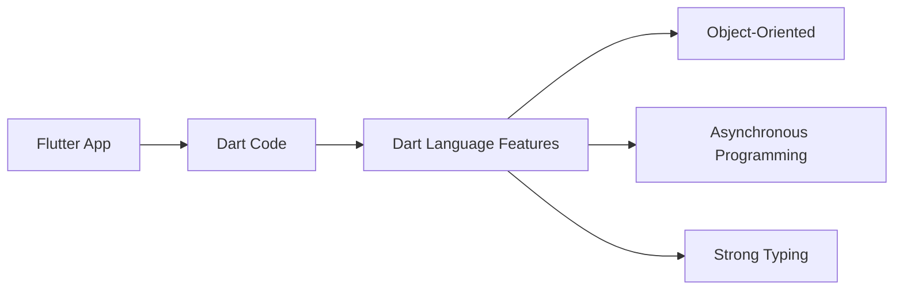

## 1.2.1 Introduction to Dart

Dart is a versatile, client-optimized programming language developed by Google, designed to build fast applications across various platforms, including mobile, desktop, server, and web. As the backbone of Flutter, Dart empowers developers to create high-performance applications with a rich set of features. In this section, we will delve into what makes Dart an essential component of Flutter, explore its syntax, and understand its role in the Flutter ecosystem.

### What is Dart?

Dart is a modern programming language that emphasizes simplicity, efficiency, and scalability. It was introduced by Google in 2011 and has since evolved to become the primary language for Flutter, Google's UI toolkit for crafting natively compiled applications. Dart's design focuses on providing a productive environment for developers, with features that support both small scripts and large, complex applications.

#### Key Characteristics of Dart:

- **Client-Optimized:** Dart is designed to deliver high-performance applications on client devices, making it ideal for mobile and web development.
- **Cross-Platform:** With Dart, developers can write code once and deploy it across multiple platforms, including Android, iOS, web, and desktop.
- **Rich Standard Library:** Dart comes with a comprehensive standard library that simplifies common programming tasks, such as working with collections, dates, and asynchronous programming.
- **Strong Typing:** Dart supports both static and dynamic typing, allowing developers to choose the level of type safety that suits their needs.
- **Object-Oriented:** Dart is an object-oriented language, supporting classes, interfaces, and mixins, which makes it familiar to developers with experience in languages like Java or C#.

### Role in Flutter

Dart plays a crucial role in the Flutter framework, serving as the language that powers Flutter's reactive programming model. Flutter uses Dart to compile applications into native code, ensuring smooth performance and a seamless user experience. Here are some reasons why Dart is the language of choice for Flutter:

- **Hot Reload:** Dart's architecture enables Flutter's hot reload feature, allowing developers to see changes in real-time without restarting the application. This significantly speeds up the development process and enhances productivity.
- **Ahead-of-Time (AOT) Compilation:** Dart supports AOT compilation, which converts Dart code into native machine code before execution. This results in fast startup times and efficient runtime performance for Flutter apps.
- **Just-in-Time (JIT) Compilation:** During development, Dart uses JIT compilation to provide a dynamic and flexible environment, enabling features like hot reload.
- **Asynchronous Programming:** Dart's support for asynchronous programming, through features like `async` and `await`, allows Flutter apps to handle complex tasks, such as network requests and file I/O, without blocking the user interface.

### Basic Syntax Overview

Dart's syntax is designed to be familiar to developers with experience in other C-style languages, such as Java, JavaScript, or C#. This familiarity makes it easier for developers to transition to Dart and start building applications quickly.

#### Variables and Data Types

Dart supports a variety of data types, including numbers, strings, booleans, lists, and maps. Variables can be declared using the `var` keyword, which allows Dart to infer the type, or by specifying the type explicitly.

```dart
// Using var for type inference
var name = 'Flutter';
var version = 3.0;

// Explicit type declaration
String language = 'Dart';
int year = 2024;
```

#### Control Flow Statements

Dart provides standard control flow statements, such as `if`, `else`, `for`, `while`, and `switch`, allowing developers to implement logic in their applications.

```dart
// Conditional statement
if (version > 2.0) {
  print('Welcome to Flutter 3.0!');
} else {
  print('Upgrade to the latest version.');
}

// Looping through a list
var numbers = [1, 2, 3, 4, 5];
for (var number in numbers) {
  print(number);
}
```

#### Functions and Methods

Functions in Dart are first-class objects, meaning they can be assigned to variables, passed as arguments, and returned from other functions. Dart supports both named and anonymous functions.

```dart
// Named function
int add(int a, int b) {
  return a + b;
}

// Anonymous function
var multiply = (int a, int b) => a * b;

print(add(2, 3)); // Output: 5
print(multiply(4, 5)); // Output: 20
```

#### Object-Oriented Programming

Dart is a fully object-oriented language, supporting classes, inheritance, and interfaces. This allows developers to create reusable and modular code.

```dart
// Defining a class
class Car {
  String make;
  String model;

  Car(this.make, this.model);

  void display() {
    print('Car: $make $model');
  }
}

// Creating an instance
var car = Car('Toyota', 'Corolla');
car.display(); // Output: Car: Toyota Corolla
```

### Dart’s Position within the Flutter Ecosystem

To understand Dart's integral role in Flutter, let's visualize its position within the Flutter ecosystem using a Mermaid.js diagram:



In this diagram, we see how Dart code forms the foundation of a Flutter app, leveraging its language features to build robust, high-performance applications. Dart's object-oriented nature, support for asynchronous programming, and strong typing capabilities are key components that enable Flutter to deliver a seamless development experience.

### Practical Code Examples and Real-World Scenarios

To solidify your understanding of Dart, let's explore some practical examples and real-world scenarios where Dart's features shine.

#### Example 1: Building a Simple Counter App

A common starting point for Flutter developers is the counter app, which demonstrates Dart's syntax and Flutter's reactive model.

```dart
import 'package:flutter/material.dart';

void main() => runApp(MyApp());

class MyApp extends StatelessWidget {
  @override
  Widget build(BuildContext context) {
    return MaterialApp(
      home: Counter(),
    );
  }
}

class Counter extends StatefulWidget {
  @override
  _CounterState createState() => _CounterState();
}

class _CounterState extends State<Counter> {
  int _count = 0;

  void _incrementCounter() {
    setState(() {
      _count++;
    });
  }

  @override
  Widget build(BuildContext context) {
    return Scaffold(
      appBar: AppBar(
        title: Text('Counter App'),
      ),
      body: Center(
        child: Column(
          mainAxisAlignment: MainAxisAlignment.center,
          children: <Widget>[
            Text(
              'You have pushed the button this many times:',
            ),
            Text(
              '$_count',
              style: Theme.of(context).textTheme.headline4,
            ),
          ],
        ),
      ),
      floatingActionButton: FloatingActionButton(
        onPressed: _incrementCounter,
        tooltip: 'Increment',
        child: Icon(Icons.add),
      ),
    );
  }
}
```

In this example, we define a simple counter app using Dart and Flutter. The app consists of a `Counter` widget that maintains a count state, incremented each time the floating action button is pressed. This demonstrates Dart's syntax, state management, and Flutter's widget-based architecture.

#### Example 2: Asynchronous Programming with Dart

Dart's asynchronous programming capabilities are essential for handling tasks like fetching data from the internet. Here's a simple example using Dart's `async` and `await` keywords:

```dart
import 'dart:async';

Future<void> fetchData() async {
  print('Fetching data...');
  await Future.delayed(Duration(seconds: 2));
  print('Data fetched!');
}

void main() {
  fetchData();
  print('This line runs before data is fetched.');
}
```

In this example, we simulate a data fetch operation using `Future.delayed`. The `await` keyword pauses the execution of `fetchData` until the future completes, allowing other code to run in the meantime. This non-blocking behavior is crucial for maintaining a responsive user interface in Flutter apps.

### Best Practices and Common Pitfalls

As you begin your journey with Dart, here are some best practices and common pitfalls to be aware of:

- **Use Strong Typing:** While Dart allows dynamic typing, using strong typing improves code readability and helps catch errors at compile time.
- **Leverage Dart's Standard Library:** Dart's standard library offers a wealth of utilities for common tasks. Familiarize yourself with its capabilities to write efficient code.
- **Avoid Blocking the UI Thread:** Use asynchronous programming to perform long-running tasks without freezing the user interface.
- **Follow Naming Conventions:** Dart follows a consistent naming convention, such as using camelCase for variables and methods. Adhering to these conventions improves code consistency and readability.

### Further Exploration and Resources

To deepen your understanding of Dart and its role in Flutter, consider exploring the following resources:

- **Official Dart Documentation:** [Dart.dev](https://dart.dev) provides comprehensive documentation, tutorials, and guides for learning Dart.
- **Flutter Documentation:** [Flutter.dev](https://flutter.dev) offers extensive resources for building Flutter applications with Dart.
- **Books and Courses:** Consider books like "Dart Apprentice" by Jonathan Sande and Matt Galloway, or online courses on platforms like Udemy and Coursera.
- **Open-Source Projects:** Explore open-source Flutter projects on GitHub to see Dart in action and contribute to the community.

### Conclusion

Dart is a powerful and versatile language that forms the foundation of Flutter development. Its client-optimized nature, combined with features like asynchronous programming and strong typing, make it an ideal choice for building high-performance applications. By understanding Dart's syntax and role within the Flutter ecosystem, you are well-equipped to embark on your journey of creating innovative and responsive applications.

## Quiz Time!



### What is Dart primarily used for?

- [x] Building mobile, desktop, server, and web applications
- [ ] Creating operating systems
- [ ] Designing hardware components
- [ ] Developing databases

> **Explanation:** Dart is a client-optimized language developed by Google, primarily used for building applications across various platforms, including mobile, desktop, server, and web.

### How does Dart contribute to Flutter's performance?

- [x] By enabling AOT and JIT compilation
- [ ] By providing a graphical user interface
- [ ] By managing network requests
- [ ] By handling database operations

> **Explanation:** Dart contributes to Flutter's performance through Ahead-of-Time (AOT) and Just-in-Time (JIT) compilation, which optimize the execution of Flutter applications.

### Which feature of Dart allows for non-blocking UI operations?

- [x] Asynchronous programming
- [ ] Object-oriented programming
- [ ] Strong typing
- [ ] Dynamic typing

> **Explanation:** Dart's asynchronous programming capabilities, using `async` and `await`, allow for non-blocking operations, ensuring a responsive user interface.

### What is the purpose of the `setState` method in Flutter?

- [x] To update the UI when the state changes
- [ ] To initialize the application
- [ ] To compile the Dart code
- [ ] To manage network requests

> **Explanation:** The `setState` method in Flutter is used to update the UI in response to changes in the state of a StatefulWidget.

### Which of the following is a key characteristic of Dart?

- [x] Client-optimized
- [ ] Server-exclusive
- [x] Cross-platform
- [ ] Hardware-dependent

> **Explanation:** Dart is client-optimized and cross-platform, making it suitable for building applications across various devices and platforms.

### What does the `await` keyword do in Dart?

- [x] Pauses the execution until a future completes
- [ ] Declares a variable
- [ ] Defines a class
- [ ] Compiles the code

> **Explanation:** The `await` keyword in Dart pauses the execution of a function until the associated future completes, allowing for asynchronous operations.

### Which statement is true about Dart's typing system?

- [x] It supports both static and dynamic typing
- [ ] It only supports dynamic typing
- [x] It allows for strong typing
- [ ] It does not support type inference

> **Explanation:** Dart supports both static and dynamic typing, allowing developers to choose the level of type safety, and it also supports strong typing and type inference.

### What is the role of Dart in the Flutter ecosystem?

- [x] It serves as the programming language for Flutter
- [ ] It provides the graphical user interface for Flutter
- [ ] It manages the database connections for Flutter
- [ ] It handles the network requests for Flutter

> **Explanation:** Dart serves as the programming language for Flutter, enabling the creation of high-performance applications with a rich set of features.

### Which of the following is a control flow statement in Dart?

- [x] if
- [ ] var
- [ ] class
- [ ] import

> **Explanation:** The `if` statement is a control flow statement in Dart, used to execute code conditionally based on boolean expressions.

### Dart is an object-oriented programming language.

- [x] True
- [ ] False

> **Explanation:** Dart is indeed an object-oriented programming language, supporting classes, interfaces, and other object-oriented principles.


