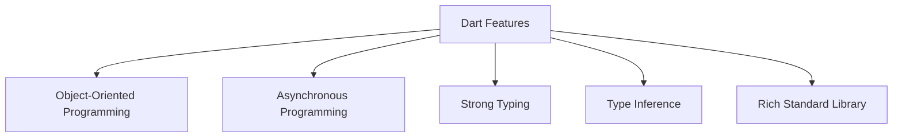

## 1.2.2 Features of Dart

Dart is a versatile and powerful programming language that serves as the backbone of Flutter, enabling developers to build high-performance, cross-platform applications. In this section, we will delve into the key features of Dart that make it an ideal choice for app development, including its object-oriented programming capabilities, support for asynchronous programming, strong typing system, type inference, and a rich standard library.

### Object-Oriented Programming (OOP)

Dart is a fully object-oriented language, which means it is designed around the concept of objects and classes. This paradigm allows developers to create modular, reusable, and maintainable code. Let's explore some of the core OOP features in Dart:

#### Classes and Objects

In Dart, everything is an object, including numbers, functions, and even null. Classes are blueprints for creating objects, encapsulating data for the object and methods to manipulate that data.

```dart
class Animal {
  String name;
  int age;

  Animal(this.name, this.age);

  void speak() {
    print('$name makes a sound.');
  }
}

void main() {
  var dog = Animal('Dog', 3);
  dog.speak(); // Output: Dog makes a sound.
}
```

#### Inheritance

Inheritance allows a class to inherit properties and methods from another class, promoting code reuse and establishing a natural hierarchy.

```dart
class Dog extends Animal {
  Dog(String name, int age) : super(name, age);

  @override
  void speak() {
    print('$name barks.');
  }
}

void main() {
  var dog = Dog('Buddy', 4);
  dog.speak(); // Output: Buddy barks.
}
```

#### Mixins

Mixins provide a way to reuse a class’s code in multiple class hierarchies. They are a powerful feature for adding functionality to classes without using inheritance.

```dart
mixin Swimmer {
  void swim() {
    print('Swimming');
  }
}

class Fish with Swimmer {}

void main() {
  var fish = Fish();
  fish.swim(); // Output: Swimming
}
```

#### Interfaces

Dart does not have a keyword for interfaces. Instead, any class can act as an interface, and other classes can implement it. This allows for defining contracts that classes must adhere to.

```dart
class Flyer {
  void fly();
}

class Bird implements Flyer {
  @override
  void fly() {
    print('Bird is flying.');
  }
}

void main() {
  var bird = Bird();
  bird.fly(); // Output: Bird is flying.
}
```

### Asynchronous Programming

Asynchronous programming is crucial for building responsive applications, especially when dealing with tasks like network requests or file I/O. Dart provides robust support for asynchronous programming through `async`, `await`, and `Future`.

#### Futures

A `Future` represents a potential value or error that will be available at some time in the future. It is used for operations that are completed asynchronously.

```dart
Future<String> fetchData() async {
  return Future.delayed(Duration(seconds: 2), () => 'Data loaded');
}

void main() async {
  print('Fetching data...');
  var data = await fetchData();
  print(data); // Output: Data loaded
}
```

#### Async and Await

The `async` and `await` keywords simplify working with asynchronous code, making it look synchronous and easier to read.

```dart
Future<void> printData() async {
  var data = await fetchData();
  print(data);
}

void main() {
  printData();
}
```

### Strong Typing and Type Inference

Dart is a strongly typed language, meaning that every variable has a type, which can be either explicitly declared or inferred by the compiler.

#### Strong Typing

Strong typing helps catch errors at compile time, making your code more robust and reliable.

```dart
int add(int a, int b) {
  return a + b;
}

void main() {
  print(add(2, 3)); // Output: 5
}
```

#### Type Inference

Dart's type inference reduces boilerplate code by allowing the compiler to infer types based on the assigned values.

```dart
void main() {
  var name = 'Dart'; // Inferred as String
  var version = 2.12; // Inferred as double
  print('Language: $name, Version: $version');
}
```

### Rich Standard Library

Dart comes with a comprehensive standard library that provides a wide range of utilities for data manipulation, collections, and more. This library is essential for building complex applications efficiently.

#### Collections

Dart offers powerful collection classes such as `List`, `Set`, and `Map`, which are used to store and manipulate groups of objects.

```dart
void main() {
  var numbers = [1, 2, 3, 4];
  numbers.add(5);
  print(numbers); // Output: [1, 2, 3, 4, 5]

  var uniqueNumbers = {1, 2, 3, 4};
  uniqueNumbers.add(4); // No effect, as 4 is already present
  print(uniqueNumbers); // Output: {1, 2, 3, 4}

  var person = {'name': 'Alice', 'age': 30};
  print(person['name']); // Output: Alice
}
```

#### String Manipulation

Dart provides a rich set of methods for string manipulation, making it easy to work with text data.

```dart
void main() {
  var greeting = 'Hello, Dart!';
  print(greeting.toUpperCase()); // Output: HELLO, DART!
  print(greeting.contains('Dart')); // Output: true
}
```

#### Date and Time

The `DateTime` class in Dart allows for easy manipulation of dates and times.

```dart
void main() {
  var now = DateTime.now();
  print('Current date and time: $now');

  var specificDate = DateTime(2022, 10, 25);
  print('Specific date: $specificDate');
}
```

### Visualizing Dart's Key Features

To better understand the key features of Dart, let's visualize them using a Mermaid.js diagram:



### Best Practices and Common Pitfalls

- **Embrace OOP Principles:** Utilize classes, inheritance, and mixins to create modular and reusable code. Avoid deep inheritance hierarchies, which can lead to complexity.
- **Handle Asynchronous Code Gracefully:** Use `async` and `await` to manage asynchronous operations. Be mindful of potential deadlocks and race conditions.
- **Leverage Strong Typing:** Take advantage of Dart's strong typing to catch errors early. Use type inference to reduce boilerplate while maintaining type safety.
- **Utilize the Standard Library:** Familiarize yourself with Dart's standard library to avoid reinventing the wheel. Use collections and string manipulation utilities to simplify your code.

### Conclusion

Dart's features make it a powerful language for building modern applications. Its object-oriented nature, support for asynchronous programming, strong typing, type inference, and rich standard library provide developers with the tools needed to create robust and efficient applications. By understanding and leveraging these features, you can write cleaner, more maintainable code and build high-quality applications with Flutter.

### Further Reading and Resources

- [Dart Language Tour](https://dart.dev/guides/language/language-tour)
- [Effective Dart](https://dart.dev/guides/language/effective-dart)
- [Asynchronous Programming: Futures, async, await](https://dart.dev/codelabs/async-await)
- [Dart Standard Library Documentation](https://api.dart.dev/stable/)

## Quiz Time!



### What is a key feature of Dart that supports modular and reusable code?

- [x] Object-Oriented Programming
- [ ] Functional Programming
- [ ] Procedural Programming
- [ ] Logic Programming

> **Explanation:** Dart's object-oriented programming capabilities, including classes, inheritance, and mixins, support modular and reusable code.

### Which keywords are used in Dart for asynchronous programming?

- [x] async and await
- [ ] sync and wait
- [ ] async and defer
- [ ] await and defer

> **Explanation:** Dart uses `async` and `await` keywords to handle asynchronous programming, making it easier to work with asynchronous operations.

### How does Dart's type inference benefit developers?

- [x] Reduces boilerplate code
- [x] Maintains code safety
- [ ] Increases code verbosity
- [ ] Eliminates the need for types

> **Explanation:** Dart's type inference reduces boilerplate code while maintaining code safety by allowing the compiler to infer types based on assigned values.

### What is a `Future` in Dart?

- [x] A potential value or error that will be available in the future
- [ ] A synchronous operation
- [ ] A type of collection
- [ ] A class for handling exceptions

> **Explanation:** A `Future` in Dart represents a potential value or error that will be available at some time in the future, used for asynchronous operations.

### Which of the following is NOT a collection type in Dart?

- [ ] List
- [ ] Set
- [ ] Map
- [x] Array

> **Explanation:** Dart does not have an `Array` type. Instead, it uses `List`, `Set`, and `Map` for collections.

### What is the purpose of mixins in Dart?

- [x] To reuse a class’s code in multiple class hierarchies
- [ ] To define a class without methods
- [ ] To create a new data type
- [ ] To handle exceptions

> **Explanation:** Mixins in Dart allow for code reuse across multiple class hierarchies without using inheritance.

### Which class in Dart is used for date and time manipulation?

- [x] DateTime
- [ ] Date
- [ ] Time
- [ ] Calendar

> **Explanation:** The `DateTime` class in Dart is used for manipulating dates and times.

### What is a common pitfall when using asynchronous programming in Dart?

- [x] Potential deadlocks and race conditions
- [ ] Increased code readability
- [ ] Reduced code execution speed
- [ ] Simplified error handling

> **Explanation:** A common pitfall in asynchronous programming is the potential for deadlocks and race conditions, which can occur if asynchronous operations are not managed properly.

### How can you define an interface in Dart?

- [x] By using a class and implementing it
- [ ] By using the `interface` keyword
- [ ] By using the `abstract` keyword
- [ ] By using the `mixin` keyword

> **Explanation:** In Dart, any class can act as an interface, and other classes can implement it, defining the required methods.

### True or False: Dart's standard library provides utilities for both data manipulation and collections.

- [x] True
- [ ] False

> **Explanation:** True. Dart's standard library includes a wide range of utilities for data manipulation and collections, making it easier to build complex applications.


