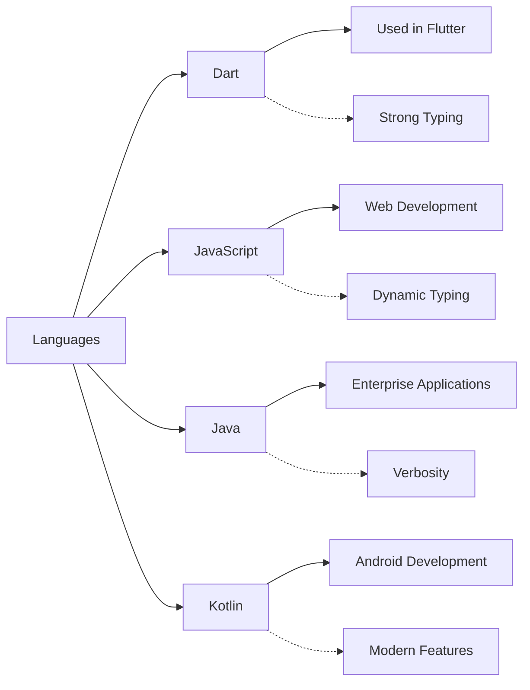

## 1.2.3 Dart vs. Other Languages

As you embark on your journey to master Flutter, understanding the Dart programming language is crucial. Dart is the backbone of Flutter, providing the tools and features necessary to build beautiful, high-performance applications. However, to appreciate Dart's strengths and unique characteristics, it's helpful to compare it with other popular programming languages such as JavaScript, Java, and Kotlin. This comparison will not only highlight Dart's capabilities but also provide insights into why it is the preferred choice for Flutter development.

### Comparison with JavaScript

JavaScript is a cornerstone of web development, powering countless websites and applications. While Dart and JavaScript share some similarities, they also have distinct differences that set them apart.

#### Syntax Similarities and Differences

Both Dart and JavaScript have C-style syntax, which makes them relatively easy to learn for developers familiar with languages like C, C++, or Java. However, there are notable differences:

- **Typing System:** Dart is a statically typed language, meaning that variable types are known at compile time. This allows for better performance and error checking before runtime. In contrast, JavaScript is dynamically typed, which can lead to runtime errors if not carefully managed.

  ```dart
  // Dart Example
  int number = 42; // Statically typed
  ```

  ```javascript
  // JavaScript Example
  let number = 42; // Dynamically typed
  ```

- **Performance:** Dart's static typing and ahead-of-time (AOT) compilation contribute to its superior performance in mobile applications compared to JavaScript, which relies on just-in-time (JIT) compilation.

#### Use Cases

- **Dart in Flutter:** Dart is the primary language for Flutter, enabling developers to create cross-platform mobile applications with a single codebase. Its performance and expressive syntax make it ideal for building complex, high-performance apps.

- **JavaScript for Web Development:** JavaScript remains the dominant language for web development, supported by a vast ecosystem of libraries and frameworks like React, Angular, and Vue.js. While Dart can be used for web development, it is not as widely adopted as JavaScript in this domain.

### Comparison with Java

Java is a long-standing language known for its robustness and widespread use in enterprise applications. Comparing Dart with Java reveals several key differences and advantages.

#### Verbosity

Java is often criticized for its verbosity, requiring more lines of code to accomplish tasks that can be done more concisely in Dart.

- **Dart's Conciseness:** Dart's syntax is more concise, allowing developers to write less code to achieve the same functionality. This can lead to faster development times and easier maintenance.

  ```dart
  // Dart Example
  void greet(String name) => print('Hello, $name!');
  ```

  ```java
  // Java Example
  public void greet(String name) {
      System.out.println("Hello, " + name + "!");
  }
  ```

#### Modern Features

Dart supports modern programming features that enhance developer productivity and code readability:

- **Async/Await:** Dart's async/await syntax simplifies asynchronous programming, making it easier to write and understand asynchronous code.

  ```dart
  // Dart Example
  Future<void> fetchData() async {
    var data = await fetchFromServer();
    print(data);
  }
  ```

- **First-Class Functions:** Dart treats functions as first-class citizens, allowing them to be assigned to variables, passed as arguments, and returned from other functions.

### Comparison with Kotlin

Kotlin has gained popularity as a modern language for Android development, offering features that improve upon Java. Dart and Kotlin share some similarities but also have distinct differences.

#### Interoperability

- **Kotlin for Android Development:** Kotlin is fully interoperable with Java, making it an excellent choice for Android development. It allows developers to use existing Java libraries and frameworks seamlessly.

- **Dart for Cross-Platform Apps:** Dart provides a unified language for building cross-platform applications with Flutter. This eliminates the need for separate codebases for Android and iOS, streamlining development and reducing maintenance overhead.

#### Language Features

- **Null Safety:** Both Dart and Kotlin offer null safety, reducing the risk of null pointer exceptions by ensuring that variables cannot be null unless explicitly declared.

  ```dart
  // Dart Example
  String? name; // Nullable variable
  ```

  ```kotlin
  // Kotlin Example
  var name: String? = null // Nullable variable
  ```

- **Extension Functions:** Both languages support extension functions, allowing developers to add new functionality to existing classes without modifying their source code.

  ```dart
  // Dart Example
  extension StringExtension on String {
    String get reversed => split('').reversed.join();
  }
  ```

  ```kotlin
  // Kotlin Example
  fun String.reversed(): String = this.reversed()
  ```

### Visual Comparison Using Mermaid.js

To better understand the relationships and unique features of these languages, let's visualize them using a Mermaid.js diagram:



### Conclusion

Dart stands out as a powerful language for cross-platform app development, offering a blend of performance, modern features, and ease of use. While JavaScript, Java, and Kotlin each have their strengths and specific use cases, Dart's integration with Flutter makes it an excellent choice for developers looking to build high-quality mobile applications efficiently.

By understanding the differences and similarities between Dart and these other languages, you can make informed decisions about which language best suits your project's needs. As you continue your journey with Flutter, you'll find that Dart's capabilities and features provide a solid foundation for creating innovative and engaging applications.

### Further Reading and Resources

- [Dart Programming Language Documentation](https://dart.dev/guides)
- [Flutter Official Website](https://flutter.dev)
- [JavaScript MDN Web Docs](https://developer.mozilla.org/en-US/docs/Web/JavaScript)
- [Java Documentation](https://docs.oracle.com/en/java/)
- [Kotlin Documentation](https://kotlinlang.org/docs/home.html)

These resources will provide you with deeper insights into each language and help you explore their features and capabilities further.

## Quiz Time!



### Which language is primarily used for web development?

- [ ] Dart
- [x] JavaScript
- [ ] Java
- [ ] Kotlin

> **Explanation:** JavaScript is primarily used for web development, supported by frameworks like React, Angular, and Vue.js.

### What type of typing does Dart use?

- [x] Static Typing
- [ ] Dynamic Typing
- [ ] Weak Typing
- [ ] No Typing

> **Explanation:** Dart uses static typing, meaning variable types are known at compile time, which helps with performance and error checking.

### Which language is known for its verbosity?

- [ ] Dart
- [ ] JavaScript
- [x] Java
- [ ] Kotlin

> **Explanation:** Java is known for its verbosity, often requiring more lines of code to accomplish tasks compared to other languages like Dart.

### What feature does Dart support that simplifies asynchronous programming?

- [ ] Promises
- [x] Async/Await
- [ ] Callbacks
- [ ] Threads

> **Explanation:** Dart supports async/await syntax, which simplifies writing and understanding asynchronous code.

### Which language is fully interoperable with Java?

- [ ] Dart
- [ ] JavaScript
- [ ] Java
- [x] Kotlin

> **Explanation:** Kotlin is fully interoperable with Java, allowing developers to use existing Java libraries and frameworks seamlessly.

### What is a key advantage of using Dart for Flutter development?

- [x] Unified language for cross-platform apps
- [ ] Better web development capabilities
- [ ] More verbose syntax
- [ ] Lack of modern features

> **Explanation:** Dart provides a unified language for building cross-platform applications with Flutter, eliminating the need for separate codebases for Android and iOS.

### Which feature is common to both Dart and Kotlin?

- [x] Null Safety
- [ ] Dynamic Typing
- [ ] Lack of modern features
- [ ] Verbosity

> **Explanation:** Both Dart and Kotlin offer null safety, reducing the risk of null pointer exceptions by ensuring that variables cannot be null unless explicitly declared.

### What is a common use case for Java?

- [ ] Web Development
- [ ] Cross-Platform Apps
- [x] Enterprise Applications
- [ ] Mobile Games

> **Explanation:** Java is widely used for enterprise applications due to its robustness and scalability.

### Which language treats functions as first-class citizens?

- [x] Dart
- [ ] JavaScript
- [ ] Java
- [ ] Kotlin

> **Explanation:** Dart treats functions as first-class citizens, allowing them to be assigned to variables, passed as arguments, and returned from other functions.

### True or False: Dart is dynamically typed.

- [ ] True
- [x] False

> **Explanation:** False. Dart is statically typed, meaning variable types are known at compile time.


