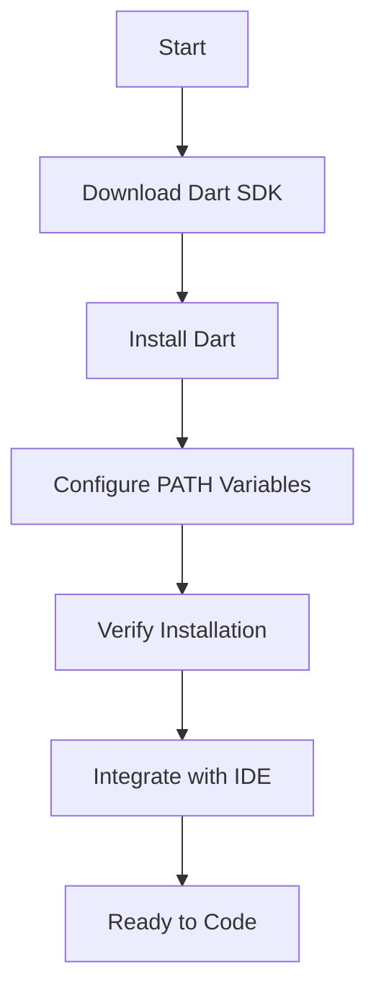

## 1.2.4 Setting Up Dart

Setting up Dart is a crucial step in your journey to becoming a proficient Flutter developer. Dart is the programming language that powers Flutter, and having it properly installed and configured on your system is essential for building robust applications. In this section, we'll guide you through the process of installing Dart SDK on various operating systems, configuring your environment, verifying the installation, and integrating Dart with popular Integrated Development Environments (IDEs) like Visual Studio Code and Android Studio.

### Installation Guide

#### Installing Dart SDK on Windows

1. **Download Dart SDK:**
   - Visit the [official Dart website](https://dart.dev/get-dart) to download the Dart SDK for Windows.
   - Choose the appropriate version for your system architecture (32-bit or 64-bit).

2. **Install Dart SDK:**
   - Run the downloaded installer.
   - Follow the on-screen instructions to complete the installation.
   - By default, Dart is installed in `C:\tools\dart-sdk`.

3. **Configure Environment Variables:**
   - Open the Start Menu, search for "Environment Variables," and select "Edit the system environment variables."
   - In the System Properties window, click on "Environment Variables."
   - Under "System variables," find and select the `Path` variable, then click "Edit."
   - Click "New" and add the path to the Dart SDK's `bin` directory (e.g., `C:\tools\dart-sdk\bin`).

#### Installing Dart SDK on macOS

1. **Download Dart SDK:**
   - Open Terminal and use Homebrew to install Dart by running:
     ```bash
     brew tap dart-lang/dart
     brew install dart
     ```

2. **Verify Installation:**
   - After installation, verify by running:
     ```bash
     dart --version
     ```

3. **Configure PATH Variables:**
   - Homebrew automatically configures the PATH, but you can verify by checking your `.bash_profile` or `.zshrc` file:
     ```bash
     export PATH="$PATH:/usr/local/opt/dart/libexec/bin"
     ```

#### Installing Dart SDK on Linux

1. **Download Dart SDK:**
   - Open Terminal and add the Dart repository:
     ```bash
     sudo apt update
     sudo apt install apt-transport-https
     sudo sh -c 'wget -qO- https://dl-ssl.google.com/linux/linux_signing_key.pub | apt-key add -'
     sudo sh -c 'wget -qO- https://storage.googleapis.com/download.dartlang.org/linux/debian/dart_stable.list > /etc/apt/sources.list.d/dart_stable.list'
     ```

2. **Install Dart SDK:**
   - Update your package list and install Dart:
     ```bash
     sudo apt update
     sudo apt install dart
     ```

3. **Configure PATH Variables:**
   - Add Dart to your PATH by editing your `.bashrc` or `.zshrc` file:
     ```bash
     export PATH="$PATH:/usr/lib/dart/bin"
     ```

### Environment Configuration

Setting up environment variables is crucial to ensure that Dart commands are accessible from any terminal session. This involves adding the Dart SDK's `bin` directory to your system's PATH variable, allowing you to execute Dart commands globally.

- **Windows:**
  - Use the System Properties to edit the `Path` variable and add the Dart SDK path.

- **macOS/Linux:**
  - Edit your shell configuration file (e.g., `.bash_profile`, `.zshrc`, or `.bashrc`) to include the Dart SDK path.

### Verifying Installation

Once Dart is installed and the environment variables are configured, it's important to verify the installation to ensure everything is set up correctly.

- Open a terminal or command prompt.
- Run the following command:
  ```bash
  dart --version
  ```
- You should see output similar to:
  ```
  Dart SDK version: 2.x.x (stable) on "your_os"
  ```
  This confirms that Dart is installed and accessible.

### IDE Integration

Integrating Dart with an IDE enhances your development experience by providing features like syntax highlighting, code completion, and debugging tools. Here’s how to set up Dart in popular IDEs:

#### Visual Studio Code

1. **Install Visual Studio Code:**
   - Download and install [Visual Studio Code](https://code.visualstudio.com/).

2. **Install Dart Extension:**
   - Open Visual Studio Code.
   - Go to the Extensions view by clicking on the Extensions icon in the Activity Bar.
   - Search for "Dart" and install the Dart extension by Dart Code.

3. **Configure Dart SDK:**
   - The Dart extension automatically detects the Dart SDK if it's in your PATH. If not, you can manually set the Dart SDK path in the settings.

#### Android Studio

1. **Install Android Studio:**
   - Download and install [Android Studio](https://developer.android.com/studio).

2. **Install Dart Plugin:**
   - Open Android Studio.
   - Go to `File > Settings` (or `Android Studio > Preferences` on macOS).
   - Navigate to `Plugins` and search for "Dart."
   - Install the Dart plugin and restart Android Studio.

3. **Configure Dart SDK:**
   - The Dart plugin should automatically detect the Dart SDK. If not, you can specify the SDK path in the Dart settings.

### Mermaid.js Diagram

To visually represent the setup process, here's a flowchart illustrating the steps involved in setting up Dart:



### Best Practices and Common Pitfalls

- **Keep Dart Updated:** Regularly check for updates to the Dart SDK to ensure you have the latest features and security patches.
- **Verify PATH Configuration:** If Dart commands are not recognized, double-check your PATH configuration to ensure the Dart SDK's `bin` directory is included.
- **IDE Configuration:** Ensure your IDE is correctly configured to recognize the Dart SDK for optimal development experience.
- **Troubleshooting:** If you encounter issues, consult the [Dart documentation](https://dart.dev/tools) or community forums for support.

### Additional Resources

- [Dart Official Documentation](https://dart.dev/guides)
- [Flutter and Dart Community](https://flutter.dev/community)
- [Dart on GitHub](https://github.com/dart-lang/sdk)

By following these steps, you'll have a fully functional Dart environment ready for Flutter development. This setup will enable you to write, run, and debug Dart code efficiently, paving the way for building powerful Flutter applications.

## Quiz Time!



### Which command is used to verify the Dart installation?

- [x] dart --version
- [ ] dart --check
- [ ] dart --install
- [ ] dart --path

> **Explanation:** The `dart --version` command is used to verify the Dart installation by displaying the installed version of the Dart SDK.

### What is the default installation path for Dart SDK on Windows?

- [x] C:\tools\dart-sdk
- [ ] C:\Program Files\dart-sdk
- [ ] C:\Dart
- [ ] C:\Users\dart-sdk

> **Explanation:** By default, Dart SDK is installed in `C:\tools\dart-sdk` on Windows systems.

### Which file should be edited to configure PATH variables on macOS?

- [x] .bash_profile or .zshrc
- [ ] .dartconfig
- [ ] .profile
- [ ] .bashrc

> **Explanation:** On macOS, you typically edit `.bash_profile` or `.zshrc` to configure PATH variables for terminal sessions.

### Which package manager is used to install Dart on macOS?

- [x] Homebrew
- [ ] MacPorts
- [ ] Apt
- [ ] Yum

> **Explanation:** Homebrew is a popular package manager for macOS used to install Dart and other software.

### What is the purpose of configuring environment variables for Dart?

- [x] To make Dart commands accessible from any terminal session
- [ ] To install additional Dart packages
- [ ] To update Dart automatically
- [ ] To configure Dart plugins

> **Explanation:** Configuring environment variables allows Dart commands to be accessible globally from any terminal session.

### Which IDE requires a Dart plugin installation for integration?

- [x] Android Studio
- [ ] Visual Studio Code
- [ ] Eclipse
- [ ] NetBeans

> **Explanation:** Android Studio requires a Dart plugin installation for integration, whereas Visual Studio Code uses an extension.

### What should you do if Dart commands are not recognized in the terminal?

- [x] Check and configure the PATH variable
- [ ] Reinstall the Dart SDK
- [ ] Restart the computer
- [ ] Update the Dart SDK

> **Explanation:** If Dart commands are not recognized, you should check and configure the PATH variable to include the Dart SDK's `bin` directory.

### Which command is used to install Dart on Linux?

- [x] sudo apt install dart
- [ ] sudo yum install dart
- [ ] sudo pacman -S dart
- [ ] sudo brew install dart

> **Explanation:** On Linux, you use `sudo apt install dart` to install Dart after adding the Dart repository.

### What is the role of the Dart extension in Visual Studio Code?

- [x] Provides syntax highlighting, code completion, and debugging tools for Dart
- [ ] Installs Dart SDK automatically
- [ ] Updates Dart SDK
- [ ] Configures environment variables

> **Explanation:** The Dart extension in Visual Studio Code provides syntax highlighting, code completion, and debugging tools for Dart development.

### True or False: The Dart SDK must be manually added to the PATH on all operating systems.

- [ ] True
- [x] False

> **Explanation:** On macOS, if installed via Homebrew, the PATH is automatically configured. On other systems, manual configuration may be necessary.


